# Distributed Job Scheduler: Leader Election, Priority Queues, and Failure Recovery

## Scope and framing

This explainer follows the supplied transcript, which walks through the design of a distributed job scheduler for intermediate-level system design. It uses the transcript as the backbone and adds widely known engineering background where it helps explain why a mechanism exists. Figures such as lock TTLs, heartbeat intervals, and "millions of jobs per day" are as reported in the transcript and have not been independently verified; they are illustrative defaults, not universal recommendations. The diagrams are conceptual and are not meant to reproduce any specific product's internals.

The problem being solved is deceptively ordinary: run background work (billing, invoice emails, data exports, database cleanup) on a schedule, reliably. The classic tool for this is `cron` on a single machine. The design question is how to keep that simplicity while removing the single point of failure without creating a new failure mode: the same job running twice.

The resulting design combines four mechanisms:

- **Leader election** so only one scheduler makes scheduling decisions at a time.
- **Idempotency keys** so the same scheduled execution cannot be enqueued twice.
- **A priority queue** so critical jobs are not stuck behind a flood of low-value work.
- **Heartbeats and a watchdog** so jobs abandoned by crashed workers are detected and retried.

## 1. The 3 a.m. problem

The transcript opens with a familiar scenario. The machine running the cron jobs dies around midnight. For hours no billing jobs run, no invoice emails go out, no exports happen, and no cleanup runs. Cron does not retry and does not alert; it simply stops. The team discovers the outage when a customer asks why an invoice is missing.

The obvious fix is to run the scheduler on several machines. That fixes availability but introduces a correctness problem: two machines both decide to run the billing job at the same moment, leading to double charges, duplicate emails, and corrupted aggregations.

This is the central tension of the design:

- **One scheduler:** a single point of failure; work silently stops when it dies.
- **Many uncoordinated schedulers:** duplicate execution; work happens more than once.

A distributed job scheduler exists to sit between these two bad outcomes.

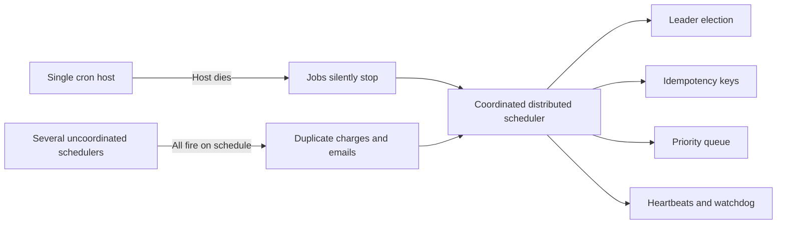

## 2. The mental model: exactly-once is off the table

Before any architecture, the transcript sets an expectation: **exactly-once execution is impossible in a distributed system**. The reasoning is the classic one. A worker can start a job, get partway through, and crash before reporting whether it succeeded. From the scheduler's point of view, the worker's silence is ambiguous:

- If the scheduler retries, the job may run twice (if the first attempt actually finished its side effects).
- If the scheduler does not retry, the job may be lost (if the first attempt did not finish).

There is no third option that is correct in every case. The realistic target is **at-least-once execution combined with idempotent jobs**.

### What idempotency means in practice

A job is idempotent if running it twice produces the same externally visible result as running it once. That property does not come for free; it has to be designed into every job:

- A job that sends an email checks whether that email has already been sent.
- A job that processes an invoice checks whether that invoice has already been processed.
- A job that writes an aggregate writes it with an upsert keyed on the aggregation period, not an append.

The transcript frames this as the price of fault tolerance. Once it is accepted, the scheduler's goal becomes simpler and more honest: *minimize* duplicate execution and handle failures gracefully, while relying on job-level idempotency as the last line of defense.

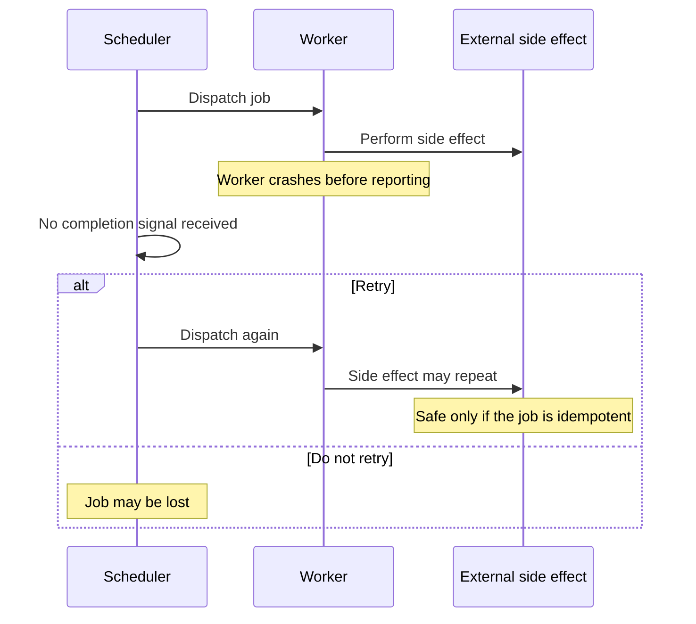

## 3. Three ways a single-node scheduler fails

The transcript separates three distinct failure modes. They are worth keeping separate because each needs a different mechanism.

| Failure mode | What happens | Design response |
| --- | --- | --- |
| Dead scheduler | The scheduler host dies; triggers stop; workers sit idle waiting | Multiple scheduler nodes with leader election |
| Slow job | A job scheduled every 5 minutes takes 7 minutes, so the next run starts while the previous one is still in flight | Job locking with heartbeats, so a running job blocks re-scheduling of itself |
| Lost job | A worker acknowledges the job, starts it, and crashes before finishing; the scheduler thinks it is done | Heartbeat-based progress tracking; a job is complete only when a completion signal arrives |

The third failure mode is subtle. If "acknowledged" is treated as "done", a worker crash after acknowledgement silently loses the job. The fix is to separate the concepts: dispatch and acknowledgement mean *started*, and only an explicit completion record means *finished*.

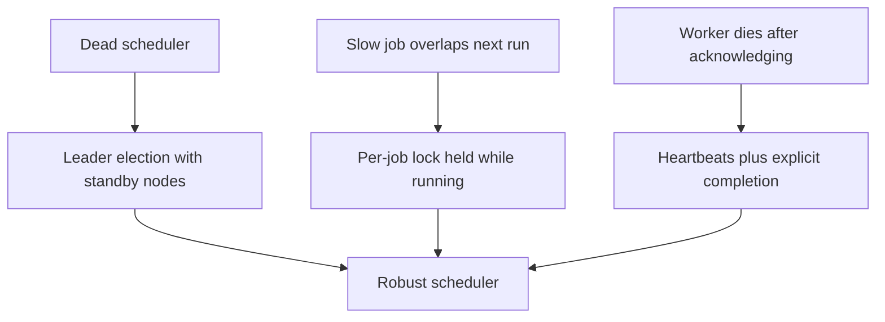

## 4. Leader election with a TTL lock

### Active leader, hot standbys

The design runs several scheduler nodes, labelled A, B, and C in the transcript. At any moment only one of them, the **leader**, makes scheduling decisions. The others are hot standbys: they are running, watching, and ready to take over as soon as the leader disappears.

Leadership is represented by a **distributed lock** stored in a coordination service such as Redis or etcd. The transcript's example numbers:

- The leader holds the lock with a **30-second TTL** (time to live).
- The leader **renews** the lock every **10 seconds**.
- Standby nodes periodically check whether the lock is available.

If the leader dies, it stops renewing, the lock expires after the TTL, and the standbys race to acquire it. Exactly one wins and begins scheduling.

### Atomic acquisition

The race must have a single winner. In Redis this is done with `SET key value NX PX <ttl>`: `NX` means "set only if the key does not already exist", and the expiry is set in the same command. Because it is a single atomic operation, two nodes cannot both believe they acquired the lock from the same free state. In etcd the equivalent is a lease plus a compare-and-swap transaction.

A good implementation also stores a unique node identifier as the lock value, so that renewal and release only succeed if the caller still owns the lock. Otherwise a slow former leader could extend or delete a lock that now belongs to someone else.

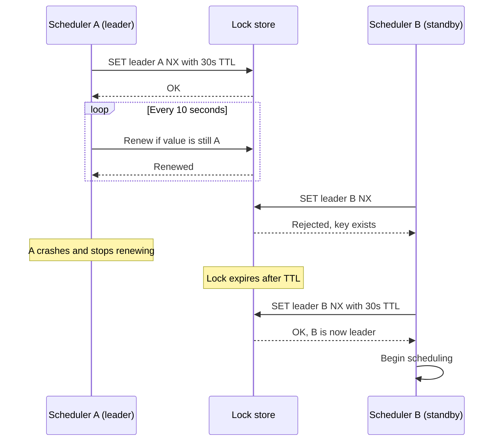

### Stepping down is as important as stepping up

The transcript highlights a subtlety that many implementations get wrong: **when a node loses leadership, it must stop scheduling immediately.** A node whose renewal failed but that keeps acting as leader while a new leader is being elected will cause duplicate execution.

In practice this means:

- Treat a failed or late renewal as loss of leadership, not as a transient warning.
- Check leadership before each scheduling decision, not just at start-up.
- Leave a safety margin: stop scheduling somewhat before the TTL would expire, since the node's local clock and the lock store's clock may not agree exactly, and a process can pause (for example, during garbage collection) between checking and acting.

As general background, lease-based leadership can never fully eliminate the window where an old leader believes it is still in charge. Systems that need a hard guarantee attach a monotonically increasing **fencing token** to each leadership term and have downstream resources reject stale tokens. For a job scheduler, the combination of a quick step-down, idempotency keys, and idempotent jobs usually makes that residual window harmless.

### Choosing the TTL

The TTL is effectively the **failover latency**: the longest time jobs may go unscheduled after the leader dies. The transcript's advice is to keep it short, but not so short that normal network blips cause unnecessary leadership changes. Frequent, spurious failovers are themselves a source of risk, because every handoff is a moment where two nodes might briefly overlap.

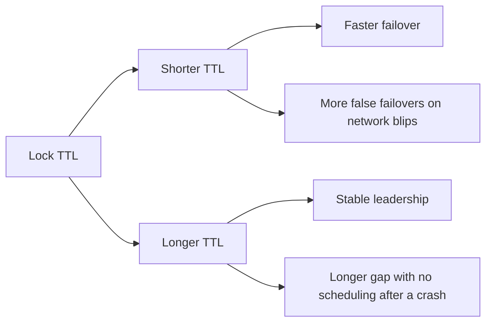

## 5. Deduplication with idempotency keys

Leader election prevents two schedulers from running simultaneously. It does **not** prevent the same leader from triggering the same job twice. That can still happen because of clock skew, a network retry, or a race condition in the scheduling loop.

The fix is an **idempotency key**: a unique identifier for each *scheduled execution*. The transcript's recipe is to hash the job ID together with the schedule time window.

- The first submission inserts an execution record with that key and is queued.
- A second submission with the same key hits the unique constraint and is silently dropped, for example with PostgreSQL's `INSERT ... ON CONFLICT DO NOTHING`.

### Why the time window matters

The key should deduplicate *within a scheduling period*, not forever. An hourly job must be able to run again next hour; it must simply not run twice in the same hour. Including the window (for example, the scheduled timestamp truncated to the period) in the key achieves exactly that.

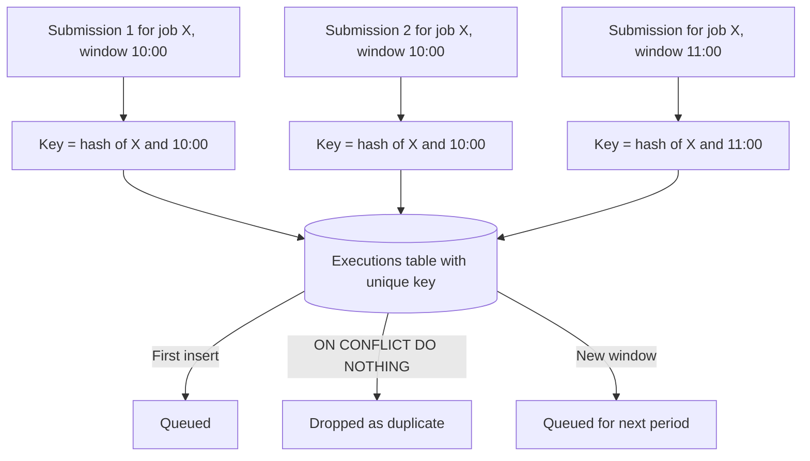

The layers of protection now stack:

1. Leader election keeps multiple schedulers from firing in parallel.
2. Idempotency keys keep one scheduler from enqueuing the same execution twice.
3. Idempotent job logic protects against the unavoidable remaining case: a retry after a crash in the middle of execution.

## 6. Priority queues

### Why arrival order is not enough

In a flat first-in, first-out queue, arrival order determines everything. After a backlog clears, 500 low-priority thumbnail generation tasks can land just ahead of a critical billing job, and the billing job waits behind all of them.

The transcript's design uses four priority lanes: **critical, high, normal, and low**. Workers always drain the highest non-empty lane first. In a priority queue, importance determines order rather than arrival time.

### A single table and a careful poll query

The implementation does not require a separate queue system. It uses one `jobs` table with a `priority` column and a worker poll query that orders by priority, then by scheduled time. Conceptually:

```sql
SELECT id, name, payload
FROM jobs
WHERE status = 'pending' AND run_at <= now()
ORDER BY priority, run_at
LIMIT 1
FOR UPDATE SKIP LOCKED;
```

`FOR UPDATE SKIP LOCKED` is the key detail. Many workers can poll concurrently; each one locks the row it picks, and other workers skip rows that are already locked instead of blocking on them. No two workers claim the same job, and there is no contention hot spot. The worker then updates the row to `running`, records its `worker_id`, and sets `last_heartbeat` in the same transaction.

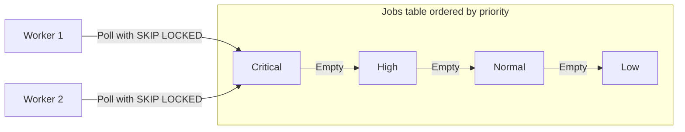

### A note on starvation

Strict priority ordering has a well-known side effect: if higher lanes are never empty, lower lanes may never run. For many schedulers this is acceptable because low-priority work genuinely can wait. When it is not, common mitigations include aging (raising a job's effective priority the longer it waits), reserving a small share of worker capacity for lower lanes, or running separate worker pools per lane.

## 7. Heartbeats and the watchdog

### The stuck-job problem

Suppose Worker B is running a job and dies mid-execution: machine failure, network partition, process kill. The database row still says `status = running`. Nothing will ever set it to `completed` or `failed`. Without an extra mechanism, the job is stuck forever.

### How the heartbeat pattern works

While a job is running, its worker periodically updates the row's `last_heartbeat` timestamp. The transcript's example numbers:

- Workers send a heartbeat every **10 seconds**.
- A separate **watchdog** process runs every minute.
- The watchdog looks for rows where `status = running` and `last_heartbeat` is older than **60 seconds**.

Such a row belongs to a worker that is presumed dead. The watchdog resets it to `pending`, increments `attempt_count`, and it becomes eligible for another worker to pick up.

The gap between heartbeat interval and timeout is deliberate. With a 10-second interval and a 60-second timeout, a worker can miss several heartbeats before being declared dead. A healthy worker that is briefly slow (a long GC pause, a slow downstream call, a noisy neighbor) should not be killed prematurely, because doing so would itself produce duplicate execution.

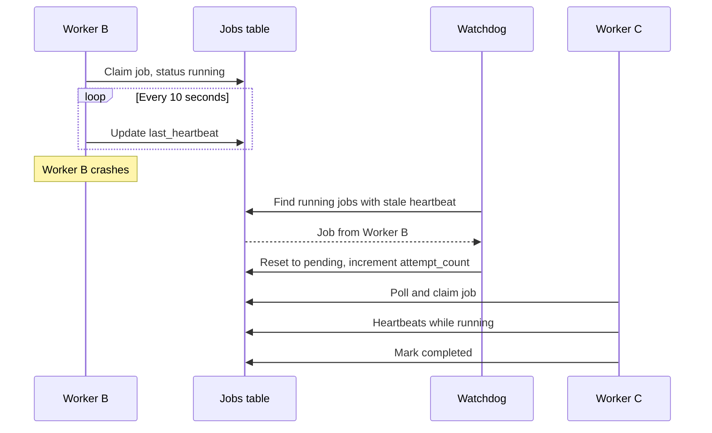

### Heartbeats also solve the slow-job problem

The heartbeat doubles as a lock on the running job. While a job is running and heartbeating, the scheduler knows it is in flight and should not dispatch another instance of the same recurring job. That addresses the "7-minute job on a 5-minute schedule" failure mode: the next run either waits, is skipped, or is coalesced, depending on the policy chosen for that job.

### Retry budget and dead letters

Every reset increments `attempt_count`. When it reaches `max_attempts`, the job is moved to a **dead-letter** state instead of being retried forever. This matters because some failures are not transient: a malformed payload or a permanently broken dependency will crash every attempt. Dead-lettering stops the retry loop from consuming capacity and surfaces the job for human attention. As general practice, retries are usually spaced with exponential backoff and jitter so that a failing dependency is not hammered by synchronized retries.

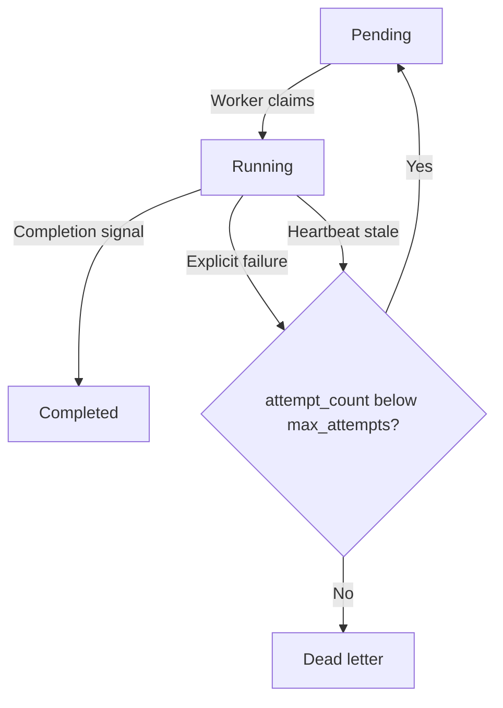

## 8. The schema that ties it together

The transcript presents a single `jobs` table. The ordinary fields are `id`, `name`, `payload`, `priority`, and `status`. The operational columns are where the design lives:

| Column | Purpose |
| --- | --- |
| `run_at` | When the job should next run; recalculated after each run for recurring jobs |
| `cron_expression` | Null for one-off jobs; populated for recurring jobs |
| `attempt_count`, `max_attempts` | The retry budget; exceeding it sends the job to dead letter |
| `worker_id` | Which worker currently owns the running job |
| `last_heartbeat` | The timestamp the watchdog uses to detect dead workers |

An idempotency key column with a unique constraint (or a separate executions table keyed on it) provides the deduplication described in section 5.

### Partial indexes keep hot queries small

Two **partial indexes** support the two hot queries:

1. **Worker poll index:** covers pending jobs, ordered by `priority` and `run_at`. Filtered with `WHERE status = 'pending'`.
2. **Watchdog index:** covers running jobs by `last_heartbeat`. Filtered with `WHERE status = 'running'`.

A partial index only contains rows that match its predicate. Completed jobs, which will vastly outnumber active ones over time, are not in either index. Both indexes therefore stay small and fast regardless of how much history accumulates. The transcript states this schema handles millions of jobs per day.

```sql
CREATE INDEX jobs_poll_idx
  ON jobs (priority, run_at)
  WHERE status = 'pending';

CREATE INDEX jobs_watchdog_idx
  ON jobs (last_heartbeat)
  WHERE status = 'running';
```

As general background, a table that receives many status updates and deletes will need attention to vacuuming and to archiving or partitioning completed rows, so that table bloat does not erode the benefit of the partial indexes.

## 9. End-to-end flow

Putting the pieces together, a recurring job moves through the system as follows:

1. The leader scheduler (holding the TTL lock) finds a job whose `run_at` has arrived.
2. It computes the idempotency key from the job ID and the schedule window and inserts an execution record, ignoring conflicts.
3. The job sits in the table as `pending`, ordered by priority.
4. A worker claims it with `FOR UPDATE SKIP LOCKED`, marks it `running`, and starts heartbeating.
5. On success the worker marks it `completed`; for recurring jobs, the next `run_at` is computed from the cron expression.
6. If the worker dies, the watchdog notices the stale heartbeat and returns the job to `pending` or, once the retry budget is exhausted, to dead letter.

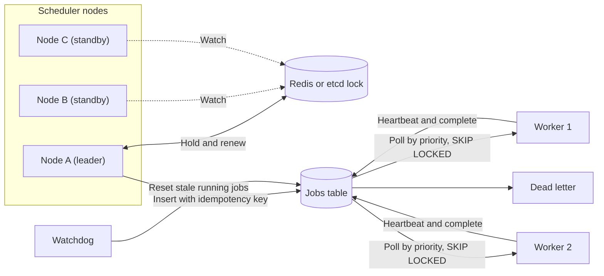

## 10. Trade-offs and where this design stops

### What the design costs

- **Duplicate execution is minimized, not eliminated.** Every job must still be idempotent. This is a permanent design constraint on everyone who writes jobs, not a one-time scheduler feature.
- **Failover is not instant.** The gap between a leader crash and a new leader is roughly the lock TTL. Jobs due during that window run late.
- **Heartbeat timeouts are a judgment call.** Too short and slow-but-healthy workers are declared dead, causing duplicates. Too long and truly dead workers hold jobs hostage.
- **The database is on the hot path.** Polling, heartbeats, and watchdog scans all hit the jobs table. At very high rates this becomes the bottleneck and needs tuning, partitioning, or a dedicated queue.
- **Strict priority can starve low lanes** unless mitigated.

The transcript also notes what the design does *not* cost: the operational surface is small. Leader election adds one lock call per renewal interval; the watchdog is a periodic query. No exotic infrastructure is required.

### When to reach for something else

The transcript is explicit about the limits:

- **Long, multi-stage jobs.** A 4-hour job with several checkpoint stages is expensive to retry from scratch. Durable workflow engines such as Temporal or AWS Step Functions provide fine-grained checkpointing.
- **Fan-out and fan-in.** A job that spawns 10,000 subtasks, waits for all of them, and aggregates results needs workflow primitives a simple job queue does not have.
- **Sequences of external calls with compensation.** When a job is really a chain of API calls to external services with compensating actions on failure, that is saga territory and a different abstraction.

For scheduled cron-style jobs, background processing pipelines, and retry-with-backoff tasks, the purpose-built scheduler is sufficient.

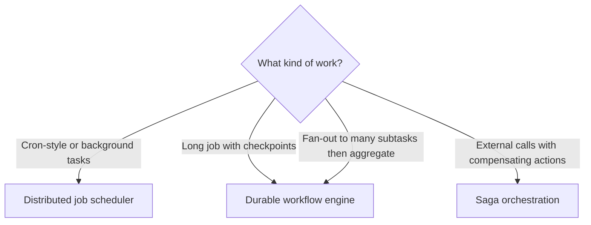

## 11. Observability

The transcript closes by naming the hardest part of the system as organizational rather than technical: accepting that exactly-once is impossible, designing every job to be idempotent from the start, and building **observability that catches duplicate executions before anyone notices the downstream effects**.

Useful signals for a scheduler like this include:

- Current leader identity and the count of leadership changes over time.
- Queue depth per priority lane and age of the oldest pending job.
- Number of jobs reset by the watchdog, which is a proxy for worker crashes.
- Attempt-count distribution and dead-letter volume.
- Idempotency-key conflicts, which reveal how often duplicate submissions are attempted.
- Duplicate side effects detected by the jobs themselves (for example, "email already sent" short-circuits).

An alert on "no billing job has completed in the expected window" is the direct answer to the 3 a.m. scenario: it catches silent stoppage regardless of which component caused it.

## Key takeaways

1. A single cron host is a silent single point of failure; naively running several schedulers trades that for duplicate execution.
2. Exactly-once execution is not achievable in a distributed system. Design for at-least-once delivery and make every job idempotent.
3. Leader election with an atomic, TTL-based lock keeps one scheduler in charge. The TTL is the failover latency, and a node that loses the lock must stop scheduling immediately.
4. Idempotency keys built from the job ID and schedule window stop the same execution being enqueued twice without blocking future runs.
5. A priority column plus `FOR UPDATE SKIP LOCKED` gives a contention-free priority queue on an ordinary relational table.
6. Heartbeats and a watchdog turn "a worker died silently" into a detectable, retryable event, with a retry budget and dead-letter state for permanent failures.
7. Partial indexes keep the poll and watchdog queries fast as job history grows.
8. For long, multi-stage, fan-out, or compensating workflows, use a workflow engine or saga pattern instead of stretching a job queue.

The broader lesson is to separate concerns cleanly: one mechanism for who decides, one for what has already been decided, one for what matters most, and one for noticing when work was abandoned. Each is simple on its own; together they make scheduled work both available and safe to retry.
