# Backpressure: Detecting, Absorbing, and Propagating Overload

## Scope and framing

This explainer follows the supplied transcript, which treats backpressure as a design principle for systems built on queues, message brokers, and service-to-service calls. It uses the transcript's structure and examples and adds well-established background where useful. Figures such as event rates, thresholds, timeouts, and the LinkedIn and Uber references are as reported in the transcript and have not been independently verified. The diagrams are conceptual and are not exact reproductions of any particular system.

Backpressure shows up under many names: growing Kafka consumer lag, RabbitMQ refusing messages because a memory limit was hit, an API returning HTTP 429 Too Many Requests. Engineers often treat these as isolated incidents ("add more consumers", "make the queue bigger"). The transcript's argument is that they are all the same phenomenon: a component is telling the rest of the system that it cannot keep up. The design question is whether the system has a planned answer to that message.

The transcript organizes the topic into four layers, which this document follows:

1. **The problem:** what happens when producers outrun consumers, and why bigger queues do not fix it.
2. **Detection:** which signals warn of overload before things break.
3. **Response:** bounded queues, load shedding, priority tiers, and pull-based flow.
4. **Propagation:** how the signal travels back to the source, using HTTP 429, Kafka pause/resume, and circuit breakers.

## 1. The core problem: producers faster than consumers

### The plumbing analogy

Picture a pipe feeding a drain. If water arrives faster than the drain empties, the pipe fills and eventually overflows or bursts. In software the pipe is a queue or buffer, the water is incoming requests or events, and the drain is the consumer. If data arrives faster than it is processed, something eventually gives.

### A worked example

The transcript's example uses an API server producing work at roughly **10,000 events per second** and a payment-processing consumer that handles roughly **2,000 events per second**. The difference, about **8,000 events per second**, accumulates in the queue between them.

A queue is an excellent tool for *temporary* mismatch. A 30-second burst is absorbed, the consumer catches up in a minute, and nobody notices. But if the mismatch persists for an hour, the queue holds tens of millions of events:

$$
8{,}000 \ \tfrac{\text{events}}{\text{s}} \times 3{,}600 \ \text{s} \approx 28.8 \text{ million events}
$$

That backlog consumes gigabytes of memory. Eventually the host runs out of RAM and the process is killed. If the queue was in memory, those events are gone. Even with a durable log such as Kafka, the consumer is now hours behind, and the effects cascade: users see stale data, payments are delayed, notifications do not fire.

A bigger queue does not fix this. It only moves the crash later. The actual fix is to **control the flow of data so the system never accepts more than it can handle**.

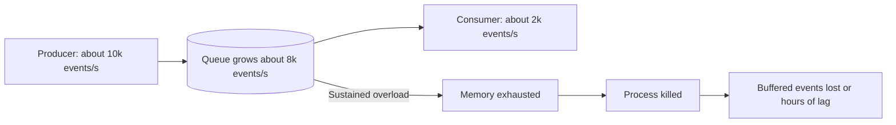

### Three things an overloaded system can do

When overwhelmed, a component has three basic options:

1. **Absorb.** Keep accepting work and hope to catch up. This is what an unbounded queue does. It works until it doesn't, and when it fails, it fails catastrophically.
2. **Drop.** Reject new work when full. This prevents a crash, but *silent* dropping creates a new problem: the producer never learns its work was lost, and the loss surfaces weeks later as a customer complaint. Dropping *with a signal* (an error response, a metric, a dead-letter queue) is a completely different, and acceptable, behavior.
3. **Propagate.** Tell the producer to slow down. The consumer's overload state travels backward until it reaches the source, and the source reduces its rate. This is backpressure in the strict sense. It is the cleanest solution, but every layer must participate.

Most production systems use all three at once: buffer up to a limit, drop low-priority work when the buffer fills, and signal upstream to reduce incoming rate. The engineering skill is in tuning when each mechanism activates.

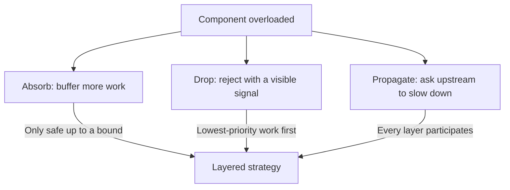

## 2. Detection: seeing overload before it becomes a crisis

A system can only respond to overload it has detected, and many teams detect it only once it is already an incident. The transcript identifies four signals, ordered roughly by how much warning they give.

### Signal 1: queue growth rate, not queue depth

The most important signal is **how fast a queue is growing**, not how full it is. A queue that is 90% full but stable is fine: the system is keeping pace and simply using most of its buffer. A queue that is 30% full and growing at 5% per second will be full in about 14 seconds. The emptier queue is the bigger emergency.

In Kafka, **consumer lag** plays this role: the difference between the latest offset in a partition and the consumer group's committed offset. A widening gap means the consumer is falling behind. The derivative of lag over time is the early-warning signal.

### Signal 2: tail latency

The second signal is response time, specifically for the slowest requests. Averages hide problems. The transcript's example: if 99 requests take 10 ms and one takes 5 s, the average is about 60 ms, which looks healthy, yet one user had a terrible experience. Watching high percentiles (p99, p99.9) reveals this.

The shape of the slowdown also carries information:

- **A few requests are very slow:** likely a localized bottleneck, such as one overloaded database partition or one struggling downstream dependency.
- **Everything is slower:** the whole system is saturated.

### Signal 3: worker utilization

The third signal is how many processing threads, goroutines, or workers are busy. With 50 workers and 49 active, the system is one burst away from queueing work with nobody to process it. As general background, queueing theory predicts that waiting time rises sharply as utilization approaches 100%, so high utilization is a warning well before it is a failure.

### Signal 4: error rate

The fourth signal is error rate: exhausted connection pools, timeouts, downstream 503s. These are symptoms, not early warnings. By the time errors climb, the system is already in trouble. The first three signals buy time to act; the error rate confirms it is late.

| Signal | What it measures | Warning time |
| --- | --- | --- |
| Queue growth rate / consumer lag trend | Whether intake exceeds processing | Earliest |
| Tail latency (p99 and above) | Localized or global saturation | Early |
| Worker utilization | Remaining headroom | Early |
| Error rate | Failures already occurring | Late |

### A graduated response ladder

Detection should feed a **graduated response**, not a binary healthy/broken switch. The transcript's example ladder:

- At **50%** queue utilization, log warnings.
- At **75%**, start shedding low-priority work.
- At **90%**, reject new writes entirely.

The ladder needs **hysteresis**: the threshold to enter a state should differ from the threshold to leave it, and state changes should not happen on every tick. Otherwise the system oscillates between shedding and accepting, which amplifies instability rather than damping it.

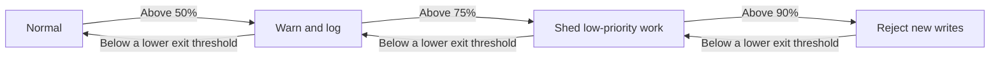

## 3. Response: bounded queues

### An unbounded queue is a promise it cannot keep

The foundation of every backpressure strategy is a **bounded queue**, one with a fixed maximum size. An unbounded queue effectively says "don't worry, I'll hold everything", but under sustained overload it grows until it consumes all memory. Bounding the queue forces an explicit decision at the moment it fills.

### Four choices when the queue is full

| Policy | Behavior | Good fit | Poor fit |
| --- | --- | --- | --- |
| Block | The producer waits until space frees up | Batch pipelines where waiting is acceptable | User-facing APIs, where blocking means a spinner |
| Drop newest | Reject the arriving item and tell the sender to retry | Idempotent work that is safe to resend | Work that cannot be retried |
| Drop oldest | Evict the oldest item to make room for the new one | Fresh-data streams: dashboards, IoT sensors, market data | Work where completeness matters |
| Raise an error | Return an exception to the caller and let it decide | Producers with their own handling logic | Producers that cannot handle errors well |

**Blocking** is backpressure in its most literal form: the full queue physically prevents the producer from going faster. **Drop-oldest** trades completeness for freshness, which is exactly right when only the latest value matters.

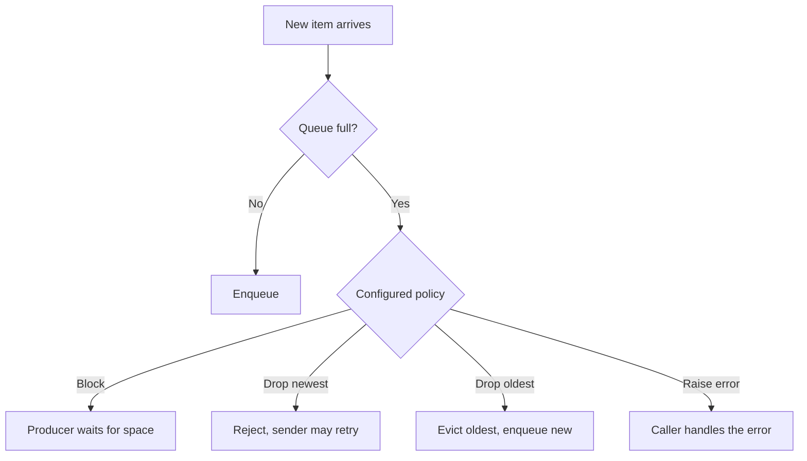

### It is a product decision

The transcript stresses that choosing an overflow policy is not purely an engineering choice. When the system is overloaded, *someone's* work is delayed or dropped. Is it free-tier users, batch analytics, or payment retries? If that is not decided in advance, it is decided at random during the incident, which is always the wrong answer. Senior engineers are expected to make this decision explicitly with product and business stakeholders.

## 4. Response: load shedding and priority tiers

**Load shedding** means choosing *what* to drop deliberately. Not all work is equally important; when some work must be rejected, it should be the work that matters least.

### A flash-sale example

The transcript uses an e-commerce flash sale. The platform is handling:

- **Payment transactions:** critical; every dropped payment is lost revenue.
- **Product page loads:** important, but a user can refresh.
- **Analytics events:** useful, but can be delayed.
- **Search crawler traffic:** nice to have; nobody minds if it is slow during the sale.

These map to priority tiers:

| Tier | Examples | Behavior under pressure |
| --- | --- | --- |
| Critical | Payments, authentication | Always admitted |
| Standard | API requests from paying customers | Processed next |
| Background | Webhooks, exports | Shed first as pressure builds |
| Batch | Analytics, crawlers | Shed immediately at any pressure |

The transcript cites Uber's trip-processing pipeline as an example: during peak load, internal analytics and reporting pause first, while customer-facing trip requests continue. The important property is that **tiers are predefined**, not invented mid-incident.

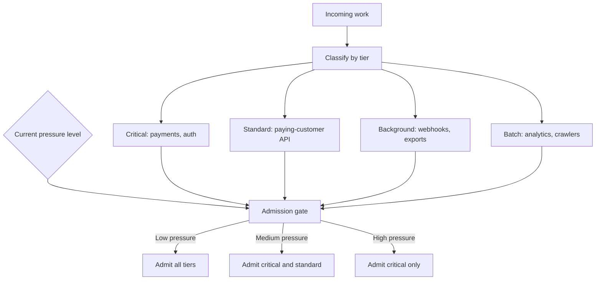

### Priority starvation

Strict priority has a known failure mode: if high-priority work floods the system continuously, low-priority work may never run. The transcript's fix is **age-based boosting**: if a low-priority task has waited longer than some limit (the transcript suggests on the order of a minute), raise its priority. Low-priority work is still processed eventually, not only when the system happens to be idle.

## 5. Response: flipping the model with pull-based flow

Everything so far assumes a **push** model. The producer sends work whenever it has it; the consumer does its best; bounded queues and shedding manage the gap when the consumer falls behind.

A **pull** model inverts control. The consumer says "I'm ready for 50 more items", the producer (or broker) sends exactly 50, the consumer processes them and asks again. The consumer's own capacity becomes the rate limiter. There is no gap to manage inside the consumer because it never receives more than it asked for.

This is how Kafka consumers work. A consumer calls `poll()` to fetch records; the broker does not push them. A slow consumer simply polls less often, and the resulting lag becomes the visible backpressure signal. The durable log absorbs the difference, and the consumer is never flooded.

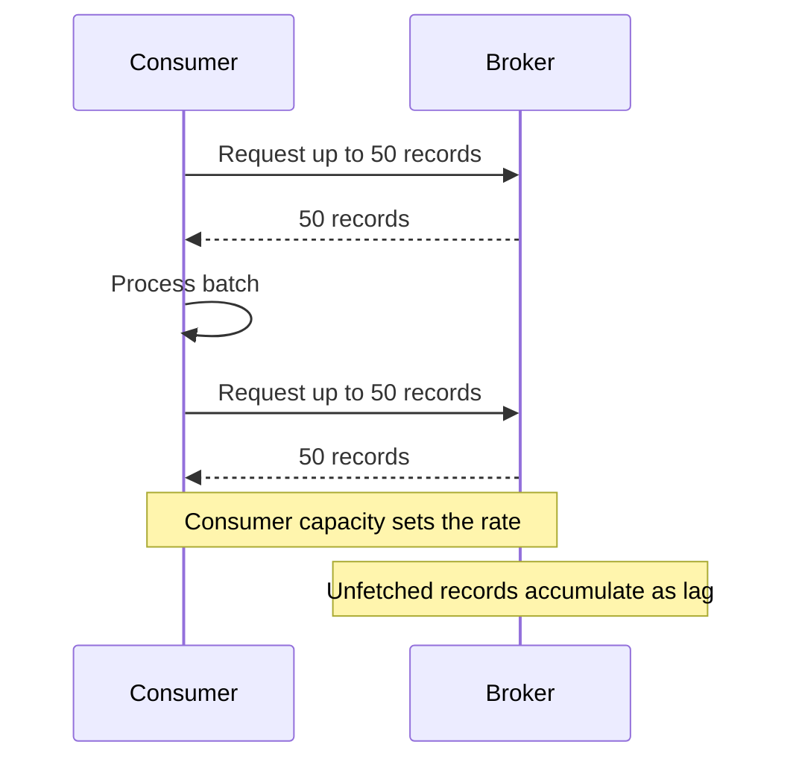

Pull shifts the storage problem to the broker rather than eliminating it. The broker must be able to retain the backlog, and lag still needs monitoring. But it keeps the consumer safe and makes the overload explicit and measurable.

## 6. Propagation: getting the signal back to the source

Detection, bounded queues, shedding, and pull all operate within a single service. Real systems are chains. The transcript calls upstream propagation the most important part of the topic, because it is where most systems fall apart.

### The broken chain

Consider services A → B → C. Service C becomes overloaded and starts dropping requests. Service B sees its queue to C fill and begins shedding too. But Service A has no idea anything is wrong and keeps sending at full speed. B keeps shedding; A keeps sending. The pressure never decreases because the signal never reaches the component that could reduce the traffic.

### The working chain

For backpressure to work end to end, every layer participates:

1. Service C returns **503 Service Unavailable** to B.
2. B sees its own queue growing and returns **429 Too Many Requests** to A, with a **`Retry-After`** header (the transcript's example: retry in 30 seconds).
3. A honors the header and reduces its sending rate.

Each layer passes pressure backward until it reaches the component that can actually slow down.

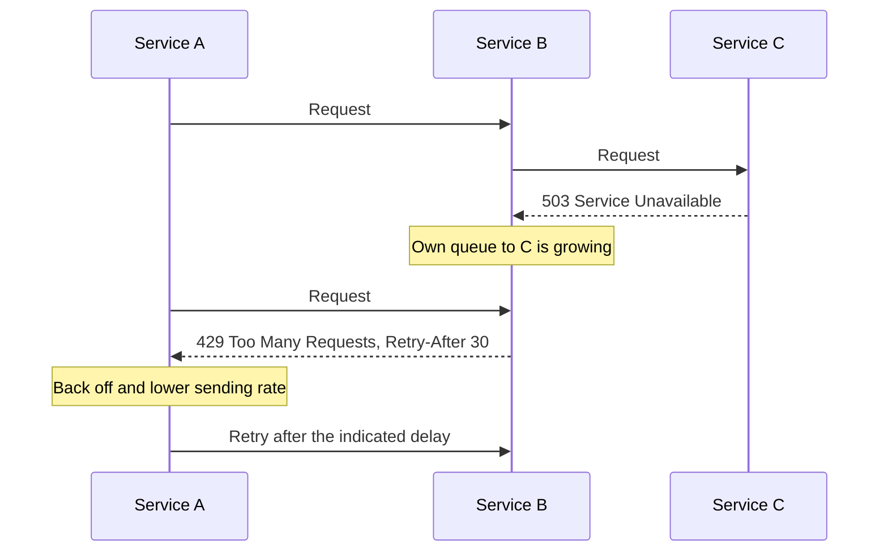

### Why `Retry-After` matters

The transcript calls `Retry-After` the detail most teams miss. A 429 without it is just a rejection; a naive client retries immediately, *adding* load at exactly the wrong moment. A 429 with `Retry-After` tells the client precisely when to try again, so it backs off for the right amount of time.

As general background, clients should also add exponential backoff and random jitter to retries even when a header is present. Otherwise many clients that were rejected at the same moment all retry at the same moment, creating a synchronized "retry storm". Retry budgets (capping retries as a fraction of total requests) further limit amplification across deep call chains.

## 7. Kafka-specific backpressure

Many modern systems are event-driven rather than request-response, and Kafka is the most common place engineers meet backpressure there.

### The `max.poll.interval.ms` trap

Kafka is pull-based, but one configuration interacts badly with slow processing. **`max.poll.interval.ms`** is how long the group coordinator waits between `poll()` calls before assuming the consumer is dead and triggering a **rebalance**. The transcript cites a default of 5 minutes.

If a consumer fetches a batch and takes longer than that to process it before polling again, Kafka removes it from the group and reassigns its partitions. Rebalances are expensive: consumers in the group pause while partitions are redistributed. A consumer that is merely slow can therefore trigger repeated rebalances, making the group slower still. That is one of Kafka's most frustrating failure modes.

### Pause and resume

The transcript's recommended pattern is **consumer pause/resume**:

- When the consumer's internal processing queue is full, call `pause()` on its assigned partitions. The consumer keeps calling `poll()` (and heartbeating), so it stays in the group and no rebalance occurs, but no new records are fetched for paused partitions.
- When the internal queue drains below a threshold, call `resume()` and fetching continues.

This is explicit, consumer-level backpressure that decouples processing speed from group membership. The transcript reports that LinkedIn, which it says runs over 7 trillion messages per day through Kafka, has documented pause/resume combined with lag monitoring as more effective than queue-based approaches.

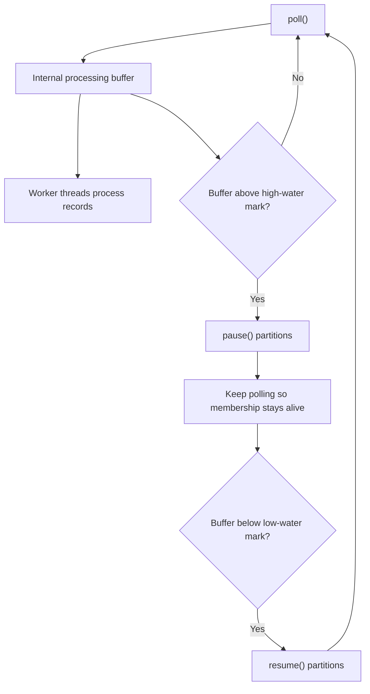

The separate high- and low-water marks provide the hysteresis discussed in section 2.

### Lag is the primary metric

Consumer lag is the primary backpressure metric for Kafka:

- **Zero or flat:** keeping up.
- **Growing:** falling behind.
- **Growing fast:** add consumers (up to the partition count) or reduce the producer rate.

The transcript's advice is to monitor and alert on lag with the same seriousness as CPU utilization on a database server.

## 8. Circuit breakers: when the dependency is broken, not just slow

The previous mechanisms handle a downstream service that is *overloaded*. A different scenario is a dependency that is effectively *broken*: it takes 30 seconds to respond to every request and never returns an error.

### How a dead dependency takes you down

Without protection, each request to the dependency holds a thread for 30 seconds until it times out. Meanwhile new requests keep arriving and taking threads. After about 50 such requests (in the transcript's example) the entire thread pool is blocked. Now the calling service cannot process anything, including requests that do not need the broken dependency at all. It is down, not from load, but from waiting on something that will not answer.

### The breaker

A **circuit breaker** interrupts this:

- **Closed:** requests flow normally; failures are counted.
- **Open:** after a threshold of consecutive failures (the transcript uses about five), requests to that dependency fail immediately without waiting. The thread pool clears, and the service keeps working for everything else.
- **Half-open:** after a cool-down (about 30 seconds in the transcript), one trial request is allowed. Success closes the breaker; failure reopens it for another cool-down.

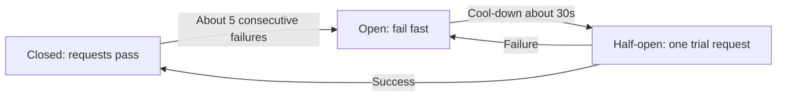

### Whose protection is it?

The transcript emphasizes a mental-model shift: **the circuit breaker protects the caller, not the dependency.** It is not about being polite to the broken service. It is about keeping your own service alive so that one failed dependency does not drag everything down with it. As general background, circuit breakers pair naturally with tight timeouts and **bulkheads** (separate thread or connection pools per dependency), so a problem in one dependency cannot exhaust resources shared with others.

## 9. Trade-offs

Every backpressure mechanism exchanges one kind of cost for another:

- **Bounded queues** prevent memory exhaustion but force explicit loss or delay. Someone's work will be rejected; the choice must be made in advance.
- **Blocking** is clean backpressure for pipelines but unacceptable for interactive latency.
- **Drop-oldest** keeps data fresh at the expense of completeness.
- **Load shedding** protects critical paths but requires classifying all traffic and accepting degraded service for lower tiers. Strict priority needs aging to avoid starvation.
- **Pull-based consumption** protects consumers but moves the backlog into the broker, which must retain it.
- **Upstream propagation** is the cleanest fix but only works if every layer, including external clients, honors the signal.
- **Retries** improve resilience for transient errors but amplify load under overload unless bounded and jittered.
- **Circuit breakers** keep the caller alive but turn a slow dependency into fast, explicit failures that callers must handle, and poorly tuned thresholds can trip on normal noise.
- **Thresholds and hysteresis** need tuning; too sensitive and the system flaps, too lax and it reacts too late.

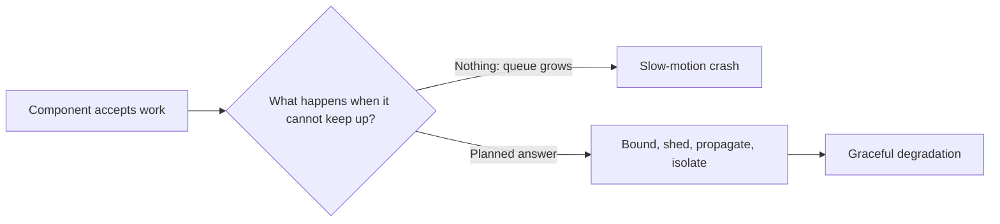

## 10. End-to-end picture

Combining the layers, a well-behaved system under overload looks like this:

1. Monitoring watches queue growth, tail latency, and utilization, not just errors.
2. Every queue is bounded, with an overflow policy chosen per workload.
3. Pressure levels trigger a graduated, hysteretic response: warn, shed low tiers, reject.
4. Consumers pull at their own pace; Kafka consumers use pause/resume rather than risking rebalances.
5. Overloaded services return 429 with `Retry-After`; callers back off with jitter and propagate the signal further upstream.
6. Circuit breakers isolate broken dependencies so their failures do not exhaust shared resources.

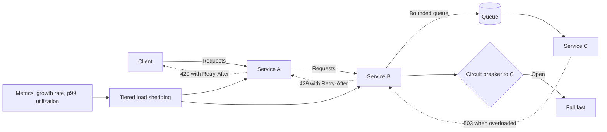

## Key takeaways

1. Backpressure is one phenomenon behind many symptoms: Kafka lag, RabbitMQ rejections, and HTTP 429s are all a component saying it has reached capacity.
2. Bigger queues only delay failure. Under sustained overload, the fix is controlling flow so the system never accepts more than it can process.
3. Watch queue *growth rate*, tail latency, and utilization; error rate is a lagging indicator.
4. Use a graduated response ladder with hysteresis instead of a binary healthy/broken switch.
5. Bound every queue and choose its overflow policy deliberately. Deciding whose work gets dropped is a product decision, made in advance.
6. Shed load by predefined priority tiers, with age-based boosting to prevent starvation.
7. Pull-based consumption makes consumer capacity the natural rate limiter; in Kafka, use pause/resume instead of risking rebalances, and treat lag as a first-class metric.
8. Propagate pressure all the way upstream. A 429 with `Retry-After`, honored by clients with backoff and jitter, is what finally reduces the incoming rate.
9. Circuit breakers protect the caller from broken dependencies by failing fast instead of exhausting threads.

The unifying principle from the transcript: every component that accepts work needs an answer to "what happens when I can't keep up?" If the answer is "nothing", the system does not have backpressure; it has a slow-motion crash waiting to happen. The goal is not to suppress the overload signal but to respect it.
