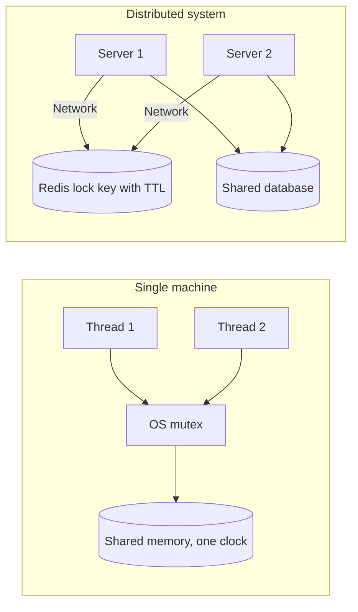
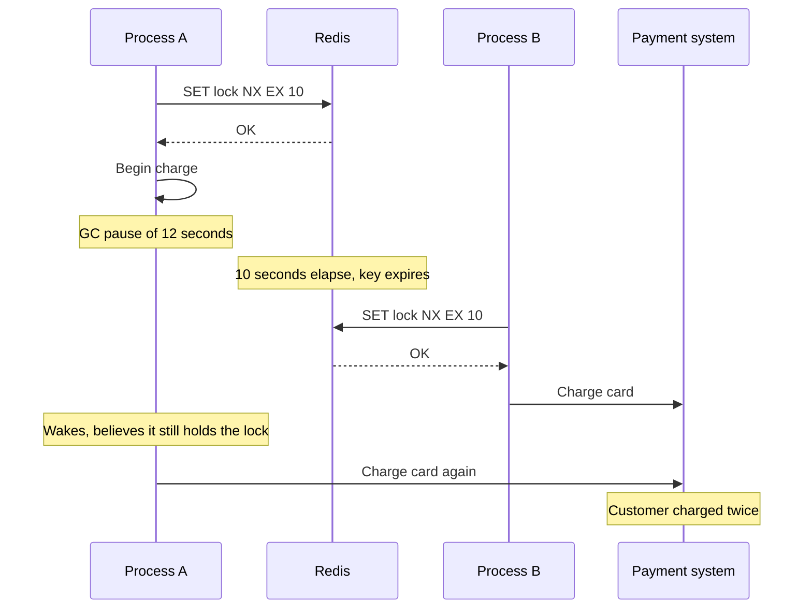
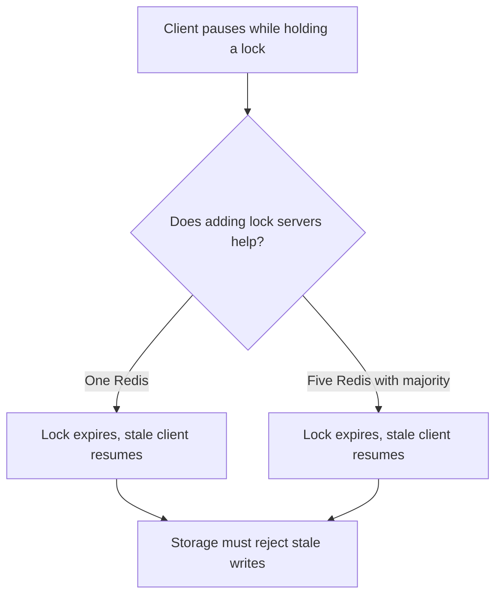
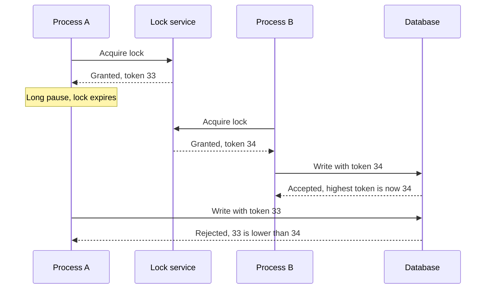
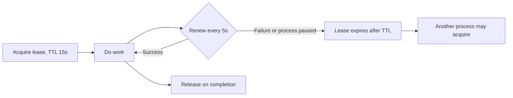
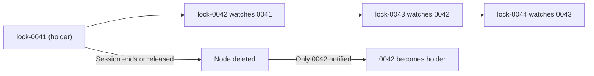
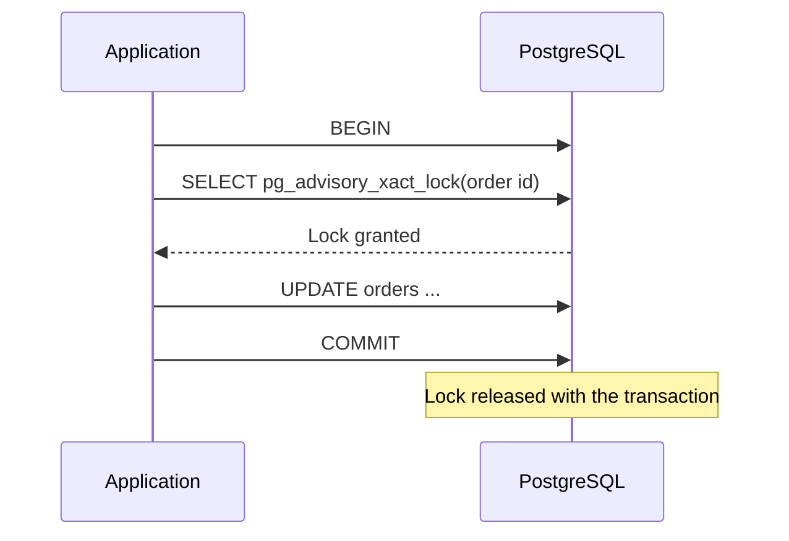
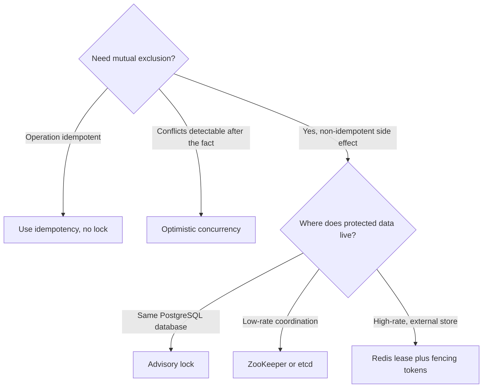
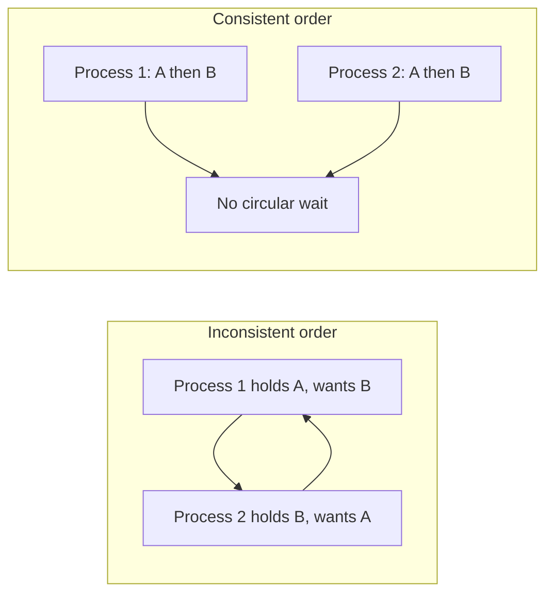

# Distributed Locks: Leases, Fencing Tokens, and When Not to Lock

## Scope and framing

This explainer follows the supplied transcript on distributed locks and uses it as the basis for a conceptual description of how locks behave across machines, why simple implementations fail, and what makes them safe. It adds established distributed-systems background (such as the Redlock debate and ZooKeeper lock recipes) where that clarifies the transcript. The incident at Plaid, latency figures, and timing examples are as reported in the transcript and have not been independently verified. The diagrams are conceptual.

The transcript opens with an incident it attributes to Plaid, the company that connects bank accounts to apps such as Venmo, Robinhood, and Coinbase. Thousands of bank transactions appeared twice in users' accounts. Some users filed disputes; some posted online. Engineers spent roughly four hours staring at code that looked correct. The culprit, according to the transcript, was a lock that was "working" but not sufficient.

The core message is that a distributed lock is not a mutex and cannot be one. It is better understood as two separate mechanisms:

- **Liveness:** ensuring a dead or stuck holder cannot block everyone forever (leases).
- **Safety:** ensuring a stale holder cannot corrupt data (fencing tokens).

## 1. What a lock is supposed to do

When two servers might touch the same data at the same moment, such as charging the same card, updating the same balance, or creating the same transaction, a lock ensures only one proceeds. The first acquires the lock, does its work, and releases it; others wait.

### On one machine, locks are easy

In a single process, the language runtime provides a mutex and the operating system manages it. There is one memory space and one clock. If the process crashes, the OS cleans up. The holder cannot be "paused" in a way that other threads fail to notice, because everything shares the same fate.

### Across machines, every assumption breaks

In a distributed system:

- Servers do not share memory.
- Servers do not share a clock.
- Servers cannot reliably tell whether another server has crashed or is merely slow.

The common reaction is to use Redis as a shared lock store:

```text
SET lock:order:123 <owner-id> NX EX 10
```

This means "create this key only if it does not exist, and delete it automatically after 10 seconds". Whoever creates the key has the lock. It is simple, fast, and works most of the time. The rest of this document is about the time it does not.



## 2. The process pause problem

### A lock only protects while the holder is actually running

Processes do not fully control when they run. The transcript lists several ordinary causes of a process freezing for seconds and then resuming as if nothing happened:

- A garbage-collection pause.
- A network delay that stalls a response.
- A Kubernetes pod being killed and restarted mid-operation.
- A cloud provider live-migrating the VM to another host.

The lock's TTL keeps ticking in Redis while the process is frozen. Redis has no way to distinguish a paused holder from a dead one; it only sees an expiring key.

### The double-charge timeline

1. Process A acquires the lock with a 10-second TTL and begins charging a customer's card.
2. Process A hits a 12-second GC pause.
3. After 10 seconds, Redis expires the key.
4. Process B acquires the lock and charges the same card.
5. Process A wakes. From its perspective no time has passed; it still believes it holds the lock and charges the card too.

Two processes, both convinced of exclusive access, both write to the same record. The transcript presents this as the pattern behind the Plaid duplicates: the locks worked as designed, but the design did not cover pauses.



Note that checking "do I still hold the lock?" right before writing does not fix this. The pause can occur between the check and the write, and the process cannot observe its own pause.

## 3. The Redlock debate

This problem sits at the center of a well-known debate in distributed systems.

**Redlock**, proposed by Salvatore Sanfilippo (antirez), the creator of Redis, acquires the lock on a majority of several independent Redis instances (five in the usual description) instead of one. The goal was to make the lock survive the failure of individual Redis nodes.

**Martin Kleppmann** published a critique. As summarized in the transcript, his central point was that the pause problem is not a Redis problem; it is a *client* problem. A process can pause whether it is talking to one Redis instance or five. Adding lock servers makes the lock service more available, but does nothing when the client itself goes silent for 12 seconds and resumes with a stale belief. Kleppmann also raised concerns about Redlock's reliance on timing assumptions, such as bounded clock drift and bounded pauses.

The takeaway for system design is not "never use Redis for locks". It is that **no lock service, however replicated, can by itself stop a paused client from acting on an expired lock**. Something downstream has to refuse the stale action.



## 4. Fencing tokens: making storage the correctness boundary

### How fencing works

Kleppmann's answer is the **fencing token**. Every time the lock is granted, the lock service also returns a number that only ever increases.

- Process A acquires the lock and receives token **33**.
- Later, Process B acquires the lock and receives token **34**.

Every write to the protected resource carries the token. The resource (for example, the database) remembers the highest token it has seen and rejects writes carrying a lower one.

### Replaying the scenario

1. A acquires the lock with token 33, starts work, and pauses for 12 seconds.
2. The lock expires. B acquires it with token 34 and writes. The database accepts 34 and records it as the highest seen.
3. A wakes and writes with token 33. The database sees 33 < 34 and **rejects** the write.

Two processes still believed they held the lock at the same time. The system remained correct anyway, because the stale write was refused before it landed.



### Implementing the check

In a relational database, the check can be a conditional update:

```sql
UPDATE accounts
SET balance = :new_balance, fence_token = :token
WHERE id = :id AND fence_token <= :token;
```

If zero rows are updated, the writer's token is stale and it must abandon the operation. The check and the write happen atomically in the database, which is the property the client-side "am I still the holder?" check lacked.

Fencing requires two things: a lock service that issues monotonically increasing tokens (ZooKeeper's zxid or node versions and etcd's revisions are natural sources; a plain Redis `SET NX` does not produce one by itself), and a downstream resource that can enforce the comparison. When the side effect lives in a third-party system that cannot check tokens, fencing is harder, and idempotency keys supported by that provider become the closest equivalent.

### The reframe

The transcript's key reframe: **the lock is not the correctness boundary; the storage layer is.** The lock is a performance optimization. It ensures that nearly all of the time only one process is in the critical section, so work is not wasted on conflicting attempts. The fencing token is what guarantees correctness in the remaining cases. And the lock *will* eventually fail; the only question is when.

## 5. Leases: liveness for lock holders

Fencing tokens provide safety. A separate mechanism is needed for **liveness**: making sure a dead holder does not block everyone forever. That mechanism is the **lease**, essentially a lock with a heartbeat.

- The holder acquires the lock with a TTL.
- A background task periodically renews it.
- If renewals stop (because the process died, paused, or lost network), the lease expires and another process can acquire it.

The transcript's example: renew every 5 seconds on a 15-second lease. Its rule of thumb:

- Set the lease TTL to about **three to five times** the expected work duration.
- Renew at **TTL ÷ 3**.

Renewing at one third of the TTL allows two missed renewals before expiry, which absorbs brief network blips without falsely declaring a healthy holder dead.



### Leases do not fix pauses

A lease does not solve the pause problem on its own. If the process pauses, its renewal thread pauses too. When it wakes, the lease may already belong to someone else. That is why the transcript pairs them:

> **Lease for liveness, fence for safety.**

Each mechanism covers a failure the other cannot.

## 6. Consensus-backed locks: ZooKeeper and etcd

If a team needs a lock that is safe without adding fencing checks to every storage system, the transcript points to consensus systems: **ZooKeeper** and **etcd**. Both replicate their state with a consensus protocol, so the lock state itself is not lost or duplicated when a server fails.

### ZooKeeper's ephemeral sequential nodes

ZooKeeper's classic lock recipe:

1. A process wanting the lock creates an **ephemeral sequential** node under a lock path, such as `/locks/order-123/lock-0000000042`.
2. ZooKeeper assigns increasing sequence numbers. The process with the **lowest** number holds the lock.
3. Each waiter **watches only the node immediately before it**. When that node disappears, only that one waiter is notified. This avoids a **thundering herd**, where every waiter wakes up and races each time the lock is released.
4. Nodes are **ephemeral**: tied to the client's session. If the holder crashes or loses its session, ZooKeeper deletes the node and the next waiter takes over automatically.



The transcript presents this as needing no application-managed timeouts and no fencing tokens. As general background, the session itself still has a timeout, and a client that pauses long enough can lose its session while believing it still holds the lock. The sequence number (or ZooKeeper's transaction ID) can serve as a fencing token when the downstream resource can check it, which closes that gap for the most sensitive cases.

### The latency trade-off

Consensus is not free. The transcript cites ZooKeeper operations at roughly **5–15 ms**, versus about **0.5 ms** for Redis. For locks acquired occasionally, such as leader election or configuration changes, that is irrelevant. For thousands of lock acquisitions per second, the consensus service becomes a bottleneck.

## 7. The overlooked option: PostgreSQL advisory locks

The transcript highlights a simpler option many teams overlook. If the system already uses PostgreSQL, it already has a distributed lock:

- **`pg_advisory_lock(key)`** acquires a session-level lock identified by an application-chosen integer. It uses the same internal lock manager as `SELECT ... FOR UPDATE`.
- **`pg_advisory_xact_lock(key)`** is transaction-scoped: it is released automatically when the transaction commits or rolls back, so it cannot be forgotten.

Properties the transcript lists:

- No additional infrastructure.
- Crash-safe: if the client's session ends, its locks are released.
- Built-in deadlock detection.
- About **1 ms** per operation.

Limitations:

- Each lock holder needs a database connection, which interacts with connection pool limits.
- If PostgreSQL is down, all locks are unavailable with it.

For the common case where the critical section writes to the same PostgreSQL database anyway, the transcript calls advisory locks the right starting point. There is also a useful alignment: when the lock and the protected data live in the same database, a transaction-scoped lock and the writes it protects commit or roll back together, which avoids much of the gap that makes external locks dangerous.



## 8. Choosing a lock mechanism

| Option | Typical latency (per transcript) | Liveness | Safety against pauses | Best fit |
| --- | --- | --- | --- | --- |
| Redis `SET NX EX` | About 0.5 ms | TTL expiry or lease renewal | Needs fencing downstream | High-rate, efficiency-oriented locks |
| Redlock (multi-Redis majority) | Higher than single Redis | TTL expiry | Still needs fencing | Debated; adds availability, not pause safety |
| ZooKeeper / etcd | About 5–15 ms | Session or lease | Strong; sequence/revision usable as fence | Leader election, config, low-rate critical locks |
| PostgreSQL advisory lock | About 1 ms | Released with session or transaction | Strong when data is in the same database | Apps already on PostgreSQL |



## 9. Granularity: lock the right thing

Lock scope matters as much as lock mechanism.

- **Too coarse:** locking the whole `orders` table serializes every order operation and destroys throughput.
- **Too fine:** separate locks for an order's status and its payment create **deadlock** risk. Two processes may acquire the two locks in opposite orders and wait on each other forever.
- **Just right:** lock the entity being changed, such as the specific order, not the table and not individual fields.

### Consistent lock ordering

If a process must hold multiple locks, the transcript's rule is to **always acquire them in the same global order**; alphabetical works. If everyone agrees A comes before B, no two processes can ever be waiting on each other in opposite directions, so a circular wait, and therefore a deadlock, cannot form.



## 10. Do you need a lock at all?

The transcript's final practical advice: before reaching for a lock, ask whether one is needed. Usually it is not.

- **Idempotent operations.** If running the operation twice has the same effect as running it once, no lock is needed. For example, `INSERT ... ON CONFLICT DO NOTHING` with a unique key lets the database handle duplicates.
- **Optimistic concurrency.** If conflicts can be detected after the fact, add a `version` column and write with `WHERE id = :id AND version = :n`, incrementing the version. If two processes race, only one update matches; the other sees zero rows affected and retries. No lock, no deadlock, no timeout management.
- **Genuine need.** A lock is warranted when there is a **non-idempotent external side effect** that cannot be undone or deduplicated downstream: charging a card, sending an SMS, calling a paid third-party API. In that case the answer is a lock *plus* fencing tokens (or a provider-supported idempotency key), because the lock will eventually fail.

```sql
UPDATE orders
SET status = 'shipped', version = version + 1
WHERE id = :id AND version = :expected_version;
```

## 11. Trade-offs

- **Speed vs. safety of the lock service.** Redis is fast but not consensus-backed; ZooKeeper and etcd are safer but slower. Neither eliminates client pauses.
- **Fencing requires cooperation.** The protected resource must understand and enforce tokens. That is easy for your own database and hard for arbitrary third-party APIs.
- **Lease TTL tuning.** Short TTLs recover quickly from dead holders but risk expiring on healthy, slow ones. Long TTLs are stable but leave work blocked longer after a crash.
- **Operational footprint.** A dedicated consensus cluster is another system to run. Advisory locks add nothing new but couple locking to database availability and connection limits.
- **Granularity.** Coarse locks are simple but slow; fine locks are fast but deadlock-prone without strict ordering.
- **Avoiding locks.** Idempotency and optimistic concurrency eliminate many locking problems but require schema and API design (unique keys, version columns, retry logic).

## Key takeaways

1. A distributed lock is not a mutex. Machines do not share memory or clocks and cannot reliably tell slow from dead.
2. Process pauses (GC, network stalls, pod restarts, VM migration) let a lock expire while its holder still believes it owns it. Two holders at once is a normal failure mode, not an exotic one.
3. Adding more lock servers, as in Redlock, does not fix client pauses; that is the heart of the Kleppmann critique.
4. Fencing tokens make the storage layer the correctness boundary: monotonically increasing tokens let the database reject stale writes.
5. Leases provide liveness; fencing provides safety. Use both: lease for liveness, fence for safety.
6. ZooKeeper and etcd offer consensus-backed locks with fair, herd-free queuing, at roughly an order of magnitude more latency than Redis.
7. PostgreSQL advisory locks are an underrated default when the protected data already lives in PostgreSQL.
8. Lock the entity, not the table or the field, and acquire multiple locks in a consistent order.
9. Often the best lock is no lock: idempotent writes and optimistic concurrency avoid the problem. Reserve locks for non-idempotent external side effects, and fence those.
