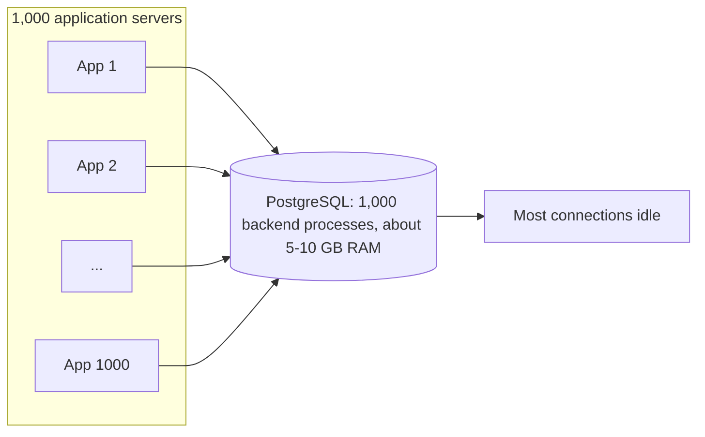
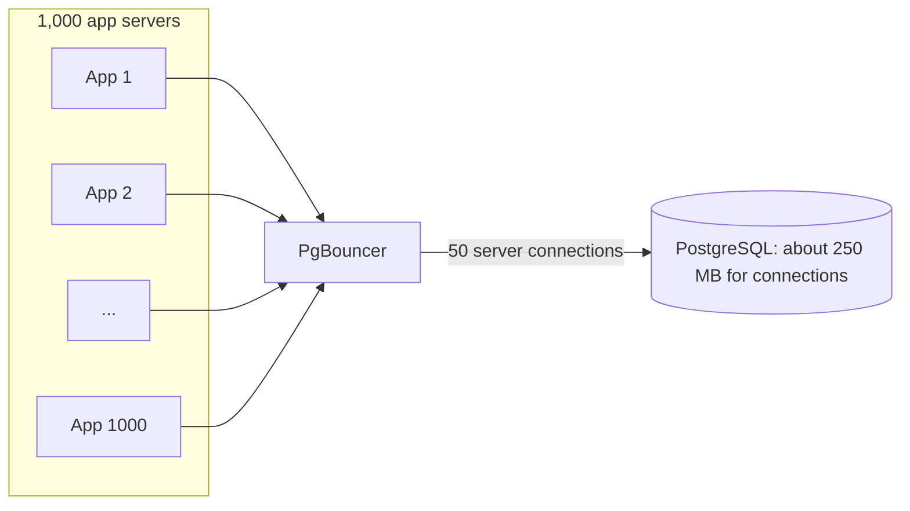
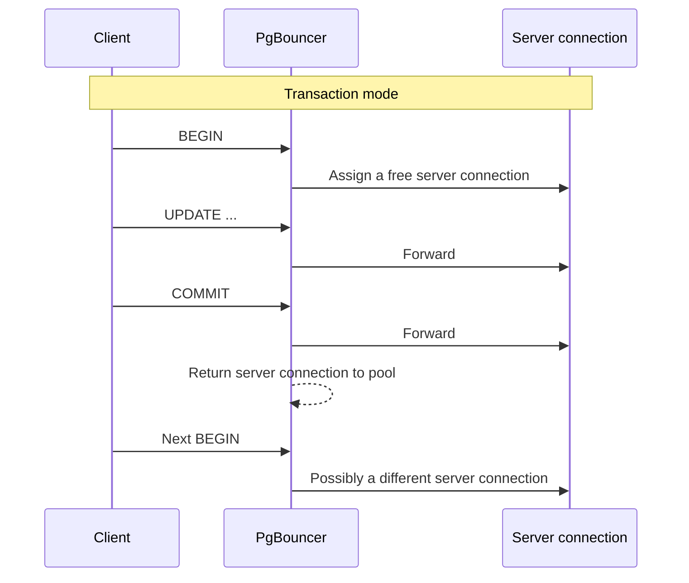
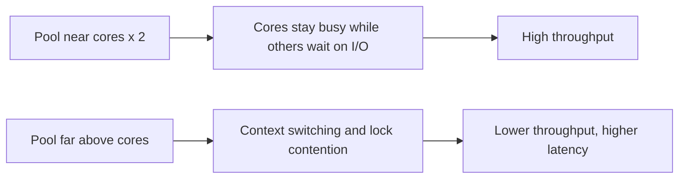
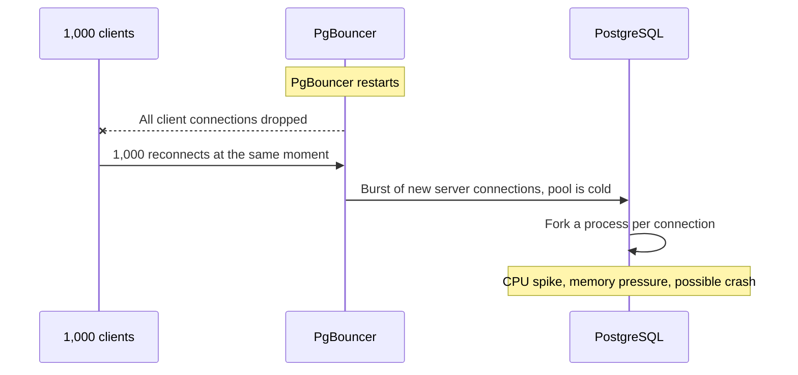
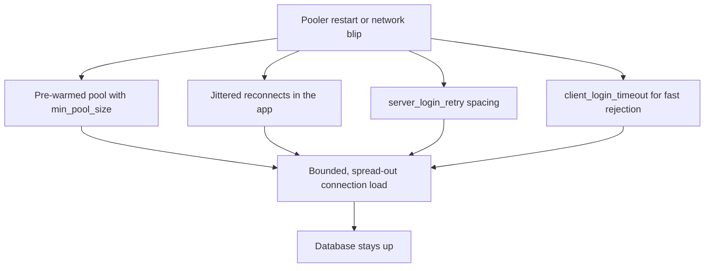
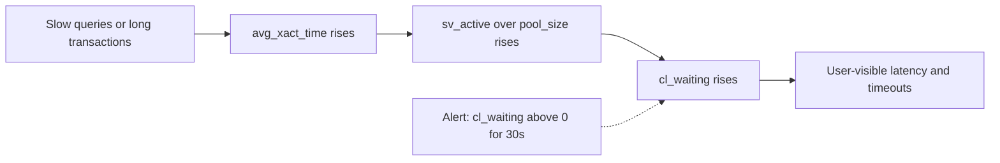
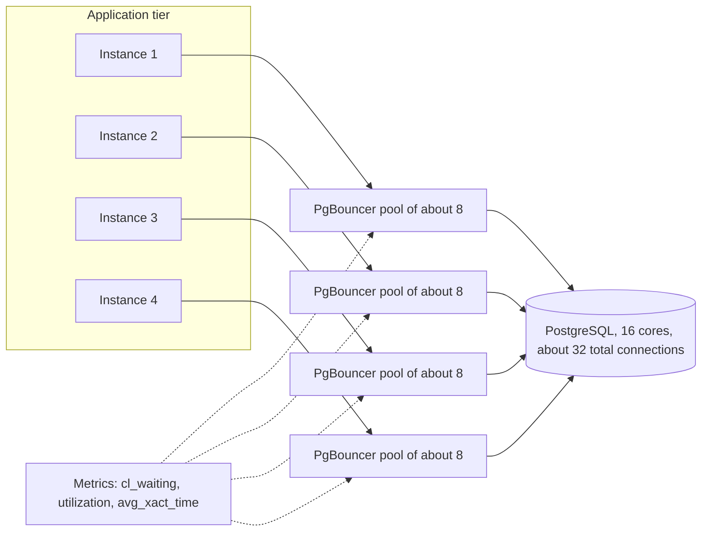

# Database Connection Pooling: PgBouncer, Pool Sizing, and Connection Storms

## Scope and framing

This explainer follows the supplied transcript on database connection pooling, focused on PostgreSQL and PgBouncer. It uses the transcript's explanations and examples and adds general engineering background where that clarifies why a mechanism behaves the way it does. Figures such as per-connection memory, idle ratios, benchmark results, and metric thresholds are as reported in the transcript and have not been independently verified; they vary by PostgreSQL version, workload, and hardware. The diagrams are conceptual.

Connection pooling is unglamorous infrastructure, but the transcript frames it as the difference between a database that scales and one that falls over at a few hundred users. Many teams discover it on the day their application first fails: connection timeouts appear, latency spikes even though individual queries are fast, and the database server looks mostly idle. That combination is the signature of a connection problem rather than a query problem.

The transcript's closing summary doubles as a checklist, and this document expands each item:

- Use a lightweight pooler (PgBouncer).
- Use transaction pooling mode.
- Size the pool from the database's CPU cores, not from traffic.
- Plan for connection storms.
- Monitor clients waiting for connections.

## 1. Why database connections are expensive

A PostgreSQL connection is not a lightweight socket. PostgreSQL uses a **process-per-connection** model: for each client connection, the server forks a dedicated backend process. According to the transcript, each process consumes roughly **5–10 MB** of RAM and holds file descriptors and internal state for as long as the connection lives.

### The multiplication problem

The transcript's example: 1,000 application servers each open a connection directly to PostgreSQL. That is 1,000 backend processes and roughly 5–10 GB of RAM devoted to connections alone.

Most of those connections are doing nothing. The transcript cites figures suggesting **80–95%** of application connections are idle at any moment. The system pays for 1,000 connections and actively uses perhaps 50.

As general background, a large number of backends also has costs beyond memory. PostgreSQL maintains shared structures that each backend interacts with (for example, when computing snapshots of which transactions are visible), so very high connection counts can slow down work even when most connections are idle. Setting `max_connections` very high is therefore not a free safety margin.

## 2. The pooler as a middleman

**Connection pooling** puts a component between the application and the database. Applications connect to the pooler, which keeps a small set of real database connections open and lends them out as needed. When an application needs to run a query, it borrows a server connection, runs the query, and returns it.

Because most client connections are idle most of the time, a small number of real connections can serve a large number of clients. The transcript's comparison:

| | Without pooling | With PgBouncer |
| --- | --- | --- |
| Application servers | 1,000 | 1,000 |
| Database connections | 1,000 | 50 |
| Connection memory on database | About 5–10 GB | About 250 MB |

That is about **20× fewer** database connections and roughly a **95% reduction** in connection memory, per the transcript.

As general background, pooling can happen in two places. **Application-side pools** (such as HikariCP in Java or the pool built into many ORMs) reuse connections within one process. An **external pooler** such as PgBouncer multiplexes across many processes and hosts. The two are often combined; the external pooler is what caps total connections to the database regardless of how many application instances are running.

## 3. PgBouncer's three pooling modes

The mode determines **how long a server connection is assigned to a client**. The transcript calls this one of the most important configuration decisions.

### Session mode

A client is assigned a server connection when it connects to PgBouncer and keeps it until it disconnects.

- **Compatibility:** complete. Prepared statements, session variables, temporary tables, advisory locks at session level, `LISTEN`: everything behaves as with a direct connection.
- **Multiplexing:** poor. If clients stay connected for a long time, which is typical for application-side pools, the pooler barely reduces server connections.

### Transaction mode

A client holds a server connection only for the duration of a transaction. After `BEGIN ... COMMIT` (or a single autocommit statement), the server connection returns to the pool and another client can use it immediately.

- **Multiplexing:** very good, because connections are constantly recycled.
- **Compatibility:** session-level state does not carry across transactions, because the next transaction may run on a different server connection. Session variables set with `SET`, session-level advisory locks, and temporary tables that outlive a transaction do not work as expected. The transcript also lists prepared statements; as general background, recent PgBouncer versions have added support for protocol-level prepared statements in transaction mode, so this limitation depends on the version and client driver.

### Statement mode

A server connection is held only for a single statement and returned immediately afterward, even if the client is about to run another.

- **Multiplexing:** the best possible.
- **Compatibility:** multi-statement transactions are not allowed at all, which rules it out for almost every application.

### Which mode to choose

| Mode | Server connection held for | Multiplexing | Session features | Typical use |
| --- | --- | --- | --- | --- |
| Session | Entire client session | Poor | All work | Apps relying heavily on session state |
| Transaction | One transaction | Very good | Not across transactions | Most web applications |
| Statement | One statement | Best | No multi-statement transactions | Rare, specialized workloads |

The transcript's guidance: the large majority of production teams (it says about 95%) use **transaction mode**. Use session mode only when the application depends on session state, and avoid statement mode unless you know exactly why you need it.

## 4. PgBouncer vs. Pgpool-II

The transcript contrasts PgBouncer with **Pgpool-II**, which sounds similar but is quite different.

| | PgBouncer | Pgpool-II |
| --- | --- | --- |
| Architecture | Small, single-threaded C program | Multi-process |
| Memory footprint (per transcript) | About 2 MB | 50 MB or more |
| Scope | Connection pooling only | Pooling, read/write splitting, query caching, automatic failover |
| Reputation | Simple and predictable | Harder to tune and debug, slower under load |

Pgpool-II looks more capable on paper, but every feature adds failure modes. The transcript's rule: **use PgBouncer for connection pooling; add Pgpool-II only if you specifically need read/write splitting or automatic failover.** Start simple rather than starting with the tool that does the most.

As general background, because PgBouncer is single-threaded, very high-throughput deployments sometimes run several PgBouncer processes (for example, with `so_reuseport`) to use more CPU cores.

## 5. How many connections should the pool have?

### The intuition is backward

The common intuition is that more connections means more throughput, so teams set pool sizes of 200 or 500 to be "generous" with the database. The transcript argues this makes the database slower.

### The formula

The transcript gives a widely cited starting formula:

$$
\text{connections} = (\text{CPU cores} \times 2) + 1
$$

On a 16-core database server that is **33** connections, not 200 or 500.

The reasoning:

- Each CPU core executes one thing at a time.
- While one connection waits on I/O (disk, network), the core can run another. So each core realistically keeps about **two** connections busy.
- The transcript explains the `+1` as allowance for coordination overhead. As general background, the formula as popularized by the HikariCP project adds the "effective spindle count" (a rough measure of concurrent I/O the storage can serve), which works out to a small number on typical hardware. Either way, the result is a small multiple of core count.

Beyond that point, extra connections mostly create **context switching**. The CPU spends time swapping between backends and contending for locks instead of executing queries, so total work done falls.

The transcript reports that PostgreSQL benchmarks on a 16-core machine showed **32 connections outperforming 200** in real throughput tests: fewer connections, more queries per second.

### Dividing across instances

The formula gives the **total** for the database. If several poolers or application instances share the database, divide the total among them. The transcript's example: four application instances, each with its own PgBouncer pool, should each have about **8** server connections so the total stays around 32.

The takeaway: **size the pool from the database's CPU cores, not from traffic.** Connection count is a CPU problem, not a traffic problem. The formula is a starting point; measure and adjust for the real workload, especially if queries spend much of their time waiting on slow storage or on external locks.

### Queueing is intentional

A small pool means that at peak, some clients wait for a connection. That is not a failure; it is the pooler applying backpressure. A short wait in the pooler's queue is far cheaper than hundreds of backends thrashing the CPU. The waiting count becomes the key health metric (section 7).

## 6. The connection storm

### How a pooler restart takes down the database

The transcript describes a failure mode that turns a routine restart into an outage:

1. PgBouncer is multiplexing 1,000 client connections onto 50 server connections.
2. PgBouncer restarts. All 1,000 client connections drop.
3. All 1,000 clients detect the disconnect almost simultaneously and reconnect at once.
4. PgBouncer's pool is cold, so it tries to open many new server connections to PostgreSQL at the same time.
5. PostgreSQL forks a process for each connection attempt. Hundreds of simultaneous forks cause a large CPU spike.
6. If unlucky, PostgreSQL hits its connection limit, runs out of memory, and crashes.

A pooler restart has taken down the entire database.

### Four defenses

The transcript lists four measures, which work best together:

1. **Pre-warm the pool.** Set `min_pool_size` so PgBouncer maintains a minimum number of server connections, including right after a restart. Clients have somewhere to go immediately rather than every request triggering a new backend.
2. **Stagger reconnects.** Use PgBouncer's `server_login_retry` and add jittered retry in the application so clients spread reconnect attempts over several seconds instead of the same millisecond.
3. **Reject gracefully.** Use `client_login_timeout` so that when the pool is overwhelmed, clients get a quick "try again later" instead of hanging indefinitely.
4. **Implement jittered retry in the application.** This is an application responsibility. If the application retries instantly on disconnect, no pooler configuration will save the database.

Also relevant as general background: PgBouncer's `max_db_connections` caps the total server connections per database, which bounds how hard a cold pooler can hit PostgreSQL, and PostgreSQL's own `max_connections` acts as the final safety limit. PgBouncer also supports online restart and pause/resume administrative commands that can avoid dropping all clients at once during planned maintenance.

The key insight from the transcript: **pooler restarts are high-risk operations.** Treat them like database operations, with planning and care, not like restarting a stateless web server.

## 7. Monitoring pool health

PgBouncer exposes statistics through its admin console (`SHOW POOLS`, `SHOW STATS`). The transcript identifies three metrics that matter in production.

### `cl_waiting`: clients waiting for a connection

The number of clients currently waiting for a server connection.

| Value | Interpretation |
| --- | --- |
| Consistently 0 | Healthy |
| 1–5 | Investigate: pool may be too small or queries too slow |
| Above 10 | Critical: clients are backing up and users feel it |

### `sv_active / pool_size`: server utilization

The fraction of pool connections actively in use.

| Value | Interpretation |
| --- | --- |
| Under 50% | Healthy |
| 50–80% | Worth investigating |
| Above 90% | Saturated; small spikes will cause waiting |

### `avg_xact_time`: average transaction duration

| Value | Interpretation |
| --- | --- |
| Under 10 ms | Healthy |
| 10–100 ms | Acceptable, worth watching |
| Above 500 ms | Slow transactions are hogging connections |

These metrics are connected. Slow transactions (high `avg_xact_time`) hold connections longer, which raises utilization, which causes clients to queue (`cl_waiting` rises). As general background, Little's Law captures the relationship: the number of connections in use is roughly the transaction rate multiplied by the average transaction time. Doubling transaction time at the same rate doubles the connections needed.

$$
\text{connections in use} \approx \text{transactions per second} \times \text{average transaction time}
$$

For example, 1,000 transactions per second at 10 ms each needs about 10 active connections; at 100 ms each it needs about 100, which would exceed a 33-connection pool.

### The one alert to set

The transcript recommends a single alert: **`cl_waiting > 0` for more than 30 seconds.** That one condition catches essentially every pool-sizing problem and every slow-query problem before it becomes an outage, because both ultimately show up as clients waiting for connections.

A related practice is to keep transactions short: do not hold a transaction open while calling external APIs or waiting on user input. In transaction mode, an idle-in-transaction client pins a server connection just as surely as an active one.

## 8. Putting it together

A typical production layout:

1. Application instances use a modest application-side pool (or none) and connect to PgBouncer.
2. PgBouncer runs in transaction mode, with `default_pool_size` set so the total across all poolers is near `cores × 2 + 1` for the database server.
3. `min_pool_size` keeps the pool warm; `max_db_connections` caps the total; login timeouts and retries are tuned.
4. Applications implement jittered reconnect logic.
5. Monitoring tracks `cl_waiting`, utilization, and transaction time, with an alert on sustained waiting.

## 9. Trade-offs

- **Transaction mode vs. session features.** Transaction mode gives excellent multiplexing but breaks session-scoped state. Applications must avoid relying on session variables, session-level locks, or cross-transaction temporary tables, and must check prepared statement support for their PgBouncer version and driver.
- **Small pools mean queueing.** A correctly sized pool will make clients wait at peak. That is intended backpressure, but it has to be monitored and paired with timeouts.
- **Another hop and another component.** The pooler adds a small amount of latency and a component that can fail or be restarted. A single PgBouncer is itself a single point of failure unless deployed redundantly.
- **Restarts are dangerous.** A pooler restart without warm pools and jittered reconnects can overwhelm the database.
- **Formula is a starting point.** `cores × 2 + 1` assumes CPU-bound work with modest I/O waits. Workloads dominated by slow storage, long lock waits, or very short queries may need a different number, found by load testing.
- **Feature-rich poolers cost complexity.** Pgpool-II adds useful capabilities but also more failure modes and tuning effort.

## Key takeaways

1. PostgreSQL connections are processes, each with real memory and CPU cost. Most application connections are idle most of the time.
2. A pooler lets a small number of real connections serve many clients; the transcript's example reduces 1,000 connections to 50.
3. PgBouncer's transaction mode is the standard choice: strong multiplexing with manageable compatibility constraints.
4. Prefer lightweight PgBouncer for pooling; add Pgpool-II only for features you actually need.
5. Size the total pool from database CPU cores, starting near `cores × 2 + 1`. More connections usually mean less throughput, not more.
6. Divide the total across poolers or instances so the database's aggregate connection count stays bounded.
7. Plan for connection storms: pre-warm pools, cap totals, stagger and jitter reconnects, and fail fast rather than hang.
8. Watch `cl_waiting`, server utilization, and average transaction time, and alert when clients wait for more than 30 seconds.

The transcript's closing idea: connection pooling is not a performance optimization; it is a survival strategy. Without it, the database burns memory on idle connections, wastes CPU on context switches, and falls over at the first traffic spike. With it, a small, well-sized pool serves thousands of clients efficiently.
