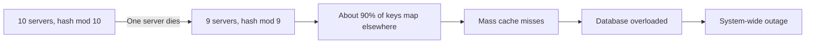
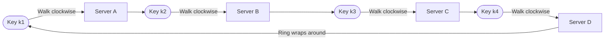
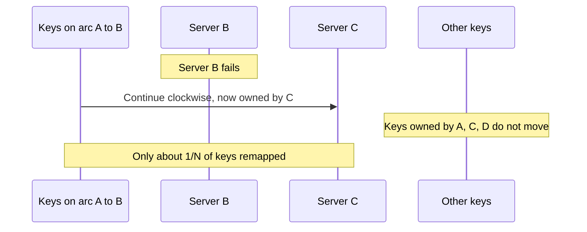
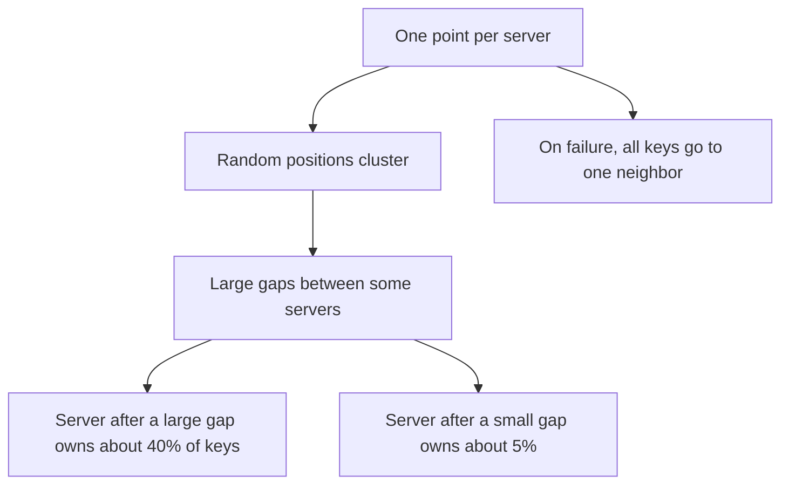
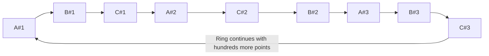
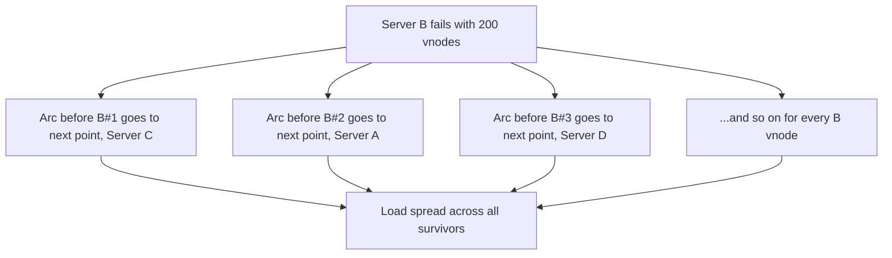
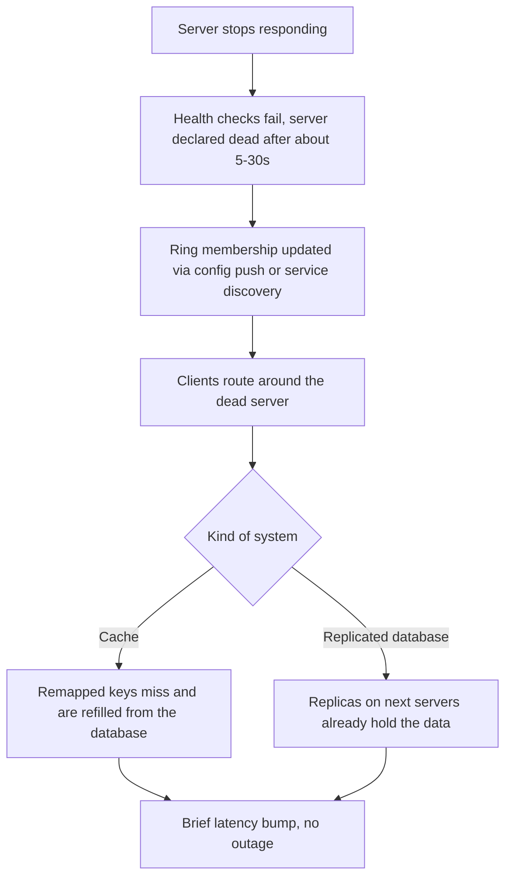
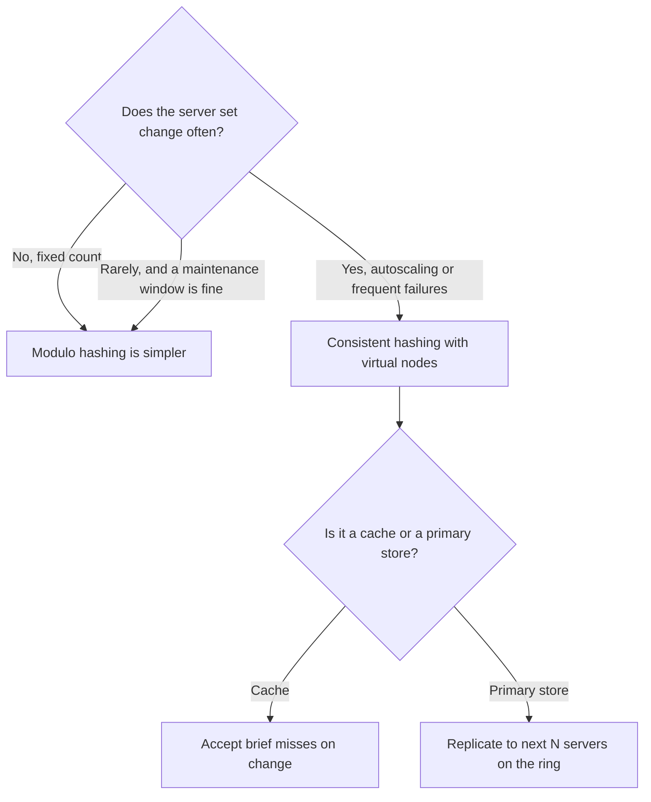

# Consistent Hashing: The Ring, Virtual Nodes, and Bounded Disruption

## Scope and framing

This explainer follows the supplied transcript on consistent hashing and uses it as the basis for a conceptual description of the algorithm, its failure behavior, and where it is used. It adds standard computer-science background where helpful. Percentages, timings, and virtual-node counts are as reported in the transcript and have not been independently verified; they are illustrative. The diagrams are conceptual and simplified, particularly the rings, which cannot be drawn to scale in Mermaid.

Consistent hashing is one of the most widely deployed algorithms in distributed systems. The transcript lists Memcached clients, Redis clusters, DynamoDB, Cassandra, CDNs, and Discord among its users. Many engineers remember it as "something to do with a ring" and little else. That is fine until the day a single server failure collapses the cache hit rate, or one node ends up doing five times the work of its peers. This document walks through why the obvious approach fails and what consistent hashing does about it.

## 1. The placement problem

Suppose there are 10 cache servers and a large number of keys. Two questions need answers:

1. Which server should hold a given key?
2. How can that decision stay stable when servers are added or removed?

The first is easy. The second is where designs succeed or fail. Every client must independently compute the same answer without consulting a central directory on every request, and the answer should change as little as possible when the server set changes.

## 2. The obvious approach: modulo hashing

The first thing most people reach for is **modulo hashing**:

$$
\text{server} = \text{hash}(\text{key}) \bmod N
$$

With 10 servers, `user:42` might land on server 2 and `user:43` on server 5. It is simple, fast, and spreads keys evenly, as long as $N$ never changes.

### What happens when a server dies

When one server fails, $N$ becomes 9 and the formula becomes $\text{hash}(\text{key}) \bmod 9$. Because of how modular arithmetic works, most keys now map to a *different* server than before, not just the keys that lived on the dead server. The transcript's figure: roughly **90%** of keys move.

As background, a key keeps its server only if $h \bmod 10 = h \bmod 9$, which holds for roughly one in ten hash values. The rest are reassigned.

With a million cached keys, about 900,000 are suddenly looked up on the wrong server. Every one is a cache miss that falls through to the database. The database, sized for a healthy cache hit rate, may be overwhelmed and fail too. One cache server dying has taken down the whole system.

### Adding a server is no better

Scaling up has the same problem. Going from 10 to 11 servers remaps about **91%** of keys. Modulo hashing has one fatal flaw: it cannot handle change.

## 3. The ring

Consistent hashing replaces the modulo with a circle.

1. Imagine the hash output space (for example, all 32-bit values) bent into a **ring**, so the largest value wraps around to zero.
2. Hash each **server** (for example, its name or address) onto the ring. Each server lands at an effectively random position.
3. Hash each **key** onto the same ring.
4. **Ownership rule:** start at the key's position and walk **clockwise**. The first server encountered owns the key.

That is the whole idea. Keys and servers share one ring, and each key belongs to the next server clockwise.

In practice, "walk clockwise" is a binary search: keep the server positions in a sorted array and find the first position greater than or equal to the key's hash, wrapping to the first entry if none is found. Lookup is $O(\log S)$ in the number of ring points.

### What happens when a server dies

Suppose Server B fails. The only keys affected are those that belonged to B, the ones sitting on the arc between A and B. They continue clockwise to the next server, C, which now owns them.

Every other key stays exactly where it was. Keys owned by A, C, and D do not move.

With 10 servers, a single failure moves only about **1/10** of keys. In the transcript's million-key example, that is roughly 100,000 misses rather than 900,000. The database absorbs the extra load, and the system recovers within seconds.

Adding a server works the same way in reverse. The new server lands somewhere on the ring and takes over the slice of keys between its predecessor and itself, all taken from the one server that previously owned that arc. Everyone else is unaffected.

The central property: **consistent hashing bounds disruption.** A change in the server set affects a small, predictable slice of keys, on the order of $K/N$ for $K$ keys and $N$ servers, instead of nearly all of them.

## 4. The catch: uneven load

Using the ring exactly as described, one point per server, causes a new problem. Hash functions scatter points randomly, not evenly. With only a handful of points on a large ring, they tend to cluster: two servers land close together, leaving a large gap elsewhere. Whichever server sits at the clockwise end of a large gap owns a disproportionate share of keys.

The transcript's example: with five servers, one might own about **40%** of keys and another about **5%**. One server is drowning; another is nearly idle. The data is distributed, but the load is not, defeating the purpose.

There is a second, related problem. When a server fails, *all* of its keys move to a *single* neighbor. That neighbor may already be one of the busier servers, and now it absorbs an entire extra server's worth of load.

## 5. The fix: virtual nodes

The fix is **virtual nodes** (vnodes). Instead of one point per server, place many, such as 100 or 200.

- Server A is hashed as `A#1`, `A#2`, …, `A#200`, producing 200 points scattered around the ring, all mapping back to physical server A.
- Server B gets 200 points, Server C gets 200 points, and so on.

With many points per server, the ring is densely populated, and random placement averages out. The clustering problem mostly disappears. With 200 virtual nodes per server, the transcript describes load distribution as close to even: each server receives roughly its fair share instead of 40% versus 5%.

As general background, the imbalance shrinks roughly with the square root of the number of virtual nodes per server; more vnodes give a smoother distribution at the cost of a larger routing table and more memory.

### Bonus 1: weighting by capacity

Virtual nodes provide a tuning knob. A more powerful server can be given more points. The transcript's example: a 32-core server gets **400** virtual nodes while smaller servers get 200. It then owns about twice as much of the ring and receives about twice the traffic. No special routing logic is required; the proportion falls out of the math.

### Bonus 2: failure load spreads evenly

When a server with 200 virtual nodes dies, each of its 200 points sits next to a point belonging to some *different* server. Its keys therefore scatter across many survivors rather than landing on one neighbor. Everyone picks up a small share; nobody gets slammed.

The transcript's summary: one point per server is how the idea is explained; **production systems use virtual nodes.**

## 6. What happens when a server dies in production

The transcript breaks a real failure into three sequential steps.

### Step 1: Detection

The system must notice the server is gone. Typically, health checks ping each server every few seconds, and after several consecutive failures the server is declared dead. The transcript puts this at roughly **5–30 seconds**. Declaring death too eagerly causes needless remapping on transient blips; too slowly prolongs errors.

### Step 2: Ring update

Every client must learn about the new ring. Either a configuration update is pushed to all clients, or they discover it through a service-discovery system. Once updated, clients route around the dead server. Because every client computes placement locally from the same member list and the same hash function, they converge on the same answer without a central lookup on every request.

### Step 3: Remapped keys are requested

Requests for keys that moved now go to their new owners, where they are initially absent.

How this looks depends on the kind of system:

- **Pure cache (such as Memcached).** Remapped keys are simply missing. They are rebuilt on the next read from the backing database. There is a brief bump in cache misses; the database absorbs it.
- **Database (such as Cassandra or DynamoDB).** The data has to be present; there is nothing to rebuild from. These systems **replicate** each piece of data to the next two or three distinct servers clockwise on the ring. When a server dies, its replicas already hold the data. Nothing needs to be copied urgently; traffic is redirected and the replicas serve it.

In both cases, the transcript describes the customer-visible impact as usually under two minutes of slightly elevated latency, with no outage.

### Replication on the ring

For replicated stores, the replica set for a key is found by continuing the clockwise walk past the owner and collecting the next distinct physical servers. As general background, with virtual nodes the walk must skip additional vnodes belonging to a server already chosen, and production systems often also skip servers in the same rack or availability zone so replicas do not share a failure domain.

## 7. Where consistent hashing is used

The transcript lists several real-world uses:

- **Memcached clients.** The Ketama algorithm, used by many Memcached client libraries, implements consistent hashing with virtual points to spread keys across cache servers.
- **Distributed databases.** Cassandra and DynamoDB use ring-based partitioning with replication to neighboring nodes.
- **CDNs.** Providers such as Cloudflare and Akamai use it in routing requests toward edge servers.
- **Discord.** Consistent hashing keeps a user's WebSocket traffic landing on the same gateway server so real-time messages stay consistent.

As general background, not every system that partitions by hash uses a ring. Redis Cluster, for example, uses a fixed number of hash slots assigned to nodes, a different technique with the same goal: make rebalancing move only a bounded subset of keys.

## 8. When you do not need it

The transcript offers a reality check: consistent hashing is often overkill.

- **Fixed server count.** If the number of servers never changes, modulo hashing is simpler and perfectly adequate.
- **Maintenance windows are acceptable.** If you can tolerate a planned window to reshard, the remapping cost of modulo may not matter.
- **Dynamic clusters.** Consistent hashing earns its complexity when servers are constantly added, removed, scaled up, or scaled down. That is when "90% of keys remap" becomes a real operational problem.

It is a tool for a specific problem, not a default.

## 9. Trade-offs

- **Bounded, not zero, disruption.** Keys still move when servers change. Caches still take a burst of misses; stores still need rebalancing. Consistent hashing limits the damage to about $1/N$ of keys.
- **Balance requires virtual nodes.** Without them, load can be badly skewed and a failed server's load lands on one neighbor. With them, the routing table grows and membership changes touch many small arcs.
- **Hot keys are not solved.** Consistent hashing balances the *number* of keys, not their popularity. A single extremely hot key still lands on one server; that needs separate techniques such as replication of hot keys or request coalescing.
- **Membership must be agreed.** Clients that disagree about ring membership route the same key to different servers. Detection and propagation of membership changes are part of the design.
- **Detection timing.** Aggressive failure detection causes churn on transient issues; conservative detection prolongs errors.
- **Complexity vs. need.** For static clusters, modulo hashing is simpler and equally effective.

## Key takeaways

1. The hard part of data placement is not the initial mapping; it is keeping the mapping stable when servers change.
2. Modulo hashing remaps roughly 90% of keys when one of 10 servers is added or removed, which can turn a single cache failure into a database outage.
3. Consistent hashing puts servers and keys on a shared ring; each key belongs to the next server clockwise. A server change moves only about $1/N$ of keys.
4. One point per server leads to uneven ownership. Virtual nodes, typically hundreds per server, make load close to even.
5. Virtual nodes also allow weighting by capacity and spread a failed server's load across all survivors.
6. In production, failure handling is detection, ring update, then remapped-key traffic. Caches refill; replicated databases already have the data on neighboring nodes.
7. Use consistent hashing when the cluster is dynamic. For a fixed server count, modulo is simpler.

The transcript's closing idea: consistent hashing does not make change free. Servers still come and go and keys still move. What it does is bound the damage, turning what would have been a cache-miss storm into a blip nobody notices.
