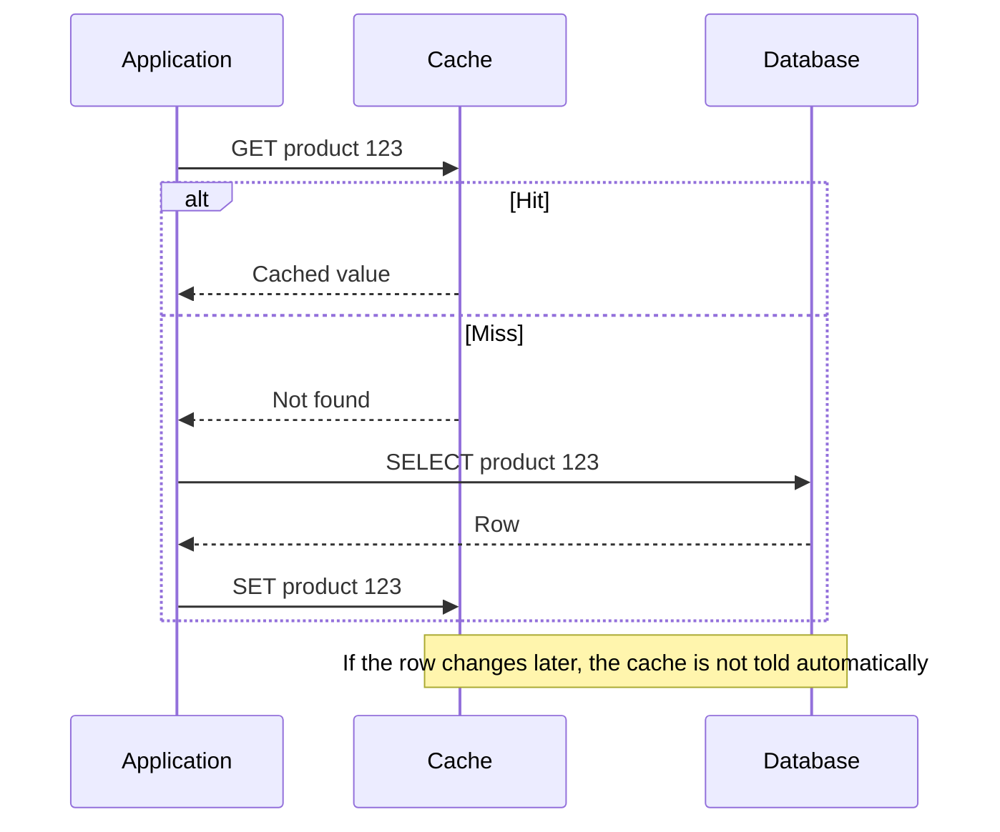
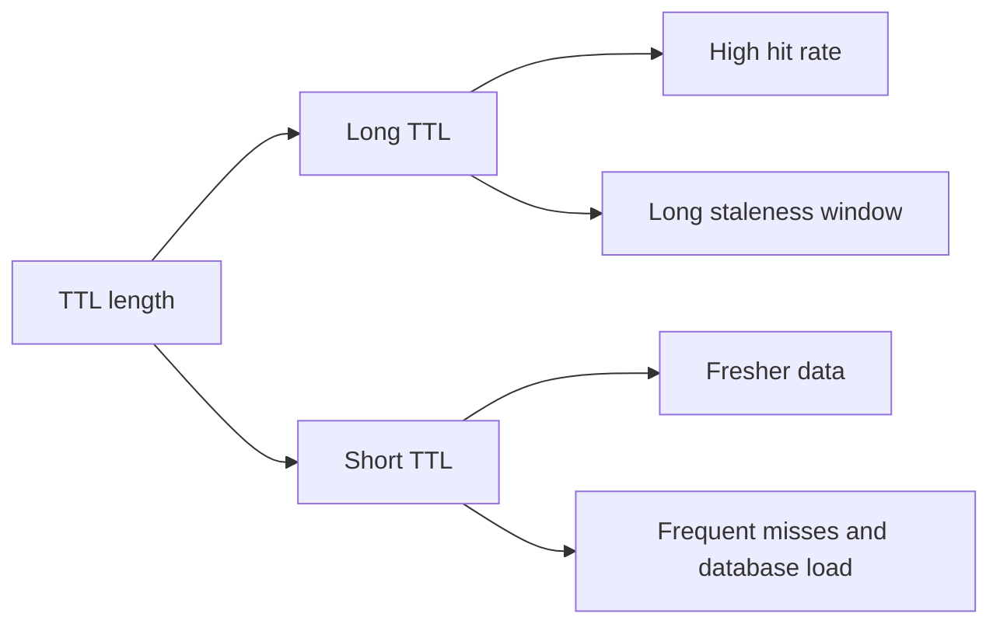
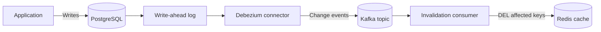
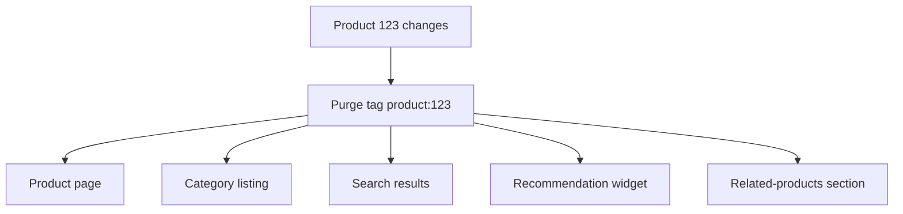
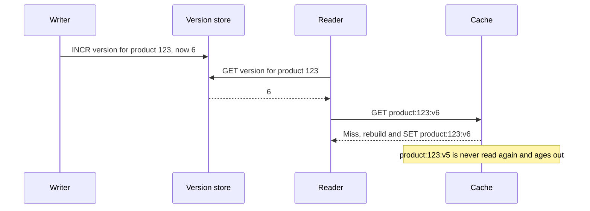
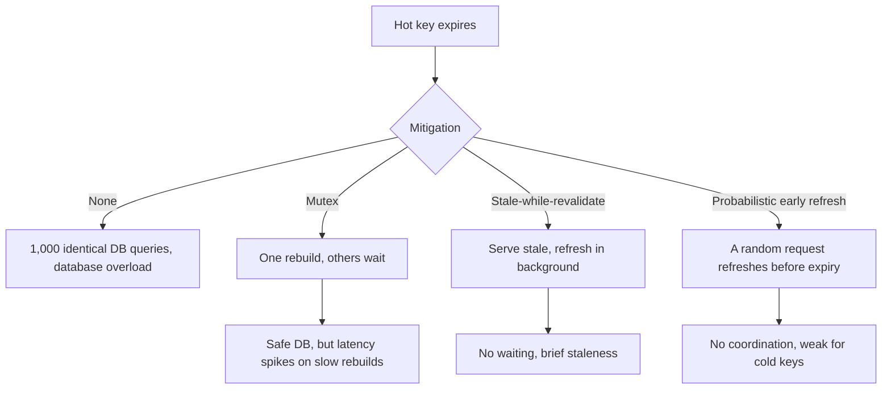
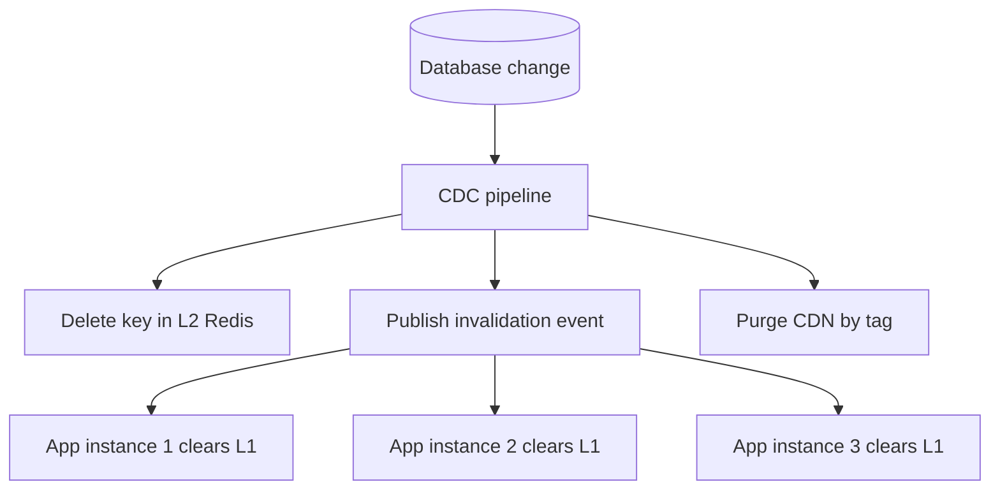
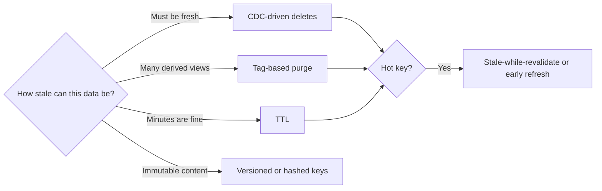

# Cache Invalidation: CDC, Tags, Versions, and the Thundering Herd

## Scope and framing

This explainer follows the supplied transcript on cache invalidation. It uses the transcript's structure (caching patterns, four invalidation strategies, thundering-herd mitigation, and multi-layer consistency) and adds widely known engineering background where it clarifies the mechanisms. References to Shopify, Cloudflare, GitHub, and Amazon, along with latency and traffic figures, are as reported in the transcript and have not been independently verified. The diagrams are conceptual.

A cache makes a system fast; a stale cache makes it wrong. Every time a key is given a TTL, say five minutes, the system is implicitly telling users "this data might be up to five minutes out of date, and that is acceptable." For many kinds of data that is fine. For product prices, inventory counts, or user permissions, that staleness can break the experience or cause real harm.

**Cache invalidation** is the act of telling a cache that data it holds is no longer valid, so it stops serving the stale copy and fetches a fresh one. The transcript's central point is that invalidation is much more than choosing a TTL, and that caching happens at many layers: CDN, browser, in-process application caches, distributed caches, and even the database's own buffer pool. Each layer has its own staleness characteristics, invalidation mechanisms, and failure modes.

## 1. Caching patterns determine the invalidation problem

The right invalidation strategy depends on how the cache is populated. The transcript briefly covers two patterns.

### Cache-aside

**Cache-aside** (lazy loading) is what most teams use:

1. The application checks the cache.
2. On a **hit**, it returns the cached value.
3. On a **miss**, it reads from the database, writes the result into the cache, and returns it.

The key property: **the cache has no idea when the underlying data changes.** It is the application's responsibility to tell it. That is the invalidation problem.

### Write-through

**Write-through** writes to both the cache and the database on every write. The cache is always fresh. The cost is that every write pays for a cache update. For write-heavy workloads, much of that effort warms the cache with data nobody reads.

Most production systems use cache-aside, so the question becomes: **when the database changes, how does the cache find out?**

## 2. The baseline: TTL and its hard trade-off

The simplest answer is a **time to live**. Each entry expires after a fixed interval. This is easy and robust, but it forces a hard trade-off:

- **Long TTL:** high hit rate, but users may see data that is hours stale.
- **Short TTL:** fresher data, but constant misses that defeat the purpose of the cache.

The transcript reframes the question: instead of waiting for a timer, what if the cache could learn about changes **the moment they happen**? The strategies below are different answers.

In practice, a TTL is still valuable even when another strategy is used: it acts as a safety net that bounds how long any missed invalidation can linger.

## 3. Strategy 1: Change data capture

### Reading the database's own change log

**Change data capture (CDC)** captures changes directly from the database's **write-ahead log (WAL)**, the log the database already uses for crash recovery and replication. Every committed insert, update, and delete appears there, regardless of which application or script made the change.

### The pipeline

The transcript describes four stages, each with a distinct job:

1. **Debezium** (or a similar connector) tails the WAL and emits a structured event for every row insert, update, or delete. It turns database changes into a stream.
2. **Kafka** receives those events and acts as a durable buffer. If the downstream invalidator is down, events wait safely rather than being lost.
3. An **invalidation consumer** reads the topic, works out which cache keys each change affects, and issues deletes.
4. **Redis** (or whichever cache) receives the delete commands.

The separation is deliberate. Someone has to read the log (Debezium). Durability is needed between producer and consumer (Kafka). Cache invalidation is its own concern and should not live inside the connector (the consumer). Redis is simply where the cache lives.

### Latency and benefits

Four stages sound slow, but the transcript puts end-to-end latency at roughly **50–100 ms**, not minutes. It cites Shopify's storefront as a user of this approach: product updates, price changes, inventory adjustments, and description edits flow through CDC to the cache layer, so caches are effectively always fresh because invalidation is triggered by the actual change rather than a timer.

Additional benefits, as general background:

- **Completeness:** CDC sees every committed change, including those made by batch jobs, admin tools, or other services that would bypass application-level invalidation code.
- **Ordering:** changes arrive in commit order per partition key, which matters when the same row changes rapidly.
- **Decoupling:** writers do not need to know what is cached.

### A race to be aware of

With cache-aside, there is a classic race: a reader misses, reads the old value from the database, a writer updates the row and the invalidation deletes the key, and then the slow reader writes the *old* value back into the cache. CDC reduces but does not eliminate this window. Common mitigations include short TTLs as a backstop, deleting again after a small delay, or storing a version alongside the cached value and refusing to overwrite a newer version with an older one.

## 4. Strategy 2: Tag-based invalidation

### Derived views are the hard part

CDC reports which **record** changed. If the cached item is that record, the key to delete is obvious. But applications cache **views built from records**:

- A user's profile page combining their data with their three most recent orders.
- A homepage feed listing that user among top contributors.
- An admin dashboard showing that user in a filtered search.

When the user record changes, all of those derived views are stale, and CDC has no idea they exist.

The transcript's product example makes this concrete. When product 123 changes, the following all need purging:

- The product page.
- Every category listing containing the product.
- Search results that include it.
- The recommendation widget.
- Related-product sections on other pages.

Tracking every individual cache key that depends on product 123 becomes unmaintainable as the system grows.

### Tagging inverts the dependency

**Tag-based invalidation** flips the relationship. When caching any view that depends on product 123, **tag** it with `product:123`. When product 123 changes, purge **everything with that tag** in one call.

The transcript notes that Cloudflare's CDN supports exactly this, using tags often called surrogate keys (the transcript's term), so a single purge request clears many related assets across the edge network.

### What it costs

Tags require maintaining an index from each tag to the keys that carry it. In a CDN, the provider maintains that index. In a self-managed cache such as Redis, the application must maintain it (for example, a set per tag listing member keys), keep it consistent as entries expire, and ensure every cached view is tagged with all of its dependencies. A missing tag means a view silently stays stale.

## 5. Strategy 3: Version-based cache keys

The transcript describes this approach as "so simple it almost feels like cheating". Instead of invalidating a key, **change the key**.

- The cache key includes a version: `product:123:v5`.
- When product 123 changes, its version increments to 6, and readers now look up `product:123:v6`.
- The old `v5` entry is still in the cache, but nobody asks for it. It expires naturally via TTL or eviction.

Mechanically:

- Store the current version in a small Redis key or a database column.
- **On read:** fetch the version, construct the key, look it up.
- **On write:** increment the version.

The transcript cites GitHub's static assets as an example of the same idea: JavaScript bundles include a content hash in their filenames. When code changes, the hash changes, and the old file is simply no longer referenced. This is the standard "cache-busting" technique for browsers and CDNs, allowing very long cache lifetimes for immutable files.

### Trade-offs

- **Zero purge logic.** No deletes need to reach the cache, so there is nothing to lose or reorder.
- **Memory.** Old versions linger until they expire or are evicted. If the cache is tight on memory, that is wasteful.
- **Extra lookup.** Reading the version can add a round trip, although versions are small and themselves cacheable.

With memory headroom, the transcript calls this the simplest correct invalidation strategy available.

## 6. Strategy 4 and the thundering herd

### The problem

Whatever strategy is used, popular keys eventually expire or are invalidated. The **thundering herd** (also called a cache stampede) happens at that moment:

1. A hot key, such as a homepage product listing or pricing page, expires.
2. A thousand concurrent requests all miss at the same instant.
3. All thousand query the database simultaneously.
4. A database comfortably serving 50 queries per second behind the cache receives a thousand identical queries in one second and falls over.

The transcript reports that Amazon has discussed this problem publicly in the context of product pages.

The transcript presents three fixes.

### Fix 1: Mutex (request coalescing)

When the entry expires, the first request acquires a lock and rebuilds the cache. Other requests wait. When the rebuild completes, the lock is released and everyone reads the fresh value. One database query serves everyone.

The catch: if the rebuild is slow, say 2 seconds, a thousand requests queue behind it. The cache and database are safe, but latency falls off a cliff.

### Fix 2: Stale-while-revalidate

When the entry expires, **keep serving the stale value** while one request refreshes it in the background. Users receive data that may be a few seconds old; then it is quietly fresh again. The database never sees a spike, and nobody waits.

CDNs have long supported this (for example, via the `stale-while-revalidate` directive in HTTP `Cache-Control`). The transcript recommends it as the default for most use cases. Implementing it in an application cache typically means storing a "soft" expiry inside the value alongside a longer "hard" TTL, so the stale value remains available during refresh.

### Fix 3: Probabilistic early expiration

Each request has a small random chance of refreshing the entry **before** it actually expires, with the probability increasing as expiry approaches. Most requests do nothing; occasionally one becomes the refresher. With enough traffic on a key, someone almost always refreshes it just before its TTL runs out, so the expiry event effectively never happens. No locks and no coordination are needed.

As general background, this idea is formalized in work on "optimal probabilistic cache stampede prevention" (sometimes called XFetch), where the chance of early refresh also scales with how long the value takes to recompute.

The trade-off: for **low-traffic keys** it is unreliable. There may be no requests near expiry to roll the dice, and the key goes cold.

| Technique | Strength | Weakness |
| --- | --- | --- |
| Mutex | Simple; exactly one rebuild | Everyone waits on slow rebuilds |
| Stale-while-revalidate | No waiting, no spike | Serves briefly stale data |
| Probabilistic early expiration | No locks; expiry rarely observed on hot keys | Unreliable for low-traffic keys |

Adding random jitter to TTLs is another widely used complement: it stops many keys that were populated together from expiring at the same moment.

## 7. Multi-layer caches and invalidation propagation

### Layers in production

Production systems rarely have a single cache. The transcript describes three layers:

- **L1: in-process cache.** A hash map, Caffeine (Java), or an LRU cache (Python) inside each application instance. Reads take microseconds: no network hop, no serialization.
- **L2: distributed cache.** Redis or Memcached, shared across all instances. Slower than L1 because of the network, but still sub-millisecond.
- **CDN.** Responses cached at the edge, closest to users and farthest from the database.

Each layer is faster than the one below and shields it from load.

### The propagation gap

Suppose a row changes, CDC fires, and the key is deleted from L2. The L1 caches on every application instance still hold the old value. Users hitting those instances continue to see stale data until each L1 entry expires on its own.

### The fix

**Invalidation propagation**: when invalidating L2, also publish an event on Redis Pub/Sub or a Kafka topic. Every application instance subscribes and clears its local L1 entry on receipt. Now the invalidation reaches every layer.

As general background, Pub/Sub delivery to a subscriber that is briefly disconnected can be lost, so L1 entries should still carry short TTLs as a backstop. Kafka-based propagation provides durability at the cost of more infrastructure. The CDN layer is usually invalidated separately via the provider's purge API, often by tag.

## 8. Choosing a combination

The transcript's closing model: cache invalidation is not a problem solved once; it is a spectrum of trade-offs.

| Strategy | Staleness | Cost |
| --- | --- | --- |
| TTL only | Up to the TTL | Simplest; the most stale |
| CDC | Near zero, tens of milliseconds | More infrastructure: connector, Kafka, consumer |
| Tags | Complete for derived views | Tag index to maintain; every view must be tagged correctly |
| Versioned keys | Zero once the version is read | Memory for old versions; version lookup |
| Stale-while-revalidate | Brief, bounded | Accepting a few seconds of staleness |

Real systems combine them, guided by how much staleness users will tolerate for each kind of data. A reasonable composite:

- CDC drives invalidation for records that must be fresh (prices, inventory, permissions).
- Tags cover derived views and CDN assets.
- Versioned or content-hashed keys handle immutable assets.
- Stale-while-revalidate protects hot keys from stampedes.
- Short TTLs on every layer act as a safety net for missed invalidations.
- Pub/Sub propagation keeps in-process caches in step.

## 9. Trade-offs summary

- **Freshness vs. load.** Every strategy trades staleness against database load, infrastructure, or memory.
- **Infrastructure vs. correctness.** CDC is the most accurate trigger but introduces a pipeline (connector, broker, consumer) that must be operated and monitored. If it lags, caches lag.
- **Completeness vs. maintenance.** Tags catch derived views but depend on correct tagging discipline.
- **Simplicity vs. memory.** Versioned keys avoid purge logic but hold obsolete entries until they expire.
- **Latency vs. staleness under expiry.** Mutexes keep data fresh but make users wait; stale-while-revalidate keeps latency flat but serves slightly old data.
- **Layer count vs. consistency.** Each cache layer adds speed and another place for stale data to hide.

## Key takeaways

1. A TTL is a promise about maximum staleness. It is acceptable for some data and harmful for prices, inventory, and permissions.
2. With cache-aside, the cache does not know when data changes; invalidation is the application's job.
3. CDC reads the database's write-ahead log and streams changes (for example, Debezium to Kafka to an invalidation consumer) so caches are purged within tens of milliseconds of a commit.
4. Tag-based invalidation handles derived views by purging everything that depends on a changed entity in one call.
5. Versioned keys replace invalidation with key changes: zero purge logic, at the cost of memory.
6. The thundering herd is inevitable for hot keys. Mutexes, stale-while-revalidate, and probabilistic early refresh each mitigate it with different trade-offs; stale-while-revalidate is a strong default.
7. Multi-layer caches need invalidation propagation, typically Pub/Sub or Kafka events that clear in-process caches on every instance.
8. There is no single answer. Choose a combination based on how much staleness each piece of data can tolerate, and keep TTLs as a safety net.
