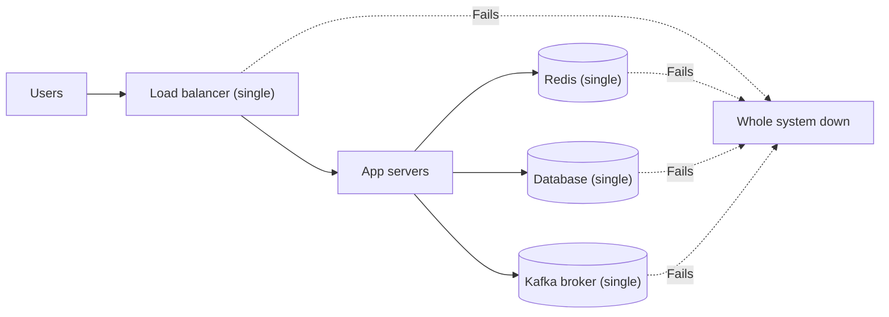
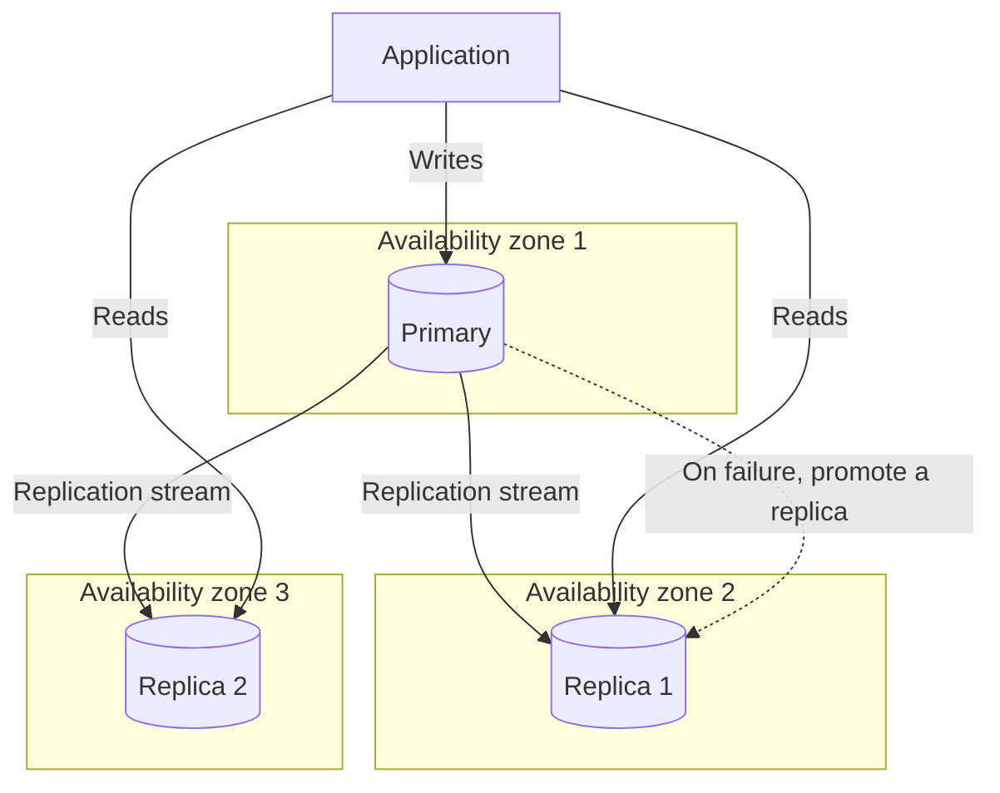
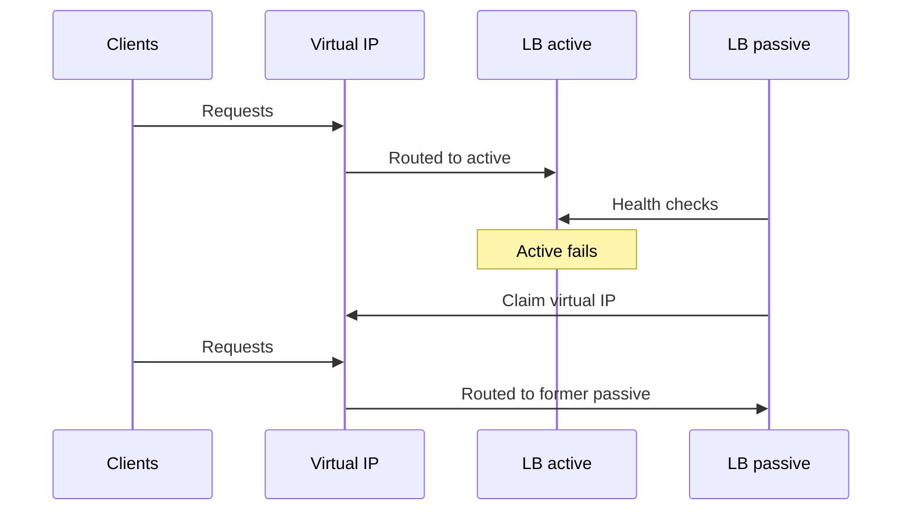
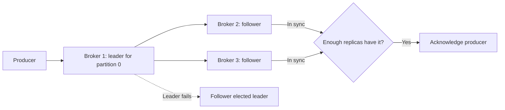
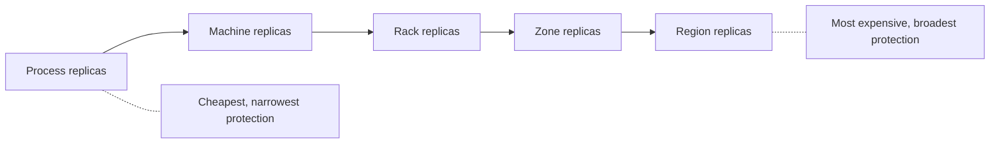
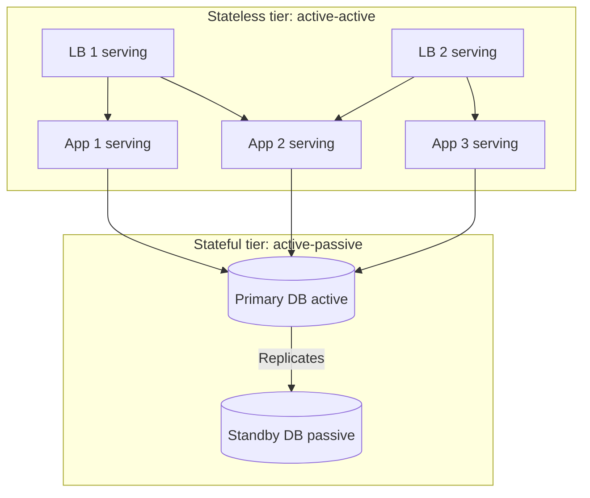
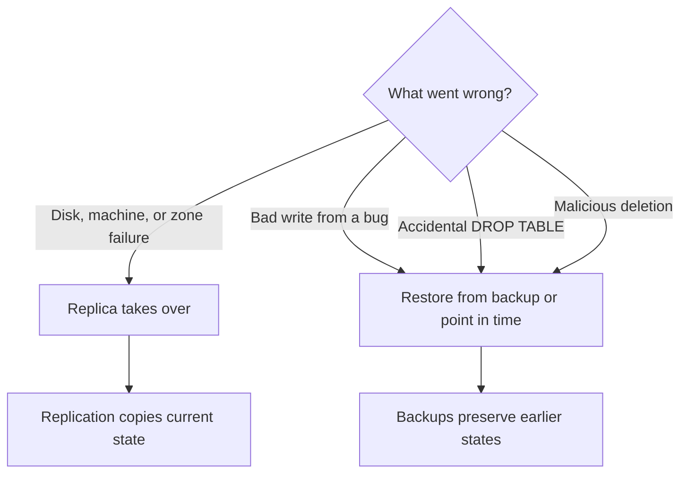
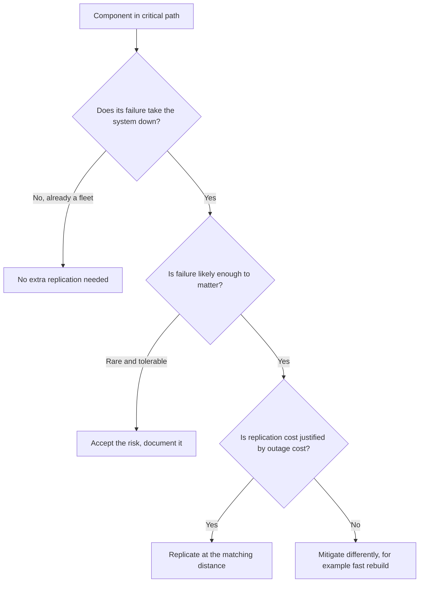

# Replication: A Fault-Tolerance Strategy Across the Whole Stack

## Scope and framing

This explainer follows the supplied transcript, which reframes replication from "a database feature" into a fault-tolerance strategy applied to every critical component in a system. It uses the transcript's structure and examples and adds widely known engineering background where it clarifies the mechanisms. Figures such as replication factors, failover times, and relative costs are as reported in the transcript and are illustrative rather than independently verified. The diagrams are conceptual.

Most tutorials introduce replication through databases: replicated PostgreSQL, MongoDB replica sets, read replicas. That becomes the mental model many engineers keep. The transcript argues that experienced engineers replicate *everything that matters*: databases, load balancers, message brokers, caches, API gateways, and entire data centers. The guiding question is not "should I replicate my database?" but:

> What in this system can fail, and how do I make sure that failure does not take everything down with it?

This document covers which components need replication, the patterns for each, the cost of replication, active-active versus active-passive designs, the failures replication cannot fix, and how to decide what to replicate.

## 1. Single points of failure are not just databases

Consider the simplest system: one database, one load balancer, one Kafka broker, and one Redis cache. Each works perfectly, until one fails:

- The database disk becomes corrupted.
- The load balancer's machine reboots.
- The Kafka broker runs out of memory.
- The Redis instance is cut off by a network partition.

Whichever component fails, the **entire system** goes down, because every one of them sits in the critical path of every request. That is the meaning of a **single point of failure (SPOF)**: any component the system depends on that has no backup. A mature production system has no SPOFs in its critical path, and replication is how they are eliminated.

## 2. Failure and fault tolerance

The transcript briefly defines two terms.

- **Failure:** a component stops working. A machine crashes, a network link drops, a disk fills, the OS kills a process.
- **Fault tolerance:** the system's ability to keep working when failures happen.

Fault tolerance does not mean failures never happen; that is impossible. It means the system survives them gracefully. The relationship matters:

- **Failures are inevitable.**
- **Fault tolerance is a design choice.**

It is not achieved by hoping nothing breaks, but by designing for breakage. Replication is one of the most powerful tools for this, because it directly addresses the most common cause of system-wide outages: one component dying and taking everything with it.

## 3. Replication, component by component

The patterns are similar across components, but not identical.

### Databases

Databases are replicated for three familiar reasons:

- **Durability:** survive disk failure.
- **Availability:** survive machine failure.
- **Read scaling:** spread read load that one machine cannot handle.

The standard pattern is a **primary** that accepts all writes and **replicas** that follow it. If the primary dies, a replica is promoted. The transcript notes that most production databases run with at least two replicas in addition to the primary, so that losing one still leaves redundancy.

The senior-engineer question is **where the replicas live**. If all three copies are in one data center, a fire or power outage takes out all three. Critical systems spread replicas across **availability zones**, and for the most critical data, across **regions**.

As general background, the replication mode matters too. With asynchronous replication, a promoted replica may be missing the last few acknowledged writes; with synchronous replication, commits wait for a replica and are slower. Failover tooling must also prevent the old primary from continuing to accept writes after a replica is promoted (split brain).

### Load balancers

Many engineers put a load balancer in front of app servers, conclude the system is now scalable, and forget that the load balancer itself is a SPOF. It carries all incoming traffic; if it dies, nothing behind it is reachable, no matter how many app servers exist.

Load balancers are commonly replicated **active-passive**: one handles traffic while another stands by. Takeover happens through:

- A **virtual IP** that floats between machines (for example, using VRRP with keepalived).
- **DNS-level failover.**
- A higher-level routing layer.

Cloud providers hide this. An AWS Application Load Balancer is a replicated set of load balancers presented as one logical endpoint, with failover handled by the provider. Replication is still happening; someone else is doing it. When running your own Nginx, HAProxy, or Envoy, replication is your responsibility. Forgetting it creates a system whose front door is a single point of failure.

### Message brokers

If the queue dies, the asynchronous pipeline stops: orders are not processed, notifications are not sent, and background jobs pile up until they time out.

Kafka replicates each **topic partition** across brokers:

- A **replication factor**, typically 3, determines how many brokers hold each partition.
- One broker is the **leader** for a partition; the others are **followers**.
- Writes go to the leader, are replicated to followers, and are acknowledged once enough followers have the data. (In Kafka terms, this is governed by producer `acks` and the topic's `min.insync.replicas`.)
- If a broker dies, partitions it led fail over to another in-sync replica. Some in-flight requests may fail and be retried, but the queue as a whole keeps running.

Other brokers follow the same principle: RabbitMQ uses **quorum queues**; NATS JetStream uses stream **replicas**. The common idea: **no message lives on only one machine, and no broker is irreplaceable.**

### Caches

For Redis or Memcached, the transcript asks one decisive question: **is the cache an optimization or a dependency?**

- **Optimization:** if the cache disappears, the system still works, just slower. Replication may be unnecessary; let it die and rebuild from the source of truth.
- **Dependency:** the application cannot function without it, or rebuilding it cold would crash the database under the resulting load. Then it must be replicated.

Redis offers a primary/replica model similar to PostgreSQL, and Redis Cluster shards data and replicates each shard.

### API gateways and reverse proxies

The logic mirrors load balancers. A single gateway instance is a SPOF for every external request. Run several behind a load balancer, or use a managed service that is replicated under the hood.

The specific hazard is **configuration drift**. If three gateway instances slowly diverge because someone updated routing rules on only one, the system acquires a harder failure mode: behavior that varies randomly depending on which instance serves a request. Replication only helps when the replicas are actually identical, which argues for configuration managed as code and deployed uniformly.

### Data centers and regions

Even with everything inside a data center replicated, the **data center itself** is a SPOF. Power failures, network outages, cooling failures, and fiber cuts can take down an entire region. The transcript notes that AWS, Google Cloud, and Azure have all had multi-hour, region-wide outages.

The most critical systems (banking, payments, critical SaaS) run in **multiple regions**, often active in two or three at once, with traffic routed by geographic DNS or global load balancers.

This is the most expensive and complex form of replication:

- Inter-region latency is high.
- Keeping data consistent across regions is hard.
- Failover testing is risky and often avoided, which makes it more dangerous when finally needed.

For systems where an hour of downtime costs millions, the cost is justified.

## 4. Match replica distance to the failure you fear

The transcript's general rule: **the more catastrophic the failure mode, the further apart replicas must be.**

| Replica placement | Survives |
| --- | --- |
| Separate processes | Process crash |
| Separate machines | Machine failure |
| Separate racks | Rack power or switch failure |
| Separate availability zones | Zone outage |
| Separate regions | Region outage |

Choose the level that matches the failures the business is unwilling to accept.

## 5. Active-active vs. active-passive

The transcript treats this as one of the deepest mental models for replication. The two approaches differ in cost, complexity, and recovery time.

### Active-active

All replicas do real work:

- Replicated load balancers both serve traffic.
- Replicated data centers both accept requests.
- Replicated database nodes both accept writes (in a multi-leader setup).

**Benefits:**

- No idle capacity; everything paid for produces value.
- Fast failover. When one replica dies, the others are already serving, so traffic simply shifts with no warm-up.

**Cost:** consistency problems. Multiple machines make decisions in parallel, which introduces conflicts and coordination overhead. For stateful systems, this can mean conflict resolution, distributed consensus, or careful partitioning of ownership.

### Active-passive

One replica does all the work; the other is a fully provisioned, fully configured, up-to-date **standby** that serves no requests.

**Benefits:**

- Simple operational model. Only one node makes decisions at a time: no conflicts, no coordination overhead.

**Costs:**

- Idle capacity.
- A takeover delay, usually seconds and sometimes longer, during which the system is partly down.
- The standby is not exercised by real traffic, so problems with it may only surface during failover.

### The usual mix

Most production systems combine them:

- **Active-active for stateless layers** such as load balancers and app servers. Stateless components have no consistency problems, so there is no reason not to use them all.
- **Active-passive for stateful layers** such as primary databases. Simpler is better unless the extra capacity is truly needed.

| | Active-active | Active-passive |
| --- | --- | --- |
| Hardware utilization | All replicas used | Standby idle |
| Failover time | Near-instant | Seconds or longer |
| Consistency complexity | High for stateful data | Low |
| Typical use | Stateless tiers, multi-region serving | Primary databases, stateful services |

## 6. What replication does not fix

Replication is not a silver bullet. It protects against **random hardware failures**: a disk dying, a machine crashing, a network link dropping. It does not protect against:

- **Bugs that corrupt data.** If the application writes bad data to the primary, the primary faithfully replicates it. As the transcript puts it, replication does not make data more correct; it makes incorrect data more durable.
- **Operator errors.** If an administrator accidentally drops a table, the drop replicates to every follower within seconds. A three-replica setup loses the table three times.
- **Attacks.** An intruder who deletes data has the deletion copied everywhere.
- **Bugs in the replication system itself.** Followers that silently diverge from the leader leave several machines with different data and no way to know which is correct.

### Backups are not replicas, and replicas are not backups

They serve different purposes:

- **Replicas** protect against **hardware failure**; they track the current state.
- **Backups** protect against **logical failure** (bugs, mistakes, attacks); they preserve past states.

Both are needed. The transcript warns that some teams skip backups because they have replicas, and discover at the worst possible moment that the replicated data is uniformly wrong. As general background, point-in-time recovery (restoring a base backup and replaying logs to a moment before the bad change) and delayed replicas are common tools for logical failures, and backups are only trustworthy if restores are tested regularly.

## 7. Deciding what to replicate

The transcript closes with a three-question framework for every component in the critical path.

### Question 1: What happens if this component fails?

- If the system keeps working, as with one stateless app server among dozens, the fleet already *is* the replication. No special attention is needed.
- If the system goes down, it is a SPOF and a candidate for replication.

### Question 2: How likely is this component to fail?

Failure rates differ. Disks fail more often than CPUs; single machines fail more often than whole data centers. The more likely the failure, the more value replication provides.

### Question 3: What does replicating it cost?

Some replication is cheap: adding a second load balancer is straightforward. Some is expensive: the transcript notes that multi-region active-active replication for a transactional database can cost an order of magnitude more than single-region replication. The cost must match the value.

Replicate components where failure would take the system down, where failure is likely enough to matter, and where replication costs less than the outage it prevents.

### An example assessment

| Component | Fails the system? | Likelihood | Replication cost | Typical decision |
| --- | --- | --- | --- | --- |
| Stateless app server | No (fleet) | Moderate | Already done | Rely on the fleet |
| Load balancer | Yes | Moderate | Low | Replicate, or use managed |
| Primary database | Yes | Moderate | Moderate | Replicas across zones |
| Kafka broker | Yes | Moderate | Moderate | Replication factor 3 |
| Cache as optimization | No | Moderate | Moderate | Often leave single |
| Cache as dependency | Yes | Moderate | Moderate | Replicate |
| Whole region | Yes | Low | Very high | Only for the most critical systems |

The goal is **not** to replicate everything. It is to ensure **no single failure takes down the whole system**. Those are different objectives, and the difference matters when making trade-offs.

## 8. Trade-offs

- **Cost.** Every replica is hardware, licensing, and network bandwidth. Standby replicas are paid for while idle.
- **Consistency.** Replicated state must be kept in step. Synchronous replication adds latency; asynchronous replication risks losing recent writes on failover; active-active writes introduce conflicts.
- **Operational complexity.** Failover mechanisms, health checks, and promotion logic are themselves software that can fail. Split brain is a classic hazard.
- **Configuration drift.** Replicas that diverge in configuration create inconsistent, hard-to-diagnose behavior.
- **False confidence.** Replication does nothing for logical corruption, operator mistakes, or attacks, and may spread them faster.
- **Untested failover.** A replica that has never taken over may not be able to. Regular failover exercises are part of the cost.

## Key takeaways

1. Replication is a fault-tolerance strategy, not a database technique. Apply it to any component in the critical path.
2. A single point of failure is any critical component without a backup: load balancers, brokers, caches, gateways, and data centers count, not just databases.
3. Failures are inevitable; fault tolerance is a design choice.
4. Each component has its own pattern: primary/replica databases across zones, active-passive load balancers with floating IPs, partition replication in Kafka, and replication for caches that are dependencies rather than optimizations.
5. Place replicas as far apart as the failure you need to survive: process, machine, rack, zone, or region.
6. Use active-active for stateless tiers and active-passive for stateful ones unless extra capacity justifies the consistency cost.
7. Replicas are not backups. Replication spreads bugs, mistakes, and malicious deletions; backups and point-in-time recovery address logical failures.
8. Decide what to replicate by asking what happens if it fails, how likely failure is, and what replication costs. The goal is that no single failure can take down the whole system.
