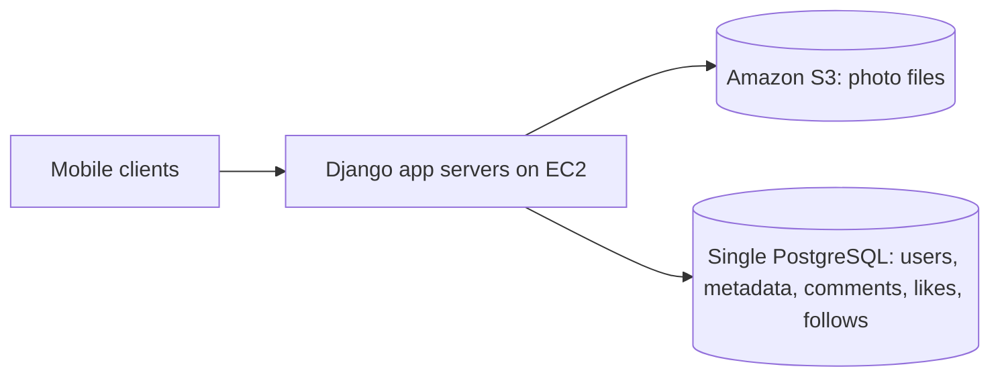
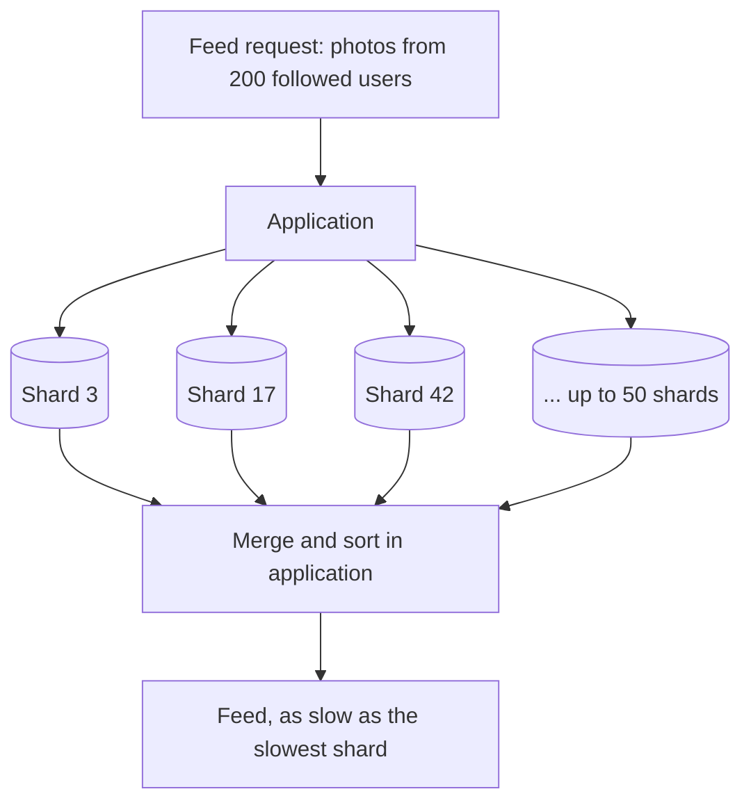
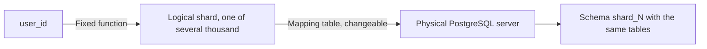
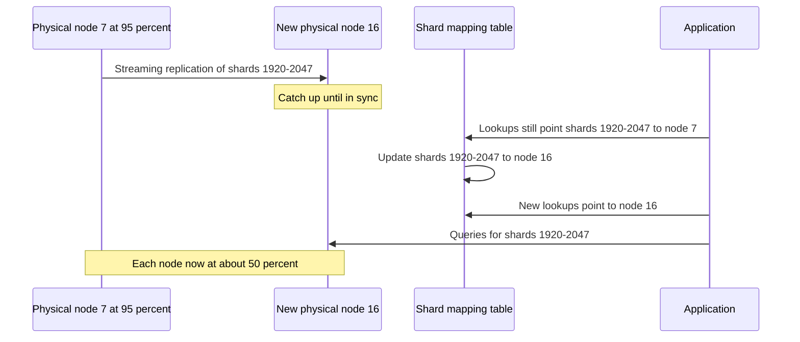
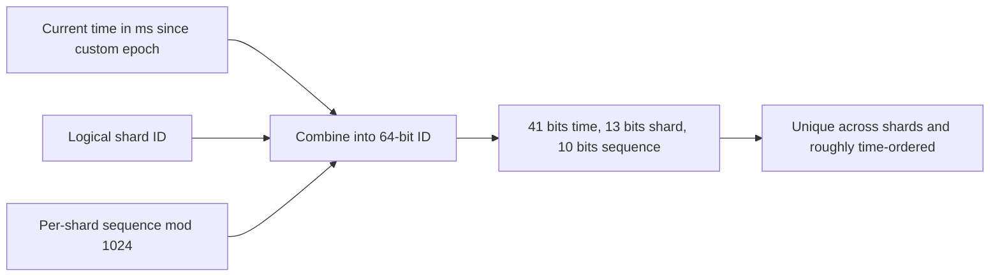
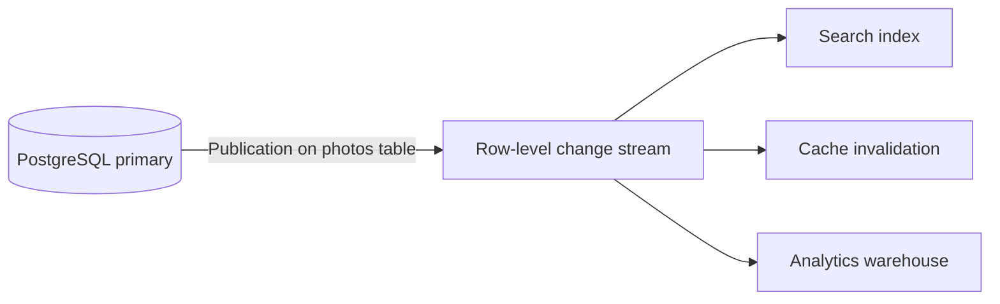
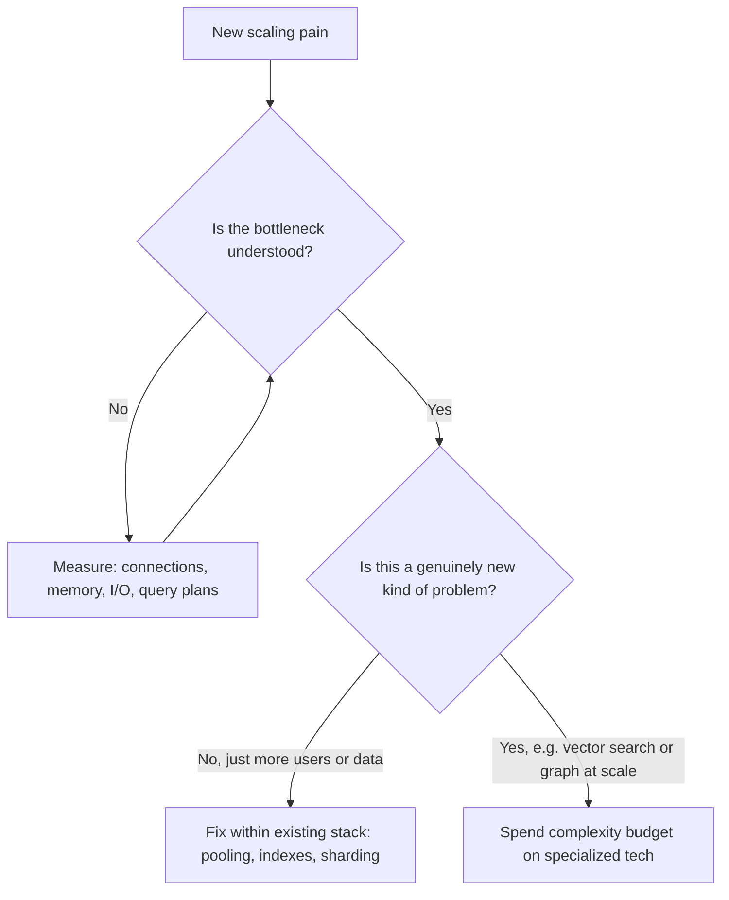

# Instagram and PostgreSQL: Scaling a Relational Database with Logical Shards

## Scope and framing

This explainer follows the supplied transcript, which describes how Instagram scaled on PostgreSQL in its early years (roughly 2010–2015) and draws general lessons for scaling relational databases. It uses the transcript's narrative as the backbone and adds well-established PostgreSQL and distributed-systems background where helpful. User counts, database sizes, per-connection memory, and similar figures are as reported in the transcript and have not been independently verified. The transcript notes that this is a historical story: after the Facebook acquisition, Instagram was integrated into Meta's internal infrastructure, and the transcript states that its social graph is now served by Meta's TAO system. The diagrams are conceptual and are not exact reproductions of Instagram's production topology.

The transcript opens with a list of companies that use PostgreSQL in some capacity, including Instagram, Reddit, Notion, Heroku, Strava, and Discord. Its question is why these teams stayed on a relational database many people assume cannot scale, and what it actually takes to make PostgreSQL work at very large scale. Its answer, developed through Instagram's story, is that the database was rarely the real bottleneck; the architecture around it was.

## 1. The starting point: one database, three engineers

When Instagram launched in 2010, the transcript describes an architecture that was almost embarrassingly simple:

- Application servers on Amazon **EC2** virtual machines, running Django.
- Photo files stored in **Amazon S3**.
- **Everything else** in a single PostgreSQL database: user accounts, photo metadata, comments, likes, and the follow graph.

No microservices, no Kafka, no specialized infrastructure. Per the transcript, Instagram reached about 10 million users in 2011, and by the 2012 Facebook acquisition (reported at about a billion dollars) it had about 27 million users on a PostgreSQL database of roughly 2 TB, still run by a handful of engineers.



By 2012, that single database was straining. At about 2 TB, it approached the memory limit of the largest EC2 instance available at the time, and disk I/O was saturated. Vertical scaling had reached its ceiling.

The transcript frames the decision point: when one machine is no longer enough, the wrong answer is to panic and switch databases. The right answer is to identify exactly *why* the database is struggling and fix that.

## 2. The first wall: connections

The first bottleneck had nothing to do with data size, disk space, or upload volume. It was **connections**.

PostgreSQL uses a process per connection, and the transcript cites about **1.3 MB** of memory per connection. Instagram's Django processes each kept their own small pool of connections. The transcript's arithmetic:

- 50 application servers × 30 connections each = **1,500 connections**.
- 1,500 × 1.3 MB ≈ **2 GB** of RAM spent holding connections before any useful work.

### The fix: PgBouncer

The fix was a connection pooler, specifically **PgBouncer**: a lightweight proxy between the application and PostgreSQL. The application believes it is talking to the database; PgBouncer multiplexes all those client connections onto a much smaller pool of real server connections. In the transcript's example, 1,500 client connections become about **30** real connections.

The freed memory goes back to what the database should be doing: caching pages, sorting results, and planning queries.


The transcript calls this the first invisible bottleneck almost every PostgreSQL deployment hits, and notes that most teams add a pooler only after they are already in pain. For a PostgreSQL deployment at meaningful scale without a pooler, it describes adding one as the single highest-leverage fix available.

## 3. The second wall: one machine is not enough

With pooling in place, the database breathed again, but it was still about 2 TB on the largest instance available, with RAM and disk throughput maxed out. The workload exceeded what one machine could hold.

### The conventional answer, and why Instagram rejected it

At this point, the standard system-design answer is to switch to a NoSQL database such as Cassandra, DynamoDB, or MongoDB, on the grounds that relational databases do not scale horizontally. The transcript says Instagram seriously evaluated Cassandra, MongoDB, and other NoSQL options of the time, and decided to stay with PostgreSQL.

The reasoning, as the transcript presents it:

- The problems were not PostgreSQL problems. Any database at Instagram's workload would hit the same walls.
- Switching to Cassandra would not make horizontal partitioning disappear; it would hide it behind a different abstraction.
- A switch would be very hard to reverse ("burning the boats").

So instead of changing databases, Instagram chose to make PostgreSQL itself horizontal by **sharding** it.

## 4. Choosing the shard key

The first decision in any sharding scheme is **what to shard by**. The shard key shapes every query the application will ever make, and in practice it is chosen once.

### Sharding by user

Instagram sharded by **user ID**. All of a user's data (profile, photos, likes) lives on the same shard. For single-user queries such as "show my profile", this is ideal: hash the user ID, identify the owning shard, and query only that shard.

### The feed problem

But Instagram is a social network. Its defining query is not "show my photos", it is "show photos from the people I follow". Under user-based sharding, if a user follows 200 accounts spread across 50 shards, building the feed means:

1. Querying up to 50 different databases.
2. Receiving partial results from each.
3. Merging and sorting them in the application.

That is slow, complex, and introduces new failure modes: if any one of the 50 shards is slow, the whole feed is slow. As general background, this fan-out effect is a tail-latency problem: the more shards a request touches, the more likely at least one of them is having a bad moment.



### The trade every sharded system makes

Sharding by user makes single-user queries fast and cross-user queries expensive. There is no clever way to avoid this; every sharded system makes some version of this trade. Instagram accepted it and solved the cross-user problem in the application layer with **caching, smart fan-out, and precomputed feeds**.

The transcript's warning: **the shard key decision is effectively permanent.** After partitioning hundreds of terabytes by user, changing the key means rewriting every row.

## 5. The key idea: logical shards decoupled from physical machines

The most influential part of Instagram's design, according to the transcript, is **how** it sharded.

### The conventional approach

Around 2010, sharding usually meant physical machines: spread user data across 16 database servers, each holding 1/16 of users. To grow, add servers and reshuffle the data, which means moving a large fraction of rows and changing the hash function the application uses.

### Instagram's approach

Instagram inserted a layer between data and hardware:

1. Pick a large, fixed number of **logical shards**: several thousand.
2. Implement each logical shard as a PostgreSQL **schema**, a namespaced collection of tables. Every schema has the same tables (users, photos, likes, and so on), each holding a different slice of the data.
3. Map users to logical shards. That mapping never changes.
4. Maintain a separate **mapping table** from logical shard to physical server. That mapping can change.

At the start, all several thousand logical shards lived on **one** physical machine. The application simply looked up which logical shard owned a user and queried that schema; it did not know or care where that schema physically lived.



The design separates two concerns that are often conflated:

- **How data is partitioned:** into thousands of logical pieces, permanently.
- **Where each piece lives:** a mapping that can be updated at any time.

### Growing without resharding

When a physical machine fills up, nothing is resharded and no rows are rewritten. Some logical shards are moved to a new machine, and the mapping table is updated.

The transcript's example:

1. Physical node 7 reaches about **95%** capacity.
2. A new machine, physical node 16, is brought up.
3. Half of node 7's logical shards are replicated to node 16 using PostgreSQL's built-in **streaming replication**.
4. Once node 16 is in sync, the mapping table is updated: logical shards **1920–2047** now live on node 16.
5. Both nodes end up at about 50%.

The data did not change. The schemas did not change. The application code did not change. Only the mapping changed, and the cutover is fast.



As general background, a production cutover also has to handle writes arriving during the switch, typically by briefly pausing writes to the moving shards or fencing the old location, and then cleaning up the now-unused schemas on the source node.

### The mapping is the architecture

The transcript's summary: if the application hardcodes "we have 16 shards", growth is painful. If it hardcodes "we have several thousand logical shards mapped onto some number of physical nodes", growth is a configuration change. The one idea to remember is to **separate the partitioning of data from where it physically lives.**

## 6. The third wall: unique IDs across shards

Sharding breaks a feature most developers take for granted: **auto-increment IDs**. On a single database, the database hands out 1, 2, 3, 4 and they are unique because there is only one issuer. With many shards each generating 1, 2, 3, 4, two photos immediately share an ID and the application cannot tell them apart.

The question becomes: how can thousands of shards generate unique IDs **without coordinating**?

### Options Instagram rejected

| Option | Why it was rejected (per the transcript) |
| --- | --- |
| UUIDs (128-bit random) | Large; random, so no natural time ordering; harder on indexes and cannot double as a time proxy |
| Ticket server (Flickr's approach) | A dedicated service issuing IDs becomes a single point of failure for all inserts |
| Twitter Snowflake service | Closest to the goal (time-ordered IDs), but required running a separate service with more moving parts |

### Snowflake-style IDs inside PostgreSQL

Instagram built Snowflake-style ID generation **directly into PostgreSQL** as a database function. Each ID is a 64-bit integer composed of three parts:

| Bits | Field | Meaning |
| --- | --- | --- |
| 41 (high-order) | Timestamp | Milliseconds since a custom Instagram epoch |
| 13 | Shard ID | Which logical shard generated the ID (up to 8,192 shards) |
| 10 | Sequence | Counter within that shard and millisecond (up to 1,024 IDs) |

The transcript describes 41 bits as providing about 41 years of millisecond timestamps. As a point of arithmetic, $2^{41}$ milliseconds is roughly 69 years; either way, the range is ample. The 10-bit sequence allows 1,024 IDs per millisecond per shard, about a million per second per shard.

$$
\text{id} = (\text{ms since epoch} \ll 23) \;|\; (\text{shard id} \ll 10) \;|\; (\text{sequence} \bmod 1024)
$$

Each shard's schema contains a small function that reads the current time, uses the shard's hardcoded ID, takes the next value from a per-shard sequence, and combines them. There is no external service, no coordination between shards, and no single point of failure.



### Why time in the high bits matters

Because the timestamp occupies the most significant bits, IDs are **roughly sortable by creation time**. "Show me the latest photos" becomes `ORDER BY id DESC LIMIT 20`, with no separate timestamp index. The ID effectively *is* the timestamp. The shard ID embedded in the ID also means that, given any ID, the application can tell which logical shard holds the row without a lookup.

The transcript notes that this pattern has since been widely adopted, citing Discord and Slack among the users of Snowflake-style IDs.

## 7. PostgreSQL features that punch above their weight

The transcript highlights three built-in PostgreSQL features that Instagram relied on and that many engineers underuse.

### Partial indexes

A normal index has one entry per row. A **partial index** includes only rows matching a condition. If a table holds a billion photos but queries mostly target the last 30 days, an index restricted to recent rows might hold around 100 million entries: roughly ten times smaller, faster to scan, and cheaper to keep in memory.

```sql
CREATE INDEX photos_recent_idx
  ON photos (created_at)
  WHERE created_at > '2012-01-01';
```

As general background, PostgreSQL requires the predicate of a partial index to be immutable, so "last 30 days" is typically implemented with a fixed cutoff date that is periodically advanced by recreating the index, or by a status column maintained by the application.

### Functional (expression) indexes

A **functional index** indexes the result of an expression instead of the raw column. The transcript's example: Instagram had columns holding long 64-character random tokens. Indexing the full strings would duplicate all 64 characters in the index. Instead, an index on only the first 8 characters kept lookups fast (most 8-character prefixes are nearly unique) while the index shrank to about a tenth of its full size.

```sql
CREATE INDEX tokens_prefix_idx ON tokens (substr(token, 1, 8));
-- Queries filter on the prefix, then confirm the full value:
-- WHERE substr(token, 1, 8) = substr(:t, 1, 8) AND token = :t
```

This does not matter at 10,000 rows. It matters a great deal at 10 billion.

### Logical replication

**Logical replication** streams row-level inserts, updates, and deletes on selected tables to downstream subscribers in real time. The primary publishes changes on, for example, the photos table, and:

- A search index subscribes and updates itself.
- A cache layer subscribes and invalidates entries.
- An analytics warehouse subscribes and keeps a near-real-time copy.

The primary remains the single source of truth, and downstream systems stay in sync. The transcript observes that many teams build this manually with application-level events, Kafka, and dual writes, when PostgreSQL provides much of it natively. (As general background, logical decoding has been in core PostgreSQL since 9.4, and built-in publish/subscribe logical replication since version 10.)



## 8. Boring technology as a superpower

The transcript returns to a lesson set up at the start: **boring technology with good engineering beats new technology.**

Every team has a finite **complexity budget**. Each new piece of infrastructure consumes part of it: learning its quirks, building operational expertise, training the team, and hiring for it. These costs are real even though they never appear on a balance sheet.

Boring technologies such as PostgreSQL, Linux, Memcached, and Nginx cost little to adopt because:

- The team likely already knows them.
- Failure modes are well documented.
- Operational tooling has matured over many years.
- Answers to most problems are already available.

The right time to spend the complexity budget is on a **genuinely new problem** the boring tools cannot solve, such as vector search at scale, real-time time-series analytics, or graph traversal at planetary scale. "We have a lot of users" is not a new problem. The transcript's claim is that the more common mistake is not choosing the wrong database but **switching databases too early**, when the real fix was understanding the existing one better.



## 9. Trade-offs

- **Cross-shard queries.** Sharding by user makes per-user queries cheap and feed-style queries expensive. The cost moves into the application: fan-out, caching, and precomputed feeds.
- **Permanent shard key.** Choosing the key is effectively irreversible at scale.
- **Application-managed routing.** The application (or a routing layer) must consult the logical-to-physical map and handle it consistently. Cross-shard transactions and joins are not available as they would be on a single database.
- **Shard moves need care.** Replication-based moves are fast, but cutover must avoid lost or duplicated writes.
- **ID design constraints.** Snowflake-style IDs depend on reasonably accurate clocks; a clock moving backwards can cause collisions unless guarded against. The bit allocation caps shard count and per-millisecond throughput.
- **Operational discipline.** Staying on "boring" technology at scale still requires deep expertise in that technology. The savings come from not multiplying the number of systems to master.
- **Eventual migration.** As the transcript notes, Instagram later moved to Meta's internal infrastructure. Scaling a boring stack buys time and simplicity, not permanence.

## Key takeaways

1. Instagram grew to tens of millions of users on a single PostgreSQL database with a very small team before sharding.
2. The first bottleneck was connections, not data size. A pooler like PgBouncer is often the highest-leverage early fix.
3. When one machine was not enough, Instagram evaluated NoSQL options and chose to shard PostgreSQL instead, reasoning that the hard problems were about its workload, not about PostgreSQL specifically.
4. The shard key (user ID) makes single-user queries cheap and cross-user queries expensive. That trade is unavoidable and effectively permanent.
5. Many logical shards (PostgreSQL schemas) mapped onto fewer physical servers let the system grow by moving shards and updating a mapping, with no resharding.
6. Snowflake-style 64-bit IDs (time, shard, sequence) generated by a PostgreSQL function give coordination-free, time-sortable unique IDs.
7. Partial indexes, expression indexes, and logical replication are built-in PostgreSQL features that matter enormously at billions of rows.
8. Boring technology preserves the team's complexity budget. Spend that budget on genuinely new problems, not on switching databases too early.

The transcript's closing lesson is not "use PostgreSQL because Instagram did". It is to understand what you already have before reaching for something new, because the bottleneck is usually the architecture around the database, not the database itself.
