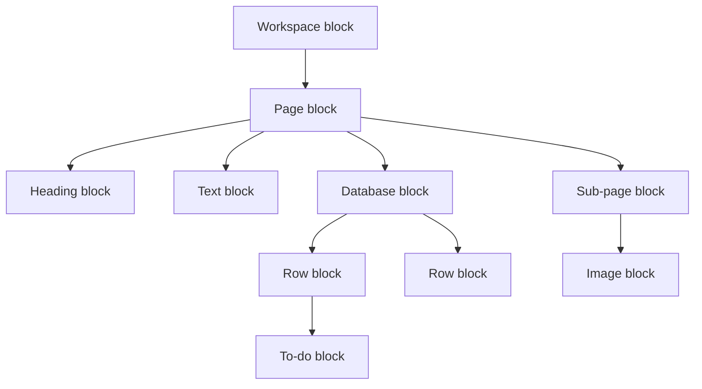
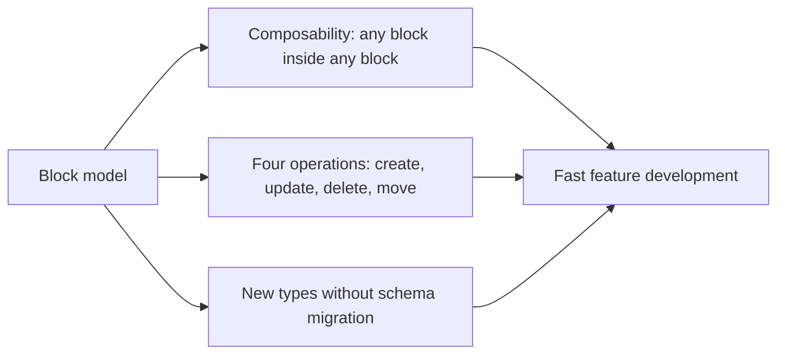
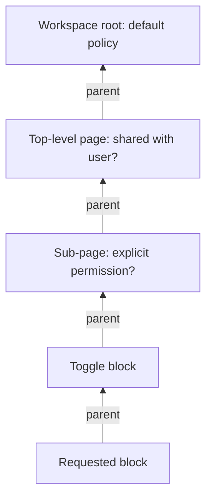
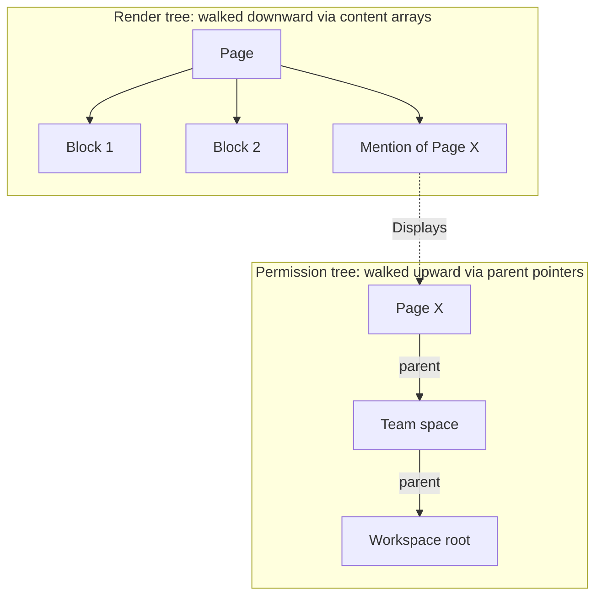
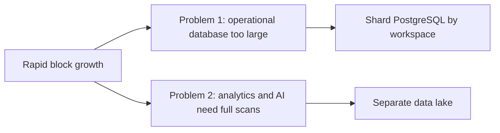
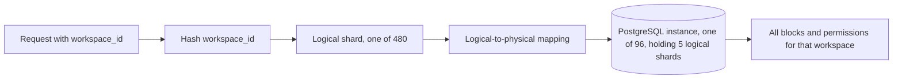
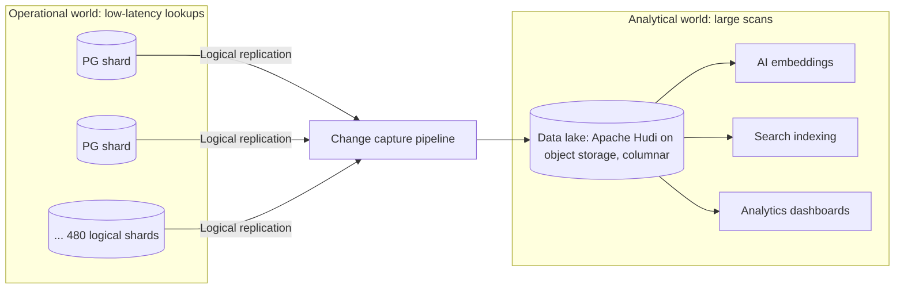
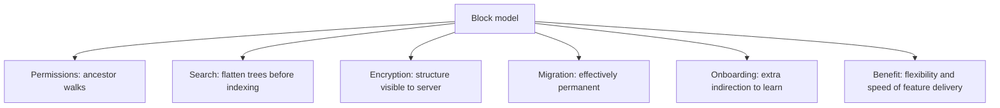

# Notion's Database Design: The Block Model and Its Consequences

## Scope and framing

This explainer follows the supplied transcript, which examines Notion's "everything is a block" data model and traces how that single decision shaped its permission system, sharding strategy, and analytics architecture. It uses the transcript as the backbone and adds well-established database and distributed-systems background where it clarifies the ideas. Figures such as block counts, growth rates, and shard counts are as reported in the transcript and have not been independently verified. The diagrams are conceptual and are not exact reproductions of Notion's production systems.

The transcript's central argument is that **data model decisions are the most consequential decisions a team makes**. A database engine can be swapped; a framework can be refactored; a cloud provider can be changed. But the shape of the data, once hundreds of billions of rows are organized around it, is effectively permanent. Notion's block model, adopted around 2016 according to the transcript, is a clear example: it enabled the product's distinctive flexibility and imposed costs that the company has been engineering around ever since. The transcript reports that Notion scaled to over 200 billion blocks across millions of workspaces.

## 1. One entity for everything

### The conventional approach

Most software models different kinds of content as different kinds of objects:

- Documents are one object type with their own schema, storage, and API.
- Database rows are another.
- Wiki pages are another.

These are separate systems stitched together in the user interface.

### Notion's approach

Notion has one kind of object: the **block**. Every paragraph, image, checkbox, database row, page, and embedded widget is a block with the same structure, the same storage, and the same API. The only thing that varies is the **type** field, which tells the front end how to render it.

The transcript describes the block's structure as simple:

| Field | Purpose |
| --- | --- |
| `id` | UUID identifying the block |
| `type` | What kind of block this is (text, to-do, image, page, database, …) |
| `properties` | A JSON blob of type-specific attributes (text content, checked state, and so on) |
| `content` | An ordered array of child block IDs |
| `parent` | A pointer to the block that owns this one |
| Metadata | Created and edited times, creator, and similar |

That is essentially the whole schema, and every feature in the product is built on top of it.

## 2. What the block model unlocks

The transcript identifies three major benefits.

### Composability for free

Because everything is a block and every parent-child relationship is the same operation, anything can be nested inside anything. A database can live inside a page; a to-do list can live inside a toggle inside a table cell inside a database row. There is no special code for "can a database be inside a page?" The page simply has the database block's ID in its `content` array.

### One API surface

Since there is only one entity type, only one set of operations is needed. The transcript names four:

- **Create** a block.
- **Update** a block.
- **Delete** a block.
- **Move** a block.

Every editing action maps onto these:

- Bolding a word updates a block's `properties`.
- Indenting a list item moves the block to a new parent.
- Deleting a page deletes a block.

A system with a separate create/update/delete API per object type would need many more endpoints.

### Extensibility without schema migrations

To ship a new block type, such as a code block, math equation, or AI summary, Notion does not migrate tables or add columns. It registers a new `type` value and adds a renderer in the front end. The back end and schema are unchanged; the new feature is just another block.

The transcript argues that these three properties together let Notion ship features competitors can only match slowly, because competitors must fight their own data models to do so.

As general background, this is a form of the **entity-attribute-value** or document-in-relational pattern: a generic table with a type discriminator and a flexible JSON payload. Its known trade-off is that the database can enforce fewer constraints and optimize fewer queries, because it knows less about the shape of the data.

## 3. The cost: permissions become tree walks

### Data becomes a forest, not a set of tables

When blocks nest arbitrarily, the data forms a tree, or more precisely a forest, since each workspace is its own tree. The data is no longer primarily relational; it is hierarchical. Hierarchies are excellent for some operations and poor for one that turns out to matter a great deal: **permissions**.

### Relational permissions vs. inherited permissions

In a typical application, a `documents` table has an `owner_id` column. Checking access is one indexed lookup: is this user the owner? That is constant time.

In Notion, permissions are **inherited**. Sharing a top-level page grants access to that page, every block inside it, every sub-page, and every block inside those, recursively. So when a user requests a block, the back end cannot simply check the block. It must walk **up** the ancestor chain toward the workspace root, checking at each level for an explicit permission that applies. An explicit grant or denial found along the way decides the answer; otherwise the walk continues until it reaches the workspace root.

For one block, that is a handful of lookups. But a page load does not request one block. The back end must determine which of potentially **thousands** of blocks on a page the user can see. The transcript identifies permission computation as the most expensive thing the system does, and stresses that it is not a bug to be fixed; it is an inherent consequence of the model:

> blocks + arbitrary nesting + inherited permissions = ancestor traversal on every request

As general background, systems with hierarchical permissions commonly mitigate this by caching resolved permissions per subtree, materializing ancestor paths so a single query can fetch all ancestors, or precomputing effective access lists and invalidating them when sharing settings or block locations change. The transcript notes that Notion has been engineering around this cost for close to a decade.

## 4. Two trees over the same data

The transcript describes a particularly careful modeling decision: Notion needs **two different trees** over the same blocks.

### The render tree (downward)

To display a page, the front end starts at the page block and walks **down** through `content` arrays: the page's children, their children, and so on, in order. This is walked top-down on every page load.

### The permission tree (upward)

To check access, the back end starts at a block and walks **up** through `parent` pointers looking for grants. This is walked bottom-up on every permission check.

### Why they are not the same tree

The two trees can differ. The transcript's example is a block that references or mentions another page inline. In the render tree, the mention appears at a particular position within the page. But the permissions of the referenced content are determined by where it structurally lives, where it was created, and who owns it, not by where it happens to be displayed.

So each block carries two pointer systems:

- **`content` array**: downward pointers used for rendering.
- **`parent` ID**: an upward pointer used for permissions and ownership.

### The payoff

Separating the two lets Notion index them differently, cache them differently, and change one without affecting the other. Moving a block is a clean example. A user can:

- Change only the `content` arrays, so the block renders in a new place but its permissions stay put.
- Change the `parent` too, so both rendering and permissions move.

The product can offer either behavior because the model separates the concerns. The transcript's lesson: **separate things that are conceptually different, even when they look the same.** One entity participates in two trees, and Notion models both explicitly rather than conflating them.

## 5. Scaling: two different problems at once

According to the transcript, Notion had about **20 billion blocks** in 2021 on a single PostgreSQL setup with basic replication, and over **200 billion** by 2024, doubling roughly every 6 to 12 months. That growth created two distinct problems that had to be solved in parallel.

1. **The operational database.** A single PostgreSQL primary holding hundreds of billions of rows does not work: the working set cannot fit in memory, indexes become too large, and the query planner starts making poor choices.
2. **Analytics and AI.** Search, AI features, and analytics require massive scans across block data. Running "scan every block in the workspace" against the production database would take the product down.

Notion responded with two separate solutions: **shard PostgreSQL** for the live product, and **build a data lake** for analytics.

## 6. Sharding by workspace

### Choosing the shard key from the access pattern

The transcript contrasts Notion with Instagram, which sharded by user ID so single-user queries were fast and cross-user queries expensive. Every data model faces an equivalent question: what natural grouping should live together on one shard?

For Notion the answer is the **workspace**:

- A user opening Notion is working inside one workspace.
- Every block loaded belongs to that workspace.
- Every permission check happens inside that workspace's tree.
- Every search from the product surface is scoped to that workspace.

Almost every read is naturally bounded by workspace ID. So Notion shards by workspace: all blocks for a workspace live on the same shard. A request carries the workspace ID, which is hashed to a shard, and that one shard has everything needed to serve it. Importantly, this also means the expensive ancestor walks for permissions stay within a single database.

### Logical and physical shards

The transcript reports that as of 2023 Notion ran **96 PostgreSQL instances**, each holding **5 logical shards**, for **480 logical shards** in total. This follows the same logical/physical decoupling used by Instagram: the logical partitioning of data stays fixed, while logical shards can be moved or rebalanced across physical hosts without rehashing data.

### The conditional nature of the choice

The transcript emphasizes that workspace sharding is only good because Notion's data really is bounded by workspace. Users do not search across workspaces, share pages across workspaces, or compute cross-workspace analytics from the product surface. If there were heavy cross-workspace queries, for example "find every page mentioning Bitcoin across the platform", each would scatter across all 480 shards.

A shard key encodes an assumption that certain queries will be rare. If that assumption is later wrong, the system is stuck with it. The principle: **the shard key should match how data is actually accessed**, whether that is user, workspace, or team.

## 7. Separating analytics: the data lake

### Why analytics cannot run on production

Features such as workspace-wide search and AI Q&A over every page require scanning every block, embedding every block, and computing features over all of them. Analytical and transactional workloads conflict fundamentally: one wants large sequential scans, the other wants indexed point lookups, and they compete for the same CPU, memory, and I/O.

### The pipeline

Notion built a separate analytical layer it calls its data lake, built on **Apache Hudi**, a transactional table format over object storage that supports efficient incremental updates without rewriting whole datasets. The flow the transcript describes:

1. The sharded PostgreSQL cluster is the **source of truth**.
2. Every block insert, update, and delete is captured via PostgreSQL **logical replication** (change data capture) and streamed into a pipeline.
3. The pipeline lands changes in the data lake, stored in a **columnar** format on object storage.
4. Downstream consumers read from the lake:
   - AI features compute embeddings.
   - The search index builds its structures.
   - Analytics dashboards query it directly.

Because the two worlds do not share a database, they no longer conflict. The operational side is optimized for fast lookups; the analytical side for massive scans. The transcript credits this separation with making features like AI Q&A possible; without it, the PostgreSQL shards would buckle under analytical load.

The lesson: **production databases serve queries; analytical systems answer questions.** Asking one database to do both leads to trouble. Use read replicas, a separate analytical store, or both.

As general background, there is also a practical benefit to landing change streams from 480 shards into one lake: the lake reunifies data that sharding scattered, so cross-shard analysis becomes possible without cross-shard production queries.

## 8. What the block model costs, layer by layer

The transcript is explicit that the block model is a long-term bet with costs at every layer:

- **Permissions:** every check is a tree walk, as described above.
- **Search:** a document cannot simply be indexed as one unit. The tree must be recursively flattened into text first.
- **End-to-end encryption:** even if each block's contents were encrypted, the relationships between blocks remain visible to the back end, which needs to traverse them to render and check permissions. The transcript describes true end-to-end encryption as essentially impossible without changing the model.
- **Migration:** with hundreds of billions of rows in one logical structure, migrating to a different structure is effectively impossible. Notion is committed to this model.
- **Onboarding:** new engineers face a learning curve in understanding how every feature maps onto blocks, and the indirection adds cognitive overhead until it is internalized.

The transcript's judgment is that the flexibility is worth the cost for Notion. The broader lesson: **every powerful abstraction carries an ongoing tax.** Adopting it means committing to pay its costs at every layer indefinitely.

## 9. Trade-offs summary

| Decision | Benefit | Cost |
| --- | --- | --- |
| Single block entity | Composability, four-operation API, schema-free extensibility | Permissions, search, and encryption become harder; the model is effectively permanent |
| Inherited permissions | Natural sharing model for nested content | Ancestor traversal on every access check |
| Separate `content` and `parent` pointers | Render and permission trees evolve independently; flexible moves | Two structures to keep consistent |
| Shard by workspace | Almost all queries hit one shard | Cross-workspace queries would scatter across all shards |
| Logical shards over physical hosts | Rebalance without rehashing | Routing layer and shard-move operations to manage |
| Separate data lake via CDC | Analytics and AI without harming production | Additional pipeline, storage, and freshness lag |

## Key takeaways

1. Data model decisions outlive every other technical decision. Databases, frameworks, and clouds can be replaced; the shape of hundreds of billions of rows effectively cannot.
2. Notion's "everything is a block" model delivers composability, a tiny API surface, and new features without schema migrations.
3. The same model turns permission checks into ancestor-tree walks, a structural cost that must be engineered around permanently.
4. When the same data is traversed in two directions for two purposes, model two pointer systems (Notion's `content` arrays and `parent` IDs) so each can be optimized and changed independently.
5. The shard key should encode the product's real access pattern. For Notion that is the workspace; for Instagram it was the user.
6. Decouple logical shards from physical hosts so capacity can grow without rehashing data.
7. Separate operational and analytical workloads. Stream changes from production into an analytical store rather than scanning production.
8. Powerful abstractions carry an ongoing tax. Adopt them knowing their costs will surface at every layer.
