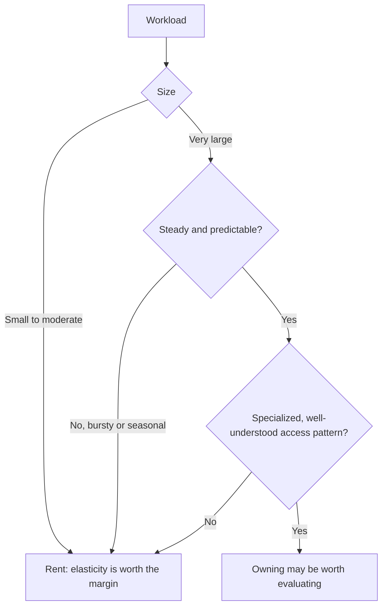
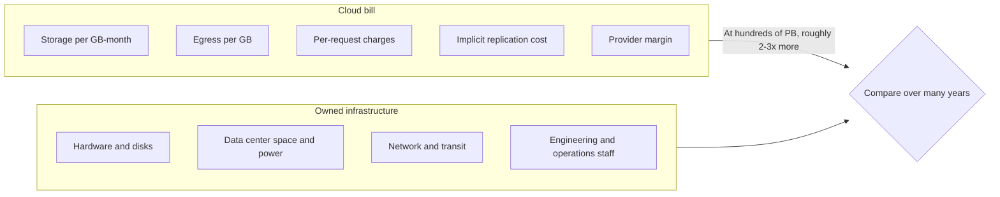
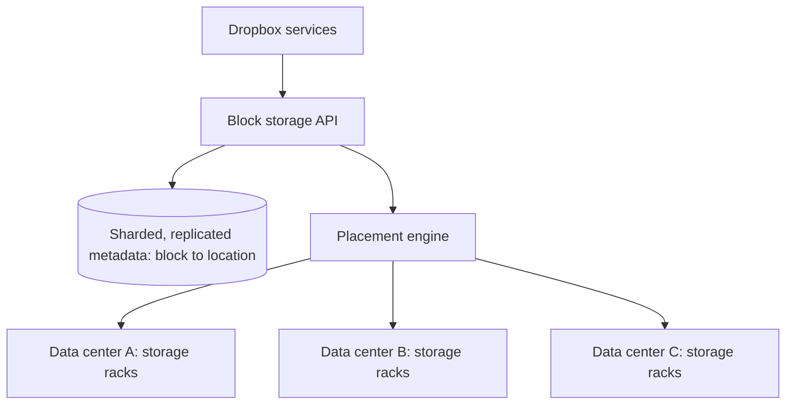
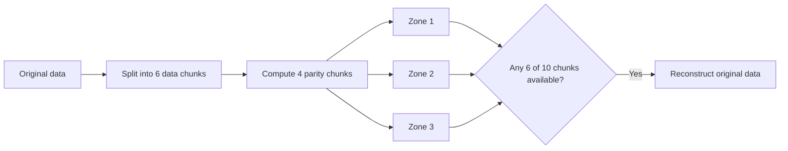
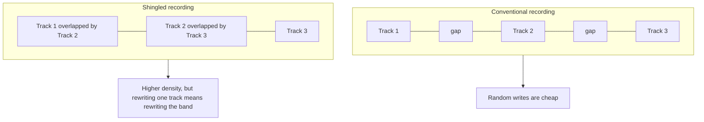
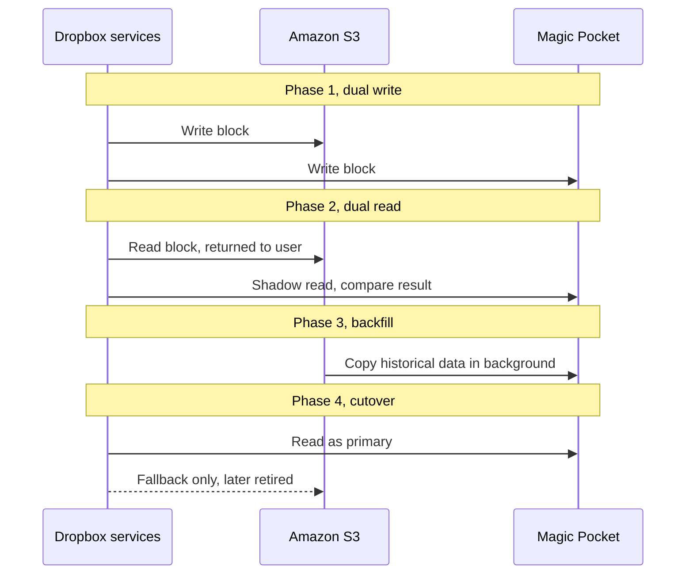
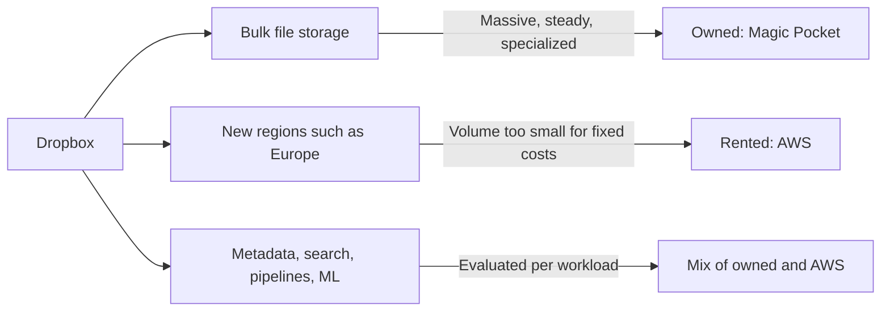

# Dropbox Leaving AWS: Magic Pocket and the Build-vs-Buy Decision

## Scope and framing

This explainer follows the supplied transcript, which recounts how Dropbox moved most of its user-file storage off Amazon S3 onto its own infrastructure (a project known as Magic Pocket) and uses that story to build a framework for "rent vs. own" decisions. It uses the transcript as the backbone and adds well-established storage-engineering background where helpful. Figures such as storage volumes, prices, savings, erasure-coding parameters, chassis density, and migration duration are as reported in the transcript and have not been independently verified; some are approximate or estimated in the transcript itself. The diagrams are conceptual and are not exact reproductions of Dropbox's production systems.

The transcript sets the scene in 2015, when many companies were racing onto AWS, and Dropbox started moving in the opposite direction for one workload. It says Dropbox's IPO filing reported infrastructure cost reductions of about **$74.6 million over two years**, and cites later estimates of savings well above $100 million per year.

The motivation, per the transcript, was neither an AWS failure nor an ideological objection to the cloud. Dropbox did the math and concluded that, at its scale and with its particular **workload shape**, owning the hardware would save tens of millions of dollars per year indefinitely. The broader lesson is a framework for one of the hardest decisions a senior engineer can face: **when to stop renting and start owning.** The naive answer ("whenever it is cheaper") is, according to the transcript, incomplete; the real answer depends on the workload's shape, not just its size.

## 1. AWS was not too expensive; one workload was

The transcript is careful on this point. AWS was not too expensive for Dropbox in general. It was too expensive for **one specific workload**: storing enormous quantities of user file data. For other workloads AWS remained the right choice. Dropbox continued using AWS after the migration, and in 2022 expanded its AWS use for new geographic regions, because building a new data center in Europe made no sense when capacity could be rented.

### What the cloud actually sells

The cloud's core product is **elasticity**: the ability to acquire capacity instantly, pay only for what is used, and scale back down. The price of elasticity is a margin built into every gigabyte and every CPU hour.

- **Small, unpredictable, or variable workloads** get full value from that margin. Building equivalent flexibility in-house would cost more.
- **Huge, steady, specialized workloads**, where required capacity is known, grows predictably, and has a well-understood access pattern, pay for elasticity they never use. They pay the provider's margin on top of hardware that is always full anyway.

Dropbox was in the second category. Its data was measured in hundreds of petabytes, growth was predictable, and the access pattern was specific: **most files are written once and read rarely**. Dropbox did not need elasticity; it needed cheap, dense, reliable storage. The transcript's summary: the lesson is not "the cloud is bad", it is "renting things you don't need is bad".

## 2. The cost model at hundreds of petabytes

The transcript walks through the cloud bill at Dropbox's scale. It describes Dropbox storing hundreds of petabytes on S3 around 2015 and uses roughly half an exabyte in its cost illustration.

### Line items

- **Storage at rest.** The transcript cites S3 standard list pricing of roughly 2 cents per GB-month at the time. Even assuming large volume discounts (say, half of list), half an exabyte costs on the order of **$50 million per year** simply sitting still.
- **Egress bandwidth.** Dropbox's product downloads stored bytes back to users. Data transfer out of AWS was cited at around 9 cents per GB, a large separate cost on top of storage.
- **Request charges.** Every PUT, GET, and LIST costs a fraction of a cent. With hundreds of millions of users performing file operations, those fractions add up.
- **Replication and durability.** AWS replicates data internally, and the customer pays for that implicitly through the storage price.
- **Provider margin.** The price includes AWS's costs plus its profit. At small scale that margin is invisible because building it yourself was never an option. At massive scale it is a number you can point to.

### The self-build estimate

Dropbox asked what equivalent infrastructure would cost to build and run. The transcript's rough answer: at that scale, perhaps **half** of what AWS charged, possibly **a third** if built well. The savings come from several sources:

- Removing the provider's margin.
- More efficient redundancy, tailored to the known workload.
- No egress charges for data served from its own data centers (replaced by its own network and transit costs).
- Hardware optimized for the specific access pattern.

### The catch: fixed costs need volume

The math only works at scale. At 10 PB instead of hundreds, the transcript says it does not work. Running data centers carries very large **fixed costs**: staff, real estate, power contracts, network providers. Enormous volume is needed to amortize them. Most companies never reach that volume and should keep paying the cloud margin as the price of not having to think about it.

## 3. What "building it" actually commits you to

Around 2014–2015, Dropbox decided to build its own storage infrastructure under the name **Magic Pocket**. The transcript stresses that this was a generational engineering project, not a quarter of side work. The commitment had five parts:

1. **Data centers.** Build or lease colocation space across multiple geographies: real estate, power, networking, redundant fiber to the internet.
2. **Custom hardware.** Off-the-shelf servers were not cost-effective at the required density, so Dropbox designed its own storage chassis for its access pattern.
3. **A new storage system.** S3 had been silently providing erasure coding, replication, durability guarantees, and a large operations layer. All of that had to be rebuilt.
4. **Migration.** Move hundreds of petabytes of live user data while users kept using the product, with no downtime and no data loss.
5. **Operations.** Hardware failures, network outages, and capacity planning, previously AWS's problems, became Dropbox's.

### The execution risk

The savings are real only if the build is executed well. Abandoning the project after three years means a fortune spent for nothing; completing it with poor reliability makes the product worse. According to the transcript, Dropbox spent years hiring systems engineers who had built large-scale storage at Google, Facebook, Microsoft, and AWS itself. That talent base is what made the project feasible.

So the real question was not "should we move off AWS?" but "**can we hire and retain a team capable of executing a multi-year hardware and software project at hyperscaler quality?**" The transcript notes that most companies should answer no.

## 4. Magic Pocket's architecture

The transcript describes Magic Pocket as layered, with sharply separated concerns:

- **Block storage API.** The interface other Dropbox services call to read or write file content.
- **Metadata layer.** A sharded, replicated index that records where every block of every file lives.
- **Placement.** Logic deciding which storage nodes and zones hold each piece of data.
- **Storage layer.** Racks of custom storage servers in multiple data centers.

The API does not know about hardware; the metadata layer does not know the placement strategy; placement does not know the details of physical machines. Each layer can be replaced, debugged, and scaled independently. The transcript calls this deliberate: it is the only way a system this complex stays maintainable.

## 5. Durability with erasure coding

### Replication is simple but expensive

The default way to make storage durable is **replication**: keep three copies of every byte. Losing one disk leaves two copies. But three copies means paying for three times the raw capacity to get one usable copy.

### Reed-Solomon erasure coding

Magic Pocket uses **erasure coding**, specifically Reed-Solomon codes. Conceptually:

1. Split data into $k$ **data chunks**.
2. Compute $m$ **parity chunks** from them.
3. Spread all $k + m$ chunks across different machines and failure domains.
4. **Any** $k$ of the $k + m$ chunks can reconstruct the original data, so up to $m$ chunks can be lost without data loss.

The transcript reports parameters of roughly $k = 6$ and $m = 4$, spread across different storage zones: 10 chunks stored for every 6 chunks of data.

$$
\text{overhead} = \frac{k + m}{k} = \frac{6 + 4}{6} \approx 1.67\times \quad \text{vs.} \quad 3\times \text{ for triple replication}
$$

At hundreds of petabytes, the gap between 1.67× and 3× is hundreds of petabytes of hardware not purchased. And with $m = 4$, the data survives four simultaneous chunk losses, more than triple replication's two.

### The trade-off, and tiering

Erasure coding costs compute. Reconstructing a missing chunk means performing math over the surviving chunks, and a degraded read may need to fetch several chunks from several machines. So erasure coding suits data that is read **relatively rarely**. For hot data read constantly, replication can be preferable because there is no decoding cost. The transcript says Dropbox **tiers** its storage: the most-accessed data uses faster, simpler storage, and the cold majority uses erasure-coded storage for maximum density.

The important point is control. On S3, the customer uses whatever durability scheme the provider chose internally. Owning the stack let Dropbox choose the optimal scheme and parameters for a mostly-cold, predictable workload.

## 6. Hardware: SMR drives and dense chassis

### Disks dominate cost

At exabyte scale, the physical storage medium becomes the dominant line item. SSDs are faster but much more expensive per gigabyte; for write-once, read-rarely data, **spinning hard drives** are the right medium.

### Shingled magnetic recording

Within hard drives, Dropbox used **shingled magnetic recording (SMR)**.

- On a conventional drive, adjacent tracks are separated by small gaps so the write head can write one track without disturbing its neighbors.
- SMR overlaps tracks slightly, like roof shingles. More tracks fit on the same platter, so capacity per drive rises.
- The catch: writing a track disturbs the overlapping tracks after it. Modifying data in place means rewriting a whole band of tracks. **Random writes are very expensive.**

SMR is therefore poor for general-purpose workloads and good for workloads that write sequentially and rarely modify data, which is exactly Dropbox's pattern.

### Custom chassis

The transcript says Dropbox designed its own storage chassis (it uses the name "Discotech") packed with SMR drives, reaching roughly **1.4 PB per 4U** chassis, about double the density of typical off-the-shelf storage servers of the time. Because the software stack was designed around write-once, read-many access (appending data sequentially and handling deletion through background compaction rather than in-place overwrites), SMR's limitations did not hurt.

This is the transcript's clearest illustration of **shape over size**. Most workloads cannot use SMR because they have random writes. Dropbox's was fundamentally sequential, so it could use a technology that nearly doubles bytes per unit of capacity. A general-purpose cloud provider must support every workload and cannot make that choice across the board.

## 7. The migration: dual write, dual read, backfill, cutover

The transcript calls migration the silent killer of infrastructure projects. Architecture diagrams and hardware specs are the easy part; moving live data under active use without anyone noticing is where projects fail.

According to the transcript, Dropbox spent about **2.5 years** (2015–2017) moving several hundred petabytes from S3 to Magic Pocket while the product kept growing at roughly a petabyte of new data per day. It followed a four-phase pattern that applies to any data-store migration.

### Phase 1: Dual writing

Every new write goes to **both** the old and new systems. From that point, no new data exists only in the old system. The old system remains the source of truth, so a problem in the new one loses nothing.

### Phase 2: Dual reading (shadow reads)

Reads go to both systems. The user receives the old system's result, while a **shadow read** from the new system is compared against it. This verifies correctness on real production traffic and surfaces edge cases that testing would never find.

### Phase 3: Backfill

Data written before dual writing began exists only in the old system and must be copied. For Dropbox that meant hundreds of petabytes, moved by dedicated jobs that scanned S3 systematically, running continuously for months in the background.

### Phase 4: Cutover

Once all data is present and verified through dual reads, reads switch to the new system as primary, with the old system as a fallback. If problems appear, traffic can flip back. After a period of stability, dual writes stop and the old system is retired.

The difficulty is not the pattern, which is well understood, but the **discipline**: completing every phase, chasing every edge case, and not cutting corners under deadline pressure. The transcript notes that teams that fail at migrations usually skip phase 2 or rush phase 3. For Dropbox, the alternative was data loss or downtime for millions of paying users.

## 8. Dropbox did not actually leave AWS

The transcript's most instructive point: Dropbox moved its **storage** workload off AWS, where the math justified it, but kept using AWS for much else, and expanded that use in 2022.

- **Bulk file storage:** owned. This was the dominant cost driver.
- **New geographic regions**, such as Europe: AWS. A single region's volume could not justify the fixed cost of a new data center.
- **Other workloads** (metadata services, search indexes, processing pipelines, ML training): a mix of owned and cloud, decided per workload.

The build-vs-buy decision is therefore not one decision but many, made **workload by workload** over the life of the company. Storage might be "build"; compute might be "buy"; machine learning might be "buy now, build later."

The mature framing, per the transcript: **own what you are so good at that owning it is a competitive advantage, and rent everything else.** For Dropbox, storing more bytes per dollar than competitors is a competitive advantage. For most companies, storage is simply an expense, and renting it is right.

## 9. Trade-offs

**Benefits of owning (for the right workload):**

- Removes the provider's margin on steady, always-full capacity.
- Eliminates cloud egress pricing for data served from owned facilities.
- Allows workload-specific durability schemes such as custom erasure-coding parameters.
- Allows workload-specific hardware such as SMR drives and dense custom chassis.

**Costs and risks of owning:**

- Large fixed costs (facilities, power, networking, staff) that require enormous volume to amortize.
- A multi-year engineering program with real risk of failure or reduced reliability.
- Dependence on hiring and retaining rare storage and infrastructure talent.
- Loss of elasticity: capacity must be forecast and bought ahead of demand.
- Full responsibility for hardware failures, outages, and capacity planning.
- A long, disciplined migration with its own risk of data loss or downtime.

**What renting keeps:**

- Instant elasticity and geographic reach.
- No capital commitment or facilities management.
- The provider's operational expertise and general-purpose reliability.

## Key takeaways

1. The cloud sells elasticity, and its margin is the price. Steady, always-full workloads pay for elasticity they never use.
2. Workload **shape** (steadiness, predictability, access pattern) matters more than size. Hundreds of petabytes of write-once, read-rarely data is a very different case from bursty random-access data.
3. Owning only pays at very large scale, because fixed costs of facilities, power, networking, and staff need enormous volume to amortize.
4. The real question is whether you can build and operate the replacement at hyperscaler quality. Most companies cannot and should not try.
5. Owning the stack unlocks optimizations a general-purpose provider cannot offer: erasure coding tuned to the workload (roughly 1.67× overhead vs. 3× replication, per the transcript) and SMR-based dense hardware.
6. Migrations are where infrastructure projects fail. Dual write, dual read, backfill, and cutover, done with discipline, moved hundreds of petabytes with no reported data loss or downtime.
7. Build vs. buy is decided workload by workload and revisited over time. Dropbox owns bulk storage and still rents AWS for regions and other workloads.
8. Own what gives you a competitive advantage; rent everything else.

The transcript's closing test: for any workload, ask whether you are in a Dropbox-like zone (massive, steady, and specialized). If yes, building might be on the table. If not, buying is almost certainly right.
