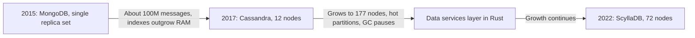
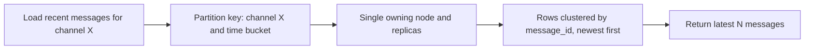
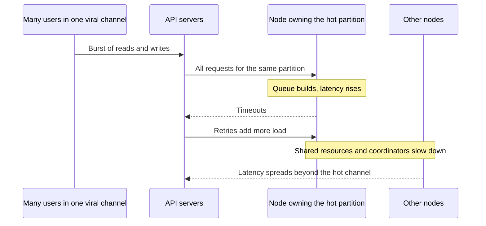
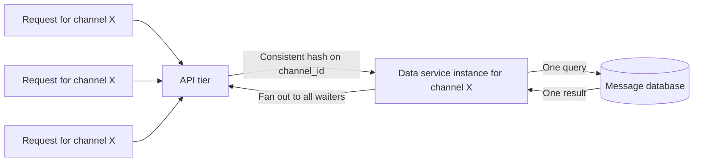
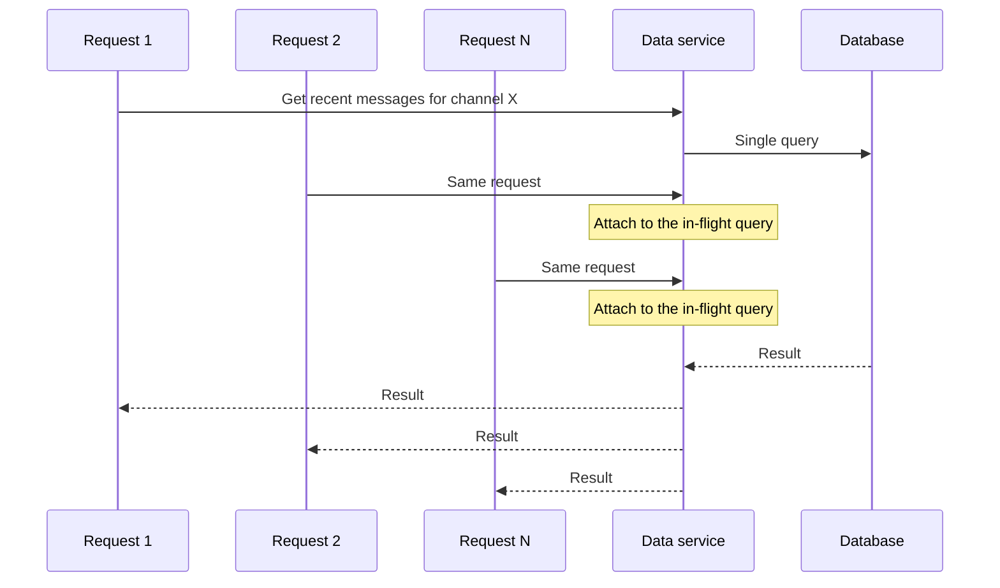
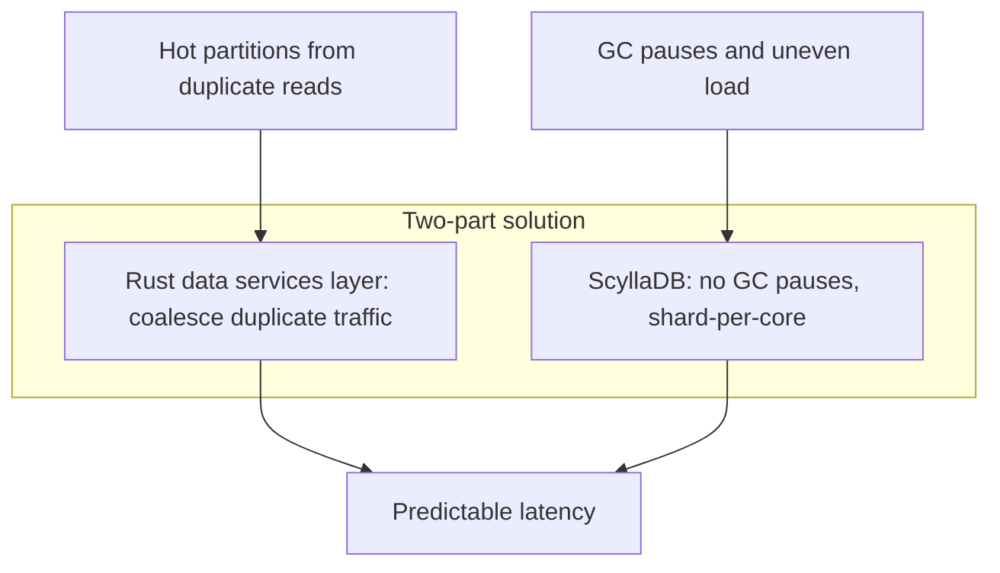
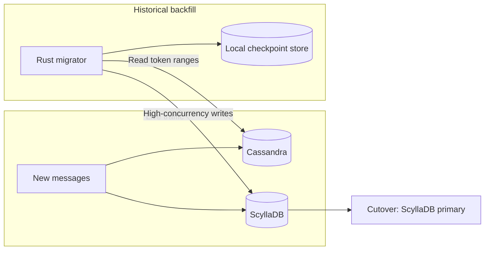

# Discord Message Storage: From MongoDB to Cassandra to ScyllaDB

## Scope and framing

This explainer follows the supplied transcript, which traces how Discord's decision to keep every message forever shaped its storage architecture, from MongoDB to Cassandra to ScyllaDB, with a Rust request-coalescing layer in between. It uses the transcript as its backbone and adds well-established database background where helpful. Figures such as message counts, node counts, latencies, migration throughput, and dates are as reported in the transcript and have not been independently verified. The diagrams are conceptual and are not exact reproductions of Discord's production systems.

Most chat products treat messages as ephemeral: they scroll away, age out, and are eventually archived or dropped. The transcript highlights a product decision Discord made early: **never delete messages.** Every message in every server and channel, back to the day a user joined, remains stored, scrollable, and searchable.

That decision means Discord is not simply running a messaging system; it is running one of the largest continuously growing databases anywhere. The transcript says Discord crossed a trillion stored messages years ago and adds billions more every day, none of them discarded. Its central lesson: **the database that gets you to a billion rows is rarely the one that survives at a trillion.** Access patterns that look harmless at small scale become the thing that breaks the system at large scale.

## 1. The early days: MongoDB

Discord launched in 2015 with messages stored in **MongoDB** on a single replica set. That is a normal starting point: flexible, fast to build on, and adequate at small scale.

By the end of 2015, the transcript says Discord held around **100 million** messages and MongoDB was showing strain. The data and indexes no longer fit in memory, and latency became unpredictable. This is the wall many fast-growing products hit: the database that got them started cannot carry the load anymore.

## 2. The textbook move: Cassandra

In 2017 Discord migrated messages to **Apache Cassandra**. On paper this was the correct choice, and the transcript says any distributed-systems engineer of the time would likely have recommended it for trillions of append-only records. Cassandra offers:

- High write throughput.
- A storage engine suited to data that only grows.
- Linear scalability: add nodes to add capacity.
- No single point of failure: a masterless, replicated ring.

Discord started with **12 Cassandra nodes** holding billions of messages, and for a while it was exactly what was needed.

## 3. The data model: designed around one question

In Cassandra-style databases, the schema and the access pattern are fused. Tables are designed around the exact query they must answer. Discord's dominant question is:

> Give me the most recent messages in this channel.

So the model was:

- **Partition key:** the channel (bucketed by time window, so a very long-lived channel's history is split into multiple partitions rather than one unbounded one).
- **Clustering key:** the message ID, which encodes time (a Snowflake-style ID), sorted so the newest messages are easy to read first.

Loading a channel is one query against one partition, returning the newest messages.

### What this model unlocked

The transcript identifies three benefits:

1. **Co-location.** All messages in a channel (per time bucket) live in the same partition. The most common operation in the product, opening a channel, is a single query to a single partition on a single node: no fan-out, no cross-machine joins. The operation users perform thousands of times per second is the cheapest one the database performs.
2. **Append-friendly writes.** Messages are almost never edited and, under Discord's policy, never deleted. Cassandra's log-structured storage turns writes into cheap appends and avoids expensive in-place rewrites. The product's write pattern matched the database's strongest pattern.
3. **Linear scaling.** More capacity means more nodes; data redistributes across the ring. Discord's cluster grew from 12 nodes to dozens and eventually past 100.

For years, this worked.

## 4. The hidden assumption: evenly distributed traffic

The model implicitly assumes that traffic spreads roughly evenly across channels, so partitions are similar in size and nodes carry similar load.

Real Discord traffic is violently uneven. Most channels are quiet, but a few, such as a huge public server during a game launch, a celebrity's community, or a viral moment, are hammered by very large numbers of people reading and writing simultaneously. And under this model, **all of that traffic lands on the one partition, on the nodes that own it.**

### Hot partitions

That is a **hot partition**: one node buried under load while its neighbors sit nearly idle. Adding nodes does not help, because the hot data cannot be split across them; it is one partition.

Hot partitions do not fail quietly:

1. The hot node slows down.
2. Requests pile up and start timing out.
3. Clients retry, adding more load to the node that is already drowning.
4. The latency spreads to anything sharing resources with that node, such as coordinator work and replicas for other partitions.

The transcript says one hot channel could cascade into system-wide latency, and engineers would be paged for global slowdowns that traced back to a single channel's big moment.

### Garbage-collection pauses

A second, independent problem: Cassandra runs on the JVM, and at Discord's scale, garbage collection periodically froze nodes for long pauses. Those pauses caused latency spikes of their own, stacked on top of hot-partition spikes. Two unrelated sources of unpredictable stalls compounded each other.

### The real cost

The model that made the common case fast made the worst case catastrophic, and at Discord's scale the worst case happened every day, because somewhere a channel was always going viral. By this point, the transcript says Discord ran a single cluster of **177 Cassandra nodes**, and much of the team's time went to firefighting. The system that was supposed to scale linearly had become a constant operational emergency.

## 5. Fixing the traffic, not just the storage

The transcript calls this the part most people miss. The obvious instinct was to replace the database. But Discord recognized that the database was not the only problem; **how traffic reached the database** was also a problem. Even a perfect database would struggle if a very large number of users demanded the same channel's data at the same instant.

So before changing the storage engine, Discord built a **data services layer** between its API and its databases.

### Request coalescing

The key technique is **request coalescing**. Imagine 10,000 people opening a popular channel at once:

- **Without coalescing:** 10,000 identical queries slam the same hot partition.
- **With coalescing:** the data services layer sees that the requests are identical, sends **one** query to the database, waits for the result, and fans that single answer back to all 10,000 waiting requests.

### Routing makes coalescing possible

Requests are routed to data service instances using **consistent hashing on the channel ID**. Every request for a given channel reaches the same instance, which is exactly what allows duplicates to be recognized and merged there. If requests for one channel were spread randomly across instances, each instance would send its own query and coalescing would be much less effective.

### Why Rust

Discord wrote the data services layer in **Rust**. According to the transcript, having been burned by JVM garbage collection, the team wanted a language with no garbage collector, precise control over concurrency, and no random pauses on the hot path.

### The payoff

A viral channel no longer multiplied database queries by the number of viewers; it produced roughly one query per burst, however many people were watching. The single worst trigger of hot partitions, many users requesting the same data at once, was flattened before reaching the database.

The engineering lesson, per the transcript: Discord separated two concerns, **how data is stored** and **how traffic reaches storage**, and solved the traffic problem independently.

## 6. Replacing the database: ScyllaDB

Coalescing helped, but 177 Cassandra nodes remained underneath: still garbage collecting, still vulnerable to hot partitions when coalescing was not enough. Data kept growing by billions of messages a day, none ever deleted. A bigger cluster meant more nodes to babysit, more GC, and more partitions that could go hot. Discord was scaling the problem, not solving it.

So it made the decision the transcript describes as terrifying at that scale: replace the database entirely, moving trillions of messages while the system remained live with no acceptable downtime.

The replacement was **ScyllaDB**, which the transcript describes as essentially Cassandra reimagined to address Discord's two problems:

- **Compatibility.** It speaks the same query language (CQL), so the existing data model could move over without a full redesign.
- **No garbage collector.** It is written in C++, removing the whole category of GC freeze pauses.
- **Shard-per-core architecture.** Each CPU core owns its own slice of data and memory and runs independently, which gives more consistent performance under load and handles uneven load more gracefully.

## 7. The migration: nine days instead of three months

### Dual writes for the present

Discord enabled **dual writes**: every new message was written to both Cassandra and ScyllaDB. From then on, the new database stayed current with new data automatically.

### Backfill for the past

The hard part was the trillions of historical messages. The first plan was ScyllaDB's off-the-shelf, Spark-based migrator. It worked and was stable, but the estimate was about **three months**. That meant three more months of running the Cassandra cluster the team wanted to retire, with all its operational risk.

So Discord wrote its **own migrator in Rust**, extending the data services framework it had already built. The custom migrator:

- Read large contiguous token ranges out of Cassandra.
- Wrote them into ScyllaDB with high concurrency.
- **Checkpointed progress** into a small local database, so after any failure it could resume where it left off rather than starting over.

The transcript reports throughput of around **3.2 million messages per second**, completing the backfill in about **nine days**.

As general background, a backfill running alongside dual writes must avoid overwriting newer data with older copies. Because messages are keyed by immutable IDs and mostly append-only, the risk is reduced, and write timestamps allow the newer version to win when the same row is written by both paths.

### Cutover and results

In May 2022, per the transcript, ScyllaDB became the primary store for Discord messages. The before-and-after figures:

| Metric | Cassandra | ScyllaDB |
| --- | --- | --- |
| Nodes | 177 | 72 |
| Data per node | Baseline | More than twice as much |
| Tail read latency | Swinging between about 40 and 125 ms | Consistent, about 50 ms as stated in the transcript |
| Worst-case write latency | Variable | About 5 ms |
| Operations | Constant firefighting | Hot partitions and GC no longer a daily emergency |

The headline is less any single number than the shift from unpredictable latency to steady latency on fewer machines. The most important change, according to the transcript, was that constant firefighting stopped.

## 8. What the "keep everything" promise costs

The transcript is explicit that the never-delete decision has lasting costs.

- **Storage only grows.** Discord permanently pays to keep data that statistically almost nobody will read. Most reads are of recent messages, but years of history are kept at full availability because that history is part of the product promise.
- **The data model is locked in.** Once trillions of messages are partitioned by channel, that scheme is permanent. This is why the database move went to a Cassandra-compatible system rather than a redesign: the shape chosen in 2017 still constrained options years later.
- **Layers to own forever.** The data services layer, coalescing, consistent-hash routing, and custom Rust tooling are now critical infrastructure that exists because of the storage decisions beneath it.

As general background, storage systems in this situation often introduce tiering (keeping recent data on the fastest hardware and older data on denser, cheaper storage) while preserving the same logical access path, so "instantly available" does not have to mean "stored identically".

The transcript concludes the bet paid off: instant access to all history is part of why people value the product, and Discord judged the experience worth the cost at every layer.

## 9. Trade-offs summary

| Decision | Benefit | Cost |
| --- | --- | --- |
| Never delete messages | Full, instant history as a product feature | Unbounded growth; paying for rarely read data |
| Partition by channel and time bucket | Common case is one partition, one query | Viral channels create hot partitions |
| Cassandra | Append-friendly, linear scale, no SPOF | JVM GC pauses; hot partitions still hurt |
| Rust data services with coalescing | Duplicate reads collapse to one query | New critical layer to own and operate |
| Consistent-hash routing by channel | Makes coalescing effective | Hot channels also concentrate on one service instance |
| ScyllaDB | No GC, shard-per-core, CQL-compatible | Migration effort; model still locked to original design |
| Custom Rust migrator | Three-month backfill cut to about nine days | Engineering investment in one-off tooling |

## Key takeaways

1. A product decision, "keep every message forever and make it instantly available", turned a chat app into one of the largest ever-growing databases and shaped every storage decision after it.
2. The database that gets you to a billion rows is rarely the one that survives a trillion. MongoDB, then Cassandra, were each right for their stage.
3. Design around the worst case, not the average. At Discord's scale, a viral channel is always happening somewhere, and partition-per-channel turns that into a hot partition.
4. Sometimes the fix is in front of the database. Request coalescing, with consistent-hash routing by channel, collapsed duplicate reads into single queries.
5. At the limits, implementation language is architecture: Rust for the data services layer and a C++ database removed garbage-collection pauses from the hot path.
6. Migrations are first-class engineering. Dual writes plus a purpose-built, checkpointing migrator turned a three-month backfill into about nine days.
7. The access pattern, especially how unevenly data is read and written, is the architecture. Ask not just what the average request looks like, but what the most extreme one looks like.
