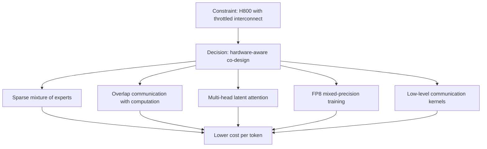
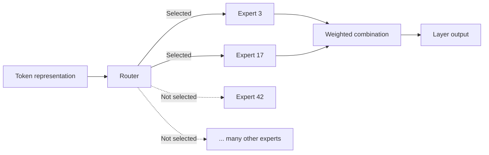
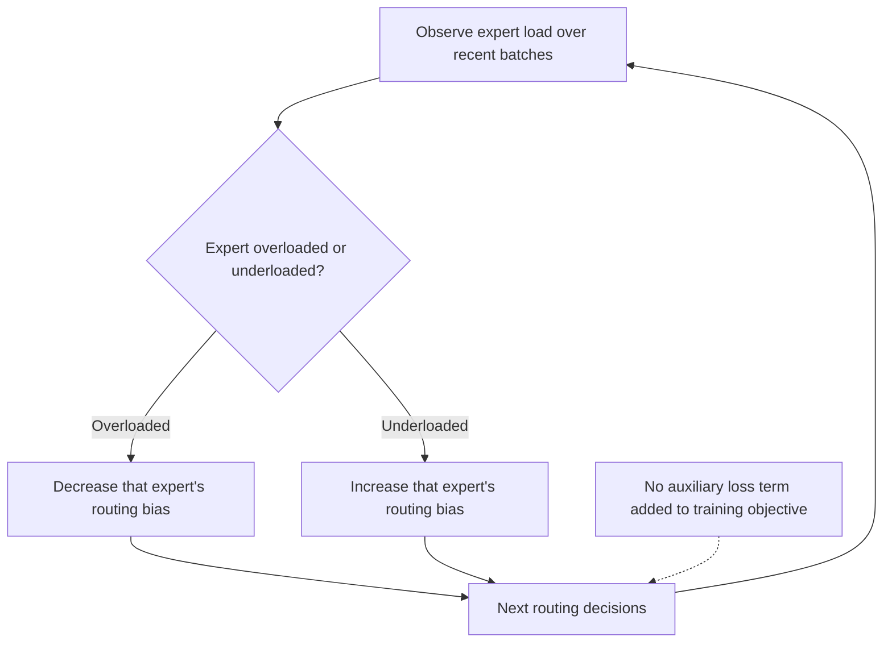
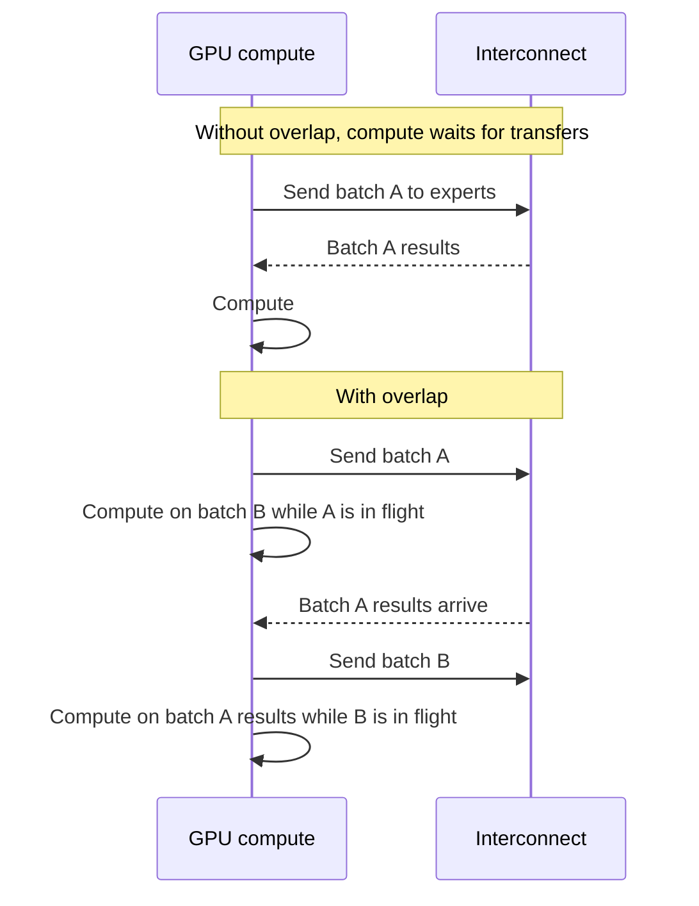
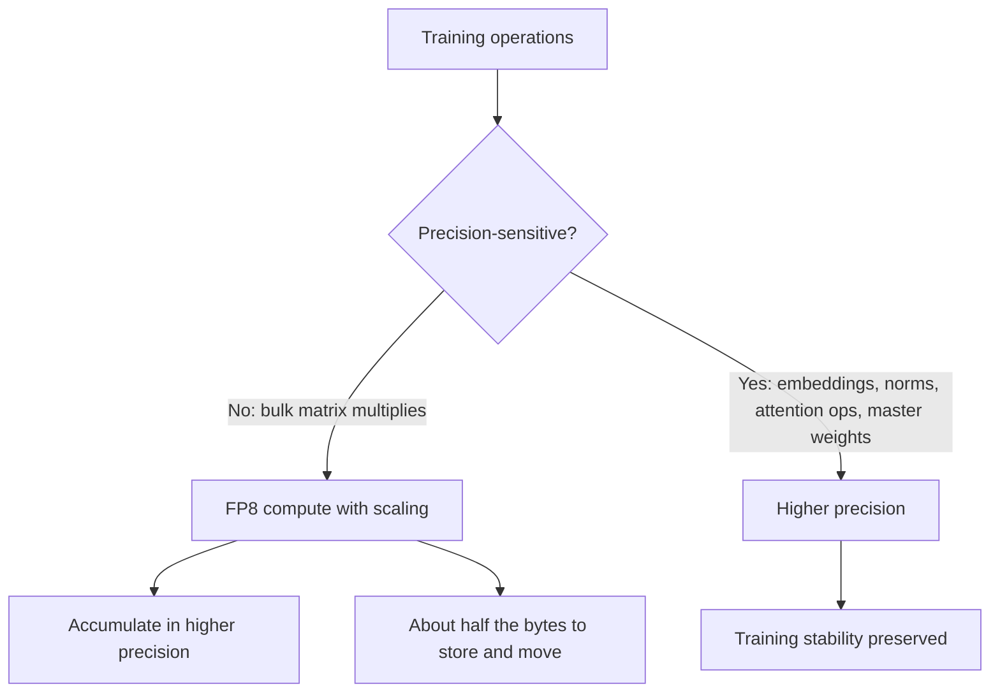
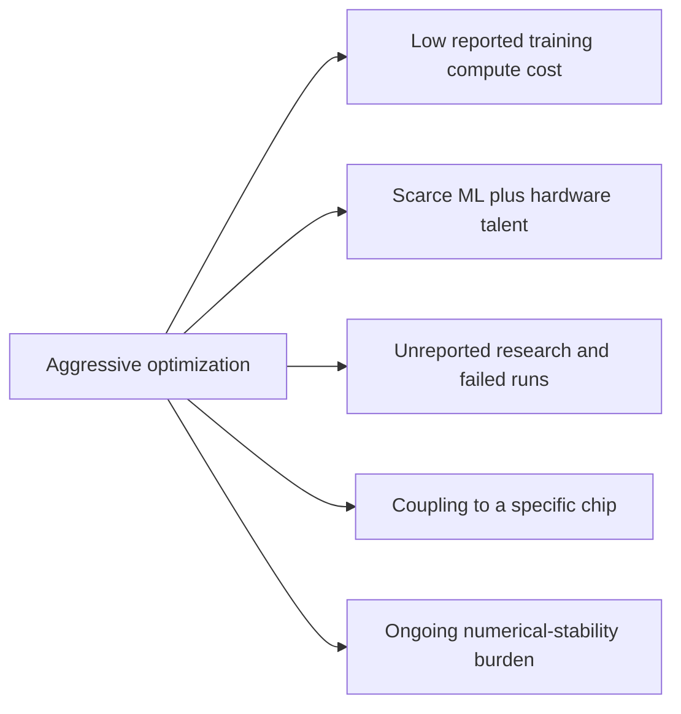

# DeepSeek Training: Hardware-Aware Co-Design Under a Bandwidth Constraint

## Scope and framing

This explainer follows the supplied transcript, which explains how DeepSeek trained a frontier-class model (DeepSeek-V3) at a reported compute cost far below what frontier labs were believed to spend. It uses the transcript as the backbone and adds well-established machine-learning and systems background where that clarifies a technique. Figures such as the roughly $5.5 million training cost, parameter counts, and comparisons with other labs are as reported in the transcript and have not been independently verified; the transcript itself stresses that the headline cost covers only the final training run. The diagrams are conceptual and do not reproduce DeepSeek's exact training topology.

According to the transcript, DeepSeek released a model in late 2024 that matched leading models, with a reported training compute cost of around **$5.5 million**, compared with the roughly hundred-million to billion-dollar range widely assumed for comparable frontier models. The transcript's claim is that this was not a trick or access to special hardware. It was the consequence of **one core decision**, hardware-aware co-design, from which almost every architectural choice follows.

The lesson the transcript draws is broader than AI: **hard constraints are often the source of good engineering rather than its enemy.** DeepSeek faced a constraint that should have crippled it, and that constraint is why it built something more efficient than labs with far larger budgets.

## 1. The constraint: throttled interconnect

Because of US export controls, Chinese labs could not legally buy NVIDIA's top-end training GPUs of the time (the H100). DeepSeek worked largely with the **H800**, which the transcript describes as having comparable compute but deliberately reduced **chip-to-chip interconnect bandwidth**.

### Why interconnect matters so much

Training a very large model means spreading it across thousands of GPUs. Those GPUs spend a great deal of time communicating:

- Exchanging and reducing gradients.
- Synchronizing weights.
- Shuffling activations between model shards and, in mixture-of-experts models, between experts.

At scale, training is as much a **communication** problem as a compute problem. The usual answer is to buy hardware with the fastest interconnect and spend money on networking. That was precisely the capability DeepSeek had been denied.

### The core decision: co-design

Rather than treating hardware as a fixed purchase to design around afterward, DeepSeek treated it as a **design constraint** from the start. Most labs design a model and then choose hardware to run it; DeepSeek, per the transcript, designed the model and the hardware strategy as one thing, with every layer shaped by a single question:

> How do we do this while moving as little data between chips as possible?

## 2. The shape of the model

The transcript summarizes DeepSeek-V3's key characteristics:

| Characteristic | Description |
| --- | --- |
| Architecture | Mixture of experts (MoE) |
| Total parameters | About 671 billion |
| Active parameters per token | About 37 billion |
| Attention | Multi-head latent attention (MLA) |
| Training precision | Largely 8-bit floating point (FP8), with selective higher precision |
| Prediction objective | Predicts multiple future tokens rather than only the next one |

Each of these, the transcript argues, is a cost decision in disguise that follows from the co-design choice.

## 3. Mixture of experts: large capacity, small active footprint

### Dense vs. sparse models

In a **dense** model, every parameter participates in processing every token. A 400-billion-parameter dense model uses all 400 billion parameters for every token, in both training and serving.

A **mixture-of-experts** model replaces some dense layers with many smaller **expert** networks plus a **router** (gating network). For each token, the router selects a small number of relevant experts, and only those run. The model's total capacity can be very large while the compute per token remains small.

### How aggressive DeepSeek was

DeepSeek-V3 has about **671 billion** total parameters but activates about **37 billion** per token, roughly **5.5%**. It carries the knowledge capacity of a very large model while paying, per token, roughly the compute bill of a model less than a twentieth of its total size.

$$
\frac{37\text{B active}}{671\text{B total}} \approx 5.5\%
$$

### The load-balancing problem

MoE has a well-known failure mode. If the router chooses freely, it tends to favor a handful of popular experts and neglect the rest. Traffic piles onto a few experts, which become bottlenecks, while many expensive parameters sit idle.

The traditional fix is an **auxiliary loss**: an extra term in the training objective that penalizes uneven expert usage. It works, but it competes with the model's actual learning objective, trading some quality for balance.

### Auxiliary-loss-free balancing

The transcript highlights DeepSeek's alternative: **auxiliary-loss-free load balancing**. Instead of adding a penalty to the loss, a **bias term** on each expert's routing score is adjusted dynamically. Overused experts have their bias lowered; underused ones have it raised. The bias influences which experts are selected, steering traffic toward balance without injecting a competing gradient into learning. Balance is achieved without the usual quality tax.

## 4. The cost of MoE: communication, and how it was hidden

### Expert parallelism is communication-heavy

In a large MoE model, experts live on different GPUs. When a token needs experts on three different GPUs, its data must be sent to those GPUs, processed, and sent back. This is **expert parallelism**, and it makes MoE models very communication-intensive: each token potentially causes several cross-chip exchanges (in collective terms, an all-to-all "dispatch" followed by an all-to-all "combine").

That collides directly with DeepSeek's constraint. The architecture that saved the most compute leaned hardest on the resource DeepSeek lacked. On paper, MoE was the worst possible fit for the H800.

### Overlapping communication and computation

The transcript says DeepSeek's response was to overlap communication and computation so tightly that while one batch of data was in transit between chips, the GPUs were already computing on another. The chips were rarely idle waiting on the network; DeepSeek approached full computation-communication overlap. The bandwidth limit was effectively hidden behind useful work instead of adding directly to step time.

The transcript's framing: the constraint forced a more sophisticated design. DeepSeek kept MoE's compute savings while refusing to pay most of MoE's communication penalty.

## 5. Training cost vs. serving cost

The transcript draws a distinction that matters for anyone operating models:

- **Training cost** is a one-time cost to create the model.
- **Inference cost** is paid forever, on every request, for as long as the model is served.

Techniques that reduce one can increase the other. DeepSeek attacked both, using different tools for each: MoE primarily reduces compute per token (helping both training and serving), while MLA targets the memory cost that dominates serving.

## 6. Multi-head latent attention: shrinking the KV cache

### The KV cache problem

When a transformer generates text, it keeps the **keys and values** computed for every previous token, the **KV cache**, so it does not recompute them for each new token. The cache grows with context length and with the number of concurrent users. For long conversations, it becomes the dominant memory cost of serving, limiting how many users or how much context fit on a GPU.

### Conventional reductions lose detail

Common approaches, such as sharing keys and values across attention heads (multi-query or grouped-query attention), reduce cache size by storing less distinct information, and can cost some quality.

### MLA: low-rank compression

**Multi-head latent attention** compresses keys and values into a small **latent** representation via a low-rank projection, stores only that compact latent in the cache, and reconstructs what attention needs on the fly. The transcript describes the result as a dramatically smaller KV cache while retaining the quality of full multi-head attention.

The operational payoff:

- Longer contexts fit in memory.
- More concurrent users fit on one GPU.
- Inference is cheaper, without the quality loss typical of other cache-saving tricks.

The transcript's point is about targeted tools: MoE addresses compute cost; MLA addresses the forever cost of serving memory. Rather than one blunt instrument, DeepSeek identified distinct bottlenecks and built a specific solution for each.

## 7. FP8 training: fewer bits, less data to move

### What precision means in training

Training performs enormous numbers of multiply-add operations. The number format determines how many bits represent each value. More bits give more precise arithmetic but consume more memory, more memory bandwidth, and more compute. The industry standard for large-model training at the time was 16-bit (BF16).

DeepSeek did most of its training in **8-bit floating point (FP8)**.

### Why this was considered risky

With only 8 bits, values have very limited range and precision. Rounding errors accumulate, gradients can underflow or overflow, and training can become unstable and **diverge**, potentially wasting millions of dollars of compute on a model that does not work. The transcript says frontier labs largely avoided full FP8 training at scale for this reason, and credits DeepSeek as the first to make it work on a model this large.

### Why it mattered for DeepSeek specifically

FP8 values are half the size of 16-bit values. That halves memory for those tensors and, crucially, roughly halves the volume of data moved across the throttled interconnect. So FP8 was not only a compute optimization; it was a **communication optimization** aimed at DeepSeek's specific weakness.

### Selective precision

DeepSeek did not go fully 8-bit. The transcript calls this the craftsmanship:

| Component | Precision | Reason |
| --- | --- | --- |
| Large matrix multiplications | FP8 | Dominate compute; tolerate lower precision |
| Embeddings | Higher precision | Sensitive to precision loss |
| Normalization layers | Higher precision | Sensitive to precision loss |
| Attention operators | Higher precision | Sensitive to precision loss |
| Master copy of weights | Higher precision | Updates must accumulate accurately |

Going fully 8-bit risks collapse; staying fully 16-bit leaves the savings unclaimed. The skill lies in knowing which operations survive the precision cut. As general background, FP8 training also typically uses fine-grained **scaling factors** (per block or per tile of a tensor) so that values are rescaled into FP8's narrow range before conversion, and accumulations are performed in higher precision to limit error build-up.

## 8. Going below the standard libraries

The transcript says DeepSeek wrote some of its communication code **below NVIDIA's standard libraries**, dropping to a low-level instruction set to control precisely how data moves between chips and how GPU resources are divided between communication and computation. That is work normally left to the chip vendor. Most teams never need to go there. When a team's competitive position depends on beating a bandwidth limit, it may have to go all the way down.

The transcript's point is that better-funded labs had no reason to attempt this; the constraint pushed DeepSeek into engineering others did not need.

## 9. Multi-token prediction

The transcript notes briefly that DeepSeek-V3 predicts **multiple tokens at once** rather than only the next token. As general background, multi-token prediction adds training objectives in which the model also predicts tokens further ahead. This can provide a denser training signal per sequence, and the extra prediction heads can also be used at inference time to propose several tokens that are then verified (a form of speculative decoding), speeding up generation. The transcript presents it as one more cost-oriented choice.

## 10. What all this cost

The transcript is explicit that aggressive optimization is not free; its costs simply do not show up in the GPU bill.

### Engineering talent and time

Writing custom low-level GPU code, pioneering FP8 training at scale, and building a new load-balancing scheme are among the hardest kinds of systems work. They require rare people who understand both machine learning and hardware deeply.

### The headline number is narrow

The roughly $5.5 million figure is, per the transcript, the compute for the **final training run**. It excludes months of research, failed experiments, prior training runs, and the salaries of the people who made it possible. A cheap final number sits on top of an expensive process.

### Specialization and fragility

A system tuned to one hardware configuration is fragile in a specific way. It is optimized to the H800's exact characteristics. Highly co-designed systems are powerful precisely because they are specialized, but that specialization does not automatically transfer when hardware changes. Tuning everything to one chip's bottleneck couples the system to that chip.

### A permanent precision burden

FP8 training operates close to the edge of numerical stability. That introduces a class of subtle bugs and instabilities that 16-bit training does not have, and every future change must respect the precision boundaries already drawn. The savings are paid for with ongoing attention.

## 11. Trade-offs summary

| Technique | Benefit | Cost or risk |
| --- | --- | --- |
| Sparse MoE (about 5.5% active) | Large capacity at small per-token compute | Load imbalance; heavy all-to-all communication |
| Auxiliary-loss-free balancing | Balanced experts without degrading learning | Custom mechanism to design and tune |
| Communication-computation overlap | Hides throttled interconnect | Complex scheduling and kernels |
| Multi-head latent attention | Much smaller KV cache, cheaper serving | Extra projection compute; more complex attention |
| FP8 mixed precision | Less memory, compute, and inter-chip traffic | Instability risk; permanent precision discipline |
| Low-level communication code | Maximum use of limited bandwidth | Deep hardware coupling; vendor-level expertise |

## Key takeaways

1. DeepSeek's constraint was bandwidth, not compute: the H800's throttled interconnect struck at what large-scale training relies on most.
2. The core decision was hardware-aware co-design: shape every layer of the model around moving as little data between chips as possible.
3. A sparse mixture of experts (about 37B of 671B parameters active per token, per the transcript) provides large capacity at a fraction of dense compute.
4. Auxiliary-loss-free load balancing uses adjustable routing biases instead of a loss penalty, keeping experts balanced without a quality tax.
5. MoE's communication cost was largely hidden by overlapping data transfer with computation.
6. Training and serving costs are different problems; MLA targets serving by compressing the KV cache into a low-rank latent.
7. FP8 training, applied selectively, cut both compute and inter-chip data volume, aimed directly at the bandwidth constraint.
8. The low headline cost covers only the final run and sits on top of scarce expertise, many experiments, hardware coupling, and ongoing precision discipline.

The transcript's closing lesson: the most aggressive efficiency rarely comes from more resources. It often comes from a constraint sharp enough to force a better design. When a constraint looks like the reason a project will fail, it is worth studying longer, because engineering around it well can become the reason it succeeds.
