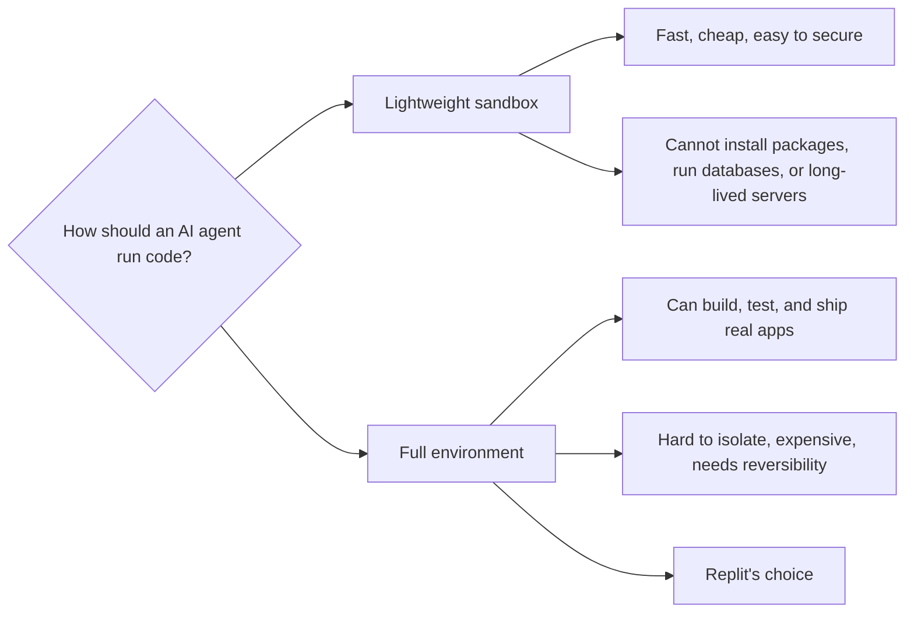
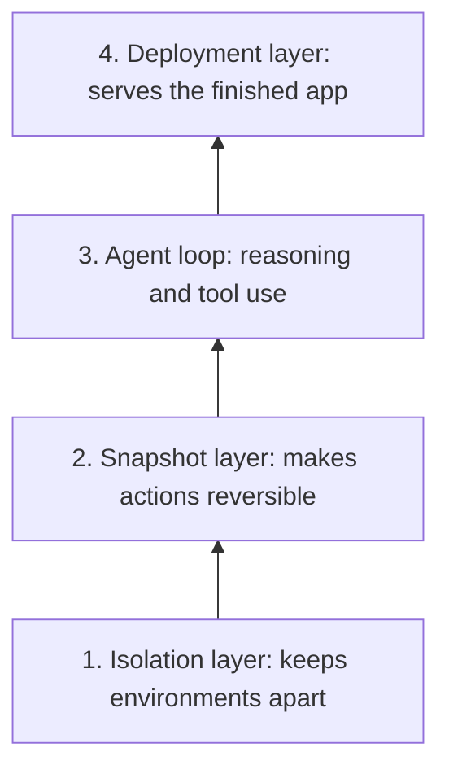
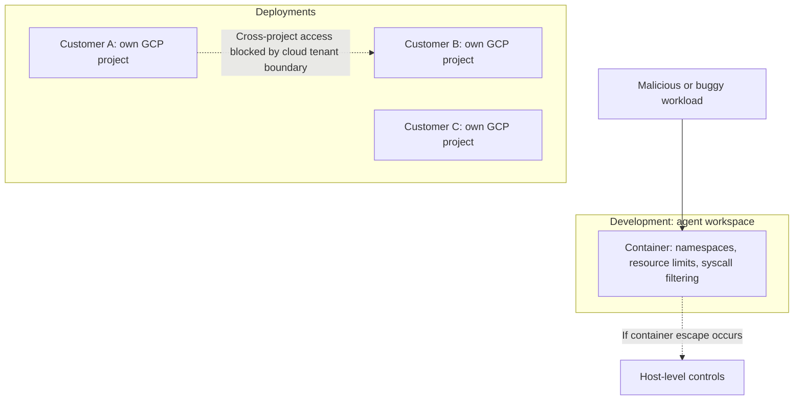
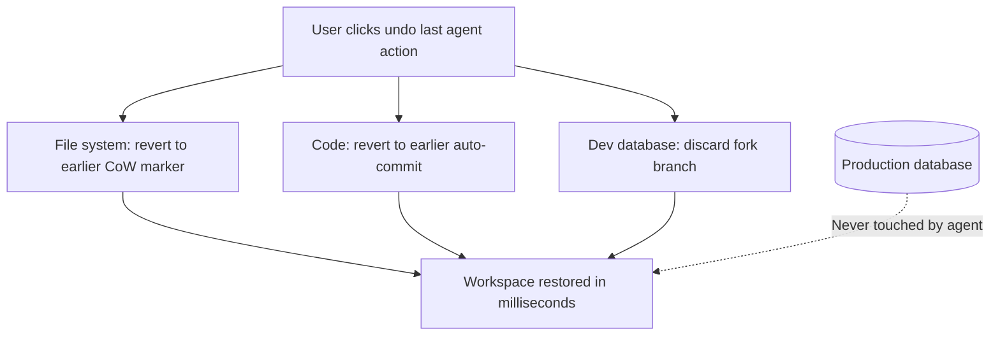
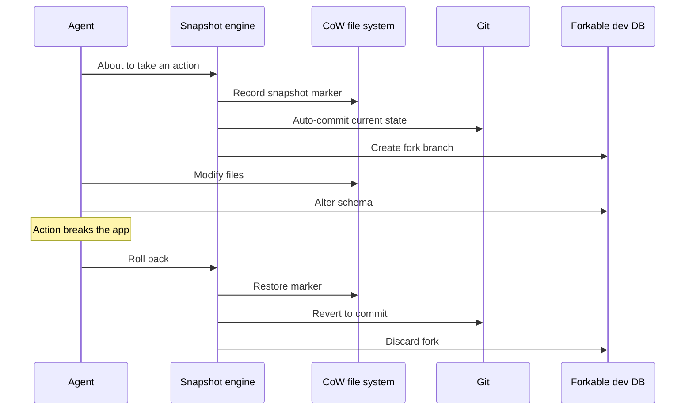
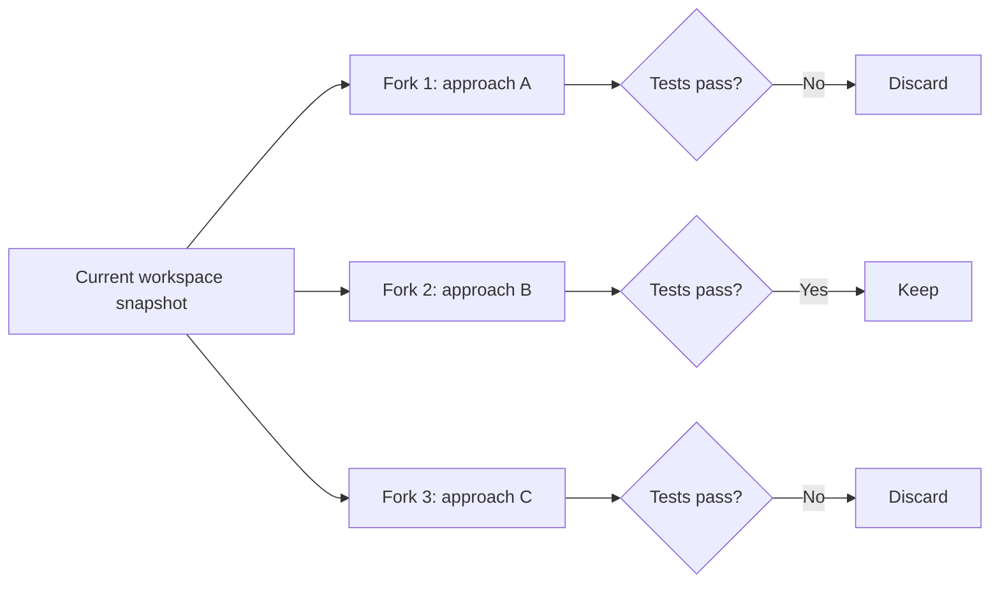
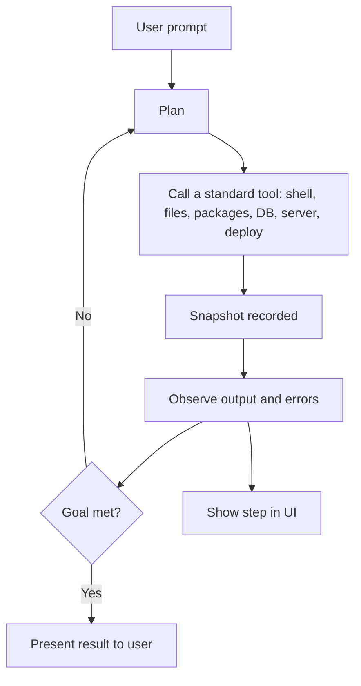
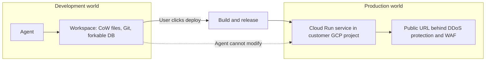

# Replit Agents: Full Cloud Environments, Isolation, and Reversibility

## Scope and framing

This explainer follows the supplied transcript, which describes how Replit built an AI agent that writes, runs, tests, and deploys software inside its own full cloud development environment. It uses the transcript as the backbone and adds well-established background on containers, copy-on-write storage, and agent loops where that clarifies the design. Claims about Replit's specific infrastructure choices (such as a Google Cloud project per customer, forkable PostgreSQL, and Cloud Run deployments) are as described in the transcript and have not been independently verified; implementation details may have changed. The diagrams are conceptual.

The transcript says that in 2024 Replit shipped an agent that does more than generate code: from a single prompt such as "Build me a calorie tracking web application", it writes the code, runs it, installs packages, provisions a database, tests the app, and deploys it to a public URL.

The architectural question behind this is one the transcript calls among the most interesting of the coming decade:

> How do you safely run untrusted code that an AI just wrote, at massive scale, while making the agent feel like it has a real computer?

Replit's answer begins with a single decision, and the rest of the architecture follows from it.

## 1. The central decision: a full environment, not a stripped-down sandbox

An AI agent that needs to execute code has two broad options.

### Option 1: A lightweight sandbox

Give the AI a constrained environment, such as a Python interpreter in a WebAssembly runtime, or a single container with a strict allow-list of operations.

- Fast to start, cheap, and relatively easy to secure because there is little inside to abuse.
- The transcript places many code-execution tools in this category.
- Much less capable. An agent that cannot install packages cannot build modern software; one that cannot start a database cannot build a real application; one that cannot run a long-lived server cannot test what it built.

### Option 2: A full environment

Give the AI an actual Linux machine: a real shell, file system, package manager, network access, a real PostgreSQL database, and a deployment pipeline. It is effectively a complete development workstation in the cloud that belongs to the agent for a session.

Replit chose option 2. Its reasoning, per the transcript: the unit of work is not "generate some code", it is "**ship a running app**", and shipping requires every tool a human developer uses. So each agent gets its own dedicated Replit workspace, the same kind a human user gets. **The agent is the user.**

## 2. What that decision commits you to

The transcript lists five requirements that follow once agents get full environments:

1. **Strong isolation.** Arbitrary code in one environment must never see or affect another user's environment. Agents will run odd commands, install random packages, and may be prompted to try to escape. Every attempt has to fail.
2. **Fast, cheap lifecycle.** Thousands of environments are created and destroyed daily. A new user should not wait minutes for provisioning.
3. **Complete reversibility.** Agents make mistakes: deleting files, corrupting databases, installing packages that break the build. Users must be able to undo cleanly and quickly.
4. **Isolated deployments.** When the finished app serves real traffic, it must be isolated from every other deployed app; otherwise one malicious prompt could harm the platform.
5. **A reliable agent.** The planning loop, tool use, and error recovery must be designed around this specific environment. **The agent and the infrastructure are one system.**

## 3. Four layers

The transcript describes the architecture as four layers, each a consequence of the central decision:

## 4. Layer 1: Isolation, assuming a hostile tenant

### The environment

A new Replit environment is a Linux container isolated using Linux kernel features and, per the transcript, hypervisor-level boundaries. Each environment has its own:

- File system.
- Process tree.
- Network namespace.
- Resource limits (CPU, memory, disk).

### A different threat model

On a traditional platform-as-a-service, the implicit assumption was that the typical tenant is a reasonably well-behaved developer trying to ship an app. Isolation had to stop accidents from spreading.

For AI agents that assumption no longer holds:

- The agent will run commands a developer would not.
- It will install packages a developer would not.
- The user behind the agent may be deliberately malicious, prompting it to break out, scan the host, or pivot into other customers' environments.

So isolation must assume a **hostile** tenant. The lightweight-sandbox approach sidesteps much of this because there is little inside to exploit; a full environment does not have that luxury.

### Defense in depth

The transcript describes Replit's approach as **defense in depth**:

- **Development environments:** sandboxed containers with strict resource limits, namespace isolation, and a hardened system-call boundary. As general background, restricting system calls (for example, with seccomp filters) and adding a hypervisor or user-space kernel layer (as in gVisor or Firecracker-style micro-VMs) are common ways to reduce the kernel attack surface exposed to untrusted code.
- **Deployments:** each customer's deployed apps run in a **dedicated Google Cloud project**, per the transcript including free-tier users.

### Borrowing the strongest boundary available

A cloud project per customer seems extravagant at first. Projects are heavyweight, with their own billing, quotas, and identity configuration. The transcript explains why Replit does it anyway: the **GCP project boundary** is the strongest tenant-isolation primitive Google Cloud offers. Within a project you must trust the project; across projects, isolation is enforced by Google's own infrastructure, the same boundary separating Google's customers from one another.

The reasoning: even if every other layer fails and a malicious workload escapes its container, the next barrier is a cloud provider's tenant boundary that has been heavily scrutinized by attackers and researchers.

## 5. Layer 2: The snapshot engine and reversibility

### Why reversibility is essential

The transcript is blunt: AI agents are not very reliable over long tasks. Even if each step is usually correct, errors compound over a 30-step task. By step 20, the agent may have deleted a needed file, changed a schema in a way that breaks the app, or installed a conflicting dependency, and the user may have no practical way to undo it by hand.

As a rough illustration of compounding (general arithmetic, not a Replit figure): if each step succeeds independently with probability 0.95, the chance that all 30 succeed is

$$
0.95^{30} \approx 0.21
$$

If users cannot recover from bad runs, the product is broken regardless of how good the good runs are. Replit's answer is the **snapshot engine**: every action the agent takes is reversible, back to the start of the session.

### Three kinds of state, three primitives

The agent touches three different kinds of state, and each needs a different mechanism.

#### File system: copy-on-write snapshots

The code lives on a file system backed by **copy-on-write (CoW)** storage.

- Taking a snapshot copies no data; it records a marker of the file system's state at that moment.
- Later writes go to new blocks; original blocks stay untouched and remain available for rollback.
- Snapshot cost is essentially constant, independent of project size, typically milliseconds.
- Rolling back means pointing the file system back to an earlier marker.

That makes it cheap to snapshot at every agent step.

#### Code history: automatic Git commits

Code changes are also tracked as a separate concern with **Git**:

- Every meaningful agent action creates a Git commit automatically in the background, so users get a complete history even if they never use Git themselves.
- Per the transcript, there is an **immutable backup remote**, so even a full file-system deletion does not lose history.
- Beginners get a single "go back to before that broke" button; power users get a full Git panel with branching, merging, and cherry-picking.

#### Database: forkable PostgreSQL

Databases are harder to snapshot than files. A running PostgreSQL instance has live connections, in-flight transactions, and an internal write-ahead log, so a naive file-level copy can capture an inconsistent state.

The transcript describes **forkable PostgreSQL** for development databases. Taking a snapshot creates a new **branch** that shares data with its parent until something writes to it, the same copy-on-write idea applied to database state. Rolling back discards the fork.

Critically, the development database is **architecturally separate** from any production database. The agent is never allowed to touch production data. It can break its dev database repeatedly; the data users care about is untouched. The dev database is meant to be disposable.

### Reversibility enables parallel attempts

With cheap forks, a further capability becomes possible: running **multiple agent attempts in parallel**. Each attempt runs on its own fork; the agent can try several approaches at once, keep the one that works, and discard the rest. The transcript calls this parallel sampling: exploiting the agent's non-determinism to get a better result by trying more than once. Products whose state model cannot fork cheaply cannot do this.

## 6. Layer 3: The agent loop

### Reason, act, observe

The transcript describes the Replit agent as built on a **ReAct-style loop**, now a standard pattern for tool-using agents:

1. **Reason** about the goal and what to do next.
2. **Act** by calling a tool.
3. **Observe** the tool's result.
4. Repeat until the goal is met.

### The same tools a human has

What distinguishes Replit is the tool set: exactly what a human Replit developer can do.

- Write and edit files.
- Run shell commands.
- Install packages.
- Create database tables.
- Start servers and check whether they work.
- Read errors.
- Deploy.

Some agent systems invent special-purpose primitives or hide messy parts of the environment. Replit's bet, per the transcript, is the opposite, for two reasons:

- **The model already knows these tools.** Language models are trained on large amounts of data showing humans using shells, file systems, and package managers. Custom tools would be unfamiliar.
- **The infrastructure is battle-tested.** The package manager, file system, database, and deployment pipeline have served human users for years, with known behaviors and failure modes. A custom agent-only infrastructure would have to discover its edge cases in production, with an AI triggering them.

### Transparency

Every action passes through the snapshot engine, is reversible, and appears in the UI as a clear message: installed this package, created this file, ran this command. The user can follow along and intervene.

The transcript notes that over time the single loop has evolved into a **multi-agent** architecture, with specialized agents for planning, coding, debugging, and deployment. The core principles remain: a real environment, real tools, and reversible actions.

## 7. Layer 4: Deployment and the dev/prod boundary

When the user is satisfied and clicks deploy, development and production must become different worlds.

| | Development | Production |
| --- | --- | --- |
| Goal | Flexibility for the agent | Stability for real users |
| Changes | Install anything, restart, break, fix | Locked down and predictable |
| State | Disposable, forkable | Protected |
| Isolation | Hardened container | Separate cloud project per customer |

Per the transcript, deployments run on **Google Cloud Run** within each customer's own GCP project. The deployed app gets a public URL, sits behind Google's DDoS protection and web application firewall, and scales with actual traffic. The development environment can be torn down or kept for further iteration.

The boundary between the two worlds is where the AI's freedom ends and the platform's guarantees begin. If the agent's mistakes could reach production, no one would let it work autonomously. Because dev can be rolled back and production is untouched, it can.

## 8. What the full-environment decision costs

The transcript is explicit about the trade-offs.

- **Operational complexity.** A cloud project per customer means managing the lifecycle of a very large number of projects: provisioning, quotas, billing, and cleanup, all automated and reliable. The transcript notes Replit had to build internal tooling for this and suggests most companies could not run it.
- **Compute cost.** Thousands of full environments per day, each with its own file system and database, cost far more than lightweight sandboxes. That cost must be absorbed in margins or passed to users.
- **Cold-start latency.** Full environments take longer to start than stripped-down sandboxes. Replit has optimized this, but the floor is inherently higher.
- **Failure surface.** Every tool is another way for the agent to fail. The snapshot engine must be essentially perfect or users lose work; isolation must hold or there is a security incident; planning must be good or the agent makes a mess with real capabilities.

The transcript concludes that for Replit the bet paid off, because the full environment is what lets the agent build real software instead of snippets. The general lesson: committing to a powerful capability means committing to pay its operational and engineering tax indefinitely.

## 9. Trade-offs summary

| Choice | Benefit | Cost |
| --- | --- | --- |
| Full environment per agent | Agent can build, test, and ship real apps | Compute cost, cold starts, larger attack surface |
| Hostile-tenant isolation with defense in depth | Contains malicious or buggy workloads | Complexity and overhead in every layer |
| Cloud project per customer for deployments | Strongest provider-enforced tenant boundary | Heavy lifecycle, quota, and billing automation |
| CoW file system, auto-Git, forkable DB | Instant, complete undo; parallel attempts | Snapshot engine must be flawless |
| Human-equivalent tool set | Model familiarity; mature infrastructure | Agent inherits all real-world failure modes |
| Strict dev/prod separation | Autonomy without risking production | Two environments and a handoff to maintain |

## Key takeaways

1. Replit's defining decision was to give the agent a full cloud development environment, the same kind a human gets, because the goal is shipping running apps, not generating snippets.
2. That decision forces hostile-tenant isolation. Replit uses defense in depth, and per the transcript places each customer's deployments in a separate Google Cloud project to borrow the provider's strongest tenant boundary.
3. Reversibility is what makes autonomy acceptable. Copy-on-write file-system snapshots, automatic Git commits, and forkable development databases let users undo any agent step quickly.
4. Cheap forks enable parallel agent attempts: try several approaches, keep what works, discard the rest.
5. Giving the agent the same tools a human uses exploits the model's training and reuses battle-tested infrastructure.
6. A strict boundary between a flexible, disposable development world and a locked-down production world is where the agent's freedom ends and platform guarantees begin.
7. Powerful capabilities carry permanent costs in compute, latency, operations, and failure surface.

The transcript's closing idea: when AI agents do real work in the cloud, the infrastructure underneath does more than the agent itself. The agent is a thin layer of intelligence on a thick stack of isolation, reversibility, and operational machinery. When designing an agentic system, start by asking what happens when the agent makes a mistake and what isolation guarantees are required, not only which model or prompt to use.
