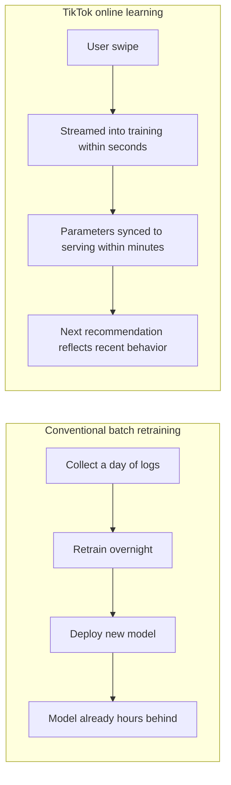
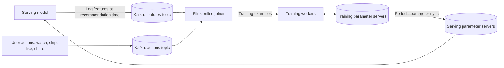
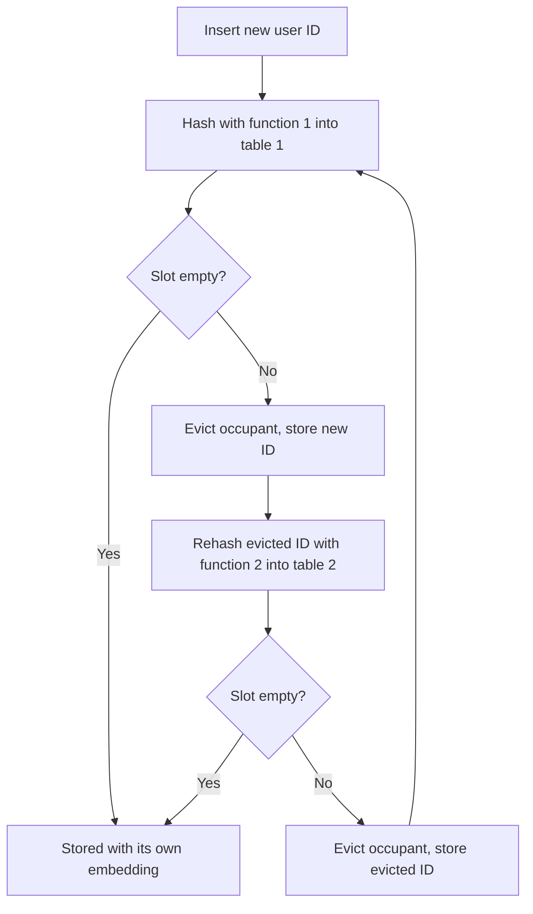
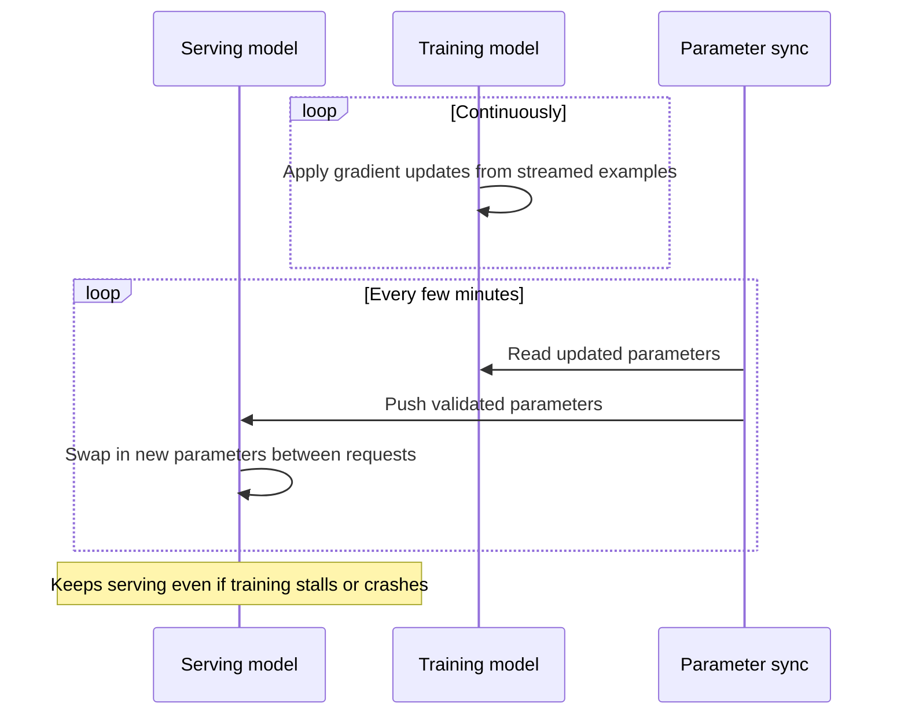
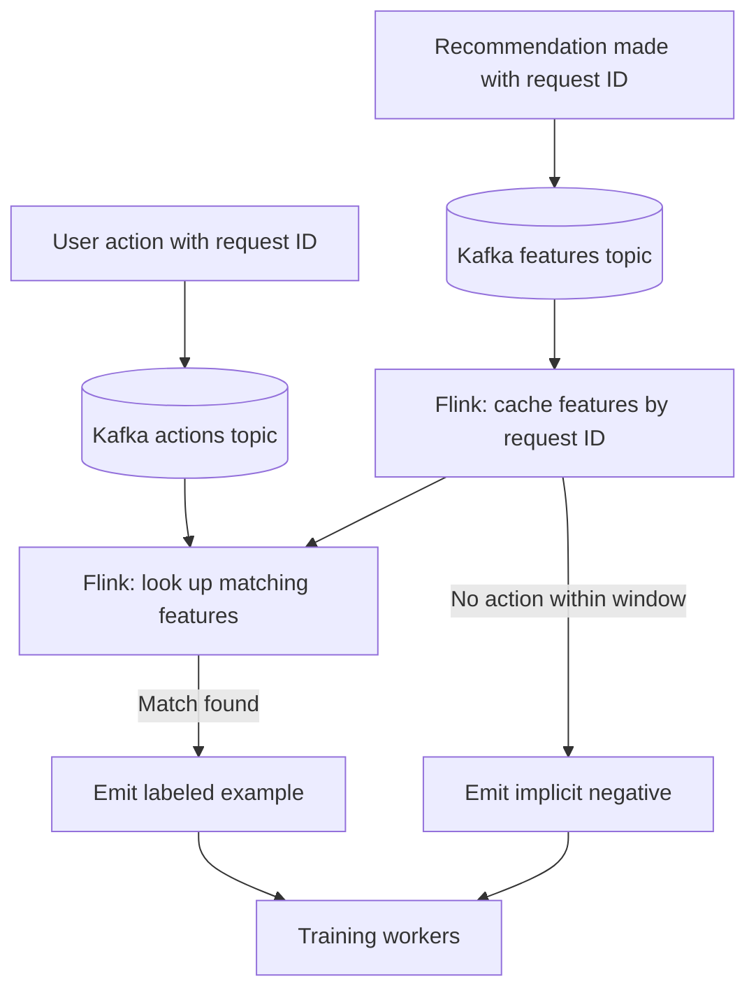
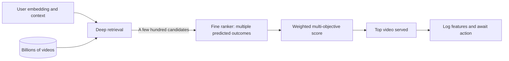

# TikTok Recommendations: Real-Time Online Learning with Monolith

## Scope and framing

This explainer follows the supplied transcript, which describes TikTok's recommendation system based on ByteDance's 2022 "Monolith" paper and related public engineering material. It uses the transcript as the backbone and adds well-established recommender-systems and distributed-training background where helpful. Figures such as the "30 to 40 minutes" to learn a new user's taste, daily upload volumes, comparisons with Netflix, Spotify, and YouTube, and latency targets are as reported in the transcript and have not been independently verified. The diagrams are conceptual and do not reproduce TikTok's exact production topology.

The transcript highlights one headline claim: TikTok can build an accurate model of a brand-new user's taste within roughly **30–40 minutes** of scrolling, while it characterizes other major platforms as needing days, weeks, or months. The transcript's argument is that this speed does not come from a smarter algorithm or better data scientists but from one **architectural** decision about how the model learns: **real-time online learning instead of batch retraining.**

Every other design choice described here, from how embeddings are stored to how user swipes reach the model and why two copies of the model run side by side, follows from that decision. The broader lesson applies to fraud detection, ad ranking, dynamic pricing, and any system with **non-stationary** data: when the world changes faster than the model is retrained, the model falls behind.

## 1. Why TikTok's problem is different

The transcript contrasts TikTok with earlier well-known recommenders, which were built for a slower world:

| Property | Earlier systems (as characterized in the transcript) | TikTok |
| --- | --- | --- |
| Catalog | Netflix: roughly 15,000 titles, changing weekly | Effectively unbounded; about 10 million uploads per day |
| Decisions per session | A movie per session; one decision in hours | About 20 videos in 10 minutes; 20 decisions |
| Content freshness | Mostly older items | A video hot four hours ago may already be stale |
| Taste drift | Months (for example, music taste) | Within a single session |

The property that breaks the standard playbook most is **in-session taste drift**. A user watching cooking videos gets an accidental finance video, watches it all the way through, and is now curious about finance. A system retrained overnight keeps showing cooking videos until tomorrow, by which point the user has left.

ByteDance's question, per the transcript: what if training and serving stopped being separate stages? What if the model were **always learning** while serving live users, so that behavior from one user becomes training signal for the model serving the next user within minutes?

## 2. The shape of the system

The transcript summarizes Monolith's architecture:

- Built on **TensorFlow's** distributed training framework, heavily modified.
- A **parameter server** architecture: model parameters are spread across many machines, and workers read and update them over the network.
- A custom, **collisionless embedding table** that grows dynamically.
- **Kafka** for ingesting features and user actions.
- **Flink** for joining features with actions in real time.
- **Training workers** that update parameters continuously.
- **Parameter sync** that pushes updated parameters to serving every few minutes.

The transcript's point is that each component exists to make real-time learning possible. Remove any one, and the system collapses back into an ordinary batch system.

## 3. Embeddings and the collision problem

### Users and videos as vectors

Modern recommenders represent each user and each item as an **embedding**, a vector of perhaps a few hundred numbers capturing taste or content. Roughly, the model's job is to match user embeddings with candidate video embeddings and find the best fits.

### The scale problem

With over a billion users and billions of videos, each with a vector of a few hundred floats, the **embedding table** has billions of rows. It cannot fit on one machine and must be sharded across parameter servers. More difficult still, the table **cannot have a fixed size**: new users and videos arrive every second, and the table must grow while the model is being trained and served.

### Why fixed-size tables fail

Standard embedding tables in frameworks like TensorFlow are pre-allocated to a fixed size, and IDs are mapped into it by hashing. When there are more IDs than slots, multiple distinct IDs map to the same slot and **share an embedding**. That is a **hash collision**.

The transcript illustrates this with two users with different tastes who collide and therefore receive the same feed. One gets mostly wrong recommendations; the other gets recommendations polluted with noise. Collisions degrade quality **silently**; they do not show up in metrics until users start leaving (churning).

ByteDance decided collisions were unacceptable: every user and every video must have its own embedding.

## 4. The collisionless embedding table

### Cuckoo hashing

Monolith's collisionless table is built on **cuckoo hashing**, named after the bird that pushes other birds' eggs out of the nest.

1. Maintain two hash tables with two different hash functions.
2. To insert a key, hash it with the first function. If that slot in table 1 is empty, place it there.
3. If it is occupied, **evict** the current occupant and place the new key.
4. Rehash the evicted key with the second function into table 2. If that slot is occupied, evict its occupant, and continue.
5. The displacements cascade until every key has its own slot.

Each key has exactly two possible locations, so lookups check at most two slots. As general background, if an insertion cycles for too long, cuckoo tables typically grow or rehash; with sufficient capacity, every key ends up in a unique slot.

### Keeping the table bounded

No collisions is not enough on its own: without limits, every user who ever signed up would occupy memory forever. The transcript describes two additional mechanisms:

- **Expirable embeddings.** Each embedding has a last-seen timestamp. If a user or video is inactive long enough, its embedding is evicted. If the user returns, a new embedding is created and relearned from new interactions. Keeping inactive users forever turns out to cost more than relearning them.
- **Frequency filtering.** IDs with very few interactions, often brand-new users or videos, carry too little signal to learn from and mostly add noise. They are kept out of the table until they cross an interaction threshold.

Together, cuckoo hashing, expiry, and frequency filtering keep memory bounded while giving every active, meaningful user and video its own collision-free representation.

## 5. Two models: one learns, one serves

### The conflict

Continuous training means the training model's parameters are updated at a very high rate. But the model serving users must be stable and must respond well within about 200 ms (per the transcript), billions of times a day. A model whose parameters change mid-request would behave unpredictably.

### The split

Monolith runs two copies:

- **Training model** on training parameter servers. It absorbs streaming updates constantly. It may hold unvalidated parameters, partial state, and experimental changes. It is a moving target.
- **Serving model** on serving parameter servers. It must be fast, reliable, and consistent. It serves the parameters it has, unchanged during a request.

A **parameter sync** bridges them: every few minutes, the latest validated parameters are pushed from training to serving. As general background, syncing can focus on the parameters that actually changed (for example, the embeddings of recently active IDs), which is far smaller than the whole model; less frequently changing dense weights can be synced on a slower cadence.

### Why this matters

The tempting design is a single model that is both trained and served. But the reliability requirements are incompatible. Training may fall behind, crash, or be experimented on; serving may not. If they are coupled, serving reliability limits training experimentation and vice versa. Decoupling them with an asynchronous sync means neither constrains the other.

The general principle from the transcript: **when two parts of a system have very different reliability requirements, decouple them with a buffer that absorbs the difference, and never make the reliable side synchronously depend on the unreliable side.**

## 6. The streaming data pipeline

### Two halves of a training example

Each training example needs:

1. **Features** of what was shown: category, creator, popularity at that moment, content embedding, and so on. These are known the instant the recommendation is made.
2. **The user's action**: watched fully, skipped after 2 seconds, liked, shared. This arrives later, anywhere from about a second to 30 seconds or more if the user rewatches.

Neither half is useful alone. Features without actions say what was shown but not how the user reacted; actions without features say how the user reacted but not to what.

### Kafka plus a Flink join

- Features are written to one **Kafka** topic when the recommendation is made.
- Actions are written to another Kafka topic when they happen.
- Kafka absorbs the firehose, letting each stream run at its own pace.
- A **Flink** streaming job performs an **online join**: it caches features in memory keyed by a unique recommendation ID; when an action arrives, it looks up the matching features and emits a complete training example.

### Windows and implicit negatives

The join uses a time window:

- If no action arrives within a reasonable window after the features, the example is emitted as a **negative**: the user implicitly ignored the video.
- Features that never find a match eventually age out.

The output is a continuous, clean stream of labeled examples feeding the training workers.

The transcript stresses that many explanations of TikTok focus on the model, which it describes as fairly standard for its time. The hard engineering is in the **data pipeline** that gets the right data to the model fast enough. The model learns; the pipeline makes learning possible.

## 7. Serving: retrieval, then ranking

The system cannot score billions of videos per request within about 200 ms. It splits the problem into two stages.

### Stage 1: Candidate generation (retrieval)

Retrieval narrows the entire catalog to a few hundred candidates likely to be relevant. It must be fast and approximate; missing some good videos is acceptable if most are captured. The transcript says TikTok uses a **deep retrieval** architecture, essentially a learned tree-like structure mapping a user embedding to candidate videos without scanning the whole catalog.

### Stage 2: Fine ranking

The ranker scores each candidate carefully, predicting several outcomes: probability of watching, completing, liking, sharing, and commenting. The best combined score wins.

### Multi-objective scoring

The final score is a weighted combination of predictions, with business weights per signal. The transcript's examples: a share might be weighted around five times a like because it signals more value; a complete watch of a longer video might outweigh a complete watch of a short one. Conceptually:

$$
\text{score} = w_{\text{watch}} \cdot \hat{p}_{\text{watch}} + w_{\text{like}} \cdot \hat{p}_{\text{like}} + w_{\text{share}} \cdot \hat{p}_{\text{share}} + w_{\text{comment}} \cdot \hat{p}_{\text{comment}} + \dots
$$

Adjusting weights lets the product team steer behavior, such as more diversity, higher quality, or less repetition, without retraining the model.

This two-stage pipeline is where the serving model is used on every request, while in the background the training model keeps learning from every other user's actions, ready for the next sync.

## 8. Implicit signals over explicit ones

Many recommenders lean on **explicit** signals: likes, comments, shares, follows. The transcript says TikTok deprioritizes these as primary signals and relies on **implicit** signals: behavior users produce without deliberate intent.

- **Completion rate** is the strongest. Watching a whole 15-second video is a strong positive; watching 7 of 10 seconds is nearly as strong; watching 1 of 15 seconds is a strong negative.
- **Rewatches** are weighted heavily. They are rare and suggest the user wanted to study or savor the content.
- **Subtle signals**: scroll velocity, pause duration, opening comments, visiting the creator's profile. Each is weak alone; across millions of users they form a high-resolution picture of taste.

Architecturally, implicit signals are **dense**: every user generates many per session. Explicit signals are **sparse**: most users never like or comment on most videos. A system trained mainly on implicit signals has orders of magnitude more data. The transcript's phrasing: the system is not reading your mind, it is reading your thumb, and behavior is harder to fake than a like button.

## 9. Relaxed consistency in training

Conventional distributed training often aims for strong consistency: all workers see the same parameter version, so gradients are computed on current values. Otherwise, gradients computed on stale parameters can make convergence behave oddly.

Monolith deliberately relaxes this. Workers may operate on slightly different parameter versions; parameter servers do not enforce strict ordering; a gradient may be computed on parameters a few seconds old.

The alternative, strict consistency across thousands of workers and parameter servers, would force every update to wait for the slowest participant, making real-time training impossible. The transcript says the quality penalty for seconds-old parameters is small.

The transcript's general framing: strict consistency is right when speed does not matter; eventual consistency is right when speed is the point. Choosing between them is part of senior engineering judgment.

## 10. What real-time learning costs

- **Custom infrastructure.** Default TensorFlow training loops, parameter servers, and data pipelines did not support real-time online learning, collisionless dynamic embeddings, or streaming feature joins at this scale. ByteDance built them and must maintain them.
- **Permanent operational complexity.** A continuously training production model has many continuous failure modes: training workers crash, parameter sync falls behind, Kafka backs up, the Flink joiner drops events under load, the embedding table fragments. Each must be detected and recovered automatically, because otherwise model quality degrades silently until users churn.
- **Reduced reproducibility.** When recommendations go wrong, the parameters that produced them may already have changed. The exact state cannot be replayed, only approximated, which slows incident response and makes root-cause analysis harder than with batch models.

The transcript concludes the bet paid off because the For You page is the product and the model is the For You page. Every minute removed from the learning loop compounds across a very large user base.

## 11. Trade-offs summary

| Decision | Benefit | Cost |
| --- | --- | --- |
| Online learning instead of batch retraining | Model tracks in-session taste shifts in minutes | Custom infrastructure; permanent operational load |
| Collisionless cuckoo-hashed embeddings | No silent quality loss from shared embeddings | Memory management complexity |
| Expiry and frequency filtering | Bounded memory; less noise | Returning users are relearned; new IDs wait for a threshold |
| Separate training and serving models | Serving stays stable through training failures | Sync machinery; serving lags training by minutes |
| Kafka plus Flink online join | Labeled examples within seconds | Windowing choices; risk of dropped or late events |
| Two-stage retrieval and ranking | Billions of items served within latency budget | Retrieval may miss good candidates |
| Implicit signals | Dense, honest training data | Harder to interpret; privacy and wellbeing considerations |
| Relaxed parameter consistency | Training keeps pace in real time | Slightly stale gradients; harder reasoning about convergence |

## Key takeaways

1. The speed of the feedback loop can matter more than model sophistication. Per the transcript, TikTok's edge comes from closing the gap between behavior and model update to minutes.
2. Batch and online training are different architectures, not different schedules. Pipelines, embedding tables, and parameter servers must be designed for real time from the start.
3. Collisionless, dynamically growing embeddings (cuckoo hashing plus expiry and frequency filtering) avoid silent quality loss at billion-ID scale.
4. When training and serving have different reliability needs, decouple them with an asynchronous buffer so serving never depends on training being healthy.
5. At scale, the hard problem is often data engineering: Kafka topics, streaming joins, and parameter servers, more than the neural network itself.
6. Two-stage retrieval and multi-objective ranking make billion-item recommendation feasible and steerable.
7. Dense implicit signals such as completion and rewatches carry far more information than sparse explicit likes.
8. Decide which consistency to give up. Monolith trades strict parameter consistency for real-time learning.

The transcript's closing lesson: when the world being modeled changes faster than the model can be retrained, the model loses. Real-time systems close that gap, at a permanent cost in engineering effort, operational complexity, and debuggability.
