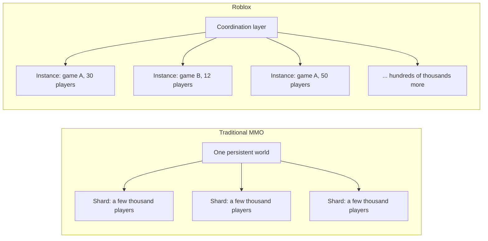
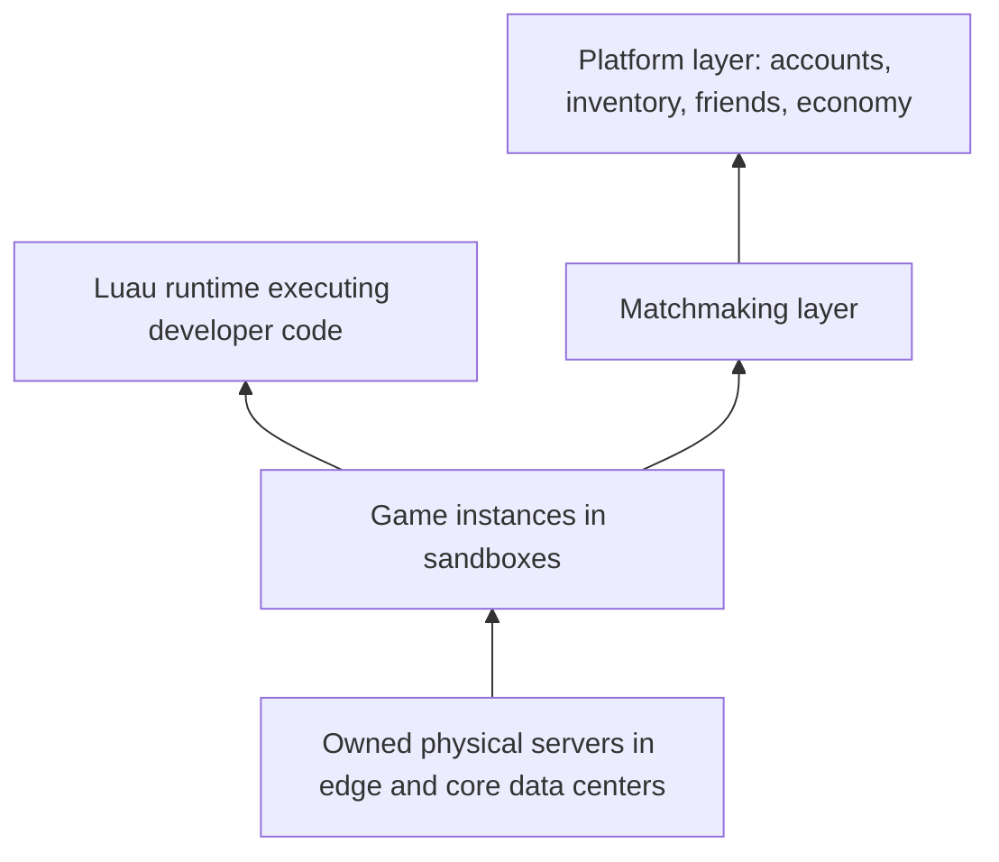
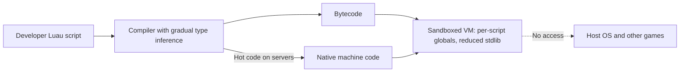
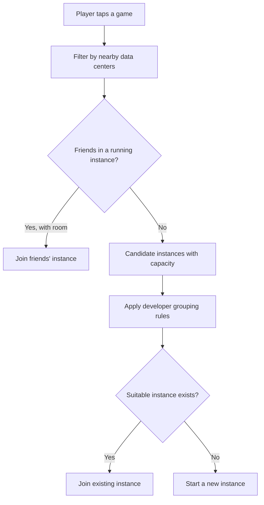
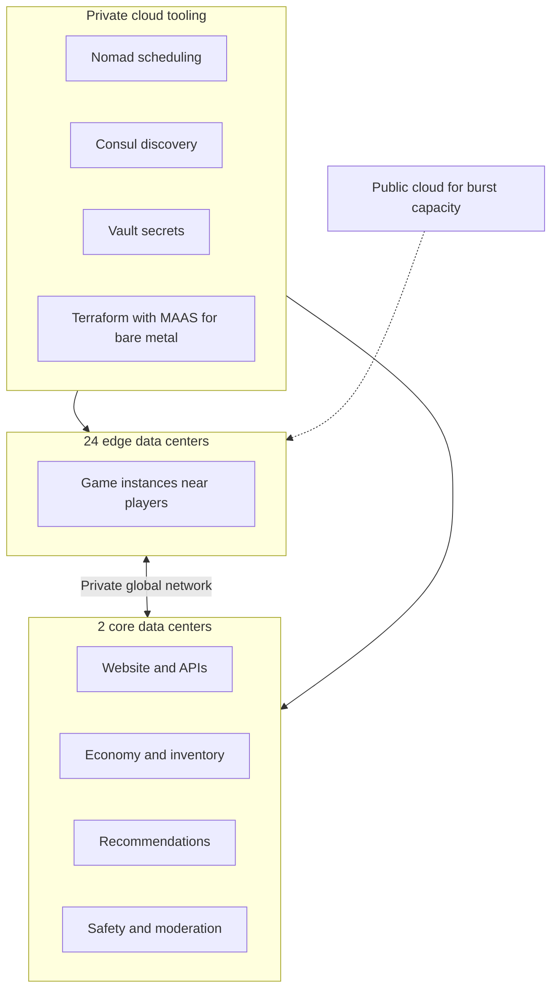
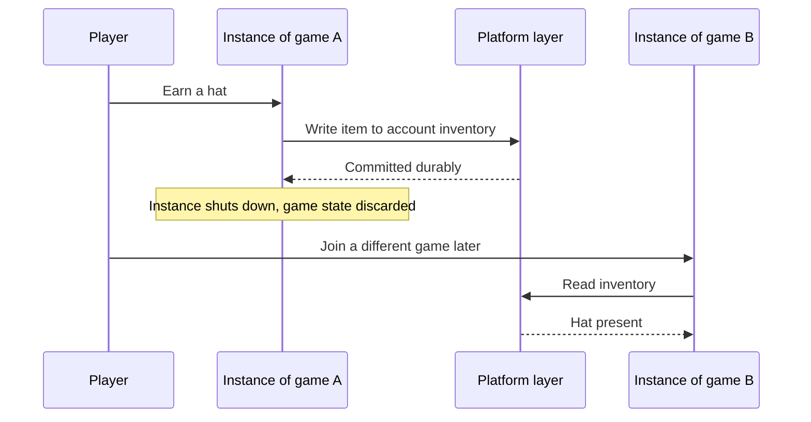
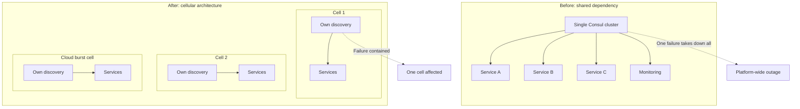

# Roblox Scaling: Tiny Instances, Smart Coordination, and Owned Infrastructure

## Scope and framing

This explainer follows the supplied transcript, which explains how Roblox handles tens of millions of concurrent players by making each game session a small, disposable server and concentrating engineering effort on the coordination layer above it. It uses the transcript as the backbone and adds well-established distributed-systems background where helpful. Figures such as the 47 million concurrent-user peak, server counts, data center counts, cost ratios, request rates, and outage duration are as reported in the transcript and have not been independently verified. The diagrams are conceptual and are not exact reproductions of Roblox's production systems.

According to the transcript, in August 2025 Roblox reached about **47 million** concurrent players, up from a peak of about 10 million a year earlier, with most of the jump driven by a single viral game, *Grow a Garden*, which roughly doubled the platform's peak within about two months. For comparison, the transcript notes that traditional MMOs run a few thousand players per shared world, and that EVE Online, famous for running its whole player base in one universe, peaks around 100,000.

To reach this scale, the transcript says Roblox built its own programming language, its own private cloud on hardware it owns, and an architecture that runs opposite to how most multiplayer games work. At the heart of it is one decision made around 15 years ago: **the game server is not the thing you scale; the layer that decides which server runs which game for which players is.**

## 1. How traditional multiplayer games scale

Large multiplayer games since World of Warcraft follow a common pattern:

- The product is **one shared, persistent world** with many players moving through it.
- To carry the load, the world is split into **shards**: copies of the world, each on its own servers, each holding a few thousand players.
- The world persists: characters stay where they logged off.
- Everything is custom-built for one game: its combat, physics, and crowded hot spots like cities and boss fights.

This works well for a single game whose players want a shared world, and studios have refined it for decades. But it tends to cap out at a few thousand players per shard.

## 2. Why Roblox could not work that way

Roblox is not one game; it is a platform hosting millions of games made by different developers, each with different rules, physics, and sizes. There is no single world to engineer. The question was never "how do we make our world bigger?" but "how do we run millions of different games at once without hand-building a world for each?"

### The answer: one small server per session

Each game session gets its own small, fresh server. When a group of friends opens a game, the platform starts (or finds) a server for a few dozen players. It lasts for that session; when everyone leaves, it shuts down and its resources return to the pool. Roblox calls these servers **instances**.

- No shared world and no shards.
- Hundreds of thousands of instances running at once.
- Each instance runs a single developer's game for a small group.

The transcript's summary: break the world apart so completely that the only remaining problem is **coordination**. Traditional games make servers big and coordination easy. Roblox makes servers tiny and disposable, and coordination becomes the real product.

## 3. The overall shape

From the bottom up, the transcript describes:

1. **Physical servers** Roblox owns, in data centers worldwide.
2. **Game instances** running on those servers, hundreds of thousands at a time, each executing one developer's game inside a **sandbox** that prevents one game's code from touching another's.
3. **Luau**, Roblox's own language (forked from Lua), in which game code is written.
4. A **matchmaking layer** that decides which instance each player joins.
5. A **platform layer**: long-lived storage and services for accounts, inventories, friends, the economy, and anything that must outlive a session.

## 4. The instance

An instance is a single server process running one developer's game.

- The developer sets a **player cap**, typically somewhere between 10 and 200.
- The instance holds the entire game state **in memory**: player positions, what they hold, and the state of every object.
- It runs physics and game logic on a fixed **tick** and streams updates to every player's device.

### Short-lived by design

Instances barely live compared with ordinary servers. One starts when a game needs more room, runs for a session (perhaps 20 minutes for a quick match or a couple of hours for something longer), and shuts down when the last player leaves, discarding everything it held. Instances do not talk to one another. Nothing at the top tracks all 47 million players in one place.

### Smallness is the feature

- Each instance runs on a slice of commodity hardware.
- Starting one is quick; killing one costs almost nothing.
- When an instance crashes, it affects only the few dozen to hundred people inside it. They reconnect and land in a new instance within seconds.

Failure stays contained because the thing that failed was small and nothing else depended on it. Roblox avoids the years of work traditional games spend splitting worlds, migrating players between shards, and keeping a giant persistent world alive.

## 5. Luau: making untrusted code safe and fast

### The problem

Every game on Roblox is written by someone else: millions of developers, many of them children, some actively trying to break things. That code runs on Roblox's servers and on every player's device, right next to things it must never access: other users' data, other games, and the operating system. Roblox needed a language in which untrusted code runs fast but **cannot escape its box**. The transcript says no mainstream language was built for that.

### Luau

Roblox forked **Lua 5.1** into **Luau**, shipped it across the platform in 2019, and open-sourced it in 2021. Per the transcript:

- **A rewritten interpreter.** The interpreter was rewritten in C++. Stock Lua was not fast enough; LuaJIT, the obvious fast option, did not support the game consoles Roblox ships on and was hard to maintain. The new runtime approached LuaJIT's speed without using it.
- **Per-script isolation.** Each script gets its own global table, so one script cannot see or modify another's globals.
- **A reduced standard library.** Everything that could touch the system or escape the sandbox was removed, including a garbage-collection hook that was bad for both isolation and performance.
- **Memory safety.** The implementation is designed so that a malicious script cannot use a memory bug to break out and execute native code. The transcript calls this the line between a sandbox and a sandbox that holds up against active attackers.

### Gradual typing

Roblox developers range from children writing their first script to studios maintaining very large codebases. Forcing types on beginners is unacceptable; leaving huge games untyped is also unacceptable. Luau's type system is **gradual**: add annotations where wanted, omit them elsewhere, and let the compiler infer what it can.

### Native code generation

In 2024, per the transcript, Roblox shipped **native code generation** to its servers. Normally Luau runs as bytecode in a VM; with native codegen, hot scripts are compiled to machine code, with numeric-heavy code running up to two to three times faster. Type annotations feed the compiler, so more type information produces better machine code. The type system became a performance tool, not just a linter.

## 6. Matchmaking: the real product

When a player taps a game, the matchmaker must place them in an instance before the game even opens: either an existing instance with room or a new one. The transcript lists five factors weighed at once:

1. **Latency.** Prefer the data center closest to the player. Per the transcript, Roblox runs game servers in 24 edge locations for this reason.
2. **Friends.** If friends are already playing, place the player in their instance.
3. **Instance load.** Among instances that pass the first two checks, which have room? A full instance is out; a nearly full one may be a poor choice if more friends are about to join.
4. **Developer rules.** Some games group players by region; others mix them. The matchmaker follows the developer's settings.
5. **New or existing.** If nothing fits, start a new instance. But new instances cost money; starting one for everyone would leave thousands of half-empty servers burning compute.

All of this happens in under about 100 ms, many times per second per popular game, across thousands of games simultaneously.

The transcript argues this matchmaker, not the game engine, is the real product. It is a real-time scheduling problem: a huge pool of interchangeable servers, demand shifting minute to minute, and placements that must be right on all five dimensions at once. Every wrong decision is felt by a player: the wrong data center means lag; the wrong instance separates friends, and they leave.

## 7. Owning the infrastructure

### Scale of the fleet

Most companies of this size run on AWS, Google Cloud, or Azure. The transcript says Roblox mostly does not. It runs **more than 800,000 servers** it owns:

- **24 edge data centers** run game instances close to players.
- **2 core data centers**, much larger, run the website, recommendations, the economy, safety filters, and other central services the edges depend on.
- A **private global network** connects them, and the edge sites also act as a protective layer in front of the core.

### Why not the public cloud?

The transcript's answer is cost, specifically **network** cost. Game servers push enormous amounts of traffic, and Roblox has said public cloud networking would cost up to **10 times** what its own hardware costs for this workload. After a major outage in 2021, the transcript says Roblox invested about **$400 million** in a new data center in Virginia. It still uses public cloud, but mainly to **burst** when it runs out of its own capacity.

### A private cloud that feels like a public one

Owning hardware usually means losing cloud-style ergonomics. Roblox built them back:

- **Nomad** schedules containers onto machines.
- **Consul** provides service discovery.
- **Vault** manages secrets.
- A custom **Terraform** provider for **MAAS** (Metal as a Service) lets physical servers be provisioned with the same infrastructure-as-code workflow used for cloud VMs.

The result is a private cloud on owned metal that, to engineers, mostly feels like a public one.

## 8. Two kinds of state, treated differently

The transcript describes a key data decision that keeps instances cheap.

- **Game state**: what is happening in the current match, such as positions, health, and score. It matters only during the session. It lives in the instance and dies with it, and that is correct: nobody expects a shot fired five minutes ago to persist after the match.
- **Platform state**: accounts, inventory, Robux balance, friends, purchases. It must survive indefinitely and be consistent across every game. It lives in the core data centers in storage built never to lose data.

When a player earns an item in one game, it is written to their account in the platform layer. An hour later in another game, the inventory is read back and the item is there. **Instances never own the inventory; they ask the platform layer.**

Many systems try to protect all data carefully everywhere. Roblox does the opposite: almost everything is disposable, and durability effort is concentrated in one layer. The general principle from the transcript: **when some data must live forever and some need not, do not protect it all the same way.** Decide what must survive, put it in a layer built for that, and let everything else be cheap.

## 9. Safety at scale

A large share of Roblox's players are children, and everything on the platform, including games, chat, images, and audio, is user-generated. That makes moderation a distributed-systems problem in its own right. According to the transcript:

- The text filter alone handles around **250,000 requests per second**, using large-model inference on every message rather than a word list.
- Roblox runs **more than 300** separate AI inference pipelines in production.
- Much of the engineering is splitting work between GPUs and CPUs to control cost, and much of it has moved onto Roblox's own hardware for control over latency and privacy.

## 10. The 2021 outage and cellular architecture

### What happened

In October 2021, per the transcript, the entire platform was down for about **73 hours**. The cause was not an attack or a traffic flood. All back-end services relied on a **single Consul cluster** for service discovery. Enabling a new Consul feature under Roblox's load caused heavy contention, which triggered a severe performance problem in the storage layer Consul used underneath. Because everything shared that one cluster, everything failed together, and the monitoring that would have diagnosed the problem depended on the same failing systems. The team spent days partly blind.

The transcript notes this resembles many large outages: one shared dependency quietly sitting beneath everything.

### The response: cells

The outage reshaped how Roblox builds its back end. It moved toward a **cellular architecture**. A **cell** is a self-contained slice of infrastructure with its own dependencies, so a failure inside one cell stays inside it rather than taking down the platform. It is the same instinct as small game instances, applied to the back end: **make the blast radius small by design.**

Cells also make cloud bursting cleaner. At peak, the matchmaker can place players into cloud-hosted edge cells the same way it places them into cells on owned hardware, without caring which is which.

## 11. Operating for viral spikes

Roblox's traffic has a distinctive shape: the weekly peak (weekends) is predictable to the hour, but its **size** is not. A single game can go viral and double platform load within days; the transcript mentions another popular game going from nothing to about a million concurrent players almost overnight.

Roblox, per the transcript, runs a public weekly rhythm:

- **Monday:** review what broke.
- **Tuesday:** plan capacity.
- **All week:** chaos testing, deliberately killing parts of the live system to confirm failures stay contained.
- **Friday:** provision extra servers for the weekend wave.

The whole design rests on the promise that failures stay small. The only way to trust that promise is to keep breaking things deliberately and confirm that it holds.

## 12. Trade-offs

- **No single shared world.** Players are deliberately split across instances. A game can have huge total concurrency but never all players in one space.
- **The matchmaker is now the critical point.** One instance dying affects a few dozen players; the matchmaker failing means nobody can start a game. Reliability pressure removed from instances concentrates in coordination.
- **Owning the cloud means owning everything.** Hardware purchases, data center operations, and the weekly capacity cycle are permanent responsibilities. When something like the 2021 failure happens, there is no provider to call.
- **Custom language.** Luau provides safety and speed but must be maintained by Roblox indefinitely.
- **Moderation cost.** Hundreds of inference pipelines at very high request rates are a large, ongoing cost center.

## Key takeaways

1. How work is divided matters more than how big one piece can be made. Roblox scales the layer that runs very many small game sessions rather than one giant world.
2. Tiny, disposable instances make failure cheap: a crash affects a few dozen players who reconnect in seconds.
3. Running untrusted code safely is a language and runtime problem. Luau provides per-script isolation, a reduced standard library, memory safety, gradual typing, and native code generation.
4. Matchmaking, balancing latency, friends, load, developer rules, and cost in under about 100 ms, is the real product.
5. The cloud is a default, not a law. For Roblox's network-heavy workload, owned hardware was reported as up to ten times cheaper, and tooling made it feel like a public cloud.
6. Separate disposable game state from durable platform state, and concentrate durability effort in one layer.
7. Shared dependencies create the largest outages. The 2021 Consul failure drove a move to cellular architecture with small blast radii.
8. A promise about failure containment means little until it is tested; continuous chaos testing is how Roblox verifies it.

The transcript's closing lesson echoes Kubernetes and serverless: platforms that reach extraordinary numbers often do so by shrinking the unit of work until they can run as many copies as they need. When the only option seems to be making one thing bigger, look for the version where it is made small and run many times.
