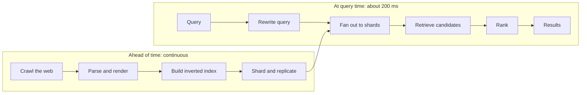
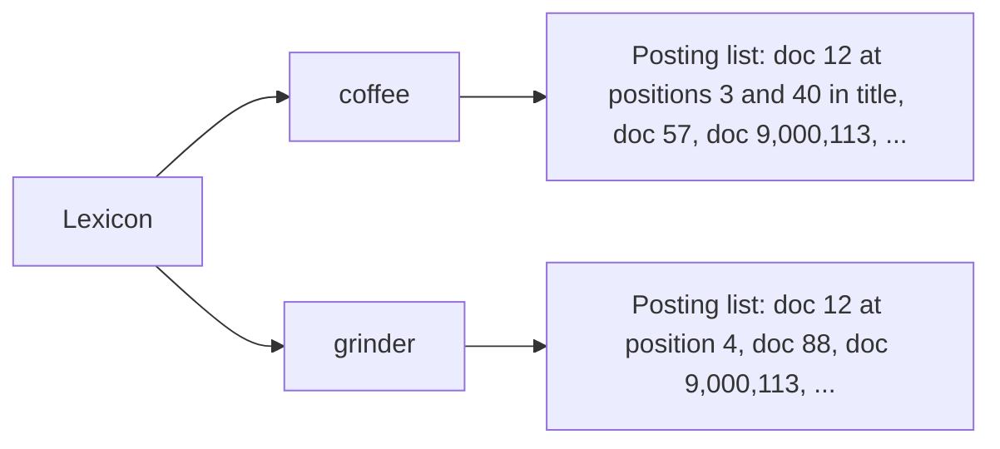
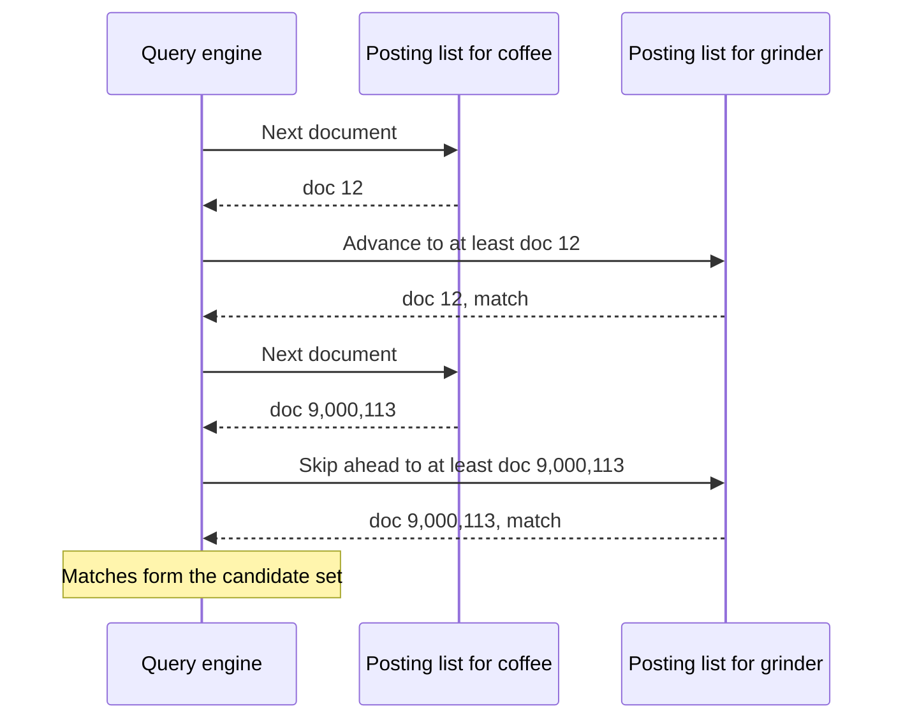
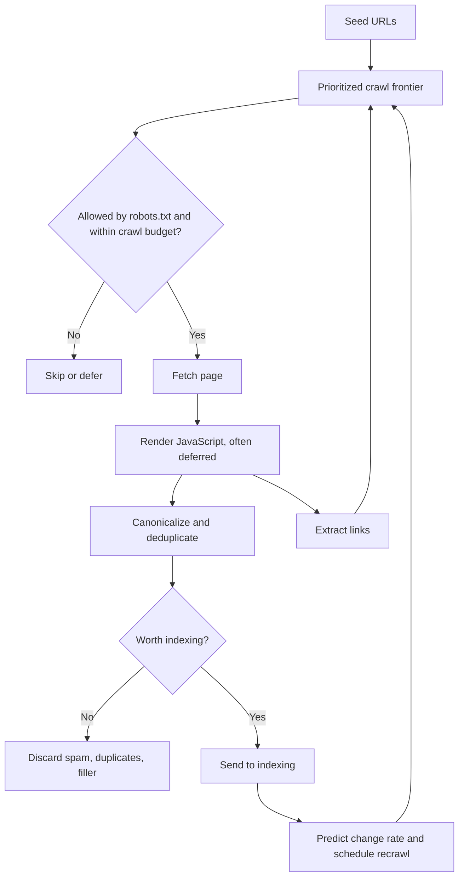
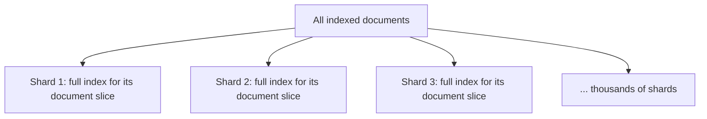
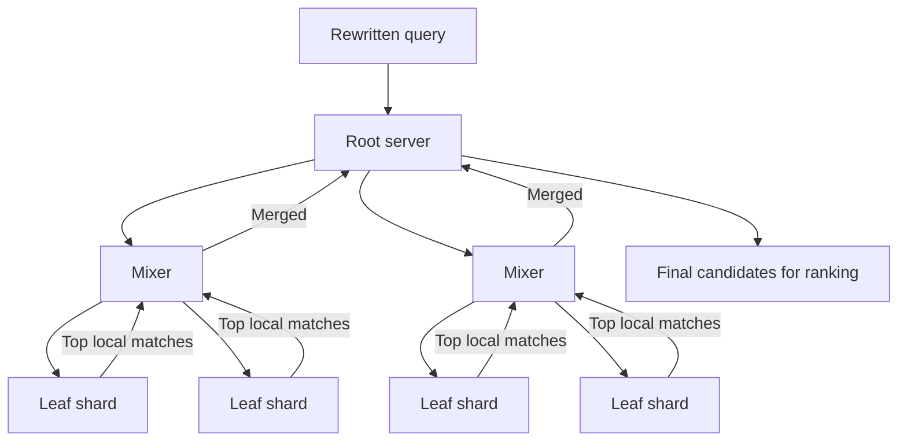
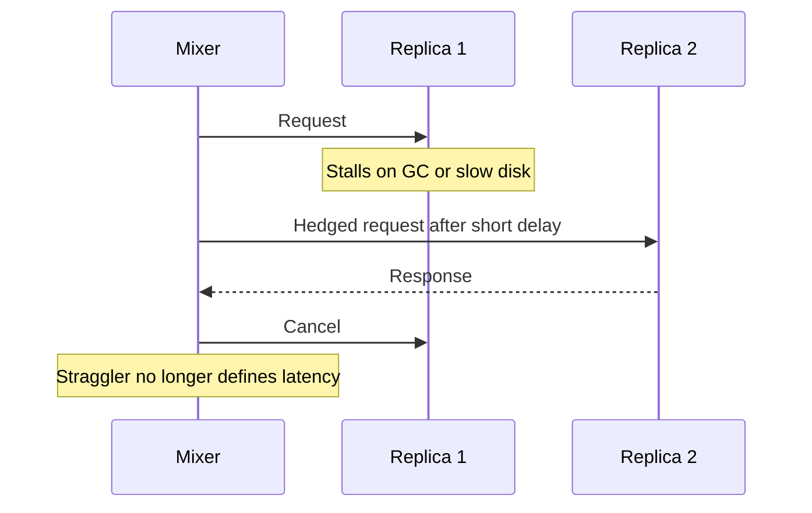
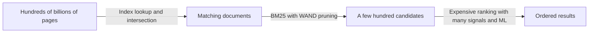
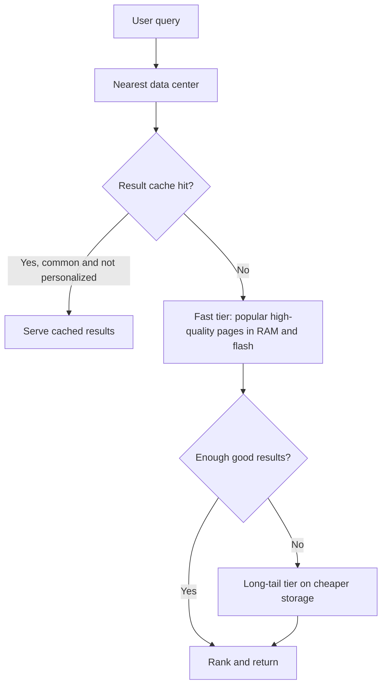

# Google Search: Doing the Heavy Work Before the Query

## Scope and framing

This explainer follows the supplied transcript, which describes how Google Search returns answers from an index of hundreds of billions of pages in roughly 200 milliseconds. The transcript draws on Google's published work, including the Google File System, MapReduce, Bigtable, PageRank, and "The Tail at Scale" papers. This document uses the transcript as its backbone and adds widely known information-retrieval background where helpful. Figures such as index size, query volume, machine counts, and the share of never-seen queries are as reported in the transcript and have not been independently verified. The diagrams are conceptual and are not Google's actual production topology.

The transcript opens with an apparent impossibility. A search returns in about **200 ms**, yet it runs against an index of **more than 100 billion pages** and **over 100 petabytes** of data. Reading that much data in a fifth of a second is physically impossible, on one machine or across a data center. So Google does not do it. **The search has effectively already happened, days or weeks before the query is typed.**

The one-sentence summary from the transcript:

> Do all the heavy work ahead of the query, and never during it.

That decision shapes everything else: how the web is crawled and stored, why one search reaches roughly a thousand machines, why finding candidate pages is the easy part while ordering them is the hard part, and why the whole system rests on one of the largest precomputed structures ever built. The transcript addresses this to back-end engineers, platform engineers, SREs, and anyone who has faced a slow query and been tempted to buy a bigger machine.

## 1. Why you cannot search the web at query time

A naive search for "best coffee grinder" would read through the web looking for matches: over 100 petabytes, more than 100 million gigabytes. Even spread across thousands of machines, that takes orders of magnitude longer than the latency budget. This is not a tuning problem; it is physics.

If the web cannot be read at query time, the only option is to read it **once, in advance**, and turn it into something that can be looked up instantly. The rest of the system exists to do exactly that.

## 2. The inverted index

### Forward vs. inverted

There are two natural ways to organize documents:

- **Forward index:** for each page, store the words on it. Answering "which pages contain *coffee*?" means opening every page, which is the slow thing we are avoiding.
- **Inverted index:** for each word, store the pages that contain it. The word *coffee* points directly to a list of every page containing it.

The transcript's analogy is the index at the back of a textbook. You do not reread the book to find every mention of "mitochondria"; you look it up and get page numbers. Google built that for the whole web.

### Tokenization and the lexicon

Before words become index entries, they are **tokenized**: split into terms, lowercased, and normalized, so that forms like *running*, *ran*, and *run* can map to a common root. Every term lives in a giant dictionary, the **lexicon**, which maps it to the location of its data. The lexicon is the front door; the lists behind it hold the real data.

### Posting lists

Each term's list is a **posting list**: every document containing the term, along with more than just a document ID:

- **Positions** of the term in the document, which make phrase matching possible (distinguishing the phrase "coffee grinder" from "coffee" and "grinder" far apart).
- **Where** it appeared: title, heading, body.
- Other features useful later for judging match quality.

### Compression

Posting lists are compressed aggressively:

- Document IDs are stored in **sorted order**.
- Instead of full IDs, each entry stores the **gap** from the previous ID (**delta encoding**). Gaps are small numbers.
- Small numbers are packed densely with schemes such as **variable-byte** and **group varint** encoding.
- Document IDs can be **assigned deliberately** so that related, high-quality pages cluster together, keeping gaps small.

At 100+ petabytes, compression is not optional; it determines whether the working set fits in fast memory.

$$
\text{IDs } [1000, 1003, 1010, 1011] \;\rightarrow\; \text{gaps } [1000, 3, 7, 1]
$$

### Skip pointers

Posting lists also include **skip pointers**, signposts that let a traversal jump ahead in the list instead of visiting every entry.

## 3. A search is a lookup and an intersection

For the query "coffee grinder", the system fetches the posting lists for *coffee* and *grinder* and **intersects** them: the pages on both lists form the candidate set. No pages are scanned and the web is not read.

Skip pointers make the intersection fast. If one list's next entry is document 9,000,000, the other list can jump straight to that neighborhood instead of checking everything in between.

The transcript's point: at its core, a search is not a search; it is a lookup of precomputed lists and a fast overlap. Everything else is the engineering required to do that at internet scale.

## 4. Crawling: getting a copy of the web

### Googlebot and the frontier

To build posting lists, Google first needs the web's content. **Googlebot** fetches a page, extracts its links, adds them to a queue of URLs to fetch, and continues indefinitely. It began from a small seed set long ago and has been following links since.

The queue is not first-in, first-out. It is a **prioritized frontier**, so important and frequently changing pages are fetched ahead of obscure, static ones.

### Politeness and hints

- **robots.txt** defines what a crawler may fetch on each site.
- A per-site **crawl budget** paces requests so the crawler does not overwhelm a server.
- **Sitemaps** let sites list their URLs directly.
- **Canonicalization** recognizes when many URLs represent the same page, so it is stored once.

### Rendering JavaScript

Much of the modern web does not exist until JavaScript runs. Google renders pages in a **headless, Chrome-based rendering service**, often as a deferred second pass, because running a browser for billions of pages is very expensive.

### Recrawl scheduling

The web does not stand still. A news homepage changes every few minutes; a page from years ago may never change. Google predicts how often each page changes and recrawls fast movers frequently while rarely revisiting stale ones.

### Scale and selectivity

The transcript cites dramatic improvements over time: crawling and indexing 50 million pages took about a month in 1999 and under a minute by 2012. It says Google has discovered well over 30 trillion unique URLs, with some counts past 100 trillion. Most are not kept: duplicates, spam, auto-generated filler, dead links, and infinite URL spaces such as calendars. The searchable index is in the **hundreds of billions**. Indexing the internet means keeping the part worth answering questions from and discarding the rest.

## 5. Building the index, and the infrastructure it created

Turning crawled content into posting lists required infrastructure that later reshaped the industry, per the transcript:

| System | Role in search | Broader legacy |
| --- | --- | --- |
| Google File System, later Colossus | Store crawled content across thousands of machines | Inspired distributed file systems such as HDFS |
| MapReduce | Process the corpus in parallel to build the index | Inspired Hadoop and the big-data ecosystem |
| Bigtable | Hold large structured datasets, including index data | Inspired wide-column stores such as HBase |
| Borg | Schedule work across the cluster | The system Kubernetes was modeled on |

The transcript's framing: the big-data movement is, in a real sense, the plumbing Google wrote for its index, released into the world.

### Anchor text

The indexer does not only index words on a page. It also indexes the **anchor text** of links pointing to that page. If thousands of pages link to a site with the words "best coffee grinder", those words are attributed to the target, so a page can rank for terms it does not itself contain.

### From batch rebuilds to incremental updates

The original indexer rebuilt the index in large batches, so a new page might not appear until the next full pass. As the web sped up, that delay became unacceptable. Around 2010, per the transcript, Google shipped **Caffeine**, built on **Percolator**, an incremental processing system that updates the index with small transactions instead of full rebuilds. New content can appear within minutes. The approach that produced a working index was not the one that met the next level of freshness demand.

## 6. Sharding by document

A 100+ petabyte index must be split across many machines, and **how** it is split matters.

- **Term-partitioned:** each machine owns posting lists for a range of terms (for example, A–C). A multi-word query touches a few machines, but those machines must exchange long lists, and popular terms create hot spots.
- **Document-partitioned:** the web is divided into thousands of slices of documents, and each shard holds a **complete inverted index for its own slice**.

Google uses **document partitioning**. Each shard can independently answer "which of *my* pages match this query?"

## 7. Serving a query

### Query rewriting

Before the index is touched, the query is rewritten:

- Spelling is corrected.
- Words are expanded into variants and synonyms, so "how to speed up a slow laptop" and "make my computer faster" can reach similar pages.
- Entities are recognized using Google's **Knowledge Graph**, a structured database of people, places, and things, so that "jaguar top speed" is understood as the animal, not the car.

The terms actually looked up are a cleaned, expanded, disambiguated version of what was typed.

### Scatter-gather through a tree

With document partitioning, no single shard can answer a query; the best result could be in any shard. So the query goes to **all** of them: **scatter** the question, **gather** the answers, merge, and keep the best.

The fan-out is not one machine contacting a thousand others, which would make that machine the bottleneck. It is a **tree**: a root server sends the query to intermediate **mixer** servers, which send it to **leaf** servers holding shards. Results flow back up the same tree, being merged at each level.

The transcript says a single search engages on the order of **a thousand machines** for a fraction of a second. It has to: the only way to search every slice in time is to search them all at once.

## 8. The tail at scale

Fanning out to a thousand machines creates one of the most important problems in large systems, described in Google's paper "The Tail at Scale". When a response waits on a thousand machines, it waits for the **slowest** one, not the average. Across a thousand machines, some are always having a bad moment: a garbage-collection pause, a busy neighbor, a slow disk. Even if a typical shard answers in 5 ms, there is almost always a straggler at 50 ms.

As a general illustration, if each machine independently has a 1% chance of being slow on a request, the probability that at least one of 1,000 is slow is:

$$
1 - (1 - 0.01)^{1000} \approx 0.99996
$$

In other words, nearly every request would hit a straggler.

### Hedged and tied requests

The remedy is deliberate redundancy:

- **Hedged requests:** send the same request to more than one replica (often after a short delay) and use whichever answers first.
- **Tied requests:** send to multiple replicas but let them cancel each other as soon as one begins executing, so the duplicate work is mostly avoided.

Doing redundant work on purpose sounds wasteful, but it prevents the straggler from setting the overall speed. At this scale, the transcript calls it not an optimization but the only way the 200 ms promise survives.

## 9. Cheap on all, expensive on few: retrieval vs. ranking

Google splits query processing into two phases with very different costs.

### Phase 1: Retrieval

Shards use the index to find matching candidates, scoring them cheaply and roughly with classic formulas such as **BM25**, which weigh how often and where terms appear. That is enough to discard obvious poor matches. Even within a posting list, not everything is scored: **dynamic pruning** algorithms such as **WAND** and **Block-Max WAND** skip whole blocks of documents that cannot make the top results, so only a fraction of each list is touched.

### Phase 2: Ranking

The small surviving set is analyzed carefully and expensively to put it in the best order.

The principle: never run expensive logic on 100 billion pages. Run the cheap thing on everything to get down to a few hundred, then the expensive thing on those few hundred. **Cheap on all, expensive on few.**

## 10. Ranking: from PageRank to machine learning

### PageRank

Google treats a link as a vote of confidence. A page many others link to is probably valuable, and a vote from an important page counts more than one from an obscure page. That is **PageRank**.

The transcript's picture is a **random surfer** who clicks links forever, with a small probability of jumping to a random page instead (the **damping factor**). A page's PageRank is how often the surfer lands on it. It is computed by iterating over the web graph until values converge. As general background, the classic formulation is:

$$
PR(p) = \frac{1-d}{N} + d \sum_{q \to p} \frac{PR(q)}{\text{outlinks}(q)}
$$

where $d$ is the damping factor (commonly around 0.85) and $N$ is the number of pages.

PageRank judged a page by what the rest of the web said about it rather than what the page said about itself, which is harder to fake.

### Hundreds of signals and learned models

That was about 25 years ago. PageRank is now one signal among hundreds, including how well a page matches intent, freshness, page speed, the user's location, language, and device. Machine-learning systems layer on top to understand meaning rather than just match words. The transcript mentions **RankBrain** (2015), Google's first ML ranking signal; **neural matching**; and **BERT** (2019), which reads queries as language. That is how a query like "change a tire" can surface a page about "replacing a flat" with no words in common.

### Retrieval is engineering; ranking is a war

Finding candidates is an index lookup and is essentially solved. Ordering them is an open, adversarial, never-finished problem, because an entire search engine optimization industry works to game it. The best answer keeps moving.

## 11. Serving infrastructure: memory, tiers, replicas, and caches

### RAM and flash, not spinning disk

A single disk seek can consume a large chunk of a 200 ms budget. The index used to serve queries lives in **RAM and flash**.

### Tiering

A smaller tier of popular, high-quality pages sits in the fastest storage and answers the bulk of everyday searches. The long tail of obscure pages lives on cheaper, slower storage and is consulted only when a query needs it. Most searches never touch the full index.

### Global replication

The transcript cites on the order of **8.5 billion searches per day**. A user in Tokyo cannot wait on machines in Virginia, so the whole serving stack, including index shards, is **replicated** across data centers worldwide, and each query goes to a nearby copy. Replication provides:

- **Low latency:** data is close to users.
- **Throughput:** load spreads across many full copies.
- **Survival:** if one data center fails, others carry the traffic.

### Result caching

Many searches are repeats. The transcript says Google has reported that roughly **15%** of daily queries are ones it has never seen before; the flip side is an enormous amount of repetition, often simultaneous. Results for common queries can be **cached** and served without touching the shards. Personalized or time-sensitive queries are recomputed, but caching absorbs a large share of load before it reaches the expensive machinery.

## 12. Freshness: the permanent cost of precomputation

Moving work ahead of the query buys speed but costs **freshness**. The moment an index is built, it is a snapshot of a web that has already moved on. A page changed 30 seconds ago may not be reflected yet.

This is why incremental indexing (Caffeine and Percolator) matters, and why some queries get special treatment. For breaking news or live scores, faster paths pull fresh content in close to real time and splice it into results. The transcript's summary: precomputing answers makes search fast; keeping those answers from going stale is a separate, permanent job.

## 13. Search in the AI era

With AI Overviews and an AI Mode powered by Gemini, one might think the index matters less. The transcript argues the opposite. A language model alone does not know what is true today and can fabricate answers. To answer a real question trustworthily, it must first **retrieve** relevant pages. The pipeline remains crawl, index, fan out, retrieve, rank; the AI layer sits on top, summarizing retrieved pages with citations. Google's term for this is **grounding**. It is retrieval-augmented generation (RAG) at planetary scale.

Retrieval quality matters more now, not less, because a generated answer is only as good as the pages it is given.

## 14. Trade-offs

- **Ever-growing index.** Keeping a fresh, searchable copy of the useful web is a permanent storage and compute cost.
- **Freshness gap.** Queries search a snapshot, never the live web; closing the gap requires continuous incremental indexing and special fast paths.
- **Document sharding means full fan-out.** Nearly every query touches every shard, engaging on the order of a thousand machines. A term-partitioned design might touch fewer machines but gives up parallelism and ranking flexibility.
- **Tail latency.** Fan-out makes stragglers the norm, requiring hedged or tied requests and the extra load they bring.
- **Adversarial ranking.** Ranking is an ongoing arms race against manipulation.
- **Caching vs. personalization.** Caching absorbs repeated load but cannot serve personalized or time-sensitive results.

## Key takeaways

1. The only way to answer a query over 100+ petabytes in about 200 ms is to have done the work already: crawl, parse, and build an inverted index ahead of time.
2. An inverted index, with compressed, sorted posting lists and skip pointers, turns search into lookups and fast intersections.
3. Building the index at web scale produced GFS, MapReduce, Bigtable, and Borg, the foundations of much modern infrastructure.
4. Document-partitioned shards let every shard answer independently; scatter-gather through a tree of mixers combines results.
5. With fan-out, tail latency is latency. Hedged and tied requests keep stragglers from defining response time.
6. Separate cheap retrieval over everything from expensive ranking over a few hundred candidates.
7. Ranking has evolved from PageRank to hundreds of signals and learned models, and remains a never-ending adversarial problem.
8. Find duplicated work and do it once: result caching and tiered storage absorb much of the load.
9. A precomputed answer is a stale answer; freshness requires its own permanent machinery.
10. In the AI era, retrieval is what grounds generated answers, so its quality matters more than ever.

The transcript's closing advice: when something is too slow at read time, do not reach for a bigger machine first. Ask whether the work can be done ahead of time so the request becomes a lookup.
