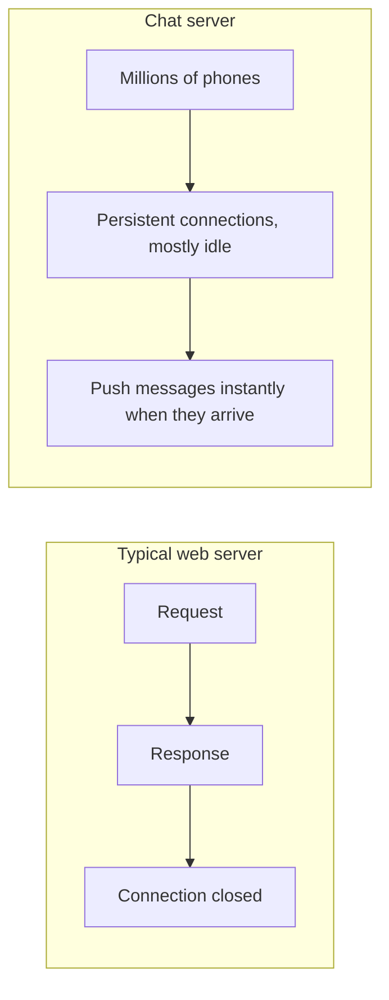
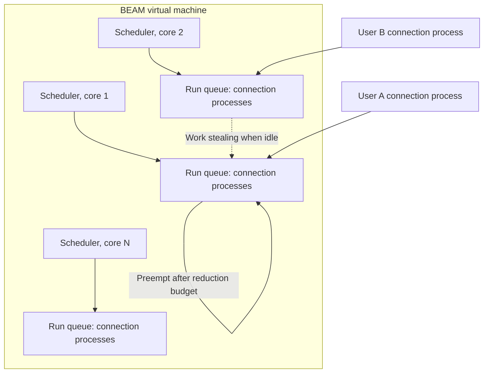
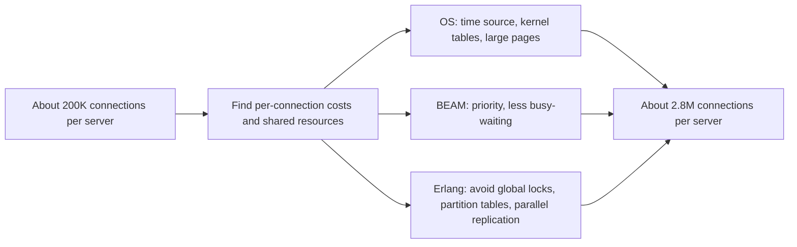
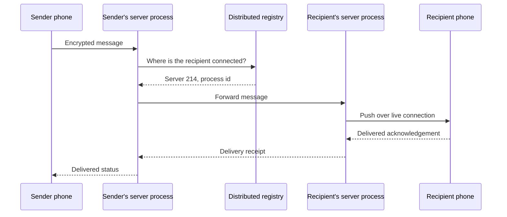
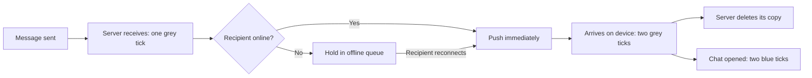
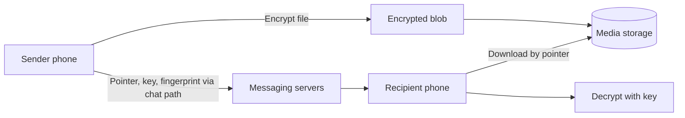
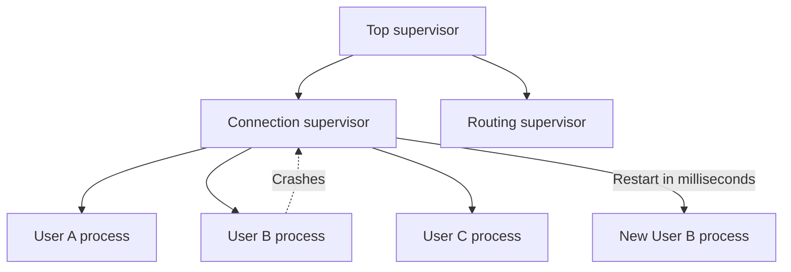
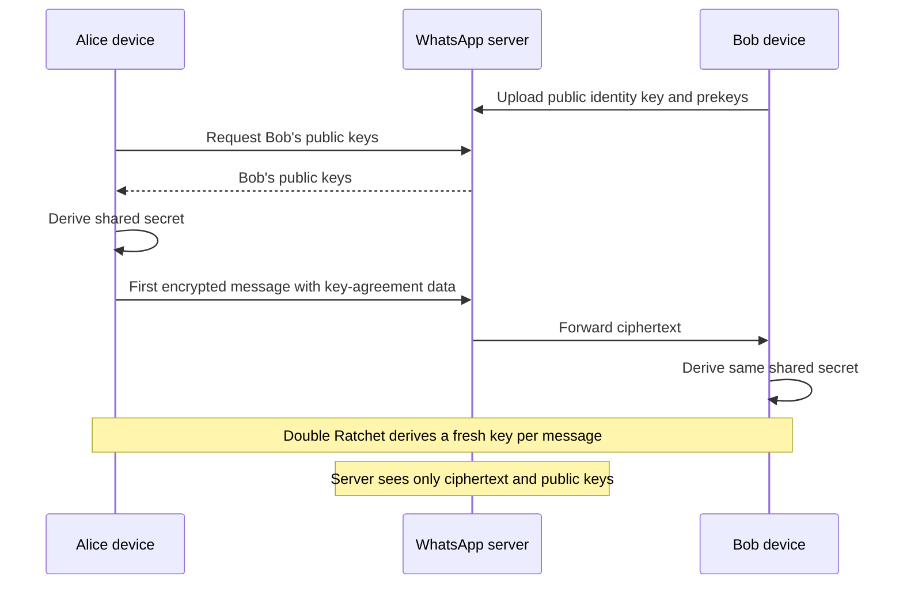
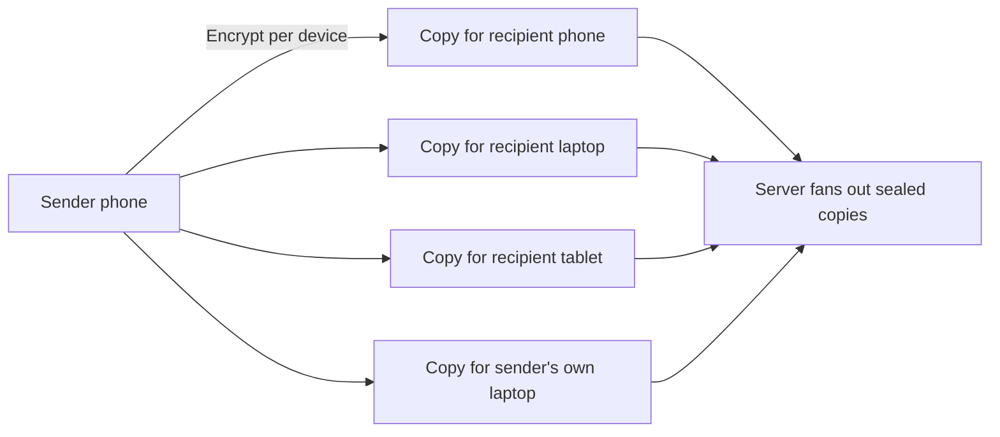
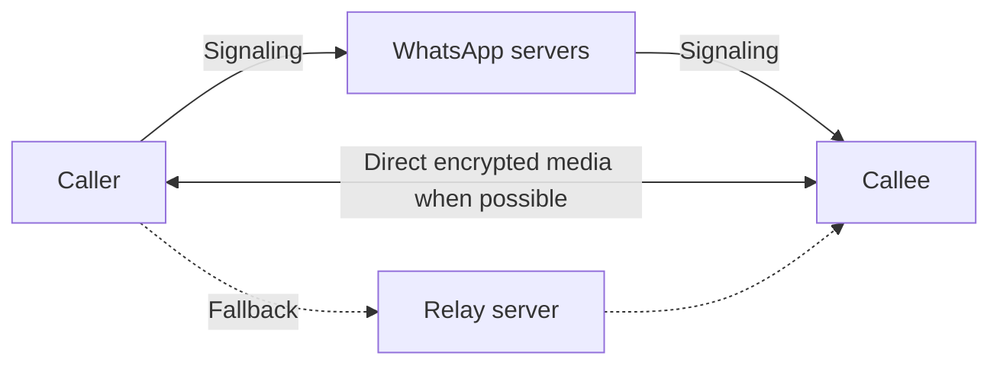

# WhatsApp Architecture: Doing More with Less

## Scope and framing

This explainer follows the supplied transcript, which describes how WhatsApp served hundreds of millions, and later billions, of users with a very small engineering team. The transcript draws on talks WhatsApp engineers gave at the Erlang Factory conference, Meta's write-up on multi-device support, and WhatsApp's encryption white paper. This document uses the transcript as its backbone and adds well-established background on Erlang, operating systems, and the Signal protocol where helpful. Figures such as user counts, team size, connections per server, and message rates are as reported in the transcript and have not been independently verified. The diagrams are conceptual and are not exact reproductions of WhatsApp's production systems.

The transcript opens with the 2014 acquisition: Facebook bought WhatsApp for about **$19 billion** when it had roughly **450 million** users and a team of about **50 people**, around **30** of them engineers. WhatsApp has since grown past **2 billion** users and more than **100 billion** messages per day, on foundations that small team built.

The usual approach at this scale is hundreds of engineers and a sprawl of services. WhatsApp went the other way:

- One server could hold about **2 million** simultaneous connections.
- The server delivers a message and then **deletes it**; it keeps no copy of conversations.
- Messages are **end-to-end encrypted**, so the server could not read them even if it wanted to.

The unifying idea, in the transcript's words: **do more with less.** Keep the server doing as little as possible, push each machine as far as it will go, and add new pieces only when other options are exhausted.

## 1. Why a chat server is hard

A typical web server handles a request, sends a response, closes the connection, and moves on. A chat server cannot. For a message to arrive instantly, the server must hold a **live connection** to every online phone the whole time, even when the user is idle or asleep. At any moment, WhatsApp holds millions of connections that are mostly idle, waiting for something to happen.

At that scale, every per-connection cost is multiplied by millions:

- The conventional model gives each connection its own OS thread. A thread needs roughly a megabyte or two of memory just to exist. A million threads means terabytes of RAM before a single message is sent.
- The operating system starts struggling long before that, at tens of thousands of connections per machine. This limit is famous as the **C10K problem**: handling 10,000 connections on one box.

WhatsApp needed 10,000 connections to be a rounding error, because it was aiming for millions per server. The cost of a single connection had to fall close to zero. The transcript calls getting there essentially the whole engineering story.

## 2. Erlang and the BEAM

### A runtime built for telephone switches

WhatsApp chose **Erlang**, a language Ericsson built in the 1980s for telephone switches: systems that keep millions of calls connected and must not go down. Erlang runs on a virtual machine called the **BEAM**.

### Lightweight processes

In Erlang, a **process** is not an OS thread. It is a lightweight entity costing a few hundred bytes of initial memory, so a single machine can run millions. WhatsApp gives **every user's connection its own process**.

### Preemptive, fair scheduling

The BEAM runs **one scheduler per CPU core** (24 schedulers on a 24-core machine), each with a queue of runnable processes. Fairness is enforced by **reductions**, a unit of work roughly corresponding to a function call. After a process uses a budget of about 2,000 reductions, the scheduler pauses it and runs the next process, whether or not the first is finished. No process can monopolize a core, even if stuck in a loop. When one scheduler runs out of work, it **steals** work from a busier one.

This is what lets a million connections share CPUs evenly and prevents one slow or misbehaving user from freezing others.

### The shape of the language matches the problem

Erlang processes share no memory; they communicate only by sending **messages**. A chat app is, conceptually, processes sending messages to each other. The transcript's point: the language's model and the product have the same shape.

WhatsApp did not start from scratch. It began from **ejabberd**, an open-source chat server written in Erlang.

### A leaner protocol

The standard chat protocol of the time, **XMPP**, encodes everything as XML, with repeated tag names wrapped around every message. On good connections that overhead is invisible. But WhatsApp was growing fastest in markets such as India, Brazil, and Indonesia, on 2G and 3G networks where every byte costs users time and money. WhatsApp built a stripped-down **binary** variant (the transcript calls it FunXMPP) that replaces repeated text with short binary codes: the same information in far fewer bytes. When users are on the slowest networks, a smaller protocol is a feature.

## 3. From 200,000 to 2.8 million connections per server

By 2012, per the transcript, the team targeted **one million** live connections on a single server, starting from around 200,000. Servers kept falling over during spikes: a big football match ending, an earthquake, moments when everyone messaged at once. They pushed past one million, then two million, and one February a single server peaked at about **2.8 million** connections, moving more than half a million packets per second and over 200,000 internal messages per second.

The interesting part is what it took. According to the transcript, every fix on the way from 200,000 to 2 million was the same kind of fix: **hunting down contention**, meaning things getting in each other's way. Two forces drive it:

- **Multiplication.** A per-connection cost that is negligible at 10,000 connections becomes the bottleneck at 2 million.
- **Sharing.** Anything shared (a lock, a counter, a single table) becomes a pileup when millions of processes reach for it at once.

Scaling was not about clever algorithms; it was about finding every per-connection cost and every shared resource and grinding them down.

### Operating system and hardware fixes

The transcript describes several, each following the pattern "something cheap done millions of times per second becomes expensive":

| Problem | Fix |
| --- | --- |
| Asking the OS for the current time millions of times per second was surprisingly costly | Read time directly from the CPU's counter, bypassing the OS call |
| The kernel's table for mapping incoming packets to connections was too small, causing collisions | Enlarge the table substantially (to around half a million slots) |
| The CPU's address-translation cache (TLB) could not cover hundreds of gigabytes, causing constant misses | Use much larger memory pages so each cache entry covers more memory |

### BEAM fixes

- **Priority:** raise the BEAM's OS scheduling priority so background housekeeping never takes the CPU while millions of users wait.
- **Busy-waiting:** reduce the BEAM's tendency to spin actively while briefly idle, which at this scale wasted real CPU.

### Erlang idioms with hidden locks

The most interesting fixes, per the transcript, were not bugs but ordinary Erlang patterns with a hidden global lock inside:

- **Linking processes.** Linking two processes so one learns when the other dies is standard practice. Setting up a link briefly took a single global lock. Harmless once; with millions of connections doing it, everyone queued on that lock. WhatsApp switched to a lighter way of watching another process (a monitor) that avoided the lock.
- **Shared in-memory tables.** Live state such as "who is connected where" lived in large in-memory tables. Each table was one shared structure hammered by millions of processes. The fix was to **partition each table** into many smaller ones so different processes touch different pieces.
- **Database replication.** The built-in database pushed all replication through a single stream. WhatsApp split it into a separate stream per table.

The transcript notes WhatsApp's engineers described this work as "dark and grungy". Stacking dozens of such fixes took the same hardware from about 200,000 connections to nearly 3 million, which is how a small team kept both headcount and hardware low.

## 4. Routing: finding the recipient's server

A message arrives at whichever server holds the sender's connection. The recipient is almost certainly connected to a different server among hundreds. Something must bridge that gap.

WhatsApp uses a **distributed registry** that records, for every online user, which server and which process currently hold their connection. A message's path:

1. It arrives at the sender's connection process.
2. That process looks up the recipient in the registry.
3. It hands the message to the process on the recipient's server.
4. That server pushes it down the recipient's connection.

Across hundreds of machines and thousands of cores, the transcript says this lookup and handoff happens tens of millions of times per second, with more than **70 million** internal Erlang messages per second at peak. One process per connection is half the story; this routing layer is the other half.

## 5. Store and forward: the server keeps nothing

Once routed, the server does as little as possible. It **does not keep chat history**.

- If the recipient is **online**, the server pushes the message and immediately forgets it.
- If the recipient is **offline**, the server queues the message (in Erlang's built-in database) until they reconnect, delivers it, and then deletes it.

This is **store and forward**. The transcript's analogy is a post office: it carries your letter and hands it over but never keeps a copy. The server is a counter, not a filing cabinet. Because messages pass through and leave instead of accumulating, the storage footprint stays small relative to the user base.

### Delivery ticks

The familiar check marks map to these stages:

- **One grey tick:** the server has the message.
- **Two grey ticks:** it reached the recipient's device.
- **Two blue ticks:** the recipient opened the chat.

The server holds only enough state to know whether a message has been delivered and whether to retry, then lets it go.

## 6. Media travels on a separate track

Photos and videos do not travel through the messaging path at all.

1. The sender's phone **encrypts** the file.
2. It uploads the encrypted blob to a separate storage service.
3. Only a small **pointer** travels through the chat channel: where the file lives, the key to decrypt it, and a **fingerprint** (hash) of its contents.
4. The recipient's phone downloads the blob and decrypts it.

Because the fingerprint is computed from content, identical files produce identical fingerprints. When a meme is forwarded by a million people, WhatsApp can recognize it as one file and store it once. The chat path carries only small pointers; heavy files ride a separate track. The transcript recommends this pattern for other systems.

## 7. Let it crash and hot code loading

### Supervisors instead of defensive code

How does a tiny team keep this running without living on call? The transcript points to Erlang's **"let it crash"** philosophy. Rather than trying to anticipate every error, a process that hits something unexpected simply dies. A **supervisor** process notices immediately and starts a fresh replacement, typically within milliseconds.

Supervisors are arranged in **trees**, watching workers and each other. When one user's connection process dies, that user is affected for a fraction of a second and the process is already replaced. The system repairs itself without human involvement.

### Updating without dropping connections

Restarting a server holding 2 million connections would disconnect all of them, and they would all reconnect at once: a small outage on every release. The BEAM supports **hot code loading**: a new version of a module is loaded into the running system and processes move to it without losing their connections. WhatsApp could ship changes without dropping users. Like supervision, this came with the runtime, because telephone switches had the same requirement.

## 8. Scale up before scaling out

The common reflex when capacity runs short is to add machines and services. WhatsApp did the opposite: make each machine do as much as physically possible, and add machines only when truly necessary. The transcript's reasoning: every machine added is one more thing that can break, one more thing to operate, one more thing to think about at 3 a.m.

For a long time, WhatsApp ran on its own **bare-metal servers** running **FreeBSD**, rather than renting cloud capacity, partly for performance and partly because owning the whole stack allowed the deep tuning described above. The coordination it needed across machines leaned on what Erlang already provided, avoiding a tower of extra services.

## 9. Staying connected on mobile

The app keeps a **single persistent connection** to WhatsApp so the server can push messages immediately. Small **heartbeats** keep it alive across unreliable mobile networks; when it drops, the app reconnects and fetches whatever it missed.

Mobile operating systems suspend background apps to save battery, and a suspended app cannot hold a connection open. So WhatsApp also relies on the platform push services (Apple's on iOS, Google's on Android) to send a small signal that wakes the app, which then reconnects and retrieves messages. The persistent connection makes things instant while the app is active; push is the fallback when the OS will not keep the app awake.

## 10. End-to-end encryption made the server simpler

WhatsApp enabled end-to-end encryption for all users at once, which the transcript describes as the largest such rollout at the time, using the **Signal protocol**.

Beyond privacy, the transcript highlights a system-design effect: encryption made the server's job **smaller**. Messages are locked on the sender's device and unlocked only on the recipient's. The server sees only ciphertext and merely passes along sealed envelopes. The less the server knows, the less it can get wrong or leak.

### How it works (simplified)

- Each device has a long-term **identity key**.
- The server stores public **prekeys** for each user. To start a conversation, the two devices perform a key agreement using these public keys and derive the same shared secret without ever transmitting it.
- The **Double Ratchet** algorithm then derives a new key for every message and discards old ones.
- This provides **forward secrecy**: compromising one key does not expose earlier messages, and the ratchet also helps recover security for later messages.

The server's only cryptographic role is distributing public keys; it never sees private keys.

### Groups: sender keys

In a 100-person group, encrypting each message separately for 99 recipients (one pairwise session each) would mean 99 encryptions per message. Instead, WhatsApp uses **sender keys**: each member creates a key and distributes it once to the group over the pairwise sessions. Afterward, each message is encrypted **once** with the sender's key and one sealed copy is fanned out.

The cost moves to key management: keys must be rotated when members join or leave so newcomers cannot read earlier messages and departed members cannot read later ones. But per-message work drops from once per recipient to once, making large encrypted groups practical.

## 11. Multi-device (2021)

For years, the phone was the center of each account. WhatsApp Web and desktop were mirrors of the phone; if the phone lost signal or died, they went dark. The reason was encryption: keys lived only on the phone.

The redesign, which the transcript says shipped in 2021 after years of work, treats every device as a **full participant**:

- Each device (the phone plus up to four companions) has its **own identity key**.
- A user is now a **set of devices**.
- Sending a message to someone with four devices means encrypting it separately for each of their devices, and also for each of the sender's other devices so all screens stay in sync.
- History, contacts, and read state must be synchronized across devices, encrypted end to end, without the server being able to read them.

Even so, the core rule holds: once a message is delivered, the server keeps nothing.

## 12. Calls: set up, then step aside

For voice and video calls, the Erlang back end handles **signaling**: who is calling whom, ringing the other device, and helping the devices exchange encryption keys. The media stream itself flows **directly between the two phones**, encrypted end to end. Only when both devices are behind restrictive firewalls or NATs and cannot connect directly does it fall back to a **relay** server. The pattern is the same as everywhere else: the server does the minimum, connects the parties, and steps out.

## 13. Trade-offs

- **Niche language.** Erlang has a steep learning curve, a small talent pool, and fewer libraries than mainstream languages. The transcript notes that Rick Reed, central to much of this work, had not written Erlang before joining. It paid off because Erlang fit the problem almost perfectly; for most teams an unusual core technology is more likely to be a trap.
- **Scaling up has a ceiling.** One machine can only hold so many connections, and an organization built around few machines must eventually scale out anyway.
- **Large blast radius per machine.** When a server holding 2 million connections fails, 2 million users drop at once and reconnect together. Fast failover and reconnection handling become critical.
- **A server that knows nothing can do little.** Without message content or history, the server cannot offer server-side search or simple server-side backups. That work moves to devices, which is why multi-device history sync was so hard. Complexity did not disappear; it moved onto billions of phones.
- **Key management complexity.** Group sender keys and per-device encryption shift work into key distribution and rotation.

## Key takeaways

1. The cheapest way to scale is to make each component do less. WhatsApp's servers store no history and cannot read messages.
2. Choose a core technology that fits the problem. A messenger is millions of mostly idle connections; Erlang processes cost a few hundred bytes instead of a thread.
3. At millions of connections, scaling is a war on contention: per-connection costs and shared resources such as locks, tables, and single streams.
4. A distributed registry routes each message to whichever server holds the recipient's connection.
5. Store and forward, with media on a separate content-addressed track, keeps servers small and storage bounded.
6. "Let it crash" with supervisor trees and hot code loading let a small team run a huge system without dropping connections on every release.
7. Scale up before scaling out: fewer, heavier machines mean fewer things to break and operate.
8. Push complexity to where it is cheapest: encryption, keys, and history live on users' devices, keeping servers simple.

The transcript's closing idea: the biggest, fastest systems are often not the ones doing the most work but the ones doing the least, on the right foundation, with the fewest parts that can break. Before adding another service or another ten engineers, ask how to make the existing pieces do more with less.
