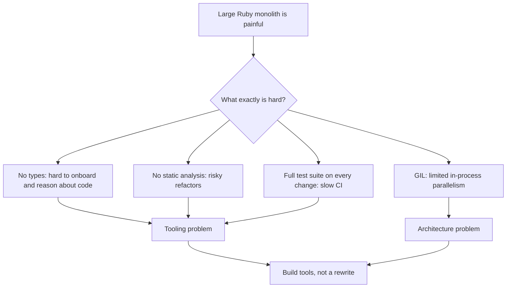
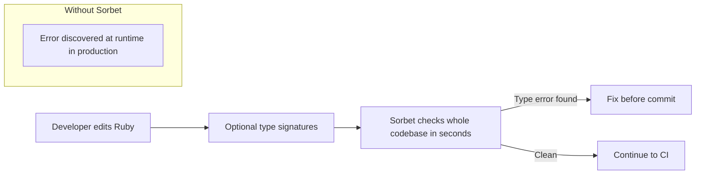
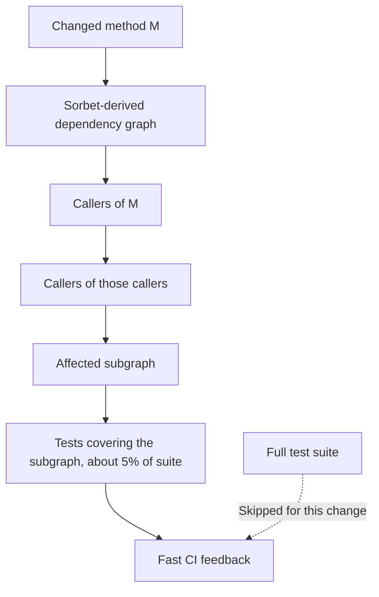
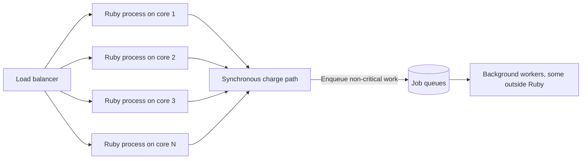
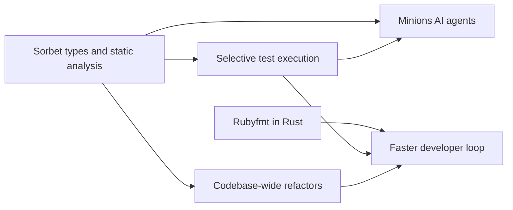

# Stripe Payments: Scaling a Ruby Monolith with Tooling Instead of a Rewrite

## Scope and framing

This explainer follows the supplied transcript, which describes how Stripe continued to run its payments platform on a very large Ruby monolith rather than rewriting it in another language or splitting it into microservices. The transcript draws on Stripe's engineering blog, conference talks, and public statements by Stripe engineers, and notes that Sorbet and Rubyfmt are open source. This document uses the transcript as its backbone and adds well-established background on type checking, testing, and runtime concurrency where helpful. Figures such as payment volume, lines of code, query rates, test-selection percentages, and the size of large refactors are as reported in the transcript and have not been independently verified. The transcript itself appears to be a machine-processed rendering in places; where its wording is ambiguous, this document describes the idea conservatively. The diagrams are conceptual.

According to the transcript, Stripe processed about **$1.9 trillion** in payments in 2025, up from about **$1.4 trillion** in 2024. That volume flows through a shared **Ruby monolith** of roughly **50 million lines of code**, described as the largest known Ruby codebase, worked on daily by hundreds of engineers.

That is surprising against the industry playbook of the 2010s. Many companies with large Ruby or other dynamic-language codebases moved performance-critical services to compiled languages, rewrote in something faster, or broke monoliths into microservices. Stripe faced the same scale and the same pain, and made the opposite decision.

The transcript sums it up in one sentence: around 2017, Stripe concluded that **the bottleneck was not the language but the codebase, and codebases are fixed with tools, not rewrites.** Stripe took the budget others spent on migrations and spent it instead on the tools Ruby lacked at its scale.

## 1. What was actually hard

Ruby at this size has real, well-known limitations:

- **Global interpreter lock (GIL).** Within one process, only one thread executes Ruby code at a time, so threads do not provide true CPU parallelism the way they do in, for example, Go.
- **Dynamic typing.** A typo or missing method fails at **runtime**, when a request reaches that code path, rather than at compile time where a developer would see it.
- **Per-operation speed.** Ruby is generally slower per operation than compiled languages.
- **Tooling built for medium codebases.** Formatters, test runners, and code-intelligence tools were designed for codebases far smaller than 50 million lines.

The common response was to leave: move hot paths to a compiled language, write new code elsewhere, and split into services. Stripe asked a different question, per the transcript. Not "what language should we use?" but "**what exactly makes working with this codebase difficult?**" The answers were not really about the language:

- **Onboarding is hard** because there are no types to tell a new engineer what a method expects or returns.
- **Refactoring is risky** because no static analysis says what a change across thousands of files might break.
- **Testing is slow** because the whole suite runs on every change.

None of these requires a rewrite. They require tooling appropriate to a 50-million-line codebase, which Ruby did not have.

## 2. The toolchain Stripe built

The transcript lists what Stripe created, each a tool that "should have existed but didn't":

| Tool | Problem addressed |
| --- | --- |
| **Sorbet** | Gradual static type checker for Ruby; checks the whole codebase in seconds |
| **Selective test execution** | Runs only the tests affected by a change (about 5% of the suite on average, per the transcript) |
| **Rubyfmt** | A Ruby formatter written in Rust, much faster than existing options |
| **Minions** | In-house AI coding agents tuned for Ruby plus Sorbet |
| **Runtime work** | Stripe's own patches and forks of parts of the Ruby runtime where upstream was not optimized for its needs |

The rest of this document looks at how each follows from the same bet.

## 3. Sorbet: types without leaving Ruby

### The problem with untyped Ruby at scale

In untyped Ruby, types live in programmers' heads. Nothing verifies that an object passed to a method actually responds to the methods called on it. Ruby resolves method calls at runtime, so mistakes usually surface in production. For a small application this is manageable; for 50 million lines of payment logic, the transcript argues, it is a class of error that should not be allowed to exist.

### Gradual typing

Other ecosystems had already shown a path: **TypeScript** for JavaScript and **Hack** for PHP, both of which let teams add types incrementally to a dynamic language. According to the transcript, nobody had done this for Ruby at production scale, so Stripe built **Sorbet**:

- A **gradual** static type checker: engineers add type signatures where they help and leave code untyped where they do not.
- Written in **C++** for speed and designed to scale across CPU cores.
- Checks the entire 50-million-line codebase in **seconds**.
- Catches inconsistencies across module boundaries **while editing**, not in production.

The result is the fast feedback loop of a modern typed language, retrofitted onto a language many thought could not support it.

As general background, Sorbet signatures are written in Ruby itself (a `sig` block above a method), and files declare a "strictness level", which lets a codebase move from untyped to strictly typed one file at a time.

### Fearless large-scale refactoring

The transcript describes a very large change, on the order of **3.7 million lines**, landed over a weekend, after which hundreds of engineers arrived on Monday and everything kept working. That kind of mass refactor is nearly impossible in a dynamic codebase, because there is no way to verify which files were broken. With whole-codebase type checking, the change could be validated before it merged.

The transcript's point: fearless, codebase-wide refactoring is exactly what a rewrite into a typed language promises. Stripe obtained it **without** migrating, by adding what Ruby lacked.

## 4. Selective test execution: CI without splitting the codebase

### The problem

With hundreds of commits a day, running the full test suite for every change would take hours. Hours of CI latency stall the whole team.

The standard fix is **microservices**: split the codebase so each service has a small test suite, and run only the tests for what changed. The transcript notes this is a primary reason organizations break up monoliths.

### Stripe's alternative

Stripe built **selective test execution** on top of the static analysis Sorbet already provides:

1. Identify which methods or files a change touches.
2. Trace their **dependents**, and the dependents of those dependents, through the codebase's dependency graph.
3. Run only tests that exercise that affected subgraph.

On average, per the transcript, this runs about **5%** of the full suite while retaining the confidence of running the relevant tests. The team gets the CI speed of microservices without their network boundaries, deployment complexity, and distributed-systems debugging.

The transcript highlights a compounding pattern: the constraint of staying in one codebase forced better infrastructure, and Sorbet became the foundation that made the next tool possible.

## 5. Productivity and performance are different problems

The transcript separates two concerns that are easy to conflate:

- **Developer productivity:** navigating, understanding, refactoring, and testing the code.
- **Runtime performance:** making the running system fast and parallel enough for the workload.

Sorbet and selective testing address productivity. They do nothing for runtime speed. A separate set of decisions was needed for that.

## 6. Working around the GIL

### What the GIL means

Standard Ruby (like standard CPython) has a global interpreter lock. In one process, only one thread executes Ruby code at a time. Threads can interleave, and they help when waiting on I/O, but on a 16-core machine, one Ruby process still executes roughly one core's worth of Ruby at any instant.

That matters for payments. A payment involves fraud checks, authentication, authorization, and ledger updates, and some of that is real computation, not just waiting on other services.

### Parallelism at the process level

Stripe did not try to change Ruby's threading model. It **routed around it**:

- Run **many separate Ruby processes**, each handling requests on its own core.
- Let **load balancers and orchestration** distribute work across those processes and machines.
- Move work that truly needs parallelism, such as background jobs, queue processors, and workers, **off the main request path**, in some cases into systems not written in Ruby.

The transcript says a Stripe engineering leader has described the charge path as Stripe's most latency-sensitive and business-critical system, and that it runs synchronously in Ruby with hundreds of developers contributing to it.

The discipline: the lack of in-process parallelism was addressed **architecturally**, not by changing languages.

## 7. When everyday tools stop working

Beyond a certain scale, the ordinary infrastructure engineers take for granted stops coping:

- Formatters become too slow.
- Package management struggles with the dependency graph.
- Test runners do not know what to skip.
- Editor features such as autocomplete, jump-to-definition, and search degrade.

Stripe rebuilt these pieces. The transcript's clearest example is **Rubyfmt**, an automatic Ruby formatter rewritten in **Rust** because existing formatters could not keep up; it runs roughly an order of magnitude faster. At 50 million lines, a slow formatter is a real cost on every save and every CI run. The same story applied to the build system, dependency management, and code discovery.

## 8. Minions: AI agents for an unusual stack

The newest tool the transcript describes is **Minions**, AI coding agents that run inside Stripe's development environment and asynchronously handle discrete bug fixes and features.

Stripe built them in-house because, per the transcript, commercial coding agents are strongest in widely used languages like TypeScript, Python, and Go. Ruby with Sorbet annotations is rare enough that off-the-shelf tools performed worse on Stripe's codebase than agents adapted to Stripe's own stack. Sorbet's types also give agents more structure to work with: an agent's changes can be type-checked and selectively tested with the same tools human engineers use.

## 9. The threshold where the ecosystem stops helping

The transcript identifies a threshold most engineers never see. Past a certain scale, a codebase's problems become too specific, the codebase too large, and the stack too uncommon for the open-source community to build tools that fit. Stripe crossed it years ago.

Past that point, tooling stops being something you adopt and becomes **supporting infrastructure you maintain indefinitely**, because no one else will. The investment also compounds:

- Sorbet pushed back the **typing** wall.
- Selective test execution pushed back the **CI** wall.
- Rubyfmt pushed back the **developer tools** wall.
- Minions pushed back the **AI tooling** wall.

Each investment makes the next easier to justify, because it builds on the same codebase and the same foundation.

## 10. Trade-offs

The transcript is explicit that this was an expensive bet whose costs are easy to overlook.

### Up-front engineering

- A production-grade type checker is years of compiler work.
- A static-analysis-driven test selector is a separate multi-year project.
- Rewriting a formatter in another language is an effort few companies would justify.
- Stripe hired engineers experienced in large monorepo tooling from companies such as Google and Facebook, because very few people had built infrastructure at this scale.

### Ongoing costs

- **Maintenance forever.** Every year of Sorbet is another year of Sorbet to maintain; every custom tool is another tool that must keep working.
- **GIL discipline.** Process-level parallelism must be engineered carefully, indefinitely.
- **Type coverage for dependencies.** Every third-party gem must be given type information or explicitly treated as untyped.
- **Dependency hygiene.** Selective testing relies on a module dependency graph clean enough to trace accurately.

### Coupling and generality

- The codebase is now tightly coupled to its custom toolchain. If Stripe ever left Ruby, it would be migrating years of custom tools and institutional knowledge, not just application code.
- New engineers must learn Stripe-specific tools and conventions.

### The outcome

The transcript concludes the bet paid off: about $1.9 trillion in 2025 on a codebase many assumed would have been rewritten a decade earlier. Stripe turned an apparent structural weakness into a compounding asset. The caution is not to conclude that monoliths are easy, but to understand the engineering it took to make this one work.

| Approach | What it promises | What it costs |
| --- | --- | --- |
| Rewrite in a compiled, typed language | Types, speed, parallelism | Years of migration, feature freeze risk, new bugs, split attention |
| Split into microservices | Small test suites, independent deploys | Network boundaries, distributed debugging, operational sprawl |
| Stripe's approach: tool the monolith | Types, fast CI, fearless refactors in place | Building and maintaining custom compilers, test selectors, formatters, agents |

## Key takeaways

1. A rewrite is rarely the real answer. "We need to rewrite this in another language" often means "we need better tooling for this codebase." Ask exactly what is hard: types, refactoring, or test speed. Those are tooling problems.
2. Sorbet brought gradual static typing to Ruby at 50-million-line scale, enabling fast feedback and codebase-wide refactors without migrating.
3. Selective test execution, built on Sorbet's static analysis, runs only affected tests (about 5% on average per the transcript), delivering microservice-like CI speed inside a monolith.
4. Separate productivity problems from performance problems. Stripe handled the GIL architecturally with many processes and off-path workers, not by changing languages.
5. Invest in tools that make the next problems easier. Sorbet enabled selective testing, large refactors, and more effective AI agents.
6. At sufficient scale, the open-source ecosystem stops fitting, and tooling becomes infrastructure you must own.
7. A steady choice sustained over a decade can beat an exciting rewrite. The transcript notes Shopify and GitHub have made similar bets on their own large Ruby codebases.

The transcript's summary: Stripe invested in tooling instead of rewriting, and every tool in its stack, from Sorbet to selective tests to Rubyfmt to Minions, follows from that single decision.
