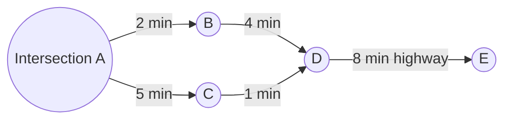
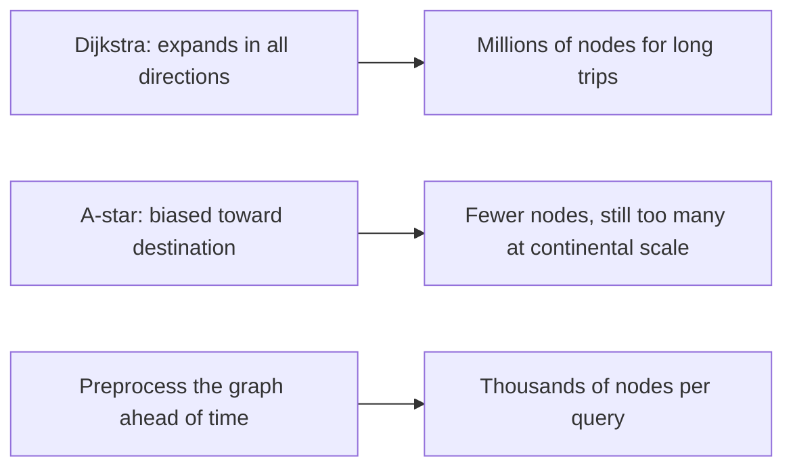
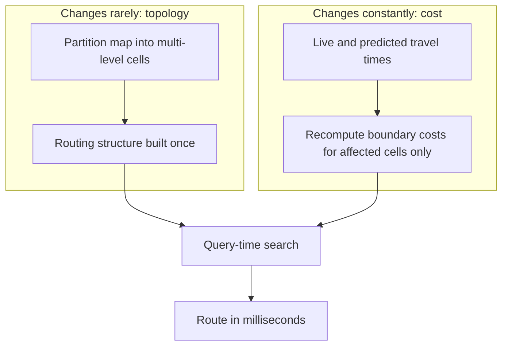
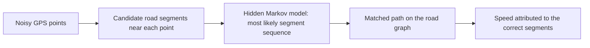
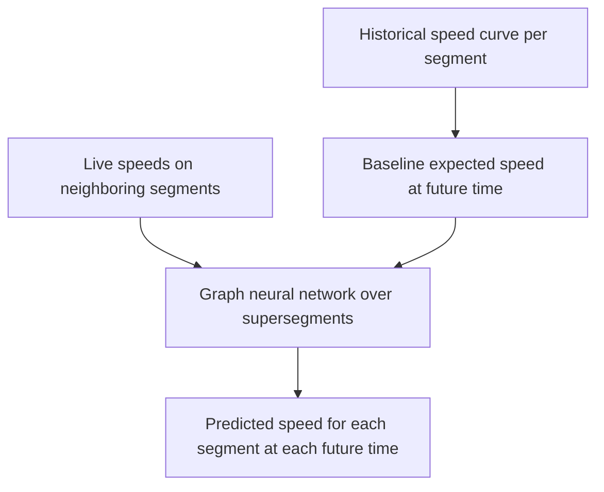
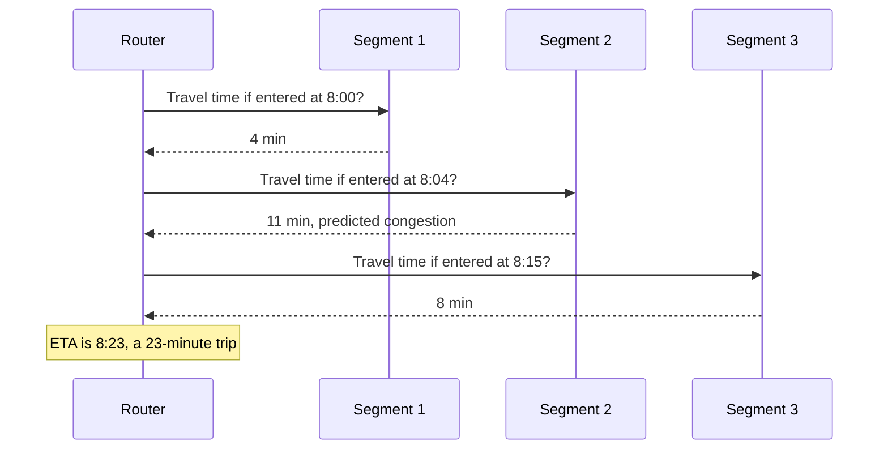
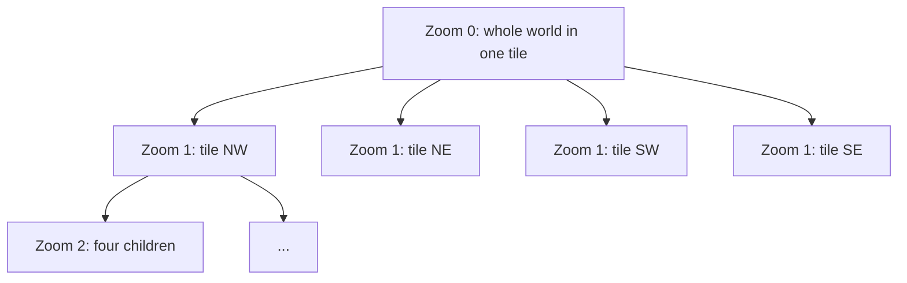
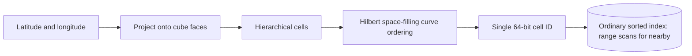
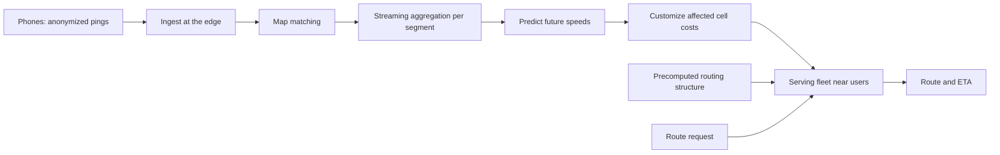

# Google Maps Traffic: Routing Against the Future

## Scope and framing

This explainer follows the supplied transcript, which describes how Google Maps computes routes and arrival times that account for traffic you have not yet reached. The transcript draws on Google's published research on large-scale routing, its work with DeepMind on arrival-time prediction, its engineering blog, and the open-source S2 geometry library. This document uses the transcript as its backbone and adds standard graph-algorithm and geospatial background where helpful. The transcript appears to be machine-processed in places (for example, algorithm names are garbled); this document uses the standard names for the techniques it describes. Figures such as user counts, country counts, and network size are as reported in the transcript and have not been independently verified. The diagrams are conceptual and do not reproduce Google's production systems.

When you enter a destination, Google Maps returns a route and an estimated time, say 23 minutes, before you leave the driveway. That estimate already accounts for a traffic jam you will hit in about 20 minutes, on a road you have not reached. Most navigation tools react to current conditions. The transcript's claim is that Google Maps routes you against **the road as it will be when you arrive at each segment**, not as it is now, and does so for more than 2 billion users across over 250 countries, over a road network of hundreds of millions of segments.

The one-sentence summary from the transcript:

> The map barely changes, but traffic changes every second. So treat them as two separate problems, and route against where traffic is going, not where it is.

Everything else follows: the stable map gets heavy, clever preprocessing that makes continental routing fast, while volatile traffic stays a thin, constantly updated, predicted layer on top.

## 1. The map as a graph

To a computer, a road map is a **graph**:

- Each **intersection** is a node.
- Each **road segment** between intersections is an edge.
- Each edge has a **weight**: how long it takes to traverse that segment.

The planet's road network becomes one enormous graph with hundreds of millions of segments, too large for one machine.

Once the map is a graph, routing becomes a classic problem: find the lowest-cost path between two nodes.

## 2. Why textbook shortest-path search is too slow

### Dijkstra's algorithm

The classic answer is **Dijkstra's algorithm**: start at the origin and repeatedly expand the nearest unvisited node until reaching the destination. The transcript's image is pouring water at the start point and watching it spread through the streets.

The problem is direction. Dijkstra does not know where the destination is; it explores in order of distance from the origin. For a trip from Los Angeles to San Francisco, about 400 miles away, the search frontier grows as a circle around Los Angeles until its edge reaches San Francisco. By then it has explored everything within 400 miles in every direction: San Diego, the desert, much of Nevada. That is millions of intersections, almost none near the actual route.

### A*: Dijkstra with a compass

**A\*** improves on this by adding, at each step, an estimate of the remaining distance to the destination (for example, straight-line distance). The search leans toward San Francisco instead of wandering into the desert. It helps a great deal for medium distances, but for continental routes the straight-line estimate is weak compared to the real path along connecting highways.

The transcript's conclusion: no search algorithm run at request time can traverse a planetary road network in milliseconds. The only way out is to **move the hard work before the request**.

## 3. Contraction hierarchies: shortcuts through the road network

People do not plan long trips street by street. They think: get out of my neighborhood, get on the highway, stay on it most of the way, exit near the destination, then handle the last few streets. Small roads matter only at the beginning and end.

**Contraction hierarchies** build that intuition into the graph during preprocessing:

- Roads are ranked into a **hierarchy**, with local streets at the bottom and major highways at the top.
- **Shortcut edges** are added so that a long stretch of highway, which would otherwise be many edges, can be traversed in one hop.
- At query time, the search only moves "upward" in importance from each end, uses shortcuts across the middle, and descends to local streets near the destination.
- The search runs **bidirectionally**, from the origin and destination simultaneously, meeting in the middle.

A route that took Dijkstra millions of steps now takes a few thousand.

## 4. The tension: precomputation vs. changing traffic

Shortcuts are computed from travel times. But travel time is exactly what changes through the day. The transcript's example: a highway segment taking 8 minutes at 2 p.m. may take 25 minutes at 6 p.m. As soon as traffic changes, shortcuts built on old weights are wrong.

Rebuilding all shortcuts for the whole planet every few minutes is too expensive. This is the core tension:

- **Precomputation** makes routing fast.
- **Live traffic** makes routing correct.
- They pull in opposite directions.

## 5. Separating topology from cost: customizable route planning

The resolution is to split the map into two parts that change at very different rates:

- **Topology**: which roads exist and how they connect. It rarely changes. Do the expensive preprocessing once and keep it for a long time.
- **Cost**: the current travel time on each road. It changes constantly.

Build the routing structure from **topology only**, and fill in the actual numbers at the last moment, cheaply and frequently. The transcript names this family of techniques **customizable route planning (CRP)**.

### Cells

As part of preprocessing, the map is **partitioned into cells**: regions subdivided into smaller regions across multiple levels, like a multi-resolution grid laid over the map. For each cell, the system precomputes the cost of crossing it from each **boundary entry point** to each **boundary exit point**. Each cell collapses into a compact summary, hiding the detail of every small road inside.

A cross-country query then:

1. Uses local streets to reach the boundary of the origin's cell.
2. Jumps from cell to cell using precomputed boundary-crossing costs.
3. Descends into local streets inside the destination cell.

### Cheap updates

When traffic changes, only the **boundary costs of affected cells** are recomputed (the "customization" step). The structure stays put; only cheap numbers move. The same partitioning also lets the graph span many machines, since each cell can live on a different one.

The transcript stresses that this pattern, **separate what changes rarely from what changes often and recompute only the cheap part**, applies well beyond maps.

## 6. Where traffic data comes from: phones as sensors

Routes are only as good as the numbers on the edges. Those numbers come largely from users. Every phone running Google Maps (with location sharing enabled) reports small, anonymized pieces of data: where it is and how fast it is moving.

- One phone on a road says almost nothing.
- Hundreds of phones on the same road crawling at 6 mph indicate a traffic jam.

There is no need for cameras or buried road sensors; the crowd of phones is the sensor network. Google aggregates anonymized speeds per road segment into a **live traffic layer**.

The transcript recounts an artist in Berlin who put **99 phones** in a small wagon and walked it slowly down an empty street. Google Maps showed the street as congested, because as far as it could tell, 99 vehicles were crawling along it. The anecdote illustrates both the power and the limits of crowd sensing.

## 7. Map matching: which road are you really on?

GPS is imprecise. A reported location may be off by several meters, enough to place a phone inside a building, in a river beside a highway, or on a parallel street. Before crowd speeds are useful, each phone must be assigned to the road it is actually on. This is **map matching**.

A single GPS point is ambiguous; a **trace** is not. If the last ten points follow the curve of one road, the phone is almost certainly on that road, even if individual points look odd. The standard tool is a **hidden Markov model (HMM)**: it chooses the most likely sequence of road segments that explains the noisy observations, balancing how close each point is to candidate roads against how plausible transitions between roads are.

Map matching keeps the blue dot on the road and keeps crowd-sourced traffic clean, because each phone's speed is attributed to the correct segment rather than smeared across three.

## 8. Predicting future speeds

For a 40-minute drive, current traffic far along the route is nearly irrelevant. What matters is each road's condition **when you arrive** there, perhaps half an hour from now. A jam visible across the map may clear or worsen before you reach it.

### Historical baselines

Each segment has been traveled millions of times and has a rhythm: slow around 5:30 p.m. on weekdays, clear on Sunday mornings. Years of data give each segment a **daily speed curve** that provides a strong baseline for any future time.

### Graph neural networks for today's deviations

History describes a typical Tuesday; today may not be typical, and a slowdown on one highway ripples into connected roads. According to the transcript, Google worked with DeepMind on a model that treats the road network as what it is, a graph:

- Connected road segments are grouped into **supersegments**.
- A **graph neural network (GNN)** predicts future speeds by looking at each segment together with its neighbors, capturing how traffic flows into and out of an area.
- This lets it detect congestion that is about to spread before it fully forms.

The historical curve sets the baseline; the model adjusts it to what is happening in the area today.

## 9. Time-dependent routing

With predicted speeds, route planning walks forward in time:

1. Start at the departure time.
2. For the first segment, ask how fast it will be **at that moment**, and add its travel time.
3. For the next segment, ask how fast it will be **at the new, later time**, and so on.

Edge weights are no longer fixed numbers; they are **functions of arrival time**. This is **time-dependent routing**. The estimated arrival time is the sum of predicted segment times, each evaluated at the moment you are expected to be on that segment. That is how the 23-minute estimate already includes the jam 20 minutes ahead.

$$
t_{\text{arrive}} = t_0 + \sum_{i=1}^{n} c_i\!\left(t_{i-1}\right), \quad t_i = t_{i-1} + c_i(t_{i-1})
$$

where $c_i(t)$ is the predicted travel time of segment $i$ when entered at time $t$.

## 10. Continuous rerouting and alternatives

Routing does not stop once you start driving:

- Your phone keeps reporting speed and position.
- The live layer keeps updating from everyone else.
- Maps keeps checking whether your route is still best.

If an accident slows the highway ahead, those segments' costs rise, another path becomes cheaper, and the route changes. On top of predicted traffic, Maps layers in discrete events such as closures, roadworks, and accident reports.

It also offers two or three **genuinely different** near-optimal alternatives rather than ten variations of the same road. Because each query against the preprocessed structure is cheap, it can be repeated continuously against a traffic layer that never stops changing.

## 11. Rendering the map: tiles, quadtrees, and vector data

### Tiles in a quadtree

Google cannot send the whole world to a device or redraw the planet on every pan or zoom. The world is cut into square **tiles** arranged in a **quadtree**:

- At the most zoomed-out level, a few tiles cover the Earth.
- Each zoom step splits each tile into four, quadrupling detail.

Whatever the location and zoom level, the device needs only a handful of tiles covering its view. Tiles are cached and served from machines close to users, so they appear quickly.

### From images to vector tiles

The older approach rendered each tile as a flat image on the server. Images are fixed: they cannot rotate smoothly or tilt in 3D, and changing the style (for example, dark mode) would require re-rendering every image on Earth.

Google Maps moved to **vector tiles**. Each tile is a compact set of drawing instructions: this road is a line from here to there, this is a park, this is a building. The **device's GPU** draws it. That enables smooth rotation, 3D tilt, and zoom, and vector tiles are often smaller than images, which matters on weak connections. The transcript notes this is the same move seen elsewhere: push work to where it is cheapest, in this case users' devices.

## 12. S2: turning two dimensions into one

Maps constantly answers spatial questions: what is near this point, which gas stations are around me, which road is closest, what is inside the visible area. Databases excel at searching by a single sorted key, but location has two dimensions, and "nearby" in two dimensions is awkward for a conventional index.

Google's **S2** library addresses this:

1. Project the sphere onto the faces of a cube and divide each face hierarchically into **cells**.
2. Trace a **space-filling curve** (a Hilbert curve) through the cells, snaking back and forth so that points close on Earth tend to be close along the curve.
3. Give every location a single **64-bit cell ID**: its position along that curve.

Now "near each other in the world" largely becomes "close together in a sorted list of numbers", which ordinary databases can range-scan quickly. A two-dimensional problem becomes a one-dimensional one. The transcript highlights this dimensionality-reduction idea as one of the most useful in the field. S2 is open source.

### Places, geocoding, and search

The spatial index also powers:

- **Geocoding:** turning an address into a point.
- **Reverse geocoding:** turning a tapped point into a place.
- **Nearby search:** "coffee near me" pulls every coffee shop in the area from the spatial index, then ranks by distance, rating, relevance, and popularity, the same kind of ranking problem as web search.

Beneath this is an index of hundreds of millions of places and businesses, each a point with attached information, all keyed by the same one-dimensional cell IDs. A map is roads plus a searchable index of nearly every named place.

## 13. Building the map itself

The road graph is not typed by hand. According to the transcript, it is assembled from many sources:

- **Satellite and aerial imagery** to identify terrain, buildings, and roads.
- **Street View** vehicles that have driven tens of millions of miles, with machine learning reading street signs, speed limits, and lane markings from photos.
- **Authoritative government data** for boundaries and addresses.
- **Corrections from users and Local Guides.**
- Models that **extract road geometry** from raw imagery.

This is the static half of the system: built once and refreshed continuously as new data arrives.

## 14. The traffic pipeline end to end

Tracing a single location ping from a phone to someone else's route:

1. **Ingest:** anonymized position-and-speed pings stream continuously into Google's edge.
2. **Match:** each ping is map-matched to the correct road segment.
3. **Aggregate:** a streaming pipeline combines pings per segment over a sliding time window into a current speed per segment. This is a continuous stream, not a nightly batch.
4. **Predict:** historical curves and the GNN produce future speeds.
5. **Customize:** boundary costs are recomputed only for cells whose traffic changed; the heavy structure is untouched.
6. **Distribute:** the updated cost layer is pushed to the serving fleet and cached near users.
7. **Serve:** a route request hits a nearby server holding a nearly static structure and a cost layer at most a few minutes old. No planet-scale work remains at request time.

The transcript calls out the reusable template: a **hot read path** that must be instant, and a separate **update path** that may take a little longer. Aggregate the firehose in the background, recompute only the delta, push it to the edge, and serve each read from something precomputed and nearby.

## 15. Routing for other objectives

Once structure is separated from cost, the router can optimize for anything expressible as an edge cost:

- **Eco-friendly routing:** each segment gets a machine-learned estimate of fuel or energy use, depending on factors such as road grade, stop-and-go traffic, and engine type (petrol, hybrid, electric).
- **Avoid tolls**, **avoid highways**, or **fewer turns and signals**: each is another cost function on the same road structure.

The fastest and most efficient routes are often different. Google computes both, and when the eco route costs little extra time, it suggests spending a minute to use less fuel. With two competing costs, the problem is no longer "find the single best path" but "choose a sensible trade-off point".

## 16. Trade-offs

- **Always slightly behind reality.** Routing uses a prepared version of the world. Road changes require re-preprocessing, and traffic layers are minutes old.
- **Predictions can be wrong.** A brand-new accident or unexpected storm has no history, so ETAs may be off until live data catches up.
- **Privacy is foundational.** The system depends on location signals from billions of phones, so careful anonymization and aggregation are what make it acceptable at all.
- **Crowd sensing can be fooled.** The 99-phone wagon shows that inferred traffic reflects device behavior, not ground truth.
- **Never finished.** Models are retrained, the map is rebuilt, imagery is re-collected, and the serving fleet runs continuously: a large, permanent cost.

## Key takeaways

1. Separate what changes slowly (road topology) from what changes constantly (travel times), and process each differently.
2. Search-time algorithms like Dijkstra and A\* cannot route across a continent in milliseconds; precomputed hierarchies and shortcuts can.
3. Customizable route planning builds structure from topology once and recomputes only affected cells' costs as traffic changes.
4. Users' phones are the sensor network; map matching with hidden Markov models turns noisy GPS into clean per-segment speeds.
5. Predict rather than react: historical curves plus graph neural networks estimate each segment's future speed, and time-dependent routing evaluates each segment at the moment you will reach it.
6. Reduce dimensions when possible: S2 maps the globe onto a single sorted key so "nearby" becomes a range scan.
7. Put work where it is cheapest: vector tiles let devices draw the map; streaming pipelines and edge caches keep request-time work minimal.
8. Separating graph structure from edge cost lets the same router optimize for time, fuel, tolls, or other objectives.

The transcript's closing question for any system: what changes slowly here, what changes quickly, and can the fast part be anticipated instead of chased?
