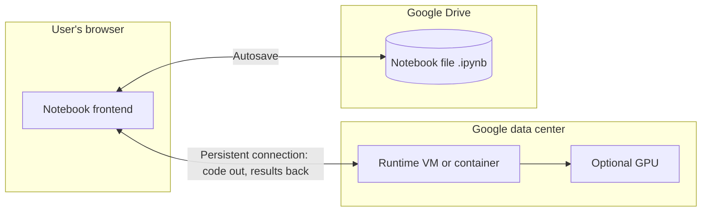
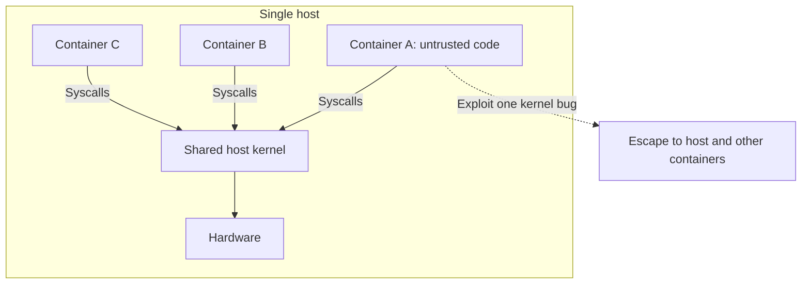
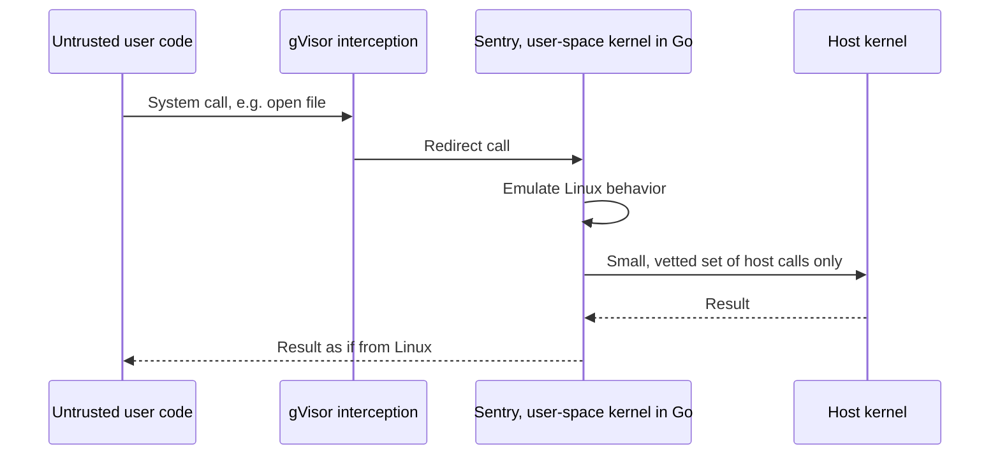
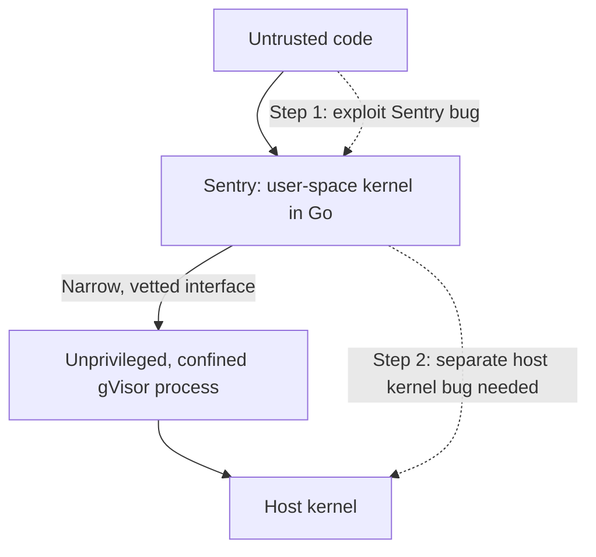
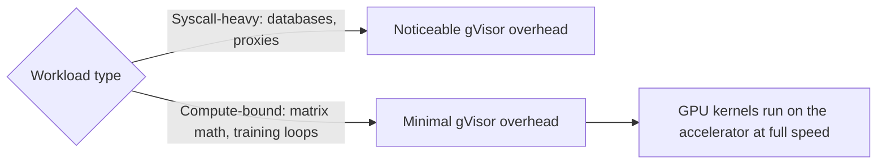
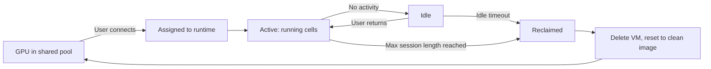
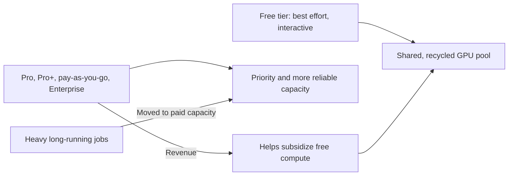
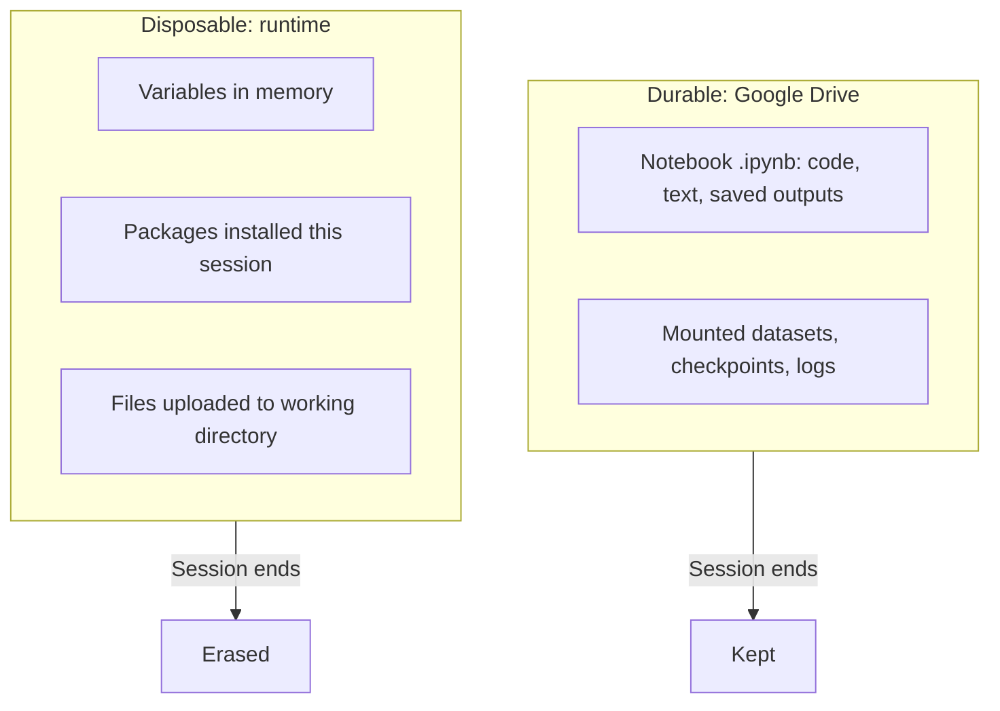
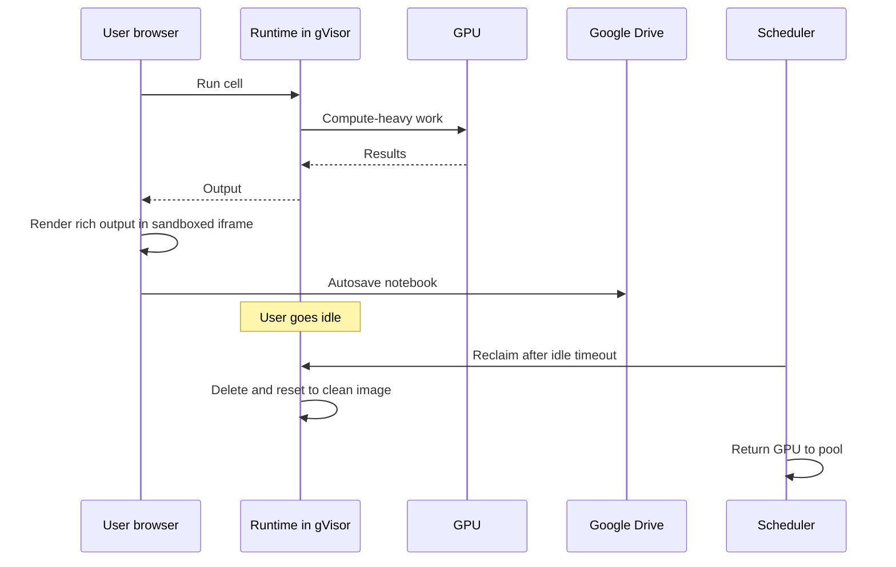

# Google Colab Free GPUs: Disposable Sandboxes for Untrusted Code

## Scope and framing

This explainer follows the supplied transcript, which describes how Google Colab lets millions of strangers run arbitrary code, often on GPUs Google pays for, without compromising the platform's security or economics. The transcript draws largely on Google's public writing about gVisor, the sandboxing technology underneath. This document uses the transcript as its backbone and adds widely known background on containers, virtual machines, and Jupyter where helpful. Figures such as idle timeouts, maximum session length, and gVisor overhead ranges are as reported in the transcript and have not been independently verified; Google does not publish all details, and limits may change. The transcript appears to be machine-processed in places; this document uses standard terminology. The diagrams are conceptual.

Every day, millions of people open a browser tab, type code into a notebook, and press Run. The code does not execute on their laptop but on Google's infrastructure. It might train a neural network, or it might try to delete the file system, scan the network, exhaust the CPU, or probe the kernel for vulnerabilities. Google does not review it in advance. Yet users do not interfere with each other, the platform does not collapse under abuse, and free compute does not bankrupt Google.

The transcript's one-sentence summary:

> Colab treats every session as a disposable, isolated sandbox.

That one decision solves both hard problems at once:

- **Security:** if each session is a locked box that will be destroyed within hours, the worst a user can do is misbehave inside a box that is about to be thrown away.
- **Economics:** if machines are disposable, they can be reclaimed the moment someone stops using them and handed to the next person, so one pool of hardware is recycled endlessly.

Almost every Colab quirk, from disappearing variables to reinstalling packages every session, follows from this.

## 1. Colab is hosted Jupyter

### Notebooks and kernels

Colab is a hosted version of **Jupyter**. A Jupyter notebook is a document of **cells**, some text and some code. You run a code cell and its output (a number, chart, or table) appears beneath it. It is a natural way to work with data because you build and inspect step by step.

The notebook file itself is just a document. Something has to execute the code: Jupyter calls it the **kernel**, a live process that holds session state in memory. When a cell runs, its code goes to the kernel, which executes it, remembers any variables created, and returns results. Colab calls this the **runtime**, and this document uses that term to avoid confusion with the operating-system kernel discussed later.

### Two halves in two places

- **Frontend:** the notebook interface running in your browser. You type, click Run, and see results.
- **Runtime:** a machine in a Google data center that executes your code on Google's CPUs and GPUs.

A persistent connection links them. Code travels from browser to runtime; text, images, and errors travel back. That open connection makes execution feel immediate.

This also explains the familiar "runtime disconnected" message. The website has not crashed. The machine at the far end has gone away.

## 2. The threat: arbitrary code from strangers

The code cell runs whatever is typed, with no approval step. On an ordinary shared server, that is the scenario you plan against: one attacker can crash the system or quietly take it over and pivot to everyone else on it. Colab's constant question is how to run completely untrusted code on its own hardware and be sure the worst case stays contained.

## 3. Why containers are not enough

### How containers work

Most engineers reach first for **containers** (for example, Docker). A container packages an application in its own isolated view: its own files, processes, and network namespace. From inside, it looks like a whole machine.

But all containers on a host **share one operating-system kernel**. The kernel manages the hardware: disk, memory, network, CPU. A program cannot touch these directly; it must ask the kernel through **system calls** (syscalls) to open files, send packets, allocate memory, and so on. The transcript's analogy: the program is locked in a room and can only affect the outside world by sliding request notes under the door to the kernel.

### The shared-kernel problem

Every container on a host slides notes under the **same door** to the **same guard**. If malicious code finds one kernel bug, one flaw in how a particular request is handled, it can trick the guard, escape its room, and reach every other container and all their data. This is a **container escape**, and for untrusted code it is a well-known class of attack. Containers are fine for trusted code; for strangers' code, a shared kernel is too thin a wall.

## 4. Why full virtual machines are too expensive

The next idea is to give each user a full **virtual machine**, a simulated computer with its own operating system and kernel. There is no shared guard: to escape, an attacker must break out of the guest OS and then out of the hypervisor beneath it. This is the gold standard of isolation.

But VMs are heavy. Each boots a full OS, reserves substantial memory and CPU just to exist, and takes real time to start. Colab's typical user opens a notebook, runs a few cells for ten minutes, and leaves. Booting and tearing down full VMs for millions of short, mostly idle sessions, for free, does not add up.

So the menu offered two unsuitable choices:

| Option | Isolation | Cost |
| --- | --- | --- |
| Container | Weak for untrusted code (shared kernel) | Cheap |
| Full VM | Strong | Too heavy for millions of free, short sessions |

Colab needed VM-level isolation at container-level cost.

## 5. gVisor: a second kernel in the way

### The idea

Google built **gVisor** for exactly this problem and, per the transcript, runs every Colab session inside it. gVisor is open source.

The container problem was that untrusted code talks directly to the real kernel. gVisor places **a second kernel between them** that intercepts every request first. This kernel runs as an ordinary program in **user space**, not as part of the host OS. Its core component is called the **Sentry**.

The Sentry re-implements much of Linux's system-call behavior and is written in **Go**, a memory-safe language chosen because whole categories of classic kernel security bugs (such as buffer overflows) are much harder to write in it.

### What happens on a system call

- **Normal container:** program makes a syscall → host kernel executes it. One hop, directly to the most sensitive software on the machine.
- **gVisor:** program makes a syscall → gVisor intercepts it → the Sentry handles it in user space, emulating what Linux would do. The program believes it is talking to Linux; it is actually talking to a careful re-implementation.

The host kernel hears almost nothing from untrusted code. It sees only a small, fixed, carefully vetted set of requests coming from gVisor itself, not the broad stream of syscalls a user program generates. The enormous attack surface of "anything a program might ask the kernel" shrinks to a narrow, controlled channel.

According to the transcript, gVisor intercepts calls either through **seccomp**-based mechanisms or through **hardware virtualization**. Either way, nothing user code requests reaches the real kernel directly.

### Two unrelated locks

To reach the host, an attacker must now:

1. Find and exploit a bug in the **Sentry**.
2. Even then, they are inside gVisor, which runs as a locked-down, unprivileged process confined by Linux isolation features and stripped of nearly all privileges before user code starts.
3. So they must separately find and exploit a bug in the **host kernel**.

The Sentry and the host kernel share no code; they are independent implementations. A bug in one says nothing about the other. The attacker must pick two unrelated locks in sequence, a much higher bar than a container's single shared kernel.

## 6. Why the overhead barely matters for Colab

Interception is not free. Handling every syscall in user space adds overhead, and that overhead falls almost entirely on **syscall-heavy** workloads that constantly hit disk or network, such as databases or load balancers. The transcript cites a performance cost on the order of **10–30%** for such workloads.

Colab users mostly do something different: train neural networks, multiply large matrices, and run numeric loops on GPUs. That work is **compute-bound**. Once running, it spends nearly all its time in arithmetic and makes very few syscalls in its hot loop. The only thing gVisor taxes is the thing Colab workloads barely do. And GPU computation runs directly on the accelerator at full speed; the sandbox surrounds the code, not the math.

The transcript's point: what the workload actually does matters more than any generic benchmark. The same tool is a poor choice for a database and nearly free for machine learning.

## 7. Contained in time: disposable runtimes

gVisor contains a bad actor in **space**. The other half of the design contains them in **time**.

- Each runtime is a fresh machine built from a **clean base image**, identical for everyone.
- When you disconnect, go idle, or hit the time limit, that machine is **deleted**, not paused, and the capacity returns to the pool.
- Colab even offers a "disconnect and delete runtime" option to reset to a clean state immediately.

Suppose something malicious did manage to install itself or corrupt files. It hardly matters, because the machine exists for a few hours at most and is then destroyed and rebuilt from a clean image. Nothing survives. The blast radius is small in space and short in time; there is nothing durable for an attacker to gain a foothold on.

## 8. Disposability is also what makes it free

GPUs are expensive and scarce. Giving each of millions of users a dedicated GPU would leave most of them idle while people read or think, which would be enormously wasteful. The only way a free tier works is to treat the whole GPU fleet as **one shared pool** that is constantly recycled.

You hold a GPU while actively using it; when your runtime goes idle, it returns to the pool for the next person. The transcript's analogy is a library with a few copies of a popular book.

That explains the limits:

- Runtimes are reclaimed after roughly **90 minutes** of inactivity, per the transcript.
- There is a hard ceiling of roughly **12 hours** on the free tier, after which even an active session is recycled.

Long overnight training runs that stop are not bugs; they are **rationing**. Without aggressive reclamation, free Colab could not exist.

## 9. The scheduler is the product

If GPUs are a rationed pool, the most important engineering component is not the notebook editor but the **scheduler**: who gets compute, how much, and for how long. Google does not publish exact details but, per the transcript, is open about two principles:

1. **Prioritize interactive notebook users.** Colab exists for students, researchers, and people learning and building interactively. Someone actively writing and running cells is the intended user.
2. **Aggressively restrict abuse.** Disallowed uses include treating the runtime as a remote server reached over SSH, running a remote desktop, hosting always-on web services, file hosting, torrenting, and cryptocurrency mining. These consume subsidized compute without being interactive coding.

Beneath this is a deliberately undisclosed **abuse-detection system**. Google does not explain how it works, because explaining it would help people evade it. Attackers continually try to farm free GPUs at scale.

As a result, the free tier offers **no guarantees**. Available resources fluctuate, and you get a GPU when one happens to be free. That uncertainty is the scheduler doing its job: distributing a scarce, expensive resource among millions of people as fairly and cheaply as possible.

## 10. Paid tiers pay the bill

The transcript describes several paid options: **Colab Pro** and **Pro+**, **pay-as-you-go** compute units, and **Colab Enterprise** within Google Cloud. Paying moves you forward in line:

- Priority access and more reliable availability.
- More capable GPUs instead of entry-level ones.
- Longer runtimes and the ability to keep running in the background.

Paid tiers do two jobs for the system:

- **Cross-subsidy:** revenue from paying customers helps fund free compute.
- **Load separation:** heavy users, such as someone training a model for two days straight, are exactly the usage that would drain the free pool. Paid tiers move them into capacity they pay for.

The general pattern: free, best-effort service for light interactive use; paid, more reliable service when guarantees matter. The free tier also acts as a funnel and a goodwill investment: attract millions of students and researchers, and some of them, and their employers, become paying customers.

## 11. Notebook vs. runtime: durable vs. disposable

Two things in Colab are constantly confused:

- **The notebook** is the `.ipynb` file: JSON containing cells, code, and saved outputs, stored in **Google Drive**. It is durable, synced, and shareable. The transcript's analogy: a recipe written on paper.
- **The runtime** is the disposable machine holding live state: variables in memory, libraries installed this session, files uploaded to its working directory. It is erased when the session ends. The analogy: a borrowed kitchen, cleaned and handed to the next cook.

Once this split is clear, behavior makes sense:

- Your code is never at risk; it is the recipe in Drive.
- Your variables, loaded data, and half-trained model live in the borrowed kitchen and vanish when the runtime ends. After reconnecting, variables are empty and cells must be rerun.
- You run `pip install` at the top of the notebook every session because each runtime is a fresh machine from a clean image; anything installed last time went with the old kitchen.

### Mitigations

- The **base image** comes with heavy machine-learning tooling preinstalled: major frameworks, GPU drivers, and data libraries. A freshly built disposable machine is ready immediately instead of requiring gigabytes of installs.
- For data worth keeping, such as datasets, checkpoints, and logs, users can **mount Google Drive** into the runtime. Durable things live on Drive; disposable things live on the machine.

## 12. Isolating output in the browser too

Untrusted code is not only a server-side problem. Notebooks can produce rich output: HTML, JavaScript, and interactive widgets rendered in the page. That output also comes from an untrusted notebook. Malicious output could try to run JavaScript inside the Colab tab to interfere with the session or steal credentials.

Colab applies the same instinct on the client: rich outputs are rendered inside **sandboxed iframes served from a separate origin**, a different domain from the main Colab application. The browser's same-origin policy then prevents that code from reaching the real Colab session. Untrusted content travels with its output all the way to the browser, and Colab isolates it there as well.

## 13. One cell, end to end

1. You press Shift+Enter.
2. The frontend sends the code over the open connection to your runtime.
3. The runtime is a machine in a Google data center, built from a clean base image, wrapped in gVisor, and possibly attached to a GPU.
4. Every syscall your code makes is intercepted by gVisor and handled by the Sentry; heavy math runs on the GPU at full speed.
5. Results return over the connection. Rich output is rendered in a sandboxed iframe on a separate origin.
6. The notebook autosaves to Drive.
7. When you go idle long enough, the machine, sandbox, GPU, and variables are reclaimed, wiped, and handed to the next user.

## 14. Trade-offs

### For users

- No guaranteed GPU; sometimes none is available.
- Unexpected disconnects and lost in-memory state.
- Idle timeouts and a session ceiling make multi-day training on the free tier impractical. This is rationing working as intended.

### For Google

- **Sandbox tax:** building and maintaining an entire second kernel is substantial engineering.
- **Cat and mouse:** an undisclosed abuse-detection system must keep evolving against people trying to farm free GPUs.
- **Scheduling burden:** allocating a scarce, expensive accelerator pool among millions of users in real time.
- **Real money:** free compute is a subsidized bet that goodwill, mindshare, and conversion to paid tiers and Google Cloud are worth it.

The transcript's framing: free Colab is not a gimmick but a deliberately designed, subsidized loss leader, resting on a sandbox, a strict scheduler, and paid tiers that cover the rest of the bill.

## Key takeaways

1. Make the unit of work disposable. Disposable sessions are safe (small, short-lived blast radius) and cheap (instantly reclaimable).
2. Match isolation to the threat model. Containers suit trusted code; full VMs suit maximum paranoia when cost is secondary; gVisor targets strong isolation without full-VM weight.
3. gVisor interposes a memory-safe, user-space kernel (the Sentry) between untrusted code and the host kernel, so an escape requires defeating two unrelated kernels.
4. Overhead depends on what the workload does. Syscall interception hurts databases but is nearly free for compute-bound ML on GPUs.
5. Separate durable from disposable: notebooks on Drive persist; runtime state is erased.
6. At scale, the scheduler is the product. Free GPUs are a rationing mechanism that prioritizes interactive users, reclaims idle capacity, and restricts abuse, funded partly by paid tiers.
7. Isolate untrusted output in the browser as well as untrusted code on the server.

The transcript's closing question for any multi-tenant system: what can be made disposable, and what is the cheapest isolation that covers the threat model? Answer both well, and you can let strangers run code on your machines safely.
