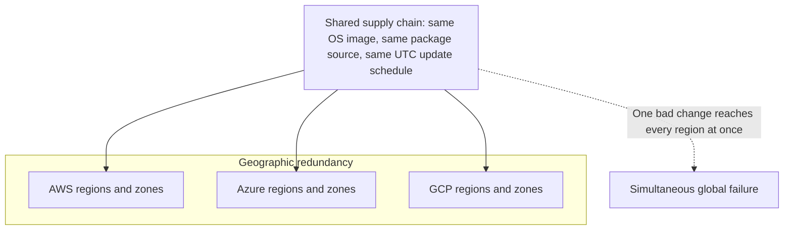
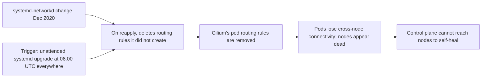
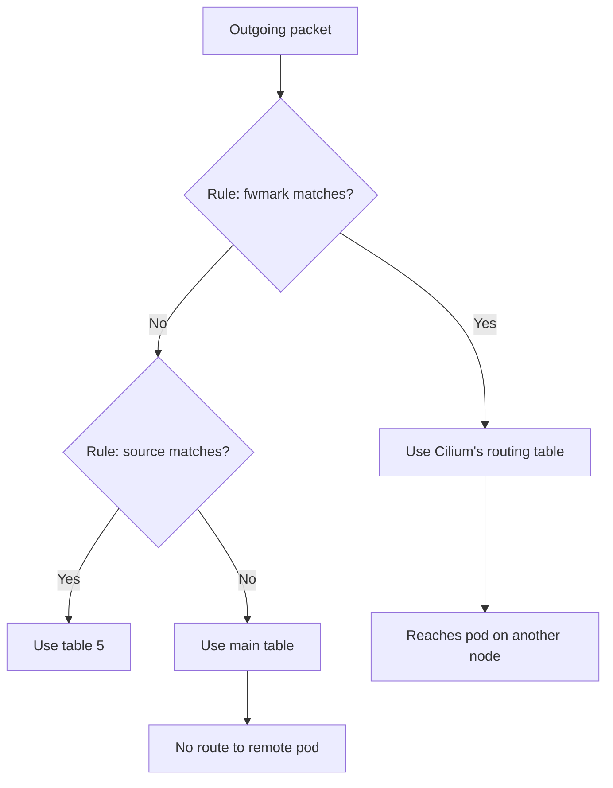
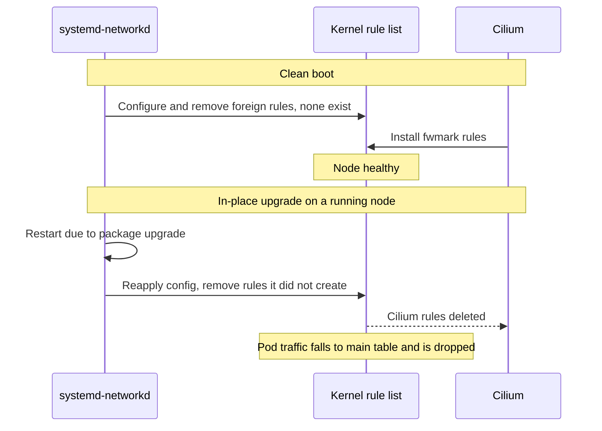
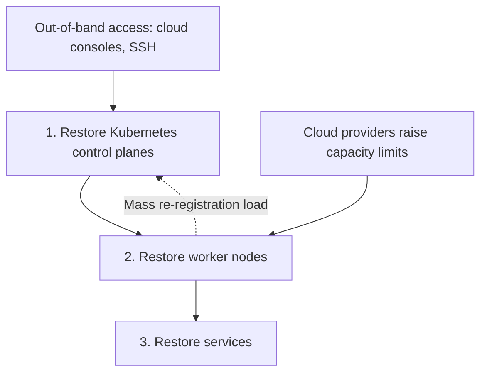
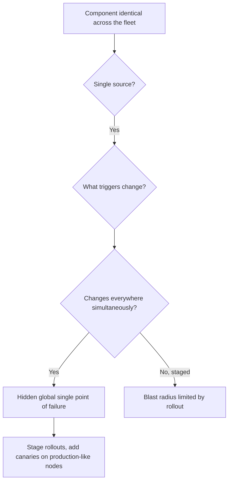

# Datadog Outage: When Multi-Region Redundancy Shares One Supply Chain

## Scope and framing

This explainer follows the supplied transcript, which analyzes Datadog's March 8, 2023 outage. The transcript draws on Datadog's own root-cause write-up, analysis by The Pragmatic Engineer, and public bug reports from the systemd and Cilium projects. This document uses the transcript as its backbone and adds well-established Linux networking and reliability background where helpful. Figures such as the number of affected machines, recovery times, and estimated revenue impact are as reported in the transcript and have not been independently verified. The transcript appears to be machine-processed in places; this document uses standard names for the software and settings involved. The diagrams are conceptual.

According to the transcript, at about **06:00 UTC on March 8, 2023**, Datadog began failing, not in one region but in every region across all three cloud providers it runs on, at the same time. Within about two hours the product was effectively unavailable: dashboards, APIs, and the alerting that thousands of companies depend on. The transcript says roughly **40,000 servers** were affected, most were restored in about **13 hours**, the remainder took about a full day, and The Pragmatic Engineer estimated lost revenue at close to **$5 million**.

Datadog ran **five regions across AWS, Azure, and Google Cloud**, each with multiple availability zones. That is exactly the diagram most engineers would draw if asked to build a system no single failure could take down. So what takes out five regions on three clouds in the same minute?

Not a cloud failure and not a bad deploy. The transcript describes a behavior change in a widely used Linux component, introduced over two years earlier, that sat on every machine waiting for a trigger. The trigger was a routine automatic security update.

## 1. The redundancy model and its hidden assumption

Multi-region designs assume **regions fail independently**. One region failing is unlikely; two failing together is much rarer; five across three providers failing in one minute is so unlikely nobody plans for it.

Datadog's architecture stacked three layers of protection:

- **Availability zones:** if one zone fails, workloads continue in other zones of the region.
- **Regions:** if a region fails, other regions carry the traffic.
- **Cloud providers:** if an entire provider fails, two others remain.

Against the failures it was designed for, it worked, and the transcript notes it had protected Datadog many times before. But every failure in that list is **geographic**: a data center fire, a regional power outage, a provider outage. Each affects a place on a map.

The March 8 failure was not on the map. It traveled through the **software supply chain**, which has no concept of region. Every one of the 40,000 machines ran Ubuntu, pulled updates from the same source, and ran the same automatic update job on the same UTC schedule. Beneath five regions and three clouds sat one operating system, updated everywhere at once.

## 2. The trigger: an automatic security update

Ubuntu ships with **unattended-upgrades**, which fetches and installs security patches on a fixed schedule without human approval. It is enabled by default, and leaving it on is generally responsible: when a serious vulnerability is disclosed, attackers begin scanning for unpatched machines within hours.

On March 8, unattended-upgrades pulled a routine security fix for **systemd**, the first process the kernel starts on boot, which launches and supervises services. One component, **systemd-networkd**, manages the machine's network configuration.

The key detail: when systemd is upgraded in place, the package installation causes systemd-networkd to **restart and reapply** the machine's network configuration. That reapplication is what set everything else in motion.

## 3. The failure chain

The transcript describes the incident as a chain of links, each requiring the previous one:

1. **A dormant behavior change** in systemd-networkd, introduced about 27 months earlier.
2. **What that change does** to Linux policy routing.
3. **Why Datadog's Kubernetes networking** depends on exactly those routing rules.
4. **Why testing never caught it.**
5. **Why recovery became its own engineering problem.**

## 4. Linux policy routing, briefly

### Routing tables

`ip route` shows the Linux **routing table**: the list the kernel consults whenever a packet leaves the machine to decide the next hop for a destination.

Linux can hold **many** routing tables at once. That raises a question: which table does a given packet use?

### Routing policy rules

Linux answers with a separate list of **rules**, visible via `ip rule`. Each rule matches one property of a packet and points it at a table:

- If the packet comes from this source address, use table 5.
- If the packet carries this **firewall mark**, use table 7.
- If the packet arrived on this interface, use table 12.

The kernel evaluates rules top to bottom by priority, stops at the first match, and uses that table. This is **policy-based routing**: routing by source, mark, or interface, not only destination. It underpins VPNs, multi-homed hosts, and most sophisticated Linux networking.

### No ownership

The detail the whole failure depends on: **the rule list is shared and has no owner.** Any sufficiently privileged program can delete any rule, including one added by a completely different program. Rules carry no owner name and no lock. Two programs that each assume they are the only one managing rules can silently delete each other's entries: no error, no warning, the rule just disappears. (Linux does allow an optional protocol tag on rules, which becomes relevant in the fix.)

## 5. Why Kubernetes networking depended on those rules

In Kubernetes, every **pod** gets its own IP address in a large virtual network. Something must actually move packets from a pod on one node to a pod on another. That is the job of the **CNI** (Container Network Interface) plugin. Datadog used **Cilium**, one of the most widely used CNIs.

Per the transcript, Cilium moves some pod traffic using exactly the mechanism above:

- It sets a **firewall mark** on certain pod traffic.
- It installs **routing policy rules** saying packets with that mark should use Cilium's own routing table, which knows how to reach pods on every other node.

Those rules carry the load. If they disappear, marked traffic falls back to the main routing table, which does not know how to reach remote pods, and the packets are dropped. From the cluster's point of view, that node has failed, including, typically, its connection to the Kubernetes control plane.

## 6. The dormant change

In **December 2020**, per the transcript, a new systemd release changed how systemd-networkd handles routing policy rules. From then on, whenever it reapplied configuration to an interface it managed, it **removed every routing rule it had not created itself**, treating unrecognized rules as stale leftovers.

From systemd-networkd's point of view, this is tidy: it believes it owns the network configuration, so rules it did not create must be garbage. But Cilium's rules were precisely rules systemd-networkd did not create. On reapply, it deleted the rules the pod network depended on.

systemd later added a setting to disable this (`ManageForeignRoutingPolicyRules`), about five months after the change according to the transcript. Two factors limited its effect:

- It **defaulted to on**, so deletion happened unless an operator found and changed it.
- The behavior was **backported** to older systemd versions already deployed widely.

So nearly every machine with a modern systemd carried this behavior, dormant until systemd-networkd reapplied its configuration on a running system.

## 7. Why testing never caught it

Datadog had staging environments, canary deployments, and extensive tests. The transcript explains why none caught this: **startup order**.

### Clean boot: harmless

1. The machine boots; systemd-networkd starts early, configures interfaces, and cleans up rules.
2. Cilium has not started yet, so no Cilium rules exist. Nothing foreign is deleted.
3. Cilium starts and installs its rules. The node works.

Build a fresh machine with the new systemd, reboot, run tests: everything passes. Nearly every test anyone writes is some form of clean boot.

### In-place upgrade on a running machine: fatal

1. The machine has been running; Cilium's rules are in the kernel.
2. systemd is upgraded in place, without a reboot. systemd-networkd restarts and reapplies configuration on top of the live Cilium rules.
3. It deletes them. Pod networking fails.

Testing that sequence requires a long-running node with established networking, an in-place restart of one specific service, and then a check on cross-node pod connectivity. The transcript's phrase: that is not a test so much as a production incident with extra steps.

## 8. March 8: everywhere at once

The unattended-upgrade schedule was set in **UTC** and was identical on every machine because all were built from the same base image. At 06:00 UTC:

- The systemd patch installed everywhere simultaneously.
- systemd-networkd reapplied configuration everywhere simultaneously.
- Cilium's rules were erased everywhere simultaneously.

There was no gradual rollout and no single region failing first to give warning. Monitoring that still functioned showed servers failing across all five regions and all three clouds at once. The expensive multi-region design did nothing, because the failure did not start in any region; it started one layer above all of them, in a component delivered to every region at the same moment.

## 9. Recovery: blind and self-blocking

### Monitoring inside the outage

Datadog's primary tool for understanding its own infrastructure is Datadog, which was down. Engineers had to diagnose a global failure without their usual visibility, falling back to cloud provider consoles, SSH to any machine still reachable, and communication channels affected by the same failure. The visibility you need most in a crisis was the first thing the crisis took.

### Self-healing on the wrong side of the damage

With Cilium's rules gone, affected nodes could not reach the Kubernetes control plane, the component meant to notice unhealthy nodes and recover them. The control plane likewise could not reach the nodes, because the network path between them was what had broken. Automation designed for large failures sat helplessly on the wrong side of the break.

Recovery became slow, largely manual work across tens of thousands of machines. Per the transcript, the root cause was not confirmed until about **11:36 UTC**, nearly six hours in; earlier effort went into chasing symptoms.

### Strict restoration order

Once understood, recovery had to proceed bottom-up:

1. Restore **control planes**, because nothing else can be managed without them.
2. Restore **worker nodes**.
3. Restore **services** on top.

The broken layer was the bottom one, so everything waited on it. As machines returned, tens of thousands tried to re-register with control planes at once, creating a thundering herd the recovery itself had to absorb. The transcript credits all three cloud providers with responding quickly and raising capacity limits so Datadog could launch replacement machines faster.

The transcript notes that for a monitoring company, the revenue loss was the smaller cost. Datadog's product is a promise to watch your systems when everything else fails; for about 13 hours, the watcher was down.

## 10. Datadog was not careless

The transcript pushes back on the view that Datadog made obvious mistakes. Multi-region, multi-cloud, multiple zones, and automatic security patching are each published best practices, and Datadog implemented all of them. This is what failure looks like when every individual practice is correct and they share a common blind spot.

We design redundancy around geography (zones, regions, vendors) because the failures we imagine are geographic. There is a second class of failures that spread through **shared dependencies** and ignore geography entirely. Consider what is byte-for-byte identical across your fleet:

- The operating system and its package mirror.
- Base images for machines and containers.
- The CI pipeline that builds code.
- The image registry.
- The certificate authority services trust.
- The DNS provider.

Each is a single shared thing sitting above every region. When any of them ships a bad change, every region receives it at almost the same time. **Multi-region is not the same as multi-fault-domain.**

## 11. A two-pass blast-radius review

The transcript proposes reviewing blast radius in two passes:

1. **Geographic pass** (common): map zones, regions, and failover paths.
2. **Supply-chain pass** (rare): go **up the stack** instead of across the map. For each piece of software identical across the fleet, ask:
   - Where does it come from?
   - What event causes it to change?
   - Does it change everywhere at the same time?

Anything delivered from one source to every machine at once is a single point of failure. The transcript argues that the automatic updater would have stood out immediately in such a review: same source, same schedule, same moment on all 40,000 machines, a synchronized update channel beneath an architecture built for redundancy, never drawn on any diagram.

## 12. Fixes and their trade-offs

### The auto-update dilemma

The reflex is to disable automatic updates, and the transcript says Datadog did so in part. But auto-updates exist for a reason: when a serious vulnerability appears in something like OpenSSL, exploitation can begin within hours. Adding human review to every patch adds hours or days of deliberate exposure. That trades **outage risk** for **breach risk**, and for many organizations a breach is worse.

The better answer is **staged rollouts**: apply updates in small waves, starting with machines that resemble production (long-running, real workload stack), then progressively to the rest of the fleet, not everywhere at once.

### Two correct systems, one shared resource

Both systemd-networkd and Cilium followed a reasonable instinct: clean up anything in "my" area I do not recognize. Both were operating on a shared kernel resource with no concept of ownership. Two programs, each correct on its own, combined into a disaster.

The transcript describes three levels of fix:

| Level | Fix | Limitation |
| --- | --- | --- |
| Surface | systemd's `ManageForeignRoutingPolicyRules` setting to leave foreign rules alone | Arrived months later and defaulted to the deleting behavior |
| Actual | Cilium tags its rules with a **protocol identifier** so systemd-networkd recognizes and skips them | A convention layered on top; works only while every program honors it |
| Deep | Give the shared resource an explicit owner or a real arbitration layer | Rarely done because it is expensive |

The transcript's generalization: when two independent systems manage the same shared resource without an agreed owner, you do not have a bug; you have a **bug category**, and you will fix instances of it one at a time indefinitely.

### Prevention has an ongoing cost

The $5 million estimate is visible. Less visible are the ongoing costs of prevention: dependency reviews, staged-rollout pipelines, and new tests whose purpose will be forgotten within months. Those invisible costs decide whether a new discipline survives or quietly erodes until the next incident proves it was needed.

## 13. Never build recovery on what can fail

Datadog spent the first hours of its worst outage without the monitoring its organization runs on, because that monitoring was inside the outage.

The principle: **recovery must not depend on the thing that failed.** Concretely, maintain at least one **independent observation and access path**:

- Out-of-band access that does not traverse the cluster network (cloud consoles, SSH over a separate path).
- A small health dashboard on a completely different stack and provider.
- Communication channels that do not share failure modes with production.

These look redundant and wasteful until the day they are the only things working.

The transcript suggests a concrete exercise: walk through your incident runbook line by line and ask, for each step, whether it assumes something that might be broken right now. If step one is "open the dashboard" and the dashboard runs on the cluster that is on fire, the runbook is a wish, not a plan.

## Key takeaways

1. Multi-region redundancy protects against geographic failures and nothing else. Audit shared dependencies, not just geography.
2. Latent bugs can have long fuses: the systemd behavior change was introduced in December 2020 and detonated in March 2023, inside a dependency Datadog neither wrote nor reviewed.
3. Test the state production is actually in. Clean boots hid this bug; it required a long-running node plus an in-place service restart.
4. Two or more systems managing the same resource without an owner is a fault line. Linux routing policy rules have no built-in ownership.
5. Stage updates in waves, starting with production-like canaries, rather than disabling security updates or applying them everywhere at once.
6. Keep recovery independent of what it recovers: out-of-band access and monitoring on a separate stack.
7. Draw two diagrams when designing for resilience: the geographic one, and the dependency graph of the few shared components sitting above every region.

The transcript's closing observation: most cloud infrastructure rests on the same handful of base images, package mirrors, update mechanisms, CNIs, and orchestrators. Architecture diagrams show regions; they rarely show that shared layer. The next large failure is likely hiding there, not in any single region.
