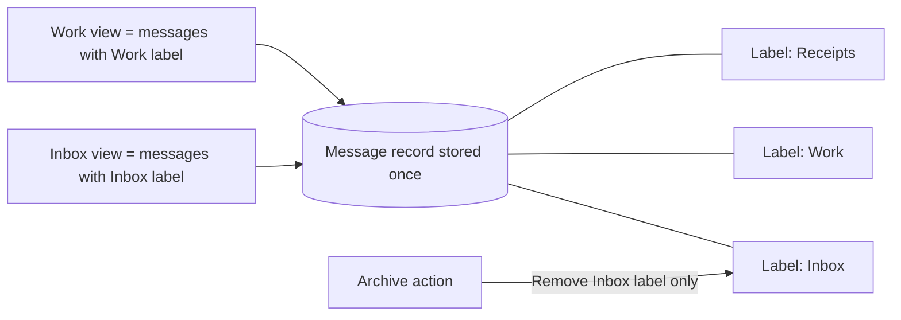
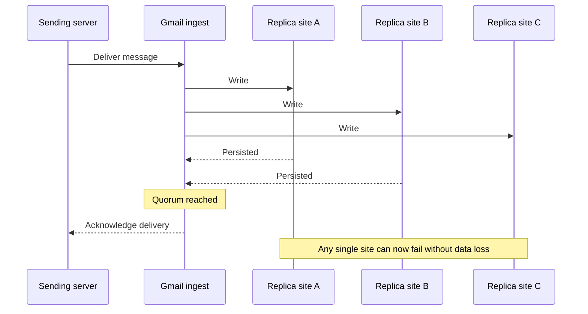
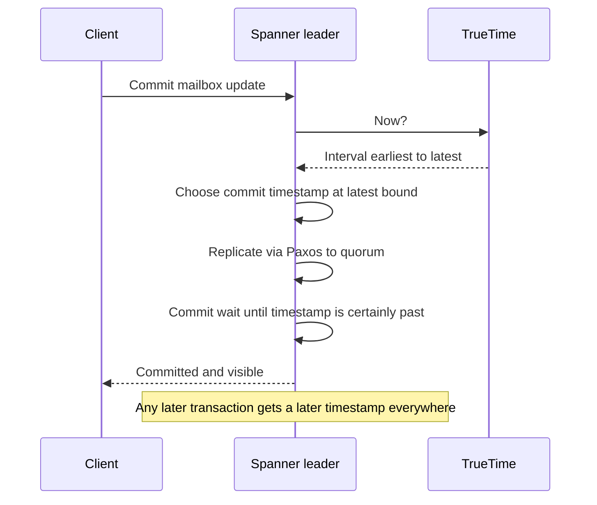
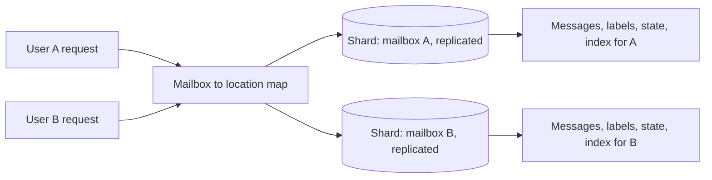
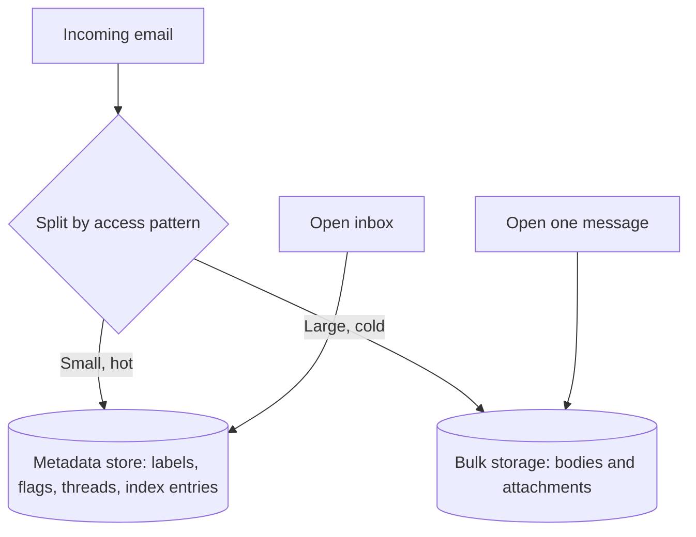
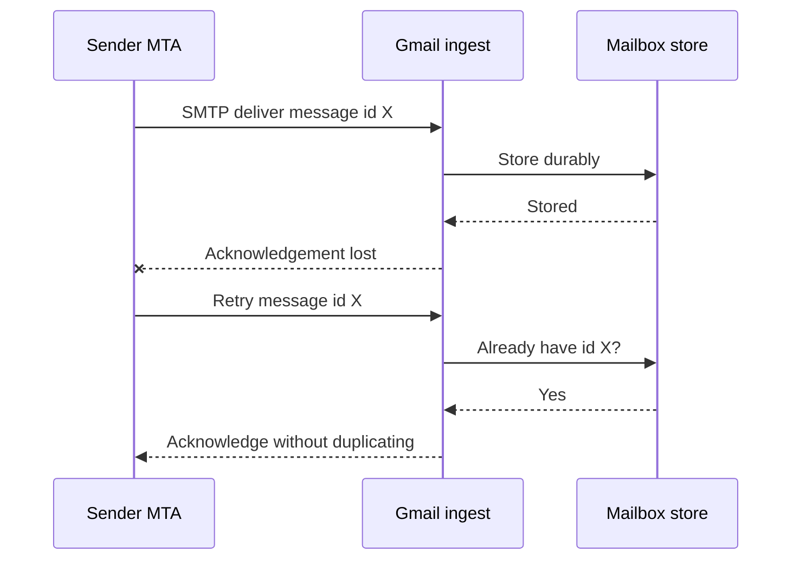
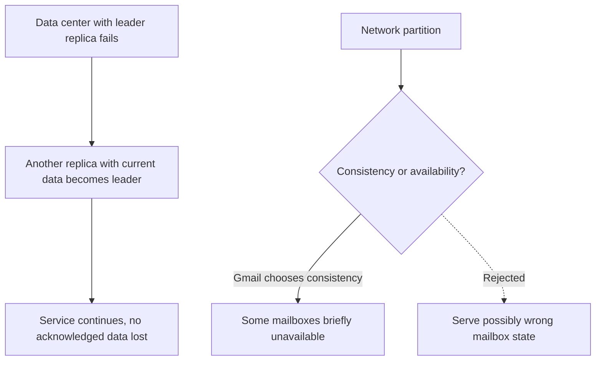

# Gmail Architecture: Search-First Email on a Durable, Consistent Store

## Scope and framing

This explainer follows the supplied transcript, which examines how Gmail keeps every email for well over a billion users, makes all of it instantly searchable, and ensures every device sees the same mailbox state. The transcript draws on Google's public engineering writing about Spanner and its storage systems. This document uses the transcript as its backbone and adds well-established distributed-systems background where helpful. Claims such as Gmail running on Spanner, user counts, and storage volumes are as stated in the transcript and have not been independently verified; Google does not publish every internal detail. The diagrams are conceptual and are not Gmail's actual production topology.

When Google announced Gmail on April 1, 2004, with **1 GB** of free storage per user (the transcript says roughly 500 times what Hotmail offered), many assumed it was an April Fools' joke. The promise behind it was radical:

- Keep every email forever.
- Never force users to delete or file anything.
- Let users find any message from years ago by typing a search, instantly.

The transcript describes doing this for about **1.8 billion** people, on storage grown to **several exabytes**, without losing a byte and without letting two devices show different versions of the same mailbox.

According to the transcript, the first version of Gmail was built by one engineer in one day by pointing Google Groups' search code at a mailbox instead of a newsgroup. That origin explains everything that follows: **Gmail is not email with search bolted on; it is search applied to your email.** That single framing creates three hard distributed-systems problems at once:

1. **Storage** that only grows, into exabytes.
2. A **private, real-time search index for every user**.
3. A mailbox that behaves like a **live database**, whose state must never be lost or inconsistent.

## 1. The hard part is state, not storage

Storing text is easy; modern systems handle petabytes of documents without much trouble. What makes email hard is **state**. Every message carries properties that are not part of its content:

- Read or unread.
- Starred.
- Archived.
- Which labels apply.
- Which conversation thread it belongs to.
- Whether it is a draft still being edited.

Simply opening a message flips its unread flag: a write. Starring, labeling, archiving, and saving drafts are more writes. Now multiply by a laptop, a phone, a tablet, and a browser, all signed into the same account. The challenge is not saving emails; it is ensuring **every device sees the same reality at the same time**:

- Marking a message read on a phone must not leave it unread on a laptop.
- A draft saved on one device must not vanish on another.
- An archived conversation must be archived everywhere.

The mental model of "a folder full of files" breaks here. Files are passive; email is active. Each message is constantly queried, indexed, updated, synchronized, and linked to others through labels and threads. Gmail is effectively a huge distributed state machine for billions of mailboxes. Email storage becomes a **database problem**: every message is a record, every action a transaction, and every device a concurrent reader and writer.

### Two non-negotiable requirements

- **Durability:** losing someone's email is among the worst failures a provider can have. Users forgive slowness, not data loss.
- **Consistency:** two devices must never disagree about whether a message exists, whether it is read, or what state it is in.

The transcript argues nearly every major architectural decision in Gmail follows from refusing to compromise on either.

## 2. Labels instead of folders

### Folders are a tree

Traditional email organizes messages into folders, a hierarchy in which each message lives in exactly one place. Putting one email in several folders requires copies or complicated cross-references, both of which add complexity.

### Labels are metadata

Gmail uses **labels**: metadata attached to a message. One email can be labeled Work, Important, Receipts, and Travel at once while remaining a single stored record. There is no duplication and no synchronization between copies. The data model moves from a rigid tree to a flexible **many-to-many** relationship between messages and labels.

### Archive moves nothing

Archiving a message in Gmail does not move it. There is no Archive folder elsewhere. Gmail simply **removes the Inbox label**. The message stays where it was, in the same thread, still searchable; it just no longer matches the condition for appearing in the Inbox.

### Every view is a query

The Inbox is not really a folder; it is a **query**: "show every message that currently has the Inbox label." A custom label is a query. Every screen in Gmail is another question asked of the same underlying message collection.

This is the search-first philosophy expressed in the data model: store messages once, describe them with metadata, and produce views by querying that metadata. It separates **storage** from **organization**: messages never have to move to appear in different places; the system only has to answer questions about them quickly. That makes query performance and correctness central to the whole experience.

## 3. Durability: never acknowledge until it is safe

Durability means that once a message is accepted, it is never lost, whatever happens next: a failed drive, a machine fire, a data center losing power.

At Gmail's scale, with millions of disks, some fail every hour of every day. A single copy on one drive, or even in one building, is not durable. The mechanism is **replication**: store copies on several machines, ideally in different locations.

### The ordering matters

Replication alone is not enough; what matters is **when the write is acknowledged**.

- **Unsafe:** write to one machine, acknowledge success, then replicate in the background. For a moment, only one copy exists. If that machine fails, the email is gone, even though the sender was told it was delivered.
- **Safe:** do not consider the write complete until it has been persisted on **multiple machines**, ideally in different physical locations. Only then acknowledge.

The safe order costs a little latency, waiting for confirmation from several places, but afterward any single machine or even a whole site can disappear without losing a byte.

The rule underpinning the no-data-loss promise: **never acknowledge a write until it is safely stored in several places.**

## 4. Consistency: one mailbox, one truth

Durability creates a new problem: the same data now exists in multiple places, and the user reads from phone, laptop, and browser simultaneously. They must agree:

- Open a message on the phone; two seconds later the laptop must show it read.
- Apply a label on the desktop; the phone must already reflect it.
- Two concurrent writes must not leave state scrambled.

Copies live on separate machines coordinated over a network that is slow and unreliable relative to human clicks. Many systems accept **eventual consistency**: copies may briefly disagree and converge later. For many applications that is a reasonable trade. For email, the transcript argues, it is not: deleting a message on the phone and seeing it reappear on the laptop, or watching the unread count flicker, breaks the illusion of a single mailbox.

Gmail therefore requires **strong consistency**: every device and every location sees one consistent version of reality.

For a long time the conventional wisdom was that strong consistency, global distribution, and massive scale could not all be had at once. Google set out to break that limitation.

## 5. Spanner

The transcript says Google's own engineering articles confirm Gmail runs on **Spanner**, storing the exabytes of data described above. Spanner is:

- **Globally distributed** across machines and continents.
- **Strongly consistent** (externally consistent).
- **Transactional**, with ACID guarantees: a set of changes happens completely or not at all, with no half-finished states.
- **Horizontally scalable**: capacity can be added almost without limit.

Strict transactional guarantees usually come from single-machine databases that do not scale; distributing data usually means giving those guarantees up. Spanner keeps them while distributing data.

For Gmail, the fit is close to ideal. A mailbox is a small bundle of state that must never be lost or contradict itself, multiplied by over a billion users:

- **Durable:** Spanner replicates data across locations and does not acknowledge a write until enough replicas hold it (via Paxos-based replication groups).
- **Consistent:** Spanner provides a single global order for all transactions.
- **Scalable:** it was designed from the start to spread across as many machines as needed.

## 6. TrueTime: making clocks trustworthy

The remaining question is how to maintain one consistent order of events across machines thousands of miles apart, connected by a slow network.

The obvious approach is to timestamp each operation and sort by time. But computer clocks drift apart by milliseconds, and at global scale those discrepancies can reorder events and break consistency. That is why global strong consistency was long considered impractical.

Google's answer was to turn time into a reliable service. It placed **atomic clocks and GPS receivers** in data centers and built **TrueTime** on top. TrueTime does not claim to know the exact time. It returns an **interval**: the true time lies between an earliest and a latest bound. Precise hardware keeps that interval small, a few milliseconds.

### Commit wait

When Spanner commits a transaction:

1. It assigns a timestamp.
2. It **waits** out the uncertainty interval before making the result visible. This is **commit wait**.

By the time anyone can observe the transaction, its timestamp is guaranteed to be in the past everywhere on Earth. So if one transaction finishes before another starts, their timestamps reflect that order on every machine, without a central coordinator. That is how the same mailbox, replicated across countries, stays consistent.

## 7. Partitioning by user

A consistent global database is the foundation, but exabytes still have to be spread across machines. Email offers a very clean answer: the natural unit is the **user**. A mailbox (messages, labels, read state, index) is a self-contained bundle almost always touched only by its owner.

So Gmail partitions by user. Each mailbox is a shard, and shards are spread across the fleet. As in the Instagram design, the logical mailbox is decoupled from its physical location, so mailboxes can move between machines as they grow and new hardware arrives.

The contrast with a social feed is instructive. Instagram's hardest query ("posts from the 200 people I follow") scatters across many shards. A mailbox query hits the single shard holding that mailbox, and everything it needs is there. Email is naturally user-scoped in a way a social feed never is.

## 8. Search: billions of private, real-time indexes

The hardest part of email was never gathering it; it is **search**, which is the center of the product. It differs sharply from web search:

| | Web search | Gmail search |
| --- | --- | --- |
| Index count | Essentially one huge shared index | A separate private index per user, nearly 2 billion |
| Who queries | Everyone queries the same index | Only the owner queries their index |
| Difficulty | One enormous index | Enormous number of isolated indexes |
| Freshness | Some lag is acceptable | New mail must be searchable immediately |

### Isolation

Email is private. Only you can search your messages; indexes must never mix. Gmail cannot build one shared index; it maintains a separate one per user, each covering that person's entire never-deleted history. Instead of perfecting one index, Gmail must keep over a billion working at once, cheaply.

### Freshness

Web search may lag; a page published five minutes ago can be missing and few notice. Email cannot. If a message arrives now and you search for it immediately, it must be found. So Gmail cannot index in lazy batches. When a new email arrives, that user's index must be updated before search reflects it, continuously, across all mailboxes, against a constant stream of incoming mail.

The search-first model only works if the index is always current. If it lags the mailbox even by seconds, the experience breaks: users search for mail they know just arrived and cannot find it.

## 9. Hot metadata, cold content

Serving all this quickly relies on not treating all data the same.

- **Hot, small data:** subject, sender, labels, read flag, thread position, search index entries. Needed constantly: to render the inbox, count unread messages, run searches, and list conversations.
- **Cold, large data:** full message bodies and especially attachments (a 10 MB PDF, images, video). Rarely needed until a specific message is opened.

These have completely different access patterns, so they are stored differently:

- Hot metadata lives in a fast, strongly consistent database, served in milliseconds.
- Bodies and attachments live in cheaper, denser bulk storage built for huge volumes of rarely accessed data.

The transcript connects this to the Dropbox case: choose storage by how data is actually used, rather than paying premium prices to keep a 2012 video attachment on the fastest tier.

### Opening the inbox

When you open Gmail, it does not read tens of thousands of stored emails. It queries your hot metadata, the most recent slice of the mailbox with labels, unread state, and thread structure, and builds the inbox view from that. Once again, the inbox is a query: everything labeled Inbox, newest first, answered from metadata rather than message bodies.

Bodies and attachments load **lazily**, only when a specific message is opened. Actively used mailboxes are cached near the serving layer, so the path users take dozens of times a day runs from fast memory, not cold storage. That is why opening a mailbox feels instant even when it holds a lifetime of email in a multi-exabyte system: the system touches a small, hot, cached slice and leaves the cold bulk alone.

## 10. Receiving mail: durable and idempotent

Receiving mail is harder than reading it. A message arrives over **SMTP** from another mail server, and before Gmail acknowledges it, several things must happen:

1. Write it durably and replicate it.
2. Run spam and security checks.
3. Apply filters and labels.
4. Update the recipient's search index.
5. Notify the recipient's devices in real time.

### Retries and duplicates

Networks fail, so senders **retry** when they do not get a clear acknowledgement. Consider: Gmail stores the message, but the acknowledgement is lost in transit. The sender sees a failure and correctly resends. Without protection, the recipient gets two identical copies, and at Gmail's scale this would happen constantly.

The protection is **idempotency**: processing the same message twice has the same effect as once. Messages carry identifiers that let Gmail recognize one it has already stored, so the retry is absorbed silently rather than creating a duplicate.

### Deduplicating content

Consider a company-wide announcement with a 5 MB PDF sent to 10,000 employees, or a newsletter to millions. Each recipient sees their own copy, but storing identical bytes thousands or millions of times would be very wasteful.

Gmail relies heavily on **deduplication**. The system computes a content fingerprint and, when identical content appears again, stores it once; each mailbox references the shared physical copy. The transcript links this to WhatsApp's content-fingerprint technique. A large attachment sent to 10,000 people need not consume 10,000 times the space.

This also explains a behavior that puzzles users: deleting a large email does not always free as much storage as expected, because the attachment may still be referenced by other mailboxes. Storage is reclaimed only when the last reference disappears. When the goal is to keep data indefinitely, eliminating redundant copies is one of the few levers on the growth curve.

## 11. Surviving data center failures

A mailbox is not stored in one place. Its replicas live in multiple data centers, often in different regions. One replica acts as **leader**, coordinating writes; the others stay synchronized. A write is complete only when enough replicas agree.

If a data center fails (power, network, a fiber cut during construction), its mailboxes do not fail with it. Another data center that already holds an up-to-date replica becomes leader, and service continues without data loss, because replicas were synchronized before any write was acknowledged.

### Choosing consistency under partition

When a network partition prevents machines from communicating, a distributed system must choose between staying **available** and staying **consistent**; it cannot fully have both at that moment (the CAP theorem). Gmail leans toward **consistency**: it would rather make a small number of mailboxes briefly unavailable than show a version of your mail that is wrong or missing messages. A few seconds of "try again" is an annoyance; a mailbox that drops messages is unforgivable.

## 12. Trade-offs: Gmail vs. WhatsApp

The transcript contrasts Gmail with WhatsApp, which took the opposite path.

| | WhatsApp | Gmail |
| --- | --- | --- |
| What the server keeps | Almost nothing; delivers and deletes | Everything, forever |
| Server complexity | Small, cheap, simple | Exabytes, a global database, atomic clocks, per-user real-time indexes |
| Where complexity lives | Pushed out to devices | Pulled into Google's infrastructure |
| Write latency | Can be fast; nothing to coordinate | Every write coordinated across distant replicas |

Gmail's costs:

- **Ever-growing storage.** Promising never to require deletion means paying to store a large share of the world's email for its lifetime, most of which will never be opened again. Deduplication and cold tiers soften the curve but do not change its direction.
- **Consistency costs latency.** Each write must be coordinated across replicas that may be very far apart, adding real network delay plus commit wait.
- **Permanent complexity.** A global database, TrueTime hardware, per-user real-time indexes, and failover machinery are ongoing engineering commitments.

Neither approach is universally right; they are two answers to the same question: where should the hard part live? Each company chose the answer that matched the promise it made to users.

## Key takeaways

1. A product decision is often an architectural decision in disguise. "Never delete, just search" demands exabyte storage, per-user real-time indexing, and a globally consistent database.
2. Model organization as metadata and views as queries. Labels instead of folders mean messages are stored once and never moved; the Inbox is just a query.
3. Durability depends on acknowledgement order: never confirm a write until multiple replicas hold it.
4. Strong consistency is worth paying for when disagreement is unforgivable. Spanner with TrueTime's bounded uncertainty and commit wait provides a global order without a central coordinator.
5. Partition by the natural unit of access. Mailboxes are user-scoped, so most queries hit one shard.
6. Gmail search is billions of small, private, always-fresh indexes rather than one huge shared one.
7. Separate small hot metadata from large cold content, and load bodies and attachments lazily.
8. Make ingestion idempotent to absorb inevitable retries, and deduplicate content to control storage growth.
9. Under partition, Gmail favors consistency over availability.

The transcript's closing lesson: every large system must decide what it values most, because every guarantee has a price. WhatsApp optimizes for simplicity by keeping almost nothing; Gmail optimizes for durability, searchability, and consistency and builds the infrastructure those guarantees require. The important thing is to understand the promise your product makes and build what it takes to keep it.
