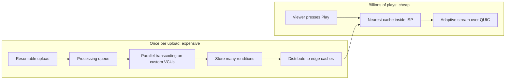
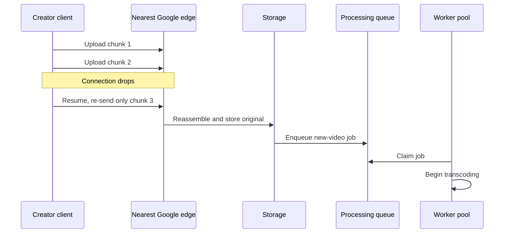
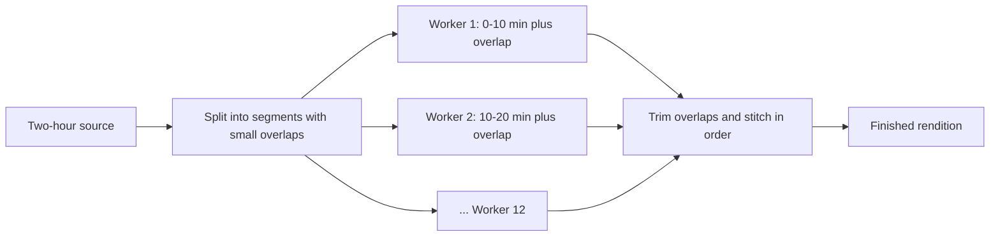
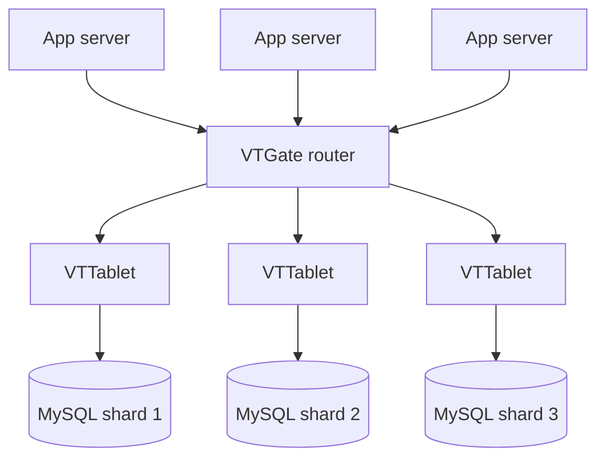
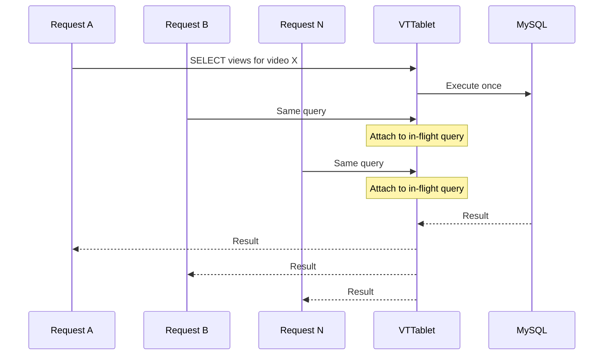
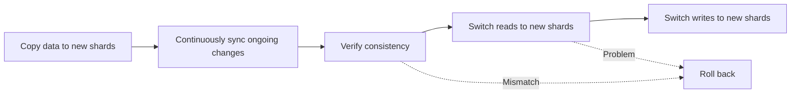
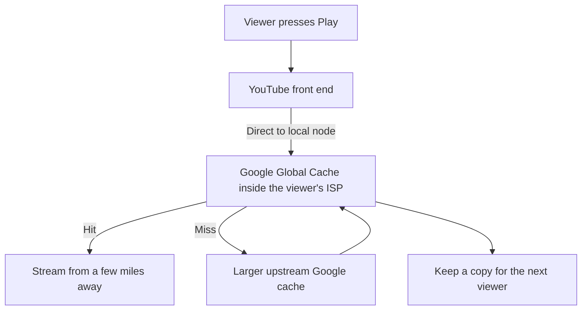
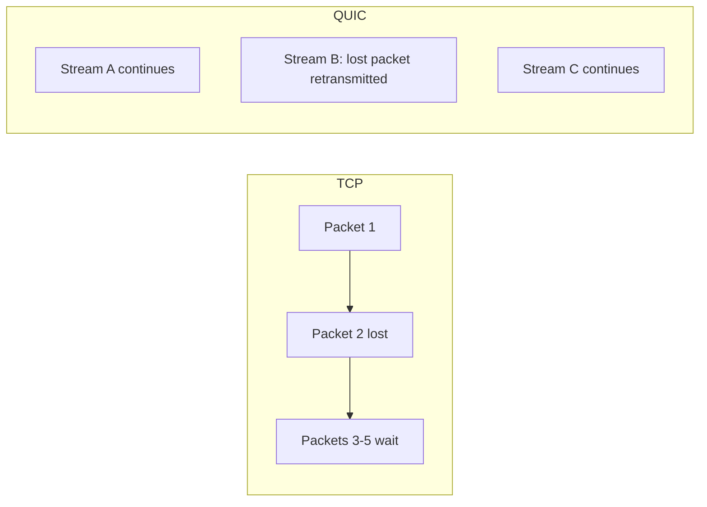

# YouTube Video Delivery: Compute Once, Serve Forever

## Scope and framing

This explainer follows the supplied transcript, which describes how YouTube ingests, processes, stores, and delivers video at planetary scale. The transcript draws on Google's published papers, engineering write-ups, and technical documentation. This document uses the transcript as its backbone and adds well-established video, database, and networking background where helpful. Figures such as hours watched, upload rates, chip efficiency, cache locations, and hit rates are as reported in the transcript and have not been independently verified. The transcript appears to be machine-processed in places (for example, product names are garbled); this document uses the standard names. The diagrams are conceptual.

The transcript opens with a striking fact: to play the video you are watching, YouTube designed **its own chip**, because at its scale general-purpose processors were no longer the most efficient way to process video. It cites scale figures of roughly **one billion hours** watched per day by over **2 billion** users, and about **500 hours** of new video uploaded **every minute**, more than eight hours of video arriving every second. Each upload must be processed, stored, indexed, replicated, and prepared for a huge range of devices and network conditions.

Many engineers assume the hardest part is delivering a billion hours a day. The transcript argues the harder problem starts earlier, when a creator clicks upload. The strategy that ties everything together:

> Do a huge amount of work once, at upload time, so that pressing Play, which happens billions of times, costs almost nothing.

By the time you press Play, the bytes have already been processed into dozens of versions and placed on a server a few miles from you. **Compute once, serve forever.**

## 1. One upload, endless device diversity

A creator uploads one file, in one resolution and one format, whatever their camera or editor produced. That single file must serve:

- Someone on a 4K TV over gigabit fiber.
- Someone on a six-year-old Android phone over unstable 3G in a rural area.
- Someone on a laptop, and perhaps someone on a smart refrigerator.

Each has a different screen, bandwidth, and set of formats the device can decode. A 4K file would buffer endlessly and burn mobile data on the phone; a small, low-quality file would look terrible on the TV. One input, a vast variety of outputs: bridging that gap is the most expensive part of the job.

## 2. Resumable, chunked uploads

When the creator clicks upload, the file is not sent as one giant object. The client splits it into chunks (the transcript cites roughly 10–50 MB) and uploads them individually.

The reason is practical: uploads get interrupted. Wi-Fi drops; a phone switches to mobile data in an elevator. If a single large transfer failed at 90%, it would have to restart from zero. With chunks, only the missing piece is resent. This is a **resumable upload**, and it is why YouTube uploads survive connections that would kill a single long transfer.

Chunks go to the nearest Google **edge** point of presence, so data enters Google's network quickly. They are reassembled and the original file is stored. YouTube then places a message on a **queue** announcing a new video that needs processing; a pool of worker machines watches the queue, and one picks up the job.

## 3. Transcoding into a matrix of renditions

### Resolutions

YouTube converts the original into a ladder of resolutions. For an 8K upload, the transcript lists about nine:

| Rendition | Typical use |
| --- | --- |
| 144p, 240p | Very poor connections |
| 360p, 480p | Constrained mobile networks |
| 720p, 1080p | Common HD viewing |
| 1440p | High-resolution displays |
| 2160p (4K) | 4K TVs and monitors |
| 4320p (8K) | 8K displays |

Each is a separate encoded file produced from the same upload.

### Codecs

Devices also differ in which **codecs** (compression schemes) they support:

- **H.264:** older and universally supported.
- **VP9:** more efficient; supported by many newer devices.
- **AV1:** newer still and more efficient.

So YouTube produces multiple resolutions **in multiple codecs**, plus separate audio tracks. One upload becomes dozens of files. This conversion is **transcoding**, and it is extremely expensive.

As general background, players use **adaptive bitrate streaming** (such as DASH or HLS): the video is also segmented into short pieces, and the player switches between renditions segment by segment as network conditions change. That is why the rendition ladder matters: it gives the player options.

## 4. Why transcoding is so expensive

Codecs trade compute for bandwidth. Their goal is to make files as small as possible at a given quality, because smaller files mean less bandwidth, faster starts, and lower delivery cost. But **better compression requires more computation**:

- Per the transcript, **VP9** compresses much better than H.264 but takes roughly **five times** more computation to encode.
- **AV1** can shrink files by roughly another **30%** relative to VP9, at even greater encoding cost.

The formats that save the most bandwidth are the most expensive to produce. Multiply by more than eight hours of new video per second, each needing a full rendition matrix, and transcoding becomes one of the largest computational workloads anywhere. YouTube attacked it from two angles: how work is organized, and what hardware runs it.

## 5. Parallel, chunked transcoding

Encoding a two-hour movie start to finish on one machine would take a very long time. YouTube instead **splits the video into segments** (the transcript's example: ten-minute pieces) and hands each to a different machine. Twelve machines each process ten minutes in parallel, and the system stitches the results back together in order. Hours of work shrink to a fraction.

### Overlap at the seams

Splitting creates a subtle problem. An encoder working on a segment cannot see frames just before its start, and good compression depends on neighboring frames. Quality artifacts can appear at segment boundaries.

The fix is to let segments **overlap slightly**: each includes a few frames from its neighbors on both sides, giving the encoder context. The extra frames are trimmed when the pieces are stitched together.

## 6. Custom silicon: the Argos VCU

Parallelism helps, but only so far. Around 2015, per the transcript, YouTube projected trends: more uploads, higher resolutions, and codecs needing several times more compute. Simply adding general-purpose servers would not scale economically. General-purpose CPUs are built to do a bit of everything; video transcoding is a very specific task.

So YouTube did what few companies would: it designed a chip that does only one thing. It is called **Argos**, a **VCU** (video coding unit). According to the transcript:

- Compute efficiency is roughly **20–23 times** better than conventional processors when the full cost of design and deployment is considered.
- One analysis estimated the chips do work that would otherwise require about **10 million** CPUs.
- Each chip has **10 dedicated encoding cores**, each able to encode **4K in real time**.
- Two chips sit on a card resembling a graphics card, and data centers are filled with them.

The transcript credits these chips as a main reason 4K uploads become available in hours rather than days. It draws the parallel to Dropbox: when you understand a workload deeply enough, specialized hardware you own can beat general-purpose hardware you rent.

## 7. Metadata on MySQL

Video is more than pixels. Around each video sits structured data:

- Title, description, and owning channel.
- View counts, likes, comments, and replies.
- Playlist membership.
- Users' subscriptions, watch history, and Watch Later lists.

That is structured, relational data, exactly what relational databases are good at. YouTube turned to **MySQL**. The transcript compares this to Instagram and PostgreSQL: rather than fleeing to a fashionable database, YouTube made a boring, well-understood tool work at scale.

### What broke

As YouTube grew, a single MySQL deployment ran into the familiar problems:

1. **Connections.** Each connection consumes memory; a large app fleet can open thousands, wasting gigabytes before any real work.
2. **Single-machine limits.** Data and traffic outgrow the largest available server.
3. **Sharding pain.** Splitting data across servers leaks shard-location logic into application code, making it confusing and fragile.
4. **Failover.** When a server dies, someone must detect it, promote a replica, and redirect traffic quickly, without data loss and without paging engineers at 3 a.m.

## 8. Vitess: many MySQL servers that look like one

YouTube did not abandon MySQL. It built a layer on top to absorb the complexity: **Vitess**, written in Go. Vitess makes a fleet of MySQL servers behave like one database. The application believes it is talking to a single MySQL server; Vitess manages dozens or hundreds behind the scenes. It handled YouTube's database traffic for years and is now open source, used by companies the transcript lists as including Slack, Square, and GitHub.

Two main components:

- **VTGate:** the router and front door. Applications connect to it as if it were MySQL. For each query it determines which shard(s) can answer and routes accordingly, hiding the partitioning from application code.
- **VTTablet:** a sidecar in front of each MySQL server on the same machine, acting as a guard for that database.

### What VTTablet does

1. **Connection pooling.** Instead of thousands of app connections hitting MySQL, VTTablet keeps a small pool of real connections (the transcript's example: about 100) and multiplexes traffic onto them. Ten thousand app connections might map to about a hundred database connections, freeing memory for real work.
2. **Query safety.** In a large codebase, someone eventually writes a harmful query, such as one missing a row limit that tries to fetch ten million rows. VTTablet inspects queries before running them and can add limits, block known-bad queries, or kill queries that run too long. The transcript calls it a seatbelt for well-intentioned, costly mistakes.
3. **Duplicate-read coalescing.** When thousands of identical reads arrive at once (for example, the view count of a viral video), VTTablet does not run a second identical query while one is already in flight. New requests wait for the in-flight one, and all receive the same result. A thousand identical queries collapse into one.

### Live resharding

The hardest database task at scale is splitting a shard that has grown too big or too hot into smaller shards, while the product keeps reading and writing, with no downtime and no lost rows. Vitess automates this:

1. Create new target shards.
2. Copy data, then keep it continuously in sync with ongoing changes.
3. Verify the copies match.
4. Switch **reads** to the new shards first.
5. Only after that is proven safe, switch **writes**.
6. At any stage, roll back if something looks wrong.

The transcript notes this is the same disciplined migration pattern as Dropbox's (copy, run in parallel, verify, cut over reads then writes) and the same logical/physical separation as Instagram's sharding, automated.

## 9. Global consistency with atomic clocks

Vitess spreads MySQL across many machines, but a different problem remains: keeping data consistent when copies live on different continents. For everyone to see the same thing, replicas must agree on the **order** in which changes happened.

On one machine that is easy: one clock, sort by timestamp. Across the planet, every machine has its own clock, and they drift apart by milliseconds. If a write happens in New York and another slightly later in Tokyo, comparing timestamps cannot reliably say which came first. Standard network clock synchronization, per the transcript, leaves errors of 100 ms or more.

Google's answer, in its **Spanner** database, was to stop trusting ordinary clocks:

- **Atomic clocks and GPS receivers** in data centers give machines very accurate time.
- **TrueTime** exposes time as an **interval** rather than a single number: the true time is somewhere between an earliest and latest bound, typically a few milliseconds apart.
- On commit, the database **waits out** that uncertainty before treating the write as complete. After the wait, any later write anywhere on Earth is guaranteed a later timestamp.

No machine needs to ask others what time it is; each trusts its bounded clock and waits. The price is a few milliseconds per write. The transcript connects this to the custom chip: when others worked around a physical limitation in software, Google changed the hardware.

## 10. Global delivery: Google Global Cache

### Caches inside your ISP

If every viewing hour had to travel from central data centers, bandwidth costs would be enormous and playback slower. YouTube moves popular videos close to viewers **before** they ask, through a CDN. Google's is **Google Global Cache (GGC)**.

GGC places Google cache servers **inside Internet service providers' networks**. Your ISP hosts Google machines preloaded with videos popular in your area. According to the transcript, these caches are in over **1,300 cities** in more than **200 countries**. For a popular video, the bytes usually do not cross a country or ocean; they come from a machine a few miles away inside your ISP.

### Why ISPs agree

ISPs pay for traffic entering their network from outside; traffic that stays inside is cheap. With a local cache, the ISP no longer repeatedly pulls the same popular videos from outside. Google calls this **offload**. Google gets content closer to viewers; the ISP cuts transit costs. The transcript cites local hit rates of roughly **98–99%** for popular content.

### Request flow

1. The player contacts a YouTube front end.
2. It sees the viewer's network, notes that the ISP has a GGC node, and directs the player there.
3. **Hit:** the local cache serves the video.
4. **Miss:** the local cache fetches from a larger upstream cache, serves it, and keeps a copy for the next viewer.

Popular videos are pre-positioned; rarely watched videos are cached only when requested.

## 11. QUIC: smoother playback on lossy networks

YouTube makes heavy use of **QUIC**, the Google-developed transport that became the basis of **HTTP/3**.

**TCP** delivers bytes strictly in order. If one packet is lost, later packets that have already arrived cannot be used until the lost one is retransmitted. The transcript's analogy: one broken-down car blocking an entire lane. This is **head-of-line blocking**, and it is especially painful on mobile networks, where loss is common and each loss can mean a stall and a spinner.

QUIC, built on UDP, multiplexes independent streams so a lost packet stalls only its own stream while others keep flowing, and it establishes connections faster than TCP plus TLS, so videos start sooner. The transcript says Google reported significant reductions in rebuffering after switching, particularly on mobile. Nobody notices this directly; they simply see fewer interruptions.

## 12. The asymmetry, and spending where demand is

The principle running through every layer: YouTube invests heavily before a video is ever watched (upload, transcoding, renditions, distribution to caches), and makes viewing as cheap as possible (served from a nearby cache with minimal computation). **Expensive work happens once; cheap work happens billions of times.**

There is a second dimension. YouTube's library holds hundreds of millions of videos, and most are watched rarely. Optimizing every video as if it were the next viral hit would be very wasteful. So YouTube spends its most expensive resources where demand is real: popular videos get wider distribution, more aggressive caching, and extra optimization (such as costlier codecs), while rarely viewed content is handled more conservatively.

## 13. Trade-offs

- **Up-front cost for uncertain demand.** Transcoding every upload into many renditions spends compute on videos that may never be watched. Popularity-aware treatment mitigates but does not eliminate this.
- **Codec economics.** Better codecs cut bandwidth but multiply encoding cost, which is what drove custom silicon.
- **Custom hardware.** VCUs are highly efficient but require chip design investment and tie the pipeline to Google-specific hardware.
- **Sharded relational metadata.** Vitess keeps MySQL viable at scale but adds a routing and control layer to operate, and cross-shard queries remain more expensive than single-shard ones.
- **Global consistency costs latency.** Spanner-style ordering adds milliseconds per write and depends on specialized time infrastructure.
- **Edge footprint.** Caches in ISPs worldwide require partnerships, hardware deployment, and ongoing operations.

## Key takeaways

1. Do expensive work in advance so the common path is cheap: transcode at upload and pre-position content so Play costs almost nothing.
2. Chunked, resumable uploads survive unreliable networks.
3. Transcoding into a matrix of resolutions and codecs is essential for device and network diversity, and extremely compute-intensive; better compression costs more compute.
4. Parallelize by splitting video into overlapping segments, then stitch; when that is not enough, build specialized hardware (Argos VCUs) for a well-understood workload.
5. Boring tools scale when you build the right system around them: MySQL plus Vitess (VTGate routing, VTTablet pooling, query safety, read coalescing, live resharding).
6. Global consistency requires agreeing on event order; Google paid in hardware (atomic clocks) and latency (commit wait).
7. Put content inside ISPs: Google Global Cache serves most popular video locally, benefiting both Google and ISPs.
8. QUIC reduces head-of-line blocking and connection setup time, cutting rebuffering on lossy mobile networks.
9. Spend the most expensive resources where demand actually is.

The transcript's summary: YouTube serves a billion hours a day by repeating one idea everywhere: do the expensive work once so everything else is cheap.
