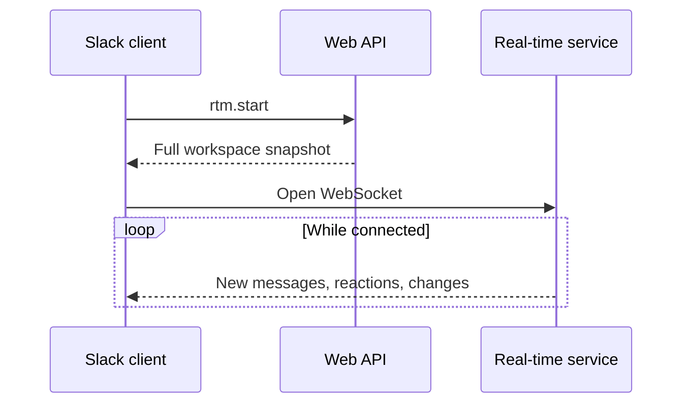
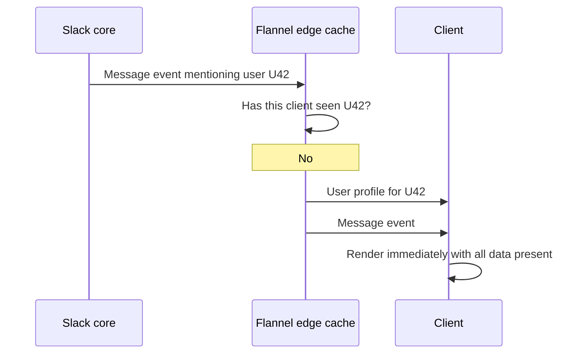
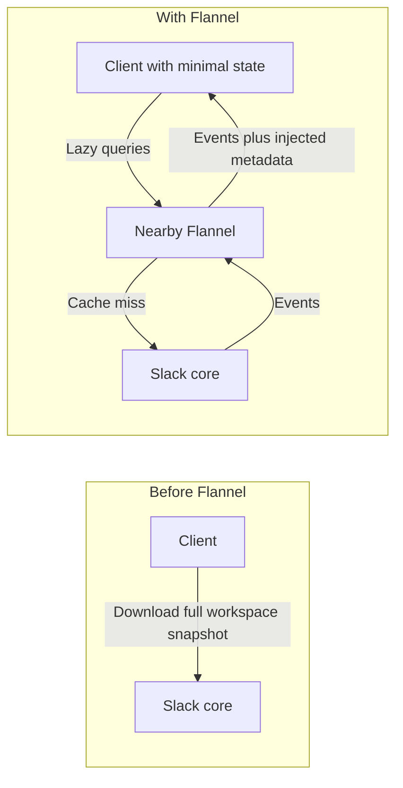
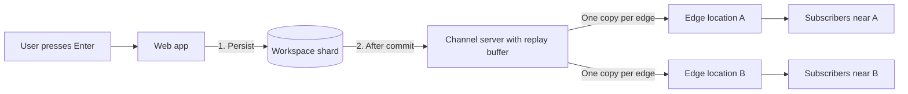
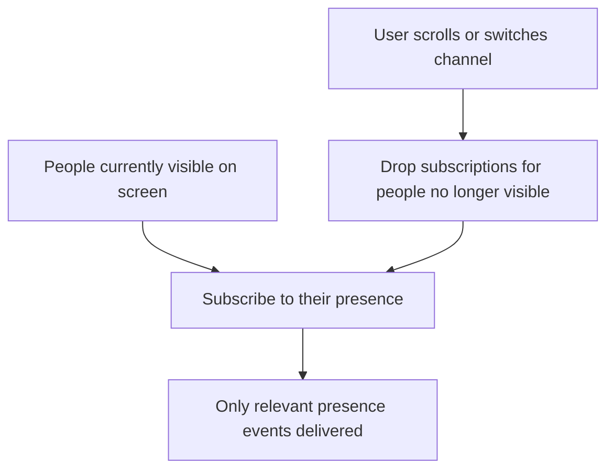
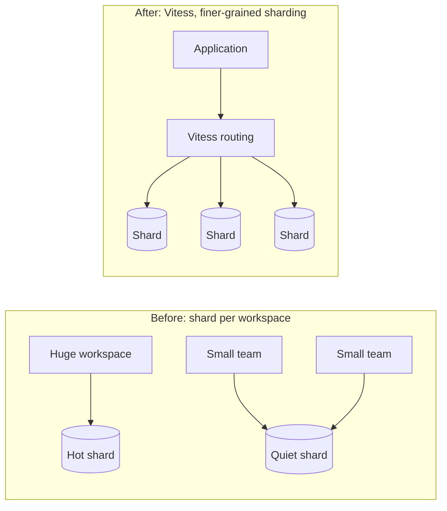
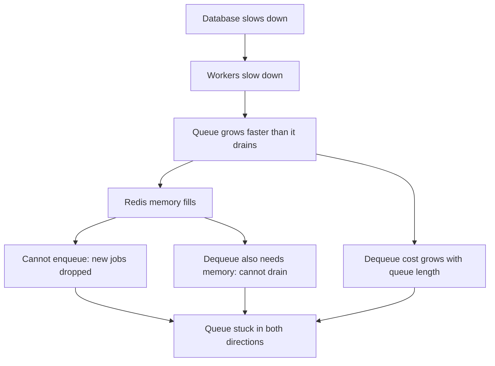
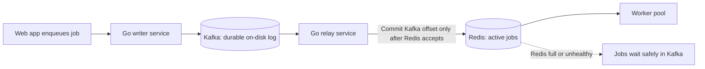
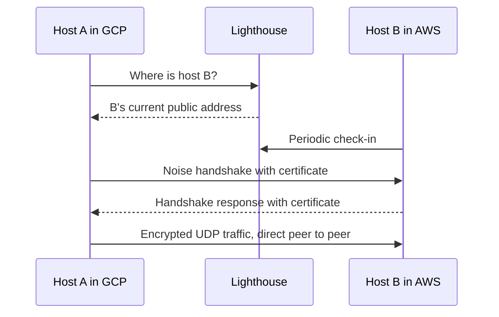
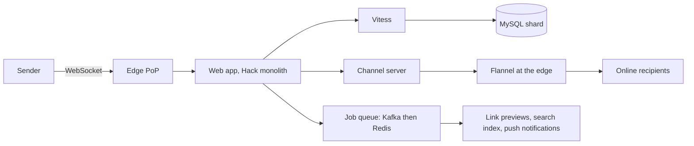

# Slack Real-Time Connections: Flannel, Channel Servers, and the Workspace Boundary

## Scope and framing

This explainer follows the supplied transcript, which describes how Slack delivers messages in real time to millions of concurrent connections and loads large workspaces quickly. The transcript draws on Slack's engineering blog and talks by Slack infrastructure engineers. This document uses the transcript as its backbone and adds well-established distributed-systems background where helpful. Figures such as concurrent WebSocket counts, payload sizes, and reduction ratios are as reported in the transcript and have not been independently verified. The transcript appears to be machine-processed in places; this document uses the standard names for the systems it mentions. The diagrams are conceptual.

Slack looks like a simple chat app: type in a channel, colleagues see it, notifications arrive. Underneath, the transcript describes one of the more complex real-time systems at scale, holding over **5 million** simultaneous WebSocket connections at weekday peak, each needing exactly the right events the moment they happen.

To make that feel instant, Slack built several things itself:

- **Flannel**, an edge cache that sits in the path of live connections and adds data to events before the client asks for it.
- **Nebula**, its own encrypted global overlay network, now open source.
- A redesigned **job queue**, after an incident in which the queue became stuck in both directions.

All of it serves two problems:

1. **Delivery:** when a message arrives, find exactly which of millions of connections should get it, and send it only there.
2. **Loading:** when someone opens Slack in the morning, load their workspace (channels, colleagues, unread messages) quickly, even for organizations with 100,000 people.

## 1. The workspace as the unit of everything

Slack is organized around the **workspace** (internally called a *team*): a sealed box containing its channels, people, messages, and files. The workspace is the unit Slack stores, caches, and routes.

That boundary is extremely useful. Large infrastructure decisions, such as how to shard data, become simpler because the system rarely has to coordinate across workspaces. The transcript returns to this boundary repeatedly: it made many things easy and a few things very hard.

## 2. Snapshot plus stream, and why it stopped scaling

### The standard design

When a client opens, it needs two things:

1. **Current state:** users, channels, memberships, unread counts, and whatever else is needed to render the app.
2. **Live updates:** new messages, reactions, and channel changes as they happen.

The standard solution is to fetch a **snapshot**, then subscribe to a **change stream**. Slack did exactly this: the client called an API (`rtm.start`) for the snapshot, then opened a **WebSocket** to receive everything after that point.

### The snapshot grew with the company

This worked while snapshots were small. But every new employee added a profile, every channel added metadata, every membership and unread count added bytes. Opening Slack came to mean downloading information about the **entire organization**, not just the part the user needed.

Per the transcript, for a 10,000-person company the payload reached tens of megabytes; for the largest organizations, clients downloaded around **100 MB** before becoming usable, then spent more time parsing it and building local state.

### Reconnect storms

Timing made it worse. At 9 a.m. when a company starts work, or after a network blip disconnects thousands of clients who then reconnect together, every client requests the same huge snapshot at nearly the same moment. This **reconnect storm** makes the back end generate its largest responses exactly when it is already under stress.

The idea of snapshot plus stream was not wrong; the snapshot had simply become too big to treat as one object.

## 3. Flannel: an edge cache in the live stream

### Lazy loading from the edge

Slack's fix was **Flannel** (named, per the transcript, because the engineer who needed a name was wearing a flannel shirt that day). Flannel is an **edge cache** running in locations around the world, close to users, holding an in-memory copy of workspace metadata: users, channels, and similar data.

With Flannel, the client starts with a very small state and asks for details **on demand**. Most such requests are answered from the nearest Flannel instance in milliseconds.

### More than a cache

The key detail: Flannel also sits **in the path of the real-time connection**. Every event from Slack to the client passes through it.

Consider a message mentioning a user the client has never loaded. Under the old design, that user's profile would have been in the startup snapshot. Under the lazy design, the client might not have it. Flannel notices, as the event passes, that the client is missing data it will immediately need to render this event, fetches that metadata from its cache, and **injects it into the stream ahead of the message**. By the time the message arrives, the client already has what it needs.

### Decoupling client and server migrations

This had a valuable side effect. Existing clients were written assuming they had every user and channel in memory. Moving to lazy loading would normally mean rewriting every client, on every platform, in coordinated releases.

With Flannel, Slack could change the back end first. Whenever an old client would expect data it no longer had locally, Flannel supplied it just in time. Existing clients behaved as if the old model still existed while the back end moved to the new one. Infrastructure and client teams could migrate **independently**, without a risky big-bang release.

### Results

The transcript reports that in a 32,000-user workspace, the startup payload changed by roughly **44 times** (the transcript's wording is garbled, but the context is a large reduction). When thousands of users reconnect at once, the load now lands on distributed edge caches rather than on Slack's core.

## 4. Delivering a message

### Persist first, then fan out

When you press Enter, the message reaches Slack's web application, whose first job is **not losing it**. It writes the message to the workspace's database before anything else. Only after the write succeeds does it deliver the message to online channel members.

If Slack delivered first and the write then failed, people would see a message that never officially existed: on screen but not in the database. So: **store, then send.**

### Channel servers and pub/sub

One message must become many: every online member needs a copy, often on several devices in different parts of the world. That is the job of the **channel server**, which keeps a live map of which clients are subscribed to which channels. It sends a message only to clients subscribed to that channel. This is classic **publish-subscribe**: a busy channel creates work only for people actually listening to it.

### Fan out near the edge

Slack also avoids a second scaling trap. If 100 subscribers are in one city, the channel server does not send 100 copies across long-distance links. It sends **one copy** to the relevant edge location, and the edge performs the final fan-out to nearby clients. The expensive long-haul link carries one copy; duplication happens near users, where bandwidth is cheap.

### A replay buffer

The channel server keeps a **buffer** of messages it has received but not finished delivering. If it crashes mid-fan-out, those messages are not lost: on restart it replays unfinished work. A failure during distribution can delay a message but not make it disappear.

## 5. Presence: subscribe only to what is on screen

The dot next to each name shows **presence**: green if online, hollow if away. The idea is simple, but it is surprisingly expensive because status changes constantly. Open a laptop, the dot turns green; close it, the dot goes hollow. Across a company of thousands, the flickers never stop, and each is an announcement to everyone who can see that name.

Broadcasting every presence change to everyone floods the system with events that are not even real messages. So Slack stopped broadcasting. A client only sees a handful of people at a time: those in the current channel and recent direct messages. It does not care whether someone three channels away just went idle.

So the client **subscribes to presence only for people currently in view**. As the user scrolls or switches channels, it drops old subscriptions and adds new ones. The transcript says this one change reduced presence events reaching clients by about **five times**.

## 6. Storage: MySQL sharded by workspace, then Vitess

### One workspace, one shard

Slack's storage is deliberately boring: **MySQL**. There is too much data for one machine, so it is sharded, and Slack chose to shard **by workspace**. A company's data lives together on one shard, and a small lookup table records which shard holds which workspace. Almost every query begins the same way: look up which database this workspace lives on. Once there, everything needed is in one place.

### Hot shards

That worked for years, until very large organizations adopted Slack: hundreds of thousands of people in one workspace, all messaging at once. Under "one workspace, one shard", the shard holding such a company carries the entire company. All of its messages land there, while neighboring shards hold a few quiet small teams. That overloaded database is a **hot shard**, and it has nowhere to shed load, because the whole design assumes a workspace never spans shards.

The available options were both bad:

- **Manually rebalance** workspaces between shards, over and over as load shifts, forever.
- **Buy ever-bigger machines**, chasing the biggest customer until hitting a hardware ceiling.

The simplifying choice had become the constraint.

### Vitess

Slack adopted **Vitess**, the system originally built at YouTube to run on top of MySQL and manage sharding. The data still lives in ordinary MySQL, but Vitess handles partitioning and routing. Two things change:

1. **Applications no longer need to know where data lives.** They issue queries; Vitess routes them to the right shard. Sharding logic moves out of application code into a layer built for it.
2. **A workspace no longer has to equal one database.** Slack can shard on finer boundaries, so one giant customer's data can be spread across many shards, and data can be rebalanced without rewriting application sharding logic.

## 7. Background jobs and the stuck queue

### Why a job queue

When you send a message or paste a link, it appears instantly. But slower work follows: generating a link preview, deciding whom to notify, indexing the message for search, running security checks. Making users wait for all that would make Slack feel slow. So Slack shows the result immediately and pushes slow work onto a **job queue**, which a pool of workers drains afterward.

### The 2016 incident

Slack's first queue ran on **Redis**, an in-memory store: fast, as a queue needs, but bounded by RAM. According to the transcript, in 2016 this caused an outage:

1. Background jobs depend on a database. The database slowed down, so workers slowed down.
2. Jobs began arriving faster than they were processed, and the backlog grew.
3. Every queued job lived in RAM, so memory filled.
4. When memory ran out, Redis could not accept new jobs, and real work was dropped.

Worse, two properties of the chosen data structure compounded the failure:

- **Dequeuing also required memory.** With none left, jobs could not be removed either. The queue was stuck in **both directions**: it could not accept new jobs and could not release old ones.
- **Dequeuing was O(n)** in the queue length. The longer the backlog, the slower each removal, so draining got harder exactly when it mattered most.

### The fix: Kafka in front of Redis

Slack placed **Apache Kafka**, a durable log that stores data on disk, in front of Redis. Kafka can hold a huge backlog without running out of memory, which is exactly what broke Redis.

The tempting move would have been to replace Redis entirely with Kafka. Slack did not. Kafka is a log: excellent at buffering streams of events, less suited to per-job queue semantics such as scheduling individual jobs and avoiding duplicate execution, which Redis already handled well. Rewriting all of that on Kafka would add risk for little benefit.

So the change was small and targeted:

- **Kafka** is the durable buffer that records every job.
- **Redis** holds only jobs currently being worked on.
- Two small **Go** services connect them. One writes incoming jobs to Kafka. The other reads from Kafka and pushes jobs into Redis, marking a job as consumed in Kafka only once it is safely in Redis, so nothing is lost in between.

If Redis fills up or has a bad moment, jobs are no longer dropped; they wait on disk in Kafka until Redis can take them.

## 8. Nebula: an encrypted overlay network

Slack runs tens of thousands of servers across multiple cloud providers and many locations. Every host must be able to talk securely to every other host, even across clouds. The transcript says no off-the-shelf solution met Slack's needs, so it built **Nebula**, an **encrypted overlay network**, and later open-sourced it.

### Identity and addressing

Each host gets a **certificate**, a signed identity binding three things:

- The host's **name**.
- A single, flat **overlay IP address**.
- The **groups** it belongs to (useful for access policy).

Any machine can be reached at its one overlay address regardless of which cloud or data center it is in. The overlay hides the underlying topology.

### Discovery with lighthouses

With no routing tables to track, how does one host find another? It asks a **lighthouse**, a lightweight discovery node whose only job is to know where every host currently is. The transcript compares it to tracker nodes in BitTorrent. The lighthouse does not relay traffic; it just tells two hosts how to reach each other, including helping hosts behind NAT establish connectivity.

### Handshake and tunnels

The two hosts then perform a handshake using the **Noise Protocol Framework**, the same family of key-exchange designs used by Signal. The transcript highlights that Slack deliberately reused proven cryptography rather than inventing its own. After the handshake, traffic flows **directly** between the hosts through an encrypted peer-to-peer UDP tunnel, not through a central server.

Nebula now runs on every Slack server. The transcript notes the irony: a company whose job is connecting people ended up building a global encrypted network to connect computers, because nothing available did the job.

## 9. When the workspace boundary breaks

Everything so far relied on the workspace being self-contained: every channel and person in it only needing each other. Even after Vitess spread data across shards, that logical assumption held. Two features deliberately break it, and the transcript calls them among the hardest things Slack has built.

- **Enterprise Grid** joins many workspaces into one organization, so a large company with dozens of workspaces can operate as a connected whole.
- **Shared channels** place one channel in two workspaces at once, sometimes belonging to two different companies, such as a supplier and a customer.

Once that happens, simplifying assumptions crumble:

- If a channel lives in two workspaces, which one owns it?
- When a message is posted, whose real-time system distributes it?
- Members sit behind different edge caches in different organizations; which edge sends to whom?

That is the cost of a sealed box. The boundary that made storage, caching, and routing easy becomes the wall you must break through when the product crosses it. Much of Slack's later work on edge caching and the real-time layer, per the transcript, involved rethinking those pieces for a world where channels and people span workspaces. The clean boundary was both a gift and a tax.

## 10. Other infrastructure notes

- **A monolith plus specialized services.** The core Slack web application is a large monolith written in **Hack** (Facebook's PHP dialect). Specialized high-performance components, including real-time servers, edge caches, job-queue infrastructure, and Nebula, are written in **Go**.
- **Cells and failover.** Slack runs across cloud availability zones treated as largely independent **cells**, so failures stay contained. When an entire region or edge location fails, automated edge failover detects it and shifts traffic via DNS, sending new connections to the next closest healthy location. The principle: design for failure and limit the blast radius.

## 11. One message, end to end

1. You press Enter; the message travels over your WebSocket through the nearest edge point of presence to Slack's core.
2. The web app writes it to your workspace's shard, located through the Vitess-managed routing layer.
3. After the write, the channel server fans it out to online subscribers, one copy per edge location.
4. As it passes through Flannel, any referenced user or channel your client lacks is injected so it renders immediately.
5. Background jobs are enqueued (via Kafka, then Redis): link preview, search indexing, and deciding who is away and should get a push notification.
6. People watching the channel see the message within a fraction of a second; people who are away get a notification.
7. Inter-host traffic throughout travels over Nebula's encrypted mesh, and failures are contained by cells and rerouted by edge failover.

## 12. Trade-offs

- **Lazy loading moves complexity to the edge.** Flannel shrinks startup payloads and absorbs reconnect storms, but it is a large, stateful, globally distributed cache that must stay correct and in the event path.
- **Workspace isolation.** It simplified sharding, caching, and routing, then produced hot shards for giant customers and made Enterprise Grid and shared channels very hard.
- **Vitess adds a layer.** It solves hot shards and removes sharding logic from applications, at the cost of operating another routing and control system.
- **Queue data structures matter.** Memory-bound queues and O(n) dequeues turned a slow database into a full outage. Kafka adds durability but also another system and relay services.
- **Owning the network.** Nebula solves cross-cloud connectivity with strong cryptography, but Slack now maintains networking infrastructure itself.

## Key takeaways

1. A cache can do more than answer requests. Flannel sits in the live stream and pre-fills data the client is about to need, which also let Slack migrate back end and clients on separate schedules.
2. Snapshot-plus-stream breaks when the snapshot grows with the customer; lazy loading from nearby caches fixes both payload size and reconnect storms.
3. Storing a message and delivering it are separate jobs: persist first, then fan out, with a replay buffer so crashes delay rather than lose messages.
4. Fan out once per edge location and let the edge do the final copies near users.
5. Subscribe to presence only for what is on screen; the transcript reports about five times fewer presence events.
6. The isolation unit is both the biggest win and the hardest wall: workspace sharding gave simplicity, then hot shards, then the complexity of shared channels.
7. Watch the boring data structures. A memory-bound queue with memory-hungry, O(n) dequeues turned a slowdown into an outage; a durable Kafka buffer in front of Redis fixed it without rewriting the queue.
8. When nothing off the shelf fits, building core infrastructure (Nebula) can be justified, especially when it reuses proven cryptography.

The transcript's closing summary: behind a simple-looking chat app sit a cache that rewrites the live stream, a fan-out service that never loses a message mid-flight, storage that can split one customer across shards, a queue redesigned around a hard failure, and a self-built encrypted network.
