# Airtable Row Limits: An In-Memory Database per Base

## Scope and framing

This explainer follows the supplied transcript, which explains why Airtable behaves the way it does, including its per-base record limits, by walking through its unusual architecture: each base loaded entirely into memory on a dedicated worker, live queries maintained incrementally, and a database engine rewritten from TypeScript to Rust. The transcript draws largely on Airtable's engineering blog, especially the post "Rewriting our database in Rust". This document uses the transcript as its backbone and adds widely known database background where helpful. Figures such as organization counts, record limits, and project durations are as reported in the transcript and have not been independently verified. The transcript appears to be machine-processed in places; this document uses standard terminology. The diagrams are conceptual.

Airtable looks like a spreadsheet: create tables, add columns, link records, share with a team, and everyone edits in real time. Underneath, the transcript describes one of the more unusual databases in production, one that breaks several usual rules:

- Queries are not executed against disk. Each **base** (Airtable's term for a document) gets a dedicated server that loads the **entire database into memory** and serves everything from RAM.
- As a result, servers are limited by **CPU**, not I/O. A normal back end spends its time waiting on a database; Airtable's data is already in RAM, so compute is what runs out.
- Pushed to the limits of JavaScript performance, Airtable spent about **three years rewriting its database engine in Rust**, which now serves production traffic.
- Every grid on screen is a **live query** the database keeps current, sending minimal changes whenever a collaborator edits a cell.

All of this serves one deceptively hard problem: a spreadsheet lets users invent structure on the fly (tables, fields, types, links, formulas), and still expects instant response, real-time sync, and continuous recalculation, for the roughly 500,000 organizations the transcript cites.

## 1. The base: a self-contained world

Everything in Airtable revolves around the **base**, a single document containing its tables, fields, linked records, and views, all within one bounded space.

What makes it hard is that the **schema is defined at runtime** by users. They add a table, add a field, pick its type, link it to another table, write a formula, and the system must store and process this arbitrary structure as though it had always existed. In a typical application, engineers design a fixed schema in advance. In Airtable, the schema is whatever a user just typed, and it must stay instant while several people edit at once, with formulas and linked records recalculating in real time.

The base as a bounded, self-contained world is what makes the rest of the architecture possible.

## 2. One worker per base, entirely in memory

When a base is opened, Airtable assigns it a dedicated server process called a **worker**. The worker reads the **whole base into memory** up front and serves everything from there.

This is not a cache in front of a database. The in-memory structure **is** the database the system operates on; the transcript says Airtable calls it **MemApp**. It is single-tenant: each base gets its own worker, isolated from others.

A small management service, the **supervisor**, decides which worker serves which base, routes requests to the right worker, and manages worker lifecycles.

### Why isolate bases

The motivation is the **noisy neighbor** problem: one customer, such as a large enterprise running a heavy workload, starving everyone else on the same machine. Giving each base its own worker and memory means one busy base does not slow down others.

The mental model is not one big shared database but **thousands of small in-memory databases**, one per base, each with its own worker.

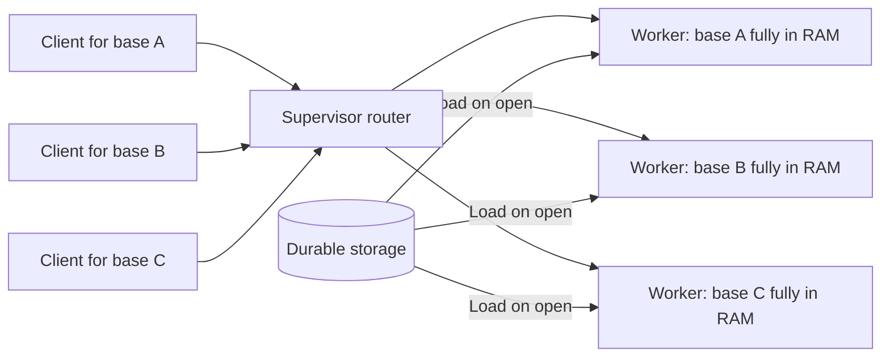

## 3. The ceiling: one base must fit on one machine

An experienced engineer's first question: if a whole base lives in one worker's memory, must the base fit on one machine? Yes.

A base cannot simply be spread across ten servers, because the techniques that make Airtable fast (in-memory live queries and dependency graphs, described below) require the entire base in one place. Split it, and those optimizations stop working.

So the size of a base is bounded by one machine's **RAM and cores**. That is the real reason Airtable has **per-base record limits**. The transcript says performance begins to degrade beyond roughly **100,000 records**, and even top plans cap bases a little above that. The number is not arbitrary; it approximates how much data one machine can hold in memory while staying fast.

The transcript links this to the "hot shard" problem in Slack, where one tenant grew too large to split. In Airtable, that constraint is not accidental; it is the price the architecture pays for in-memory speed.

## 4. CPU-bound, not I/O-bound

Most web back ends are **I/O-bound**: they spend most of their time waiting on database queries, caches, and network calls while the CPU idles. Airtable inverts this. The base is already in memory; there is nothing to wait for. Filtering 100,000 records, recomputing a formula column, or summing values across linked tables is **pure computation in RAM**.

So workers are **CPU-bound**, and that changes how to scale:

- **I/O-bound systems** scale by adding waiting capacity: more connections, more mostly idle machines.
- **CPU-bound systems** need real compute and must use every available core.

That fact is what ultimately forced Airtable's biggest architectural decision (section 9).

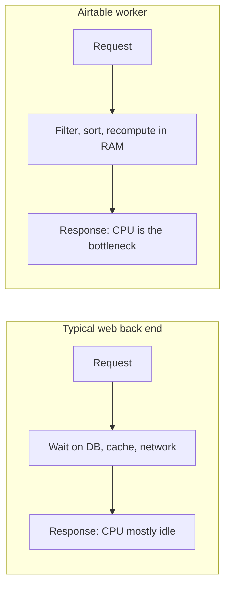

## 5. Live queries and incremental view maintenance

When a collaborator edits a cell, everyone sees it immediately, whether they are looking at a grid, a filtered view, or a Kanban board. Each person may be looking at a **different view** of the same data: filtered, sorted, or grouped differently. Each view is effectively a **live query** against the open base.

The obvious way to keep them current is to **rerun every query on every change**. At Airtable's scale, with many people watching many views, that would be very wasteful.

Instead, the database performs **incremental view maintenance**: when a write arrives, it determines how that specific change affects each live query **without rerunning it**. For example, a new record might fall inside your filtered view but not mine, and land at a specific position in your sort order. The system produces a small **diff**, a precise instruction telling your client exactly what to change on screen. Each open view gets its own tiny personalized update.

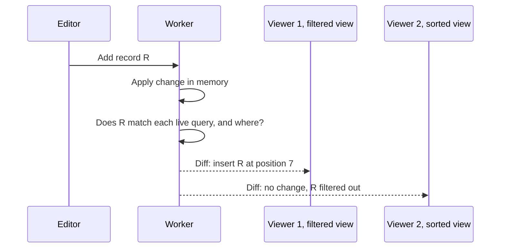

## 6. A second in-memory copy in the browser

The Airtable client is not a thin terminal that asks the server to render on every scroll. The browser tab keeps its **own working copy** of the base data in memory and applies the diffs the server sends. Scrolling, sorting, and switching views mostly happen locally, which is why the product feels instant even on slow connections.

So there are effectively **two in-memory copies** of each open base:

- An **authoritative** copy on the worker.
- A **mirror** in each browser, kept in sync by the diff stream.

This also helps explain the record limit: even if the server could hold more, the browser has its own limit on how much it can keep in memory while staying responsive.

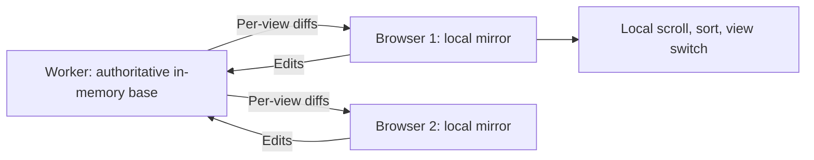

## 7. The dependency graph: a spreadsheet engine inside a database

Airtable does not just store data; it continuously **derives** data from data:

- **Linked records** connect tables, so a change in one can affect another.
- **Lookup** fields pull values across links.
- **Rollup** fields aggregate across linked records.
- **Formula** fields compute from other fields.

Records depend on one another, often across tables, forming a **dependency graph**. Changing one value may require recomputing every formula that references it, every rollup built on it, every lookup displaying it elsewhere, and every view currently showing any of those results.

This looks less like a traditional database and more like a **spreadsheet recalculation engine**, except it runs on a server for many users at once and serves as a single source of truth.

Airtable keeps the dependency graph **in memory**. When a value changes, it walks the graph directly to enumerate everything affected, with no round trips to a database. This pointer-chasing workload would be very expensive with a query per hop; it is efficient only because the whole graph is in RAM.

The pattern: **apply the change, enumerate everything it affects, recompute, and push results to clients.**

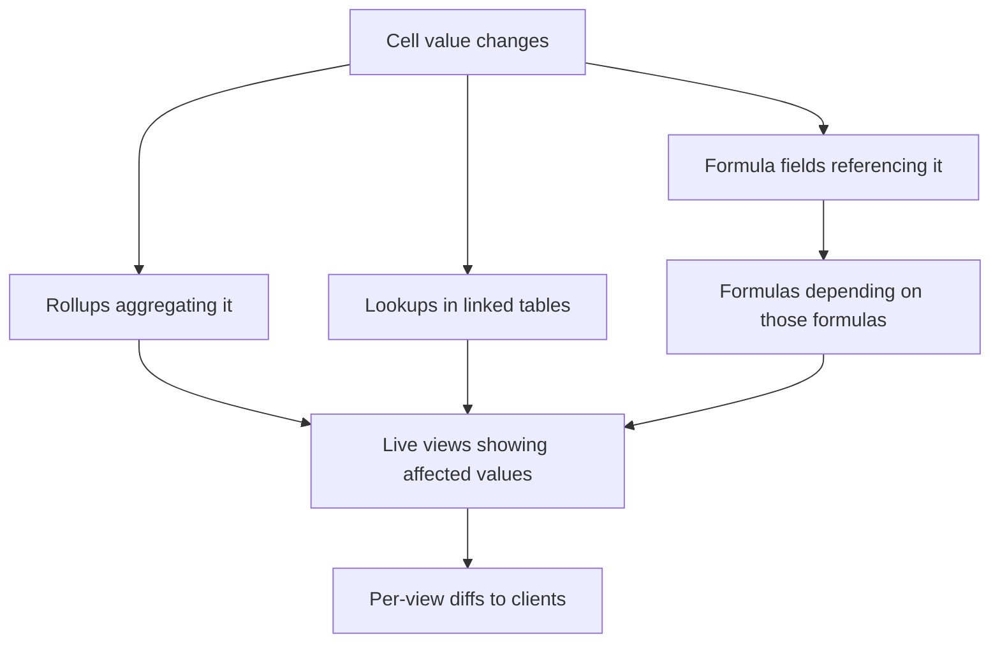

## 8. A database engine built for spreadsheet behavior

Airtable needs spreadsheet behavior with database guarantees: transactions, consistency, replication, and storage for billions of records overall. Off-the-shelf databases are designed for conventional applications, not collaborative spreadsheets where users freely create columns, link tables, drag rows, and write interdependent formulas. So Airtable built its own engine, which lets it make common spreadsheet operations cheap.

### Fractional indexing for row order

Drag a row between two others. Relational tables have no inherent row order, and maintaining an explicit order usually means renumbering everything below the moved row.

Airtable uses **fractional indexing**: each row has a position value. Moving a row between positions 2 and 3 gives it position 2.5; inserting another between 2.5 and 3 gives 2.75. Only the moved row changes.

As general background, repeated insertions between the same neighbors eventually exhaust floating-point precision, so production implementations often use arbitrary-precision keys (for example, strings) or occasionally rebalance positions.

### Transactional, non-blocking schema changes

Adding a column is technically a schema change. In many databases, schema changes can lock tables and interrupt work. Airtable made schema changes **transactional and deferred**, so a new field appears instantly while everyone keeps working.

### Human-friendly sorting

Locale-aware sorting is built into the engine, so values like 1, 2, and 10 sort the way a person expects rather than purely lexically.

### Bulk operations as first-class primitives

Some changes touch a whole column at once: a formula using the current time depends on a constantly advancing clock; changing a field type from text to something else may require converting every value. In a traditional database these are large operations affecting every row. Airtable users trigger them constantly by editing fields and formulas, so the engine includes specialized **bulk primitives** that rewrite large portions of a table as a single operation rather than row by row.

None of these features sounds impressive alone. Together they show the broader pattern: owning the database lets spreadsheet operations stay instant even with many records underneath.

## 9. The runtime wall and the Rust rewrite

### Single-threaded JavaScript meets CPU-bound work

Workers are CPU-bound, so the way to go faster is to use more cores. But Airtable's database was written in **TypeScript on Node.js**, which executes JavaScript on a single main thread. One core would be busy while others sat mostly idle.

Node.js has ways to add parallelism, but they conflict with Airtable's architecture. Workers need fast access to the **entire** base, which exists as a large in-memory structure, tens of gigabytes for big enterprise bases per the transcript. Separate processes each have their own memory, so parallelizing that way would mean **multiple copies** of the base: very expensive in memory, and every edit would have to propagate to every copy to keep them consistent.

Airtable was stuck between two constraints: data had to stay in memory for performance, but the runtime made it hard to spread computation across cores over **shared** in-memory state. The bottleneck was the programming model, not the hardware.

### Rewriting the core in Rust

Airtable rewrote the heart of its back end, the in-memory database, in **Rust**. Rust offers high performance and fine control over memory without a whole class of memory-safety bugs common in low-level code. Airtable already ran small Rust modules in production, so it knew how to deploy Rust and bridge it with TypeScript.

The rewrite removed the core limitation:

- Base data lives in **shared memory** that many threads can read safely at the same time.
- Each worker runs **one writer thread**, a **pool of reader threads**, and a **dispatcher** routing each request to the right thread, so many cores work on one base in parallel.

Because this time Airtable was building a real database engine, it added proper guarantees:

- Transactions with **MVCC** (multi-version concurrency control), so readers and writers do not block each other.
- **Indexes**, **foreign keys**, **uniqueness constraints**, and **triggers**.

The transcript says this took about **three years** of development, testing, and migration, and the engine now serves production traffic. It compares the move to Discord's use of Rust for performance-critical services.

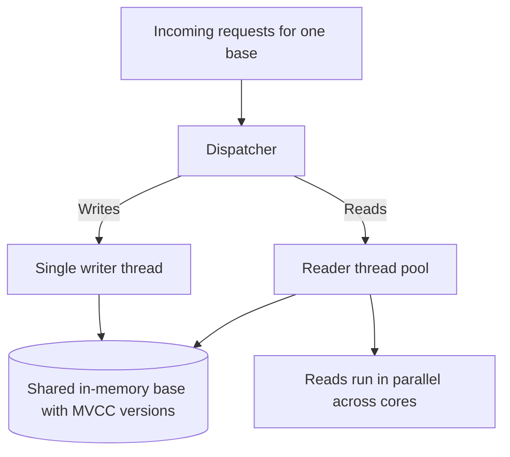

## 10. Concurrency: one writer, many readers

What happens when two people edit the same cell at the same moment? Airtable's answer is simple. Each base has **one write path**. All writes, from wherever they come, pass through a single channel and are applied **sequentially** in a well-defined order. Two edits never apply simultaneously; one goes first, the other immediately after. If both change the same cell, **the last write wins**. The base never ends up ambiguous or partially updated.

Would a single writer make everyone wait? Reads work differently. The reader pool keeps serving while writes proceed, and because of **MVCC**, readers see a consistent snapshot without blocking the in-progress write.

The result is a clean split: writes are serialized through one ordered path for consistency; reads run in parallel for speed. One writer, many readers, one shared in-memory base.

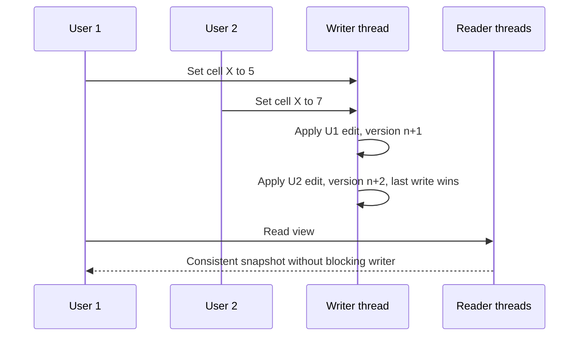

## 11. Migrating a live database safely

Replacing the database under a running product is among the riskiest things an engineering team can do. If the new engine behaves even slightly differently, the result is not a performance bug; it is **corrupted customer data**.

### A stable interface

Airtable first created a **stable interface** between the application and the database: a layer that spoke Airtable's application language on one side and database operations on the other. The product could keep evolving in TypeScript while the new engine was built independently in Rust. Feature development continued throughout instead of freezing for years.

### Shadow execution and continuous comparison

Then, over a long period, many operations ran against **both** the old and new engines, and their outputs were **automatically compared**. Mismatches were investigated. Airtable also built tools that continuously compared **entire datasets** across the two systems, hunting for any discrepancy, however small. Before the new engine handled production traffic on its own, it had already processed the same workloads as the old one many times over, with every divergence found and fixed.

The lesson: do not cut over a critical system and hope. Run old and new in parallel, compare relentlessly, and switch only when the differences disappear.

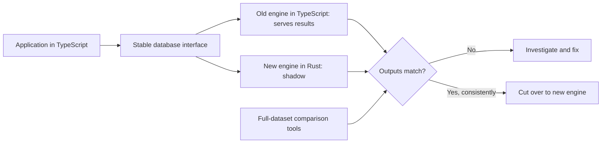

## 12. Durability and load time

RAM is volatile; a power loss erases it. So the in-memory database is a **serving layer**, and the durable copy lives on disk. When a worker takes ownership of a base, it loads that data into memory before serving requests.

That creates a distinctive bottleneck: once in memory, a base is very fast, but **getting it into memory** is the expensive step. Loading large bases, rebuilding in-memory state, and recovering from failures all depend on storage and replication. The transcript says Airtable invested heavily in infrastructure around the engine (replication, durable logs, snapshots, faster recovery) to shorten the time between a base on disk and a base ready in memory.

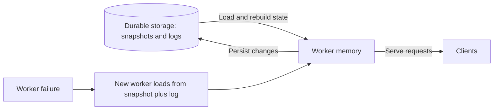

## 13. Why now: AI agents change the workload

Why take on such an ambitious rewrite? For most of Airtable's history, the system was tuned for **people**: slow typists making a few edits, running a few queries, occasionally automating something.

AI changes that assumption. An agent does not work at human speed. It can read thousands of records, make many updates, and run for hours, and organizations may run **fleets** of agents on the same data at once. The workload is no longer shaped by people but by software acting for people. A system built for human-scale interaction must now withstand machine-scale interaction. Per the transcript, that pressure justified rebuilding the database foundation.

## 14. AI search: embeddings live elsewhere

Airtable added AI-powered semantic search. Instead of matching exact keywords, a user can ask to "find similar campaigns" and get results based on meaning. Each row is converted into an **embedding**, a vector representing its content, so rows about similar topics end up near each other even without shared words. Embeddings also enable **suggested links**, for example proposing that a project be linked to a team it never names, because their embeddings are semantically close.

### Why not keep them in memory

The obvious place to store embeddings would be the in-memory database. But embeddings are large: per the transcript, a vector can be roughly an order of magnitude larger than the row it represents, and memory is one of the most expensive resources in Airtable's architecture. Storing them in the base would mean paying for RAM on every row of every base.

So Airtable keeps operational data in the main database and embeddings in a **separate vector database**, **Milvus**, chosen primarily because it can be self-hosted, keeping customer data on Airtable's own infrastructure.

### Eventually consistent vectors

Separation also allows a different consistency model. Generating an embedding requires calling an AI model, which is too slow to do inside user transactions; if every edit waited for a new embedding, the product would slow down immediately. Airtable updates embeddings **asynchronously**, tracking which ones are stale. The operational database stays strictly consistent; the vector database may lag slightly.

### Query flow

1. Convert the user's query into an embedding.
2. Ask the vector database for the nearest matches.
3. Get the matching row IDs.
4. Load the **latest** versions of those rows from the main database.

The in-memory database stays compact and focused on current data; large vectors live in a system built for similarity search.

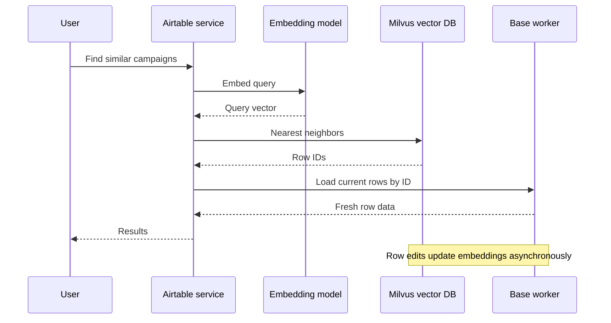

## 15. One edit, end to end

Imagine dragging a row to a new position and changing a value in it:

1. The browser sends the change; the supervisor routes it to the worker owning the base, which already holds the whole base in memory.
2. The dispatcher sends the edit to the writer thread, which applies it in a transaction.
3. The moved row gets a new fractional position between its neighbors; nothing else is renumbered.
4. The dependency graph is walked: formulas referencing the value recompute, rollups update, lookups elsewhere refresh.
5. For each collaborator's live view (each with its own filter, sort, and grouping), the engine computes the minimal diff and sends only that.
6. Browsers apply the diffs to their local mirrors; screens update almost instantly.
7. The change is persisted to durable storage.
8. If the row participates in AI features, its embedding is recomputed asynchronously and written to the vector database.

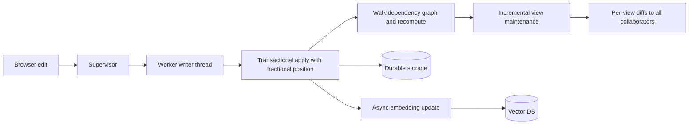

## 16. Trade-offs

- **Per-base size ceiling.** Keeping a whole base in one worker's memory bounds its size to one machine (and to what a browser can mirror). Hence the record limits.
- **Load and recovery cost.** Fast once loaded, but loading and recovering large bases is expensive and needs dedicated storage and replication engineering.
- **CPU-bound scaling.** Performance depends on using all cores well, which drove a three-year engine rewrite.
- **Custom database engine.** Owning the engine enables fractional ordering, deferred schema changes, bulk primitives, and incremental views, but Airtable must build and maintain database guarantees itself.
- **Single writer per base.** Simple and consistent, with last-write-wins semantics on conflicts; write throughput per base is bounded by one serialized path.
- **Split storage for AI.** Keeping embeddings in a separate vector database preserves memory, at the cost of eventual consistency and another system to operate.

## Key takeaways

1. If data fits in memory and the work is compute-heavy, holding the whole dataset in RAM shifts you from I/O-bound to CPU-bound. Everything gets faster, provided you use all cores and accept that a tenant must fit on one machine.
2. Airtable's per-base record limits follow directly from that design: one base, one worker, one machine's memory, plus the browser's own mirror.
3. Do not rerun queries to keep views fresh. Compute how each change affects each live query and send only the diff.
4. An in-memory dependency graph turns formula, lookup, and rollup recalculation into fast graph traversal.
5. Use fractional indexing to reorder without renumbering.
6. The language runtime can be the bottleneck. Single-threaded JavaScript could not parallelize over shared in-memory state; Rust with one writer, many readers, and MVCC could.
7. Replace critical systems by running old and new in parallel, comparing outputs and full datasets, and cutting over only when differences vanish.
8. Keep expensive storage compact. Large, derived data such as embeddings belongs in a cheaper, specialized store with relaxed consistency.
