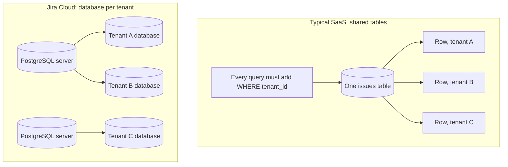
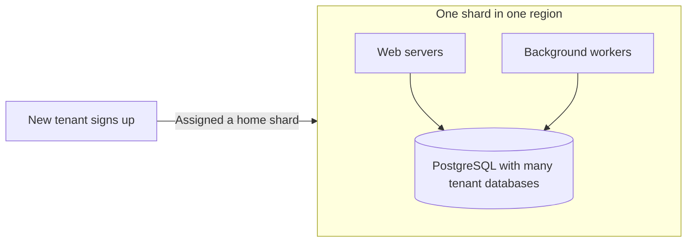
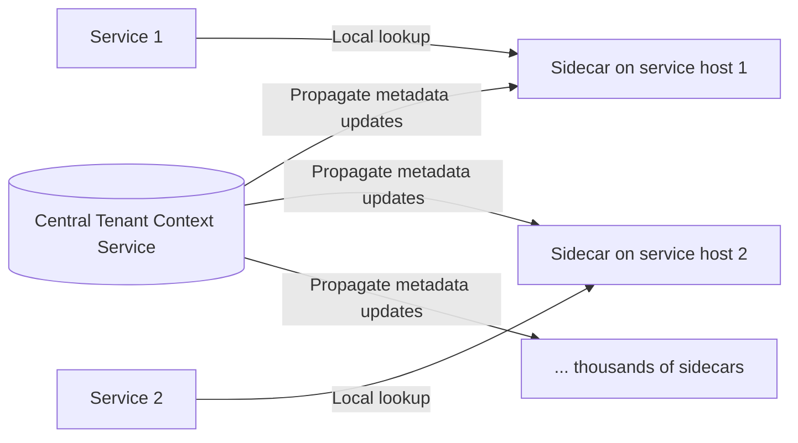
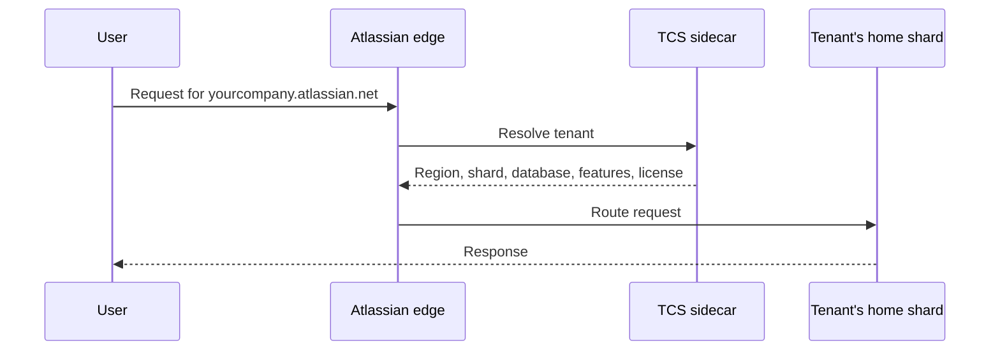
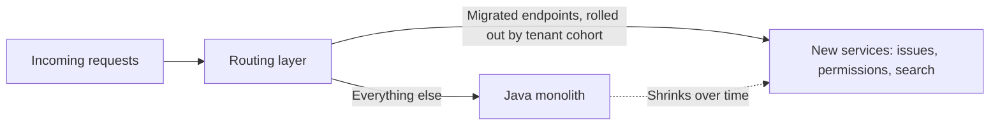
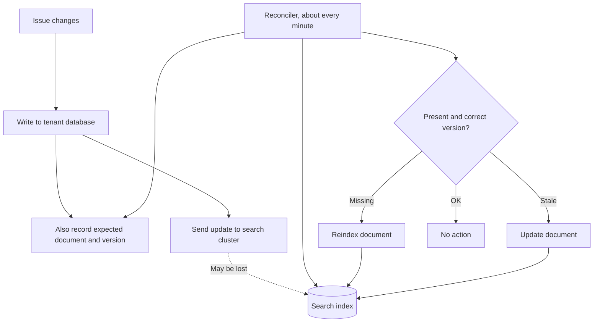
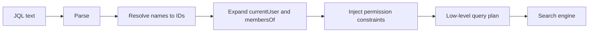
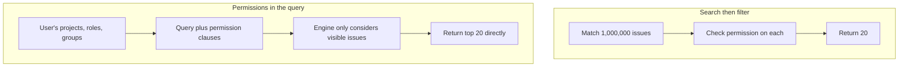
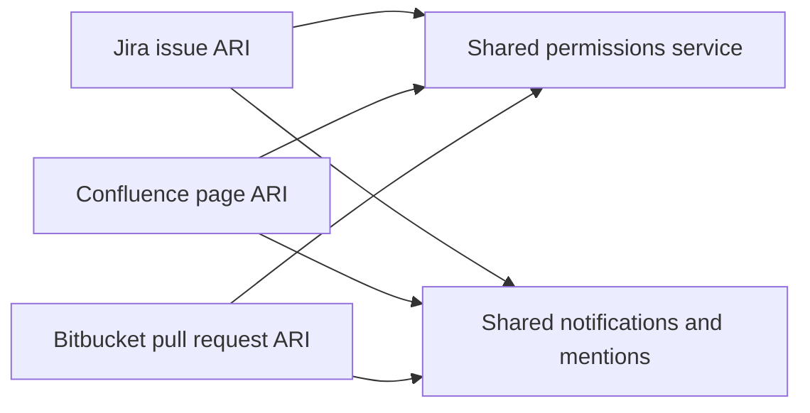
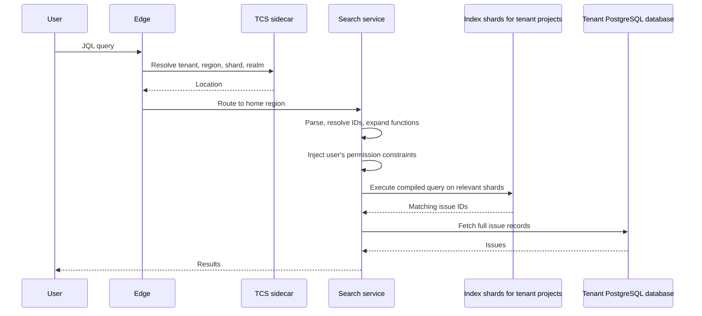

# Jira Rebuild: From Installable Monolith to Multi-Tenant Cloud Platform

## Scope and framing

This explainer follows the supplied transcript, which describes how Atlassian re-architected Jira from a Java application customers installed on their own servers into a global, multi-tenant cloud platform. The transcript draws on Atlassian's technical publications about tenant routing, search architecture, and cloud migration. This document uses the transcript as its backbone and adds widely known SaaS and search background where helpful. Figures such as tenant database counts, server counts, and request rates are as reported in the transcript and have not been independently verified. The transcript appears to be machine-processed in places; this document uses standard names where they are clear and omits names that are too garbled to identify. The diagrams are conceptual.

Jira looks simple: create an issue, assign it, move it across a board, search. Underneath, the transcript describes a system serving **hundreds of thousands of companies**, each with its own projects, workflows, permissions, and data, while giving each one the illusion of a private Jira instance.

The transcript walks through seven engineering decisions:

1. Giving each customer its **own database** rather than shared tables.
2. A **tenant routing service** every request depends on.
3. **Thousands of local sidecar copies** of that routing data.
4. Keeping the **search index reconciled** with millions of databases without constant rebuilds.
5. Treating **JQL as a compiled language**, not a search string.
6. Building **permissions into the search query** so unauthorized issues never appear.
7. A shared **platform** with a universal **resource identifier**, so Jira, Confluence, Bitbucket, and other products share services.

None of this existed in Jira's original design. Jira began as installable Java software, and today's cloud version is the result of years of incremental transformation, carried out without taking the service down.

## 1. From one install per customer to one platform for everyone

For most of its history, Jira was software a company bought, installed on its own servers, and connected to its own database. That model is simple: each customer has its own copy, with no sharing, no noisy neighbors, and no chance of one company's data leaking into another's.

**Jira Cloud** changes the problem. Atlassian does not run one Jira per company; it runs Jira for hundreds of thousands of companies on shared infrastructure. Every project, issue, attachment, workflow, and permission must belong to the right customer, while each customer should still feel it has a private instance.

The concept that makes this possible is the **tenant**: a single customer's Jira site, such as `yourcompany.atlassian.net`. Every request, piece of data, search, and permission check is scoped to a tenant. Choosing the tenant as the system's fundamental boundary drove decisions about storage, routing, search, and service communication.

## 2. A database per tenant

### Shared tables vs. separate databases

Most SaaS applications use a **shared schema**: all customers in the same tables, with a `tenant_id` column that every query must filter on.

Jira does not. Atlassian gives **each tenant its own database**. Per the transcript, Jira Cloud now has **millions** of tenant databases: not millions of servers, but millions of logical databases, many hosted together on shared PostgreSQL instances across a large fleet of database servers worldwide. A Fortune 500 company and a ten-person startup may share a physical machine while their data lives in completely separate databases.



### Why: isolation

In a shared-table model, separation depends on **application logic**; every query must remember to filter by tenant, and one missed filter is a data leak. In Jira's model, separation exists at the **database boundary**. One tenant cannot accidentally query another's data because it is not in the same database.

Benefits the transcript highlights:

- A bad query affects **one customer**, not everyone.
- Migrations can proceed **tenant by tenant**.
- **Data residency** is easier: a single customer can move to another region without affecting others.

### The cost: operational complexity

Running millions of databases raises problems most SaaS companies never face. The **noisy neighbor** is a major one: a large customer can consume so many database resources that others on the same server slow down. Atlassian enforces strict **per-tenant limits on database connections** to contain this. The system is harder to operate, but Atlassian judged isolation worth it.

## 3. Shards: homes for tenants

Millions of databases cannot be scattered randomly. They must be grouped, managed, and movable as the platform grows. When Jira moved to AWS in a multi-year program the transcript names **Project Vertigo**, the platform was organized into **shards**.

A shard here is not just a database server; it is a **slice of the platform**:

- Web servers that handle requests.
- Worker nodes for background jobs.
- A PostgreSQL instance holding the tenant databases assigned to that shard.

When a new customer signs up, Atlassian places it on a specific shard in a chosen AWS region, and that shard becomes its home. So before anything else, a request must answer one question: **which shard serves this tenant?** A customer in London might have data in Frankfurt, Sydney, or Virginia, and a request cannot read or update a single issue until it knows.



## 4. Tenant Context Service: the directory everything depends on

A database per tenant solves isolation but creates a routing problem. Before Jira can do anything, it must know, for a given tenant:

- Which region and shard it lives on.
- Which database holds its data.
- Which features are enabled and what license it has.

That information lives in the **Tenant Context Service (TCS)**, effectively the system's directory: given a tenant ID, it returns where that tenant's data is and how it is configured.

Its importance is hard to overstate. Nearly every request depends on it. If TCS were unavailable, Jira would not know where any tenant's data lives, and much of the platform would stop working. Atlassian treats it as **critical infrastructure**. Per the transcript, it handles tens of thousands of requests per second per region with latency of a few milliseconds, and is heavily **read-optimized**, since lookups vastly outnumber updates.

## 5. Sidecars: thousands of local copies

The most interesting design choice: most services **do not call the central TCS at all**. Atlassian runs lightweight **TCS sidecars** throughout the platform, thousands of them, each keeping a **local copy** of tenant metadata. A service resolves a tenant with a local lookup instead of a network call to a remote dependency.

That:

- Removes network latency from the hot path.
- Reduces load on the central service.
- Avoids turning every request into a chain of remote lookups.
- Lets services keep working from local data if the central service is briefly unreachable.



When a request reaches Atlassian's edge, the platform identifies the tenant, resolves its location via TCS data, and routes the request to the right region and shard. Only then does the real work begin.



## 6. Breaking up the monolith, gradually

For years, Jira was one large **Java monolith**: issues, boards, workflows, permissions, search, and notifications in one codebase, one process, one database. Monoliths work well for a long time; trouble arrives when parts grow at different rates. Search may need very different scaling than permissions; issue handling differs from board rendering. Scaling everything as one unit becomes wasteful.

Atlassian began splitting responsibilities into services: issues got their own service; permissions and configuration got theirs; search got a dedicated service. Each can scale, deploy, and evolve independently.

The hard part was not designing new services but **moving millions of users without them noticing**. Atlassian migrated **incrementally** rather than rewriting and flipping one giant switch:

- Route one operation, page, or API endpoint to the new service while everything else continues through the monolith.
- Enable it first for a small group of tenants and watch closely.
- Expand as confidence grows.

Over time, more requests bypass the monolith. The platform transforms continuously while staying live, and users often do not realize the system serving them is substantially different from a year earlier. As general background, this is the **strangler fig** pattern.



## 7. Keeping the search index honest

### Search runs on a copy

Search does not run directly against Jira's databases; that would be far too slow. Jira maintains a separate **search index**, historically built on **Apache Lucene**. Each issue becomes a searchable document, and queries run against the index.

The index is not the source of truth; it is a **copy**, and every copy must be kept in sync.

### The full-reindex problem

Most changes are simple: an issue updates, and its document updates. But some changes are broad: adding a calculated field, changing field configuration, altering visibility rules. Suddenly thousands or millions of documents may be wrong. Which ones need reindexing was often unclear, so the safe answer was a **full reindex**.

On large instances, a full reindex could take hours, consume significant CPU and memory, and load the system heavily while Lucene rebuilt and merged index structures. If interrupted, administrators could be left with incomplete, locked, or corrupted indexes. The transcript's point: the problem was not Lucene but the architecture of depending on a copy without a reliable way to keep it correct.

### Continuous reconciliation

The fix was to stop treating the index as something rebuilt occasionally and start treating it as a system that **continuously checks itself against the database**:

1. When an issue changes, Jira immediately sends the update to the search cluster.
2. Because networks fail, messages get lost, and machines restart, a successful database write does not guarantee the index was updated. So alongside the change, Jira writes **metadata to the database** describing which document should be indexed and at which **version**.
3. That record becomes the source of truth for indexing.
4. A **background reconciliation job** repeatedly compares the database's record with the search cluster, roughly every minute per the transcript: are the expected documents present, and at the right versions?
   - Missing document: reindex it.
   - Stale version: update it.
   - Lost message: the gap is eventually detected and fixed.

The database becomes a **checklist for the index**. Instead of assuming the index is right, Jira keeps verifying it.



### Zero-downtime rebuilds

The same philosophy applies to full rebuilds. Instead of replacing the live index in place:

1. Build a **new index alongside** the existing one while search keeps working.
2. When the rebuild finishes, **replay** changes that happened during it so the new index is fully current.
3. **Atomically switch** search traffic to the new index.

Users do not notice.

The broader lesson from the transcript: whenever you maintain a search index, cache, replica, or any derived view, the challenge is not creating it but **keeping it correct**. Reliable systems assume drift will happen and continuously verify and restore consistency.

## 8. JQL is compiled, not executed

JQL (Jira Query Language) looks simple, for example:

```text
project = PAYMENTS AND assignee = currentUser() ORDER BY created DESC
```

But a search engine cannot execute that text directly, because indexes are built on **internal identifiers**, not human-readable names. The index does not know what "PAYMENTS" is; it knows a project ID. It does not know who "developers" are; it knows sets of user IDs.

So Jira processes JQL like a programming language:

1. **Parse** the query.
2. **Resolve names** to IDs: projects to project IDs, users to user IDs, groups to sets of user IDs.
3. **Expand dynamic functions** at query time: `currentUser()` depends on who is asking; `membersOf()` depends on current group membership.
4. **Validate** the query.
5. **Transform** it into a low-level representation optimized for the search engine (the transcript mentions OpenSearch as the execution target).

By the time the query reaches the index, it looks nothing like what the user typed. **Jira does not execute the text; it compiles it.** And before running, the compiler must solve one more problem: what is this user allowed to see?



## 9. Permissions inside the query

### Why permissions make search hard

Finding relevant issues is easy; finding the ones a user is **allowed** to see is hard. Jira's permission model is rich:

- Access can depend on the project, the user's role, or group membership.
- Some issues have their own **issue-level security** rules.
- Some permissions depend on the issue itself: the reporter can see their issue; the assignee can see issues assigned to them.

### Why post-filtering fails

The obvious approach is to search first, then check permissions on each result. At Jira's scale that is disastrous: a query might match a million issues while the user only needs the first 20. Running a million permission checks to show 20 results will never be fast, and paging gets worse because each page may need many more candidates.

### Permissions as part of the query

Jira does not filter after searching. It **builds permission checks into the search query**:

- **Project-level** permissions are represented directly in the index, so the engine can exclude whole sets of issues before they are ever candidates.
- **Dynamic** rules (reporter, assignee, group-based access) cannot be computed once and stored. At query time, Jira gathers the permission facts relevant to the current user (their groups, granted permissions) and folds those constraints into the query sent to the index.

When the query reaches the engine, it already knows what the user may see. Permissions are not a filter on results; **they are part of the query itself**.



## 10. Index layout matches how people search

The search index is not one giant undifferentiated pile. Jira partitions it by **tenant and project**, keeping all of a project's issues together on the same index shard.

Most Jira searches concern a specific project or a small set of projects: open bugs in Payments, high-priority items in Mobile, everything assigned to me in Infrastructure. Because related issues are co-located, Jira can route a query to only the shards holding those projects instead of the whole index. A company with thousands of projects and millions of issues typically touches only a small fraction per query.

The principle: **data that is queried together should be stored together.**

## 11. The platform: shared primitives and data residency

### Atlassian Resource Identifiers

As Atlassian's products grew, the same needs kept recurring: permissions in Jira, Confluence, and Bitbucket; comments, mentions, and notifications everywhere. Building each separately per product meant solving the same problem repeatedly.

Atlassian introduced a common primitive: the **Atlassian Resource Identifier (ARI)**. Every significant object gets one: a Jira issue, a Confluence page, a Bitbucket pull request. With uniform identifiers, platform services no longer need product-specific logic. A permissions service can simply answer "can this user read this resource?" whatever the resource is. The same holds for comments, mentions, and notifications: build once, reuse across products. Standardize the primitives, and shared services become much simpler.



### Realms and data residency

As Jira went global, **data residency** became a requirement. Enterprises and regulators increasingly require guarantees about where data physically lives: European customers in Europe, Australian customers in Australia.

Atlassian models this with **realms**: a realm defines the set of regions where a tenant's data may be stored. This is recorded centrally, so every service can make decisions that respect it. Routing is therefore not only about performance. When TCS answers "where does this tenant live?", the answer is constrained by hard residency boundaries, not just the nearest convenient region.

Those boundaries can change: customers relocate, rules change, companies enter new markets. So Atlassian built the ability to **migrate tenants between realms**, replicating data while preserving the customer experience. The database-per-tenant model makes such per-customer moves tractable.

### Micros: the deployment platform

Beneath Jira, Confluence, and other cloud products sits an internal platform the transcript calls **Micros**, responsible for deploying and running services across AWS regions worldwide. Its value is invisible in steady state and obvious when scaling: deployment, networking, service discovery, and operational tooling are standardized, so standing up services in a new region is much easier. The transcript says Atlassian engineers described building an entire new global region during a hackathon as closer to a configuration exercise than an infrastructure project.

## 12. A JQL search, end to end

1. You type a JQL query and press Enter. The request reaches Atlassian's **edge**.
2. The platform resolves your tenant through **TCS** (via a local sidecar), identifying your home shard and region and respecting your realm's residency constraints.
3. In the right region, the **search service** parses and compiles the JQL: names become IDs, and `currentUser()` and `membersOf()` are resolved from your identity and current state.
4. It gathers the **permissions** that apply to you (groups, roles, grants) and injects them into the query plan.
5. The query goes only to the **index shards** holding your tenant's relevant projects.
6. The index returns matching **issue IDs**.
7. Full issue records are fetched from your tenant's dedicated **PostgreSQL database** and rendered.
8. Results are accurate because background **reconciliation** keeps the index aligned with the database.



## 13. Trade-offs

- **Isolation vs. density.** A database per tenant gives strong isolation, per-tenant migration, and residency control, but multiplies operational work across millions of databases and requires per-tenant resource limits.
- **Central routing dependency.** TCS is on nearly every request's path; sidecars reduce latency and load but add a distributed cache of metadata that must stay current.
- **Derived data drift.** A separate search index is fast but will drift; continuous reconciliation and shadow rebuilds are ongoing costs.
- **Compiled queries.** Treating JQL as a language enables efficient execution and permission injection, but requires building and maintaining a compiler pipeline.
- **Permission complexity.** Folding dynamic permissions into queries scales well but ties the search engine closely to the permission model.
- **Incremental migration.** Strangling the monolith endpoint by endpoint avoids a risky big bang, at the cost of running old and new paths side by side for a long time.

## Key takeaways

1. Multi-tenancy does not have to mean shared tables. Atlassian chose isolation over density with a database per tenant, accepting operational complexity for smaller blast radius, easier migration, and cleaner separation.
2. When every request depends on knowing where a tenant lives, that lookup is critical infrastructure. Jira's Tenant Context Service is optimized for fast reads and replicated into thousands of local sidecars.
3. Migrate a monolith gradually, endpoint by endpoint and tenant cohort by cohort, so users never notice.
4. Expect derived data such as search indexes to drift. Record what should be indexed, reconcile continuously, and rebuild in parallel with an atomic switch.
5. Treat query languages as real languages: parse, resolve, expand, and compile JQL into an execution plan.
6. Permissions scale when they are part of the query, not a filter afterward; the fastest permission check is one that never has to run on an unauthorized row.
7. Store together what is queried together: partition the index by tenant and project.
8. Standardize primitives such as universal resource identifiers so shared services work across products, and model data residency explicitly with realms.
