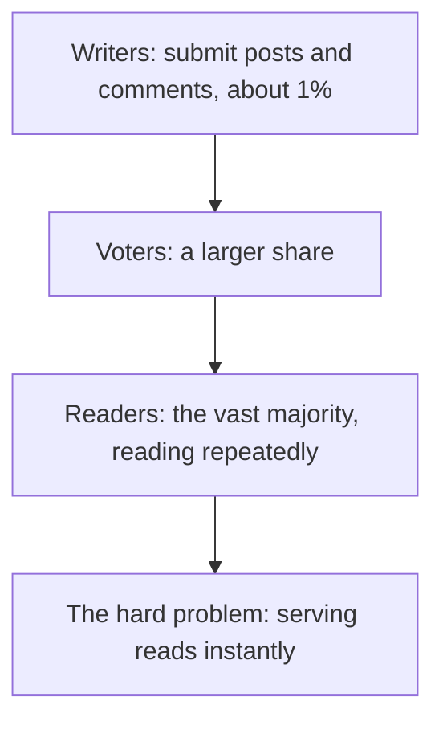
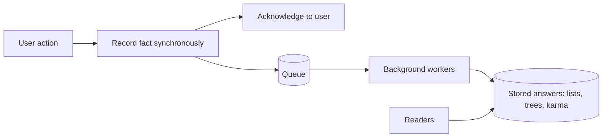
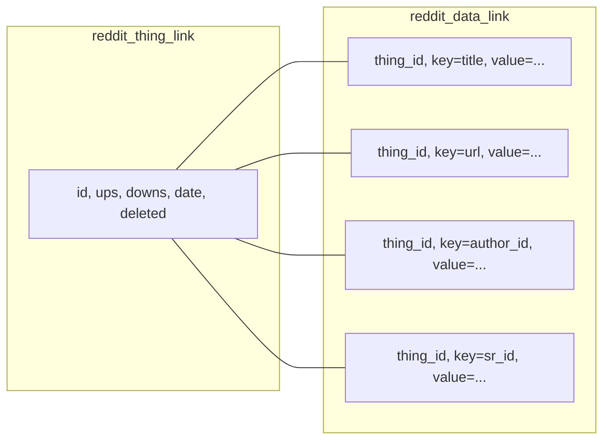
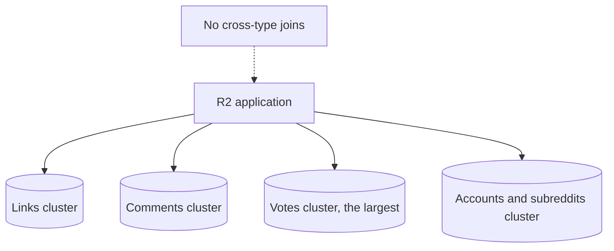
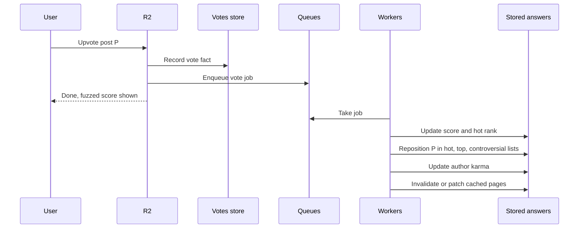
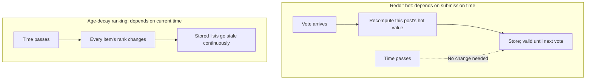
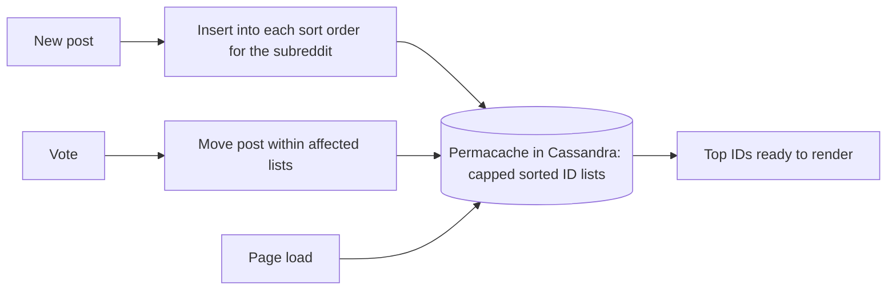
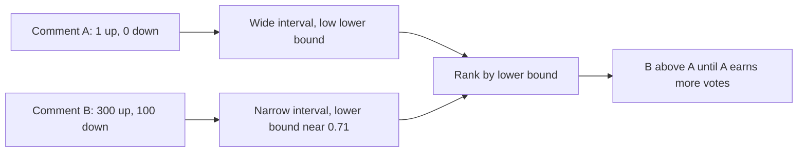
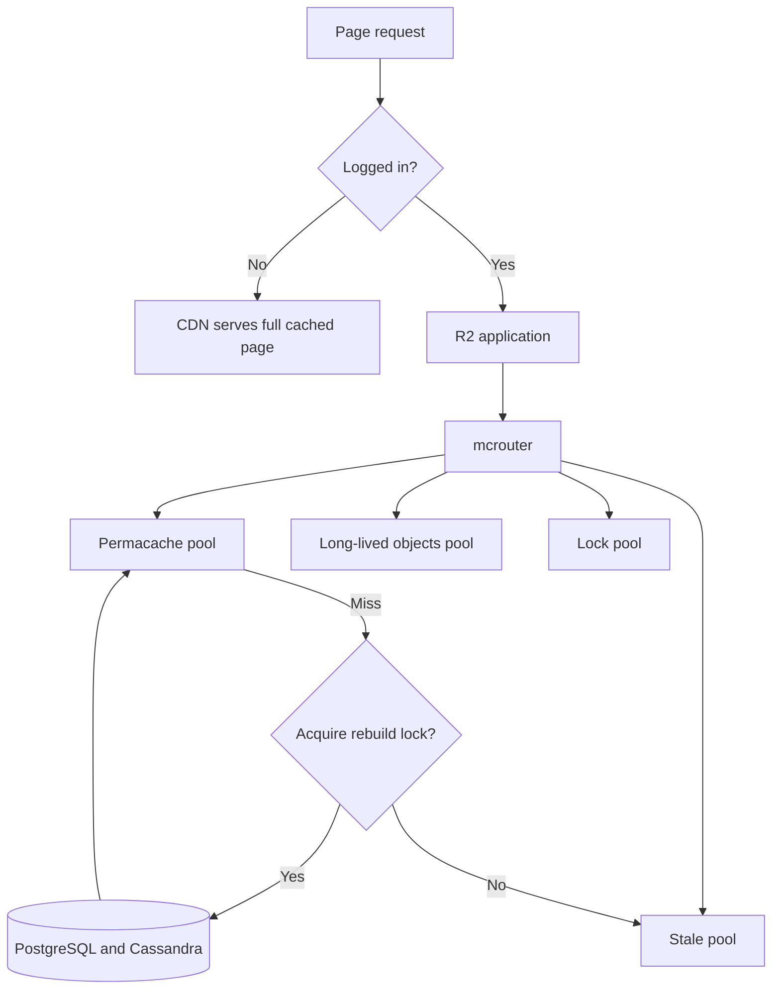
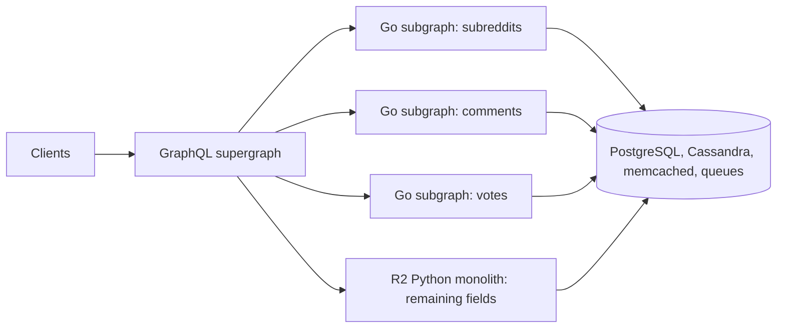

# Reddit Architecture: Separate Facts from Answers

## Scope and framing

This explainer follows the supplied transcript, which walks through how Reddit served very large read traffic with a small engineering team, and how it is now gradually replacing its Python monolith. The transcript draws on Steve Huffman's early talks about scaling Reddit, Reddit's engineering blog, the open-sourced R2 codebase, and Reddit's public ranking code. This document uses the transcript as its backbone and adds well-established background on ranking math, caching, and migration patterns where helpful. Figures such as page views, team size, updates per vote, and list limits are as reported in the transcript and have not been independently verified. The transcript appears to be machine-processed in places; this document uses the standard names for the tools it mentions. The diagrams are conceptual.

The transcript opens with January 2011, when Reddit served over **a billion page views in a month** with an engineering team of about a dozen people. It explains how through seven topics:

1. A surprisingly simple **data model**, and the trade-offs of that simplicity.
2. Treating user actions as **facts to record** rather than answers to compute on demand.
3. A **ranking formula** that makes precomputed front pages possible.
4. Updating rankings and lists **incrementally**, not by rebuilding.
5. Ranking comments when there is **not enough data** to be confident.
6. A **caching architecture** that serves much of Reddit's traffic.
7. The **R2 Python monolith**, and the ongoing effort to strangle it with Go services behind GraphQL.

The transcript highlights that Reddit's most important scaling trick was not a database, cache, or queue, but something hidden inside its ranking algorithm.

## 1. The shape of Reddit's traffic

On community sites, a small fraction of users create content, a larger fraction vote, and the vast majority only read. This is often called the **1% rule**, and Reddit's skew is extreme. The transcript pictures it as a pyramid:

- A thin top layer submits links and writes comments.
- A wider layer casts votes.
- A huge base only reads: refreshing the front page, opening threads, scrolling.

The hard problem is therefore **not recording what the top does**, since new facts are relatively rare. It is serving the base instantly, over and over, all day.

## 2. Facts and answers

Reddit drew a distinction between two kinds of data, and the transcript argues everything else follows from it.

| | Facts | Answers |
| --- | --- | --- |
| Examples | A vote, a new post, a new comment | A ranked list, a comment tree, a karma total |
| Size | Small | Can be large |
| Cost to produce | Cheap to record | Expensive to compute |
| Read frequency | Rarely read directly | Read constantly |
| Correctness | Must be exact | Must be ready; need not be perfect |

Facts are recorded when they happen. Answers are computed **from facts ahead of time** and stored, effectively every list in every sort order for every subreddit, whether or not anyone has asked for it yet.

Steve Huffman's lesson, as quoted in the transcript: **the key to speed is to precompute and cache everything.** Reddit applied it everywhere, accepting that wasting disk and memory is fine but wasting a reader's time is not.

The rule that connects the two sides: when a new fact arrives, the expensive work of updating answers happens **later**, when nobody is waiting, using queues. The transcript calls this **"write now, fix later."** It explains how voting, posting, and commenting all work.

## 3. The data model: Things and Data

### Two tables per type

Reddit's core data model was famously simple. For years, each object type ran on two tables:

- A **thing** table: the skeleton. For a link, it held an ID, up and down vote counts, creation date, and deleted flag: the attributes needed for core behavior.
- A **data** table: everything else as **key-value rows**. One row holds the title, another the URL, another the author, another the subreddit, each keyed by the thing's ID.

It is essentially a small key-value store built on PostgreSQL.

This applied to everything: links, comments, subreddits, and accounts were all things. Even relationships, such as "this user voted on this post", used the same two-table style.

### No joins across types, so shard by type

The model came with a rule: **no joins between types**. The application never asked the database to join a comment to a link to a vote. Because nothing was joined, each type could live on **its own database cluster**: links on one set of machines, comments on another, and votes, by far the largest type, on a cluster of their own, so each could be isolated and scaled independently.

Where Jira and Slack partition by customer, Reddit partitioned **by type**, and the no-join rule made that possible.

The fact store did not answer complex questions such as "rank the front page", "assemble this comment tree", or "total this user's karma". Those are answers, built elsewhere. That is why such a primitive model could underpin one of the largest sites on the internet: the fact store was a filing cabinet, not a query engine.

### Why schemaless

Adding a column to a large PostgreSQL table was painful at the time and could lock the table while running. Reddit's features changed constantly. With the key-value data table, adding an attribute required **no schema change**: just start writing a new key. The transcript notes the resemblance to Airtable's runtime-defined schema, in a much older and simpler form, with the same goal of moving fast without migrations.

### The cost, and the compromise

Key-value storage is excellent for **lookup by ID** (fetch the thing, fetch its keys) and poor for **filtering or sorting by an attribute**. "Posts with the highest score" would require extra joins against the data table and would index poorly.

So Reddit compromised. The fields that drive listings (score, hotness, controversy, creation time) were too important to hide in key-value rows. They were promoted to **indexed columns** in the thing table. Fields used for sorting lived in a fast, structured schema; fields merely looked up stayed in the flexible store. Flexibility was paid for only where it mattered.

Even so, expensive listings were not produced by live queries on page load; they were answers prepared ahead of time.

## 4. Voting: record the fact, fix the answers later

### Split the operation

When you upvote, Reddit does not synchronously recompute the score, reorder every list containing the post, update karma, and only then confirm. At Reddit's scale that would mean doing expensive work millions of times a day while users wait.

Instead:

1. **Synchronously:** record the one thing that must be recorded, the vote itself, and acknowledge the user.
2. **Asynchronously:** enqueue a job (for years, on **RabbitMQ**) and return immediately.

From the user's perspective, the vote is done. The answers that depend on it (scores, rankings, lists, karma) are updated later by background workers and become eventually consistent. For vote counts, a small delay is acceptable.

### Two scores

For years, Reddit deliberately **fuzzed** the displayed vote score by adding a little noise, to make it harder for vote-manipulation campaigns to tell whether their votes were having an effect. Internally, the true score was kept and used for ranking; externally, an approximation was shown. The same facts produced two answers with two different correctness standards.

### One vote, about twenty writes

The transcript cites Huffman's estimate that **one vote triggered around 20 updates**: the post's score, its position in hot lists, possibly its position in top-of-week and controversial lists, the author's karma, and several cached answers that became stale.

Rather than one giant queue, Reddit used **several targeted queues**, so workers were less likely to contend for the same popular post at once, reducing lock contention.

### Why the trade works

Turning one vote into ~20 writes is a great trade **when reads vastly outnumber writes**: a little extra work on a relatively rare write makes millions of later reads nearly free. If writes became as common as reads, the economics would invert, and every action would cost twenty database updates. Reddit was optimized for many readers, fewer voters, and fewer still writers, and in that world the trade pays off.

## 5. The hot ranking formula: the hidden scaling trick

Storing answers only works if stored answers **stay correct** while stored. Reddit made that possible through its ranking formula, which is public. The hot score is two components added together:

$$
\text{hot} = \operatorname{sign}(s) \cdot \log_{10}\!\big(\max(|s|, 1)\big) + \frac{t_{\text{submitted}} - t_{\text{epoch}}}{45000}
$$

where $s$ is ups minus downs, $t_{\text{submitted}}$ is the post's submission time in seconds, and $t_{\text{epoch}}$ is a fixed Reddit epoch in December 2005.

### 45,000 seconds is an exchange rate

The constant 45,000 converts between popularity and time:

- Because the popularity term is $\log_{10}$, multiplying the score by 10 adds exactly 1.
- Because the time term divides by 45,000, adding 1 is the same as being submitted 45,000 seconds (about **12.5 hours**) later.

So **a 10× larger score is worth exactly the same as being 12.5 hours newer.** The transcript notes this is why votes are sometimes described as "time travel": mathematically, they have the same effect on rank as moving a post's submission time.

### Early votes matter most

Going from 1 to 10 votes is worth 12.5 hours; going from 10 to 100 is worth another 12.5 hours. Once a post has 1,000 points, one more vote barely moves the logarithm; the transcript puts it at roughly 20 seconds of equivalent freshness. As a check:

$$
\frac{d}{ds}\left(45000 \cdot \log_{10} s\right) = \frac{45000}{s \ln 10} \approx 19.5 \text{ seconds at } s = 1000
$$

Early votes set a post's trajectory; later votes hardly change it.

### Freshness without decay jobs

Because each 12.5 hours of age must be offset by a 10× larger score, newer posts naturally outrank older ones unless the older ones are dramatically more popular. There is **no background job** removing old posts and **no scheduled recalculation**. Newer posts just start ahead.

### The crucial detail: submission time, not current time

The formula uses the **submission time**, which never changes, not the current time. Nothing in it changes merely because the clock advances. Compare this with formulas (the transcript cites Hacker News) where rank decays continuously with age, so every item's score changes every second even without votes.

On Reddit, the **only** input that changes is the score, so a post's hot value needs recomputing **only when someone votes**. Reddit recomputes it on the vote, stores it, and leaves it untouched until the next vote.

That is the architectural decision hidden in the math. If rank depended on the current time, every stored list would be wrong within seconds and would need constant rebuilding, and the whole precompute-and-store architecture would collapse.

## 6. Lists as stored, bounded answers

A hot value is a stored number that changes only on votes, and a listing is simply a **sorted set** of those numbers. The cached listing is not rendered HTML or a query result; it is a sorted list of **thing IDs with sort values**.

- **On a vote:** a worker opens the stored list, finds the post, moves it to its new position, and writes the list back. PostgreSQL is not asked to rebuild anything. The answer is maintained, not recomputed.
- **On a new post:** Reddit immediately inserts it into each relevant listing for the subreddit: hot, new, top, top of the week, top of the year, controversial, and more, about **15 sort orders** per the transcript, each precomputed and stored.

Reddit calls this collection of precomputed listings the **permacache**, stored in **Cassandra**, a database suited to denormalized data accessed almost entirely by key at large scale.

### Bounded by design

Listings are **capped**. Old Reddit did not let you page beyond about **1,000** items in a listing, not because pagination was hard but because the stored answer stopped there. Capping each list capped storage, capped maintenance work, and gave every update a known upper bound. A listing was not an ever-growing query result; it was a product with a specification.

So when you opened a subreddit sorted by hot, nothing was ranked at that moment. The ranking had already happened; every vote and new post had simply kept the stored answer current. Site-wide aggregates such as r/all, which would be extremely expensive to build per request, are exactly the answers Reddit wants ready in memory.

## 7. Comment trees as precomputed answers

Comments are not a flat list; they form a **tree** of replies to replies. Each comment stores its post and its parent comment, and the whole branching discussion can be reconstructed from those two links.

Rebuilding and sorting a deeply nested tree of tens of thousands of comments on every page load for every reader would be very expensive, and far more people read threads than comment on them. So Reddit applied the same move as for listings: the assembled tree is an **answer**, stored in Cassandra.

- A new comment is a **fact**: recorded, and a job enqueued.
- A worker **merges** it into the stored tree in the background.
- Readers receive the pre-assembled tree.

Trees are bounded too. For huge threads, Reddit does not send the whole tree; it sends the top comments and a **"load more comments"** control, delivering the tree in pieces.

## 8. Ranking comments: confidence, not percentage

Posts and comments look similar (both are voted on) but answer different questions:

- **Posts:** what is interesting right now?
- **Comments:** which reply is actually the best?

So Reddit's default comment sort, **"best"**, does not use the hot formula; it uses statistics.

### The sample-size problem

Compare two comments:

- Comment A: 1 upvote, 0 downvotes, **100%** positive.
- Comment B: 300 upvotes, 100 downvotes, **75%** positive.

By percentage, A wins, which is misleading: one person liked it. Four hundred people judged B, and three quarters approved. B is far more trustworthy. The real issue is not the percentage but **how confident** we can be in it.

### The Wilson score lower bound

The fix comes from statistics: the **Wilson score confidence interval** (published in 1927). The transcript credits Randall Munroe, creator of xkcd, with bringing it to Reddit.

Treat each comment's votes as a **sample** of how the whole community would vote if everyone read it. Rank comments not by the observed approval rate but by the **lowest approval rate the data can confidently support**, the lower bound of the confidence interval:

$$
\text{lower bound} = \frac{\hat{p} + \frac{z^2}{2n} - z\sqrt{\frac{\hat{p}(1-\hat{p})}{n} + \frac{z^2}{4n^2}}}{1 + \frac{z^2}{n}}
$$

where $n$ is total votes, $\hat{p}$ is the observed fraction of upvotes, and $z$ sets the confidence level.

- A comment with one upvote has a huge margin of error, so its lower bound is low; it sits lower until more evidence arrives.
- A comment with hundreds of votes has a narrow interval, so its lower bound is close to its true approval rate.

The method is skeptical of tiny samples and rewards comments that survive many votes.

### Self-correcting, and timeless

If a great comment starts too low, its interval is still wide; as upvotes arrive, the lower bound rises quickly and it climbs. The ranking corrects itself as evidence accumulates.

And unlike posts, **time does not matter**. Comments do not sink simply because they are old; a brilliant reply posted hours later can still become the top comment if the votes support it.

The transcript's lesson: Reddit uses two ranking algorithms built on different philosophies (popularity weighted by time for posts, statistical confidence for comments), and neither is "better". **Choose the algorithm that fits the question.** It recommends Evan Miller's essay "How Not To Sort By Average Rating" for more depth.

## 9. Caching is the read architecture

At Reddit, caching is not a layer in front of the database; the transcript calls it **the read architecture itself**.

### Edge first

For years, logged-out visitors, the largest group of readers, often received pages from a **CDN**. They could all get the same copy, so the answer was already at the edge and the request never reached Reddit's application servers.

### Multiple memcached pools behind a router

Requests that did reach the application went through several **memcached** clusters, each with a purpose:

- One for the **permacache** layer.
- One for **stale** copies.
- One for long-lived cached objects.
- One for **distributed locks**.

In front of them sat **mcrouter**, Facebook's memcached routing proxy, deciding which pool each request should go to. By the time a request reached PostgreSQL, it had already passed several chances to avoid the database.

### Caching negative answers

Reddit even cached **negative results**. "Has this user voted on this post?" is asked for every post, for every user, on every page load. Caching "yes" is obvious; Reddit also cached **"no"**, so confirming absence was as cheap as confirming presence, eliminating a huge number of database lookups.

### The stale cache

Sometimes waiting for a fresh answer is the wrong choice. If a downstream service was slow or unavailable, Reddit deliberately served an **older copy**. Stale but immediate beats fresh but unavailable. Freshness was something Reddit would sacrifice under load, as a deliberate resilience strategy.

### The lock cache and cache stampedes

When a popular entry expires and thousands of requests arrive together, each might try to rebuild the same answer and hammer the database: a **cache stampede**. Reddit used **distributed locks**: one request rebuilds while others wait briefly or get the stale copy. The database pays the rebuild cost once.

The overall picture: the CDN served whole pages; caches served stored answers; the stale cache traded freshness for availability; the lock cache protected the database from stampedes; and PostgreSQL held the facts.

## 10. R2: the Python monolith

All of this ran inside one large program. Reddit began as a Lisp application and was rewritten early in **Python**; that Python codebase is **R2**. It contains listings, ranking, caching logic, and more. The same code ships to every server, and configuration decides each server's role: one serves pages, another drains queues. Reddit moved to AWS in 2009 and was an early adopter of S3 (for example, for thumbnails).

R2 powered Reddit for over a decade. A single codebase is easy to understand and deploy. But at Reddit's current scale and team size, one shared codebase becomes a bottleneck, with many teams editing the same thing.

## 11. Strangling the monolith with GraphQL and Go

### Strangler fig, not rewrite

Reddit is moving off R2 over several years without stopping to rewrite, using the **strangler fig** pattern: build a new system around the old one, route more and more traffic to the new parts, and let the old code shrink until nothing is left.

### Steps, per the transcript

- **Around 2017:** clients began moving to **GraphQL**, an API where the client requests exactly the fields it needs.
- **2021:** Reddit adopted **GraphQL Federation**. Instead of one giant API, a **supergraph** at the front is composed from many **subgraphs** behind it. The supergraph works out which subgraph owns each field and routes accordingly. That is what makes breaking up the monolith possible.
- **From 2022:** new subgraphs written in **Go** began taking over core areas such as subreddits, comments, and voting, each replacing the corresponding part of R2.

For a time, both systems coexist: some fields come from the Python monolith, others from Go services. GraphQL assembles them into one response, so clients notice nothing.

### Hard parts

- **Traffic shifting.** The federation spec did not provide a built-in way to move traffic gradually from monolith to subgraph (send 1%, watch errors, ramp up, roll back instantly). Reddit had to build that traffic-shifting layer itself.
- **Data ownership.** A new Go service that still reads the same PostgreSQL tables and Cassandra clusters as the monolith has not really been separated; the coupling has just moved from the application layer to the data layer. Breaking a monolith is ultimately about **ownership**: who owns this table, who may change it. Answering that and moving data safely takes years.

### Keeping services uniform: Baseplate

Could dozens of new services become the next monolith, or a chaotic zoo? Reddit uses a shared service framework it calls **Baseplate**, standardizing how services are built, how they talk to infrastructure, and how they talk to each other. A hundred services that each do things differently are a nightmare; a hundred that share the same patterns for PostgreSQL, Cassandra, memcached, and queues, and the same observability, are manageable.

## 12. A page request in the transition era

1. You open a subreddit thread. The app sends one **GraphQL** request to the supergraph.
2. The supergraph splits it and routes each part to its owner: some fields from **Go subgraphs**, some still from **R2**.
3. The listing is not ranked on demand; it is already in the **permacache** in Cassandra as a sorted ID list whose order changes only on votes.
4. Post data mostly comes from **memcached pools** behind mcrouter, rarely reaching PostgreSQL.
5. Comments arrive as a **pre-assembled tree**, ordered by the **Wilson** lower bound.
6. You upvote a comment: one new **fact** is recorded, a job is enqueued, and your screen shows the (fuzzed) updated count immediately.
7. A **background worker** fixes every affected answer: comment ranking, positions, karma, cached lists and trees.
8. The next reader gets the already-updated answer.

Almost nothing was computed while you waited. Only one fact was written synchronously; everything else happened afterward, so the next reader never pays that cost.

## 13. Trade-offs

- **Precomputation spends storage to save reader time.** Every list in every sort order is stored whether or not anyone views it.
- **Write amplification.** About 20 writes per vote is excellent for read-heavy traffic and would be disastrous for write-heavy traffic.
- **Eventual consistency.** Scores, lists, and karma lag briefly behind facts; displayed scores are deliberately approximate.
- **Schemaless storage.** Fast feature development, but poor attribute queries; sort keys had to be promoted to real columns.
- **Bounded answers.** Capping lists at about 1,000 items keeps storage predictable but limits how deep users can browse.
- **Cache complexity.** Multiple pools, negative caching, stale serving, and locks make reads cheap but add many moving parts.
- **Monolith migration.** Federation enables gradual replacement, but traffic shifting had to be custom-built, and untangling shared data ownership takes years.

## Key takeaways

1. Separate facts from answers. Keep fact recording tiny, synchronous, and exact; precompute, store, and asynchronously repair the answers users actually read.
2. Design derived data to stay valid while stored. Reddit's hot formula depends on submission time, so a post's rank changes only when votes arrive, and stored lists never go stale on their own.
3. Store answers; do not recompute them. Maintain lists incrementally, and cap them so storage and update costs stay bounded.
4. Decide how correct each answer must be: exact for internal ranking, approximate for displayed scores, stale acceptable under load.
5. Match the algorithm to the question: popularity weighted by time for posts, Wilson confidence lower bounds for comments.
6. Treat caching as architecture: serve anonymous traffic from the edge, cache negative answers, serve stale when needed, and lock around rebuilds to prevent stampedes.
7. Replace a monolith in pieces, with rollback built in. Moving queries is the easy part; untangling data ownership takes years.

The transcript's summary: this is how a dozen engineers served over a billion page views a month. Almost nothing was computed while a user waited; the answers already existed.
