# Cloudflare Attack Mitigation: One Homogeneous Network That Defends Itself

## Scope and framing

This explainer follows the supplied transcript, which uses Cloudflare's record DDoS mitigations as an entry point into its broader architecture. The transcript draws on Cloudflare's engineering blog, including posts on Quicksilver, Pingora, DDoS mitigation, Workers, Argo Smart Routing, and Keyless SSL. This document uses the transcript as its backbone and adds widely known networking and security background where helpful. Figures such as attack sizes, durations, network capacity, city counts, request volumes, and performance improvements are as reported in the transcript and have not been independently verified. The transcript appears to be machine-processed in places; this document uses the standard names for the systems it describes. The diagrams are conceptual.

According to the transcript, in late 2025 an attacker launched the largest publicly reported DDoS attack to date against a Cloudflare customer: about **31.4 Tbps**, lasting about **35 seconds**. Earlier the same year, the record had been about 22 Tbps. The notable detail is that **no human at Cloudflare intervened**. No alarms, no war room, no overtime. The attack was detected and mitigated automatically in every Cloudflare location at once, and engineers learned about the record from dashboards afterward.

Cloudflare, per the transcript, fronts about a fifth of websites, spans more than **330 cities**, and has over **500 Tbps** of capacity. Early on it made a decision that runs against how most companies build infrastructure. Instead of specialized fleets (storage here, compute there, scrubbing centers somewhere else), Cloudflare made **nearly every server interchangeable**: the same software stack runs nearly every product, every machine holds every customer's configuration, and the same IP addresses are announced from hundreds of cities.

The transcript examines seven decisions that follow from that choice:

1. **Anycast**, making hundreds of data centers look like one destination.
2. A **single homogeneous fleet** where any machine can handle almost any request.
3. **Quicksilver**, pushing every customer's configuration to every server in seconds.
4. **Autonomous DDoS mitigation** with a per-server daemon and kernel-level drops.
5. **Workers** on V8 isolates, running customer code without VMs or containers.
6. **Argo**, routing around internet congestion using Cloudflare's own measurements.
7. **Durable Objects**, deliberately placing some state in exactly one place.

Along the way it covers Cloudbleed, the move to Rust (Pingora, FL2), Keyless SSL, and the lava lamps.

## 1. Anycast: one address, every city

### How traditional CDNs route users

Traditionally, one IP address means one location. Classic CDNs steer users with **DNS**: when you resolve a domain, their DNS looks at where you are and returns the address of a nearby server. The intelligence lives in that mapping system, a large piece of engineering that has to be built and operated.

### Anycast

Cloudflare sidesteps this with **anycast**: the **same IP prefix** is advertised via **BGP** (the protocol networks use to tell each other which routes exist) from **every data center at once**. To the internet, Cloudflare looks like one destination reachable from everywhere. Routers simply forward packets along the shortest BGP route they know, so packets land in the nearest Cloudflare city without anyone choosing.

Consequences:

- **No global load balancer to build.** BGP does the balancing; there is no mapping system and no central control node to fail.
- **Adding a city is trivial.** Rack servers, start announcing routes, and traffic from nearby networks flows in on its own.
- **A user in Tokyo and a user in Dubai use the same IP** but land in their own cities.

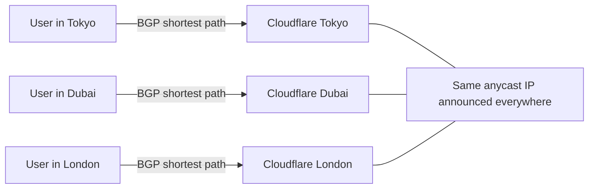

### Anycast dissipates attacks for free

A botnet is thousands of infected machines spread around the world. Their packets obey the same routing rules: each goes to the Cloudflare city nearest **that bot**. A multi-terabit attack from networks worldwide therefore arrives as **thin slices** spread across 330+ cities, each seeing only its regional share. Nobody at Cloudflare has to distribute the attack; the internet's own routing does it before any defensive code runs.

The transcript spells it out: bots in Tokyo hit only Tokyo; bots in Dubai hit only Dubai. Each data center faces a fraction of the botnet, not the whole thing.

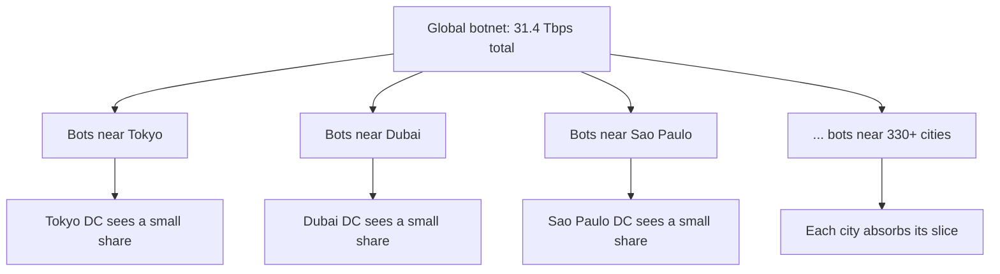

### Anycast for TCP, not just DNS

Conventional wisdom held that anycast was fine for DNS, where a query is one packet, but risky for long-lived **TCP** connections. A TCP connection is a stateful conversation held in one machine's memory; if routing changed mid-connection and packets landed in a different city with no knowledge of it, the connection would break.

In practice, Cloudflare found this almost never happens: internet routes are stable over the few seconds a typical connection lasts. So Cloudflare runs anycast for HTTP, HTTPS, and nearly everything else. Its public DNS resolver, **1.1.1.1**, is a familiar example: one address served by every Cloudflare data center.

## 2. One homogeneous fleet

Walk into any Cloudflare data center and the racks look the same. There is no separate DNS fleet, firewall fleet, or request-processing fleet. **Every server runs the whole stack**: DNS, TLS termination, web application firewall, bot management, DDoS protection, and more, and any server can fully handle a request for any of the millions of domains on the platform.

### Contrast with product-aligned fleets

In many companies, infrastructure is organized by product, each with its own cluster, forecasts, provisioning, and headroom. When one product suddenly takes off, its cluster overloads while neighboring clusters sit idle.

Cloudflare has no such boundaries:

- **Capacity is shared.** A surge in one product borrows from every machine in the city.
- **Capacity planning simplifies** from "how many servers for CDN, for WAF, for Workers?" to "how much compute does this city need?"
- **New products launch on existing hardware.** Once software ships, it is available everywhere immediately.

Inside a data center, a load balancer the transcript names **Unimog**, built on the Linux kernel's **XDP**, spreads incoming connections across all healthy servers.

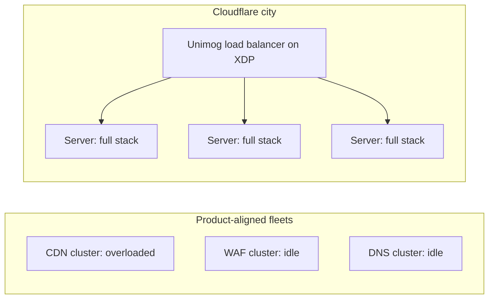

### The requirement this creates

If almost any server can serve almost any customer, **almost every server must know every customer's configuration**: certificates, DNS records, firewall rules, redirects. A server handling a request cannot pause to ask another machine for that customer's settings.

## 3. Quicksilver: every configuration, on every server, in seconds

When a customer clicks Save in the dashboard to change a DNS record or firewall rule, that change must reach every Cloudflare server on Earth. Cloudflare does this in **seconds** with a distributed configuration system called **Quicksilver**, which replaced an off-the-shelf key-value store (Kyoto Tycoon) that Cloudflare had outgrown.

Two unconventional decisions define it:

1. **Every server stores the entire global dataset.** No partitioning and no hot-key caching: each machine holds the full configuration for every customer, hundreds of gigabytes.
2. **LMDB as the storage engine.** A memory-mapped B-tree store optimized for extremely fast concurrent reads.

A single HTTP request may consult Quicksilver dozens of times: which certificate, which firewall rules, which origin, which features are enabled. Each is a **local memory read** measured in microseconds. If each required a network call to a central config service, fetching settings would take longer than serving the request. Cloudflare did not make config lookups faster over the network; it **made the network unnecessary**.

The transcript contrasts this with Jira, where every request begins by asking where a tenant lives. Cloudflare takes the opposite approach: there is nothing to look up, because every server already has everything. The price is paid on **write** (every change replicates to every server) so that **reads** are nearly free.

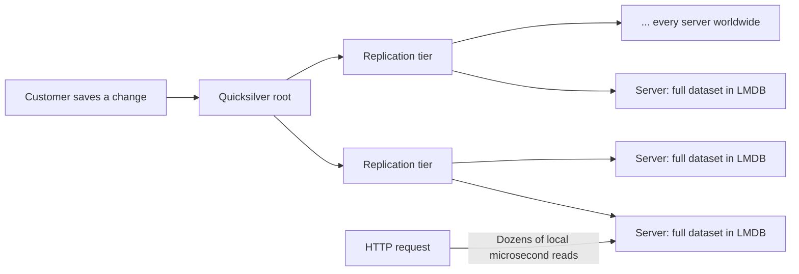

This speed is Cloudflare's main advantage during attacks, and, as the transcript notes, also a risk: a mistake propagates just as fast.

## 4. Autonomous DDoS mitigation

### No scrubbing centers

Traditional DDoS protection revolves around **scrubbing centers**: a few specialized facilities with huge bandwidth. When an attack is detected, the victim's traffic is diverted there, cleaned, and forwarded. Each step costs: detection and diversion take minutes, the detour adds latency to legitimate traffic, and protection is capped by scrubbing capacity. Build 20 Tbps of scrubbing, and 20 Tbps is your ceiling.

Cloudflare has **no scrubbing centers**. Every data center is part of the defense. With anycast spreading attacks across 330+ cities, even 31.4 Tbps looks like modest spikes locally, and the whole attack is well below the network's total capacity (over 500 Tbps per the transcript). No single server tries to absorb 31.4 Tbps; each identifies and drops the few gigabits reaching it.

### Humans cannot be in the loop

Per the transcript, about 9 in 10 network-layer attacks last **under 10 minutes**, and record attacks are far shorter: a 7.3 Tbps attack delivered its full volume in 45 seconds; the 31.4 Tbps attack lasted 35 seconds. A human would not reach the keyboard before it ended. So mitigation is fully automated.

### Detection: a daemon on every server

Each server runs a small program called **dosd** (denial-of-service daemon). It samples packets passing through the network card, looks for statistical signs of attack, and builds a **fingerprint**: packet characteristics that separate malicious traffic from legitimate traffic. Once it has a fingerprint, it immediately installs a local rule to drop every matching packet. No call to a central system is required.

A **global** detection layer also watches traffic across the network for patterns visible only when data from all cities is combined. When it finds a reliable fingerprint, **Quicksilver** distributes it to every server within seconds.

### Enforcement: drop at XDP

Once a packet is known to be malicious, the question is how cheaply to discard it. Cloudflare enforces rules in **XDP (eXpress Data Path)**. Linux's **eBPF** lets verified programs run inside the kernel at various hook points; XDP is the earliest, right as a packet arrives from the network card, before the kernel allocates memory for it or passes it into the TCP/IP stack. A matching packet is dropped on the spot. Per the transcript, Cloudflare found this about **ten times cheaper** than dropping the same packet later with iptables.

The philosophy: the cheapest packet is not one you process efficiently; it is one you never process at all.

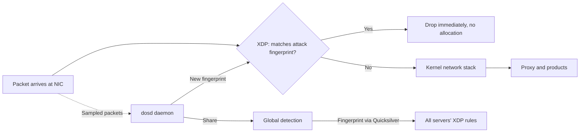

### Records, handled automatically

The transcript lists successive 2025 records: about **5.6 Tbps** in January, **7.3** in May, **11.5** in September, **22.2** weeks later, and **31.4** at year end, each detected and mitigated automatically. It says Cloudflare's systems mitigated more than **5,000 attacks per hour** on average during the year, and that in one late-year campaign attackers targeted Cloudflare's own dashboard and infrastructure, protected by the same autonomous systems. No human-in-the-loop design could scale to that.

## 5. Why DDoS protection can be free

Since 2017, per the transcript, Cloudflare has offered **unmetered DDoS protection on all plans**, including free, so a personal blog gets the same attack protection as a bank, while competitors often bill by mitigated volume. The transcript gives three reasons this works:

1. **Marginal cost is near zero.** The infrastructure exists, every server runs the full stack, anycast already spreads traffic, and XDP drops bad packets cheaply. A new customer is mostly a Quicksilver configuration entry.
2. **Free customers are sensors.** Millions of small sites see new attack techniques early. When dosd learns a fingerprint protecting a hobby blog, Quicksilver spreads it network-wide in seconds, and the next attack is recognized instantly for everyone.
3. **Scale lowers network costs.** Carrying so much of the internet gives ISPs strong reasons to **peer** with Cloudflare, often settlement-free. More peering lowers Cloudflare's transit costs, which makes the free tier affordable, which attracts more sites. It is a flywheel.

Cloudflare used a similar play in 2014 with **Universal SSL**, free TLS for every customer, which the transcript says roughly doubled the number of encrypted sites almost overnight, because every server could already terminate HTTPS.

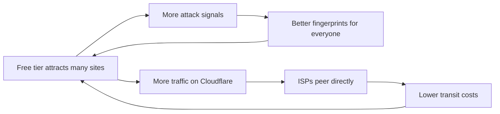

## 6. Workers: customer code in V8 isolates

### The problem

In 2017, Cloudflare decided its servers should also **run customer code**: untrusted code from hundreds of thousands of customers, on every server, next to systems handling everyone else's traffic.

The standard options:

| Approach | Isolation | Start time | Memory per tenant |
| --- | --- | --- | --- |
| Virtual machine | Strong | Seconds | High |
| Container | Moderate | Hundreds of milliseconds | Tens of megabytes |
| V8 isolate (Cloudflare's choice) | Language-runtime sandbox | A few milliseconds | A few megabytes |

### V8 isolates

Cloudflare chose **V8 isolates**, the sandboxing mechanism Chrome uses to keep browser tabs apart. One OS process runs the V8 engine, and inside it live **thousands of isolates**, each an independent JavaScript runtime with its own heap and execution context. Per the transcript, Cloudflare reports isolates start about **100× faster** than containers using about **a tenth** of the memory.

The point is **density**. At VM-scale memory, a server could host only a handful of tenants; at a few megabytes each, it can hold a huge number in memory. So publishing a Worker does not mean choosing a region: the Worker is shipped to the whole fleet, and nearly every server can run it. It is the same idea again: almost any server can run almost any customer's code.

### Hiding cold starts inside the TLS handshake

Cloudflare also tackled **cold starts**. When a browser opens a TLS connection, its first message (the **ClientHello**) includes the target hostname in the **SNI** field, before the handshake finishes and before any HTTP request exists. That is enough to know which Worker will handle the request. Cloudflare starts loading the isolate **during the handshake**. The handshake takes a few milliseconds anyway, and so does starting the isolate, so they overlap, and the Worker is ready when the first HTTP request arrives. The cold start is not eliminated; it is hidden inside latency the connection was already paying.

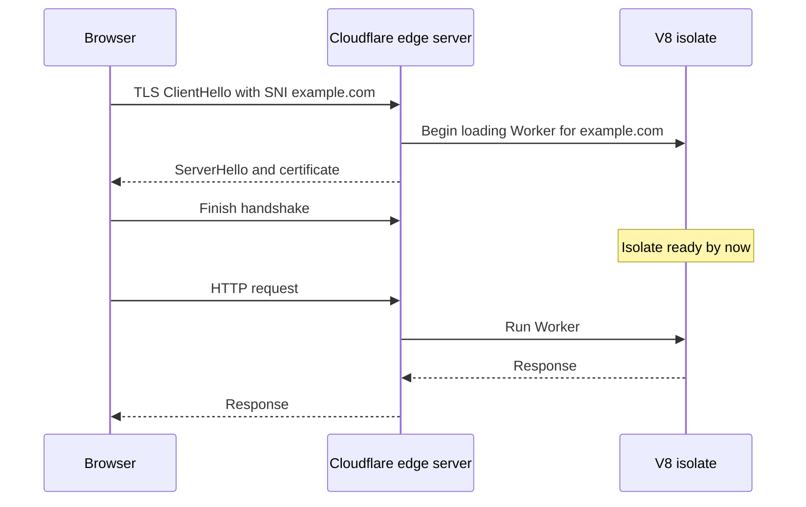

## 7. Spectre: taking away the clock

### The threat

In 2018, **Spectre** broke a basic assumption. It is a CPU flaw, not a JavaScript bug. Modern processors execute instructions **speculatively**, guessing what a program will do next. If the guess is wrong, results are discarded, but side effects such as which data was pulled into the **CPU cache** remain. Because cached data is read much faster than data from RAM, an attacker who can **measure tiny time differences** can infer what the processor touched speculatively, including data the attacker should not see. It is a hardware problem that software cannot fully fix.

The industry's usual answer was separate processes or VMs per tenant. Cloudflare could not rely on that, because Workers deliberately run many isolates in one process.

### No clock, no timing attack

Kenton Varda, the architect of Workers, observed (per the transcript) that every Spectre attack is a timing attack, and every timing attack needs a clock. So Cloudflare removed the clock:

- **Time does not advance during execution.** Calling `Date.now()` twice in a tight loop returns the same value however much work happened between. The clock moves only when the Worker performs I/O.
- **No threads and no shared memory.** Attackers can build a high-resolution timer by having a second thread increment a shared counter as fast as possible. Workers have no threads and no `SharedArrayBuffer`, so there is nowhere to build it.
- **Remote clocks are too coarse.** Asking a remote server for the time adds tens of milliseconds of network jitter, drowning out the nanosecond differences Spectre needs.

The transcript is careful to note this does not make Spectre theoretically impossible; it makes data extraction so slow that it stops being a practical attack.

Further layers:

- **Behavioral isolation.** If a Worker behaves as if running a Spectre attack, Cloudflare moves it into its own OS process for full isolation. Everyone shares a room until someone acts suspiciously.
- **Fast V8 patching.** V8 security fixes become Cloudflare's fixes; per the transcript, Cloudflare rebuilds and deploys new V8 versions across the fleet within hours.

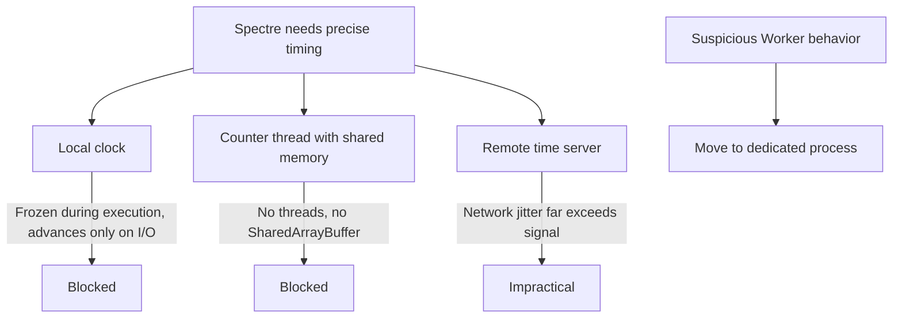

## 8. Cloudbleed and the move to Rust

### The incident

Workers were a new runtime designed with these lessons in mind. But a critical part of the request pipeline, which every request passed through, was still written in **C**, and it was Cloudflare's biggest security risk for years.

In February 2017, a researcher from Google **Project Zero** reported that, under certain conditions, a bug in Cloudflare's edge software leaked fragments of server memory into HTTP responses. In Cloudflare's shared architecture, that was especially dangerous: one process handles traffic for many customers, so memory next to one customer's request could contain another customer's cookies, authentication tokens, POST bodies, or other traffic. The bug was in an **HTML parser written in C**, used by features that rewrite pages on the fly; on certain malformed pages it read past the end of its buffer and emitted whatever lay beyond. Some responses were even **cached by search engines**, making leaked data publicly retrievable. The incident became known as **Cloudbleed**.

A memory-safety bug in a multi-tenant process does not stay within one customer. Cloudbleed changed Cloudflare's engineering direction: new request-handling code moved to **Rust**.

### Pingora

The flagship example is **Pingora**, Cloudflare's replacement for **NGINX** on the origin-facing side, in production since 2022 and open-sourced in 2024.

NGINX runs multiple independent **worker processes**, each with its own pool of connections to origin servers. Pools are isolated: if process A holds a warm, authenticated connection to your origin, process B cannot use it and must open a new TCP connection and do its own TLS handshake. At Cloudflare's scale, that meant enormous numbers of unnecessary connections and handshakes.

Pingora is a **single multi-threaded process with a shared connection pool**. Any thread can reuse any live origin connection, meaning far fewer new TCP connections and TLS handshakes for both Cloudflare and origins. Per the transcript, Pingora handles over **8 trillion** requests per day using about **70% less CPU** and about **two-thirds less memory** than the NGINX-based service it replaced.

### FL2

The legacy proxy's business logic, historically Lua scripts embedded in NGINX, is being rewritten in Rust as a new engine the transcript calls **FL2**. Together, Pingora and FL2 modernize the software every request passes through at the edge.

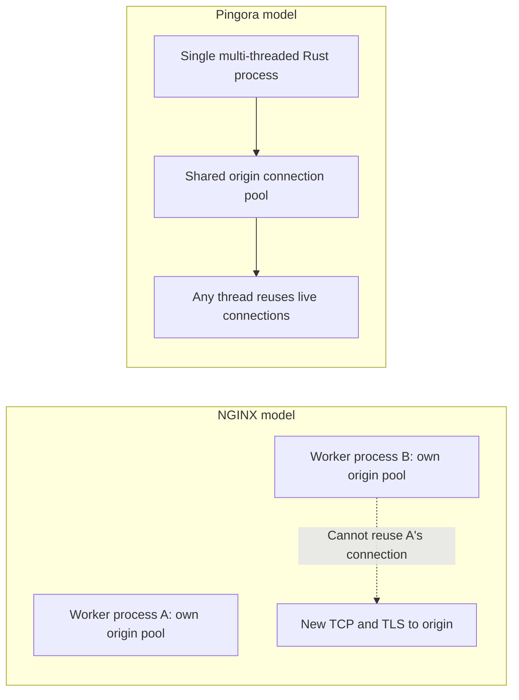

## 9. Argo: routing around the internet's congestion

When a request leaves Cloudflare for your origin, by default its path is chosen by **BGP**. BGP was designed to find a **reachable** path, not the **fastest**: it decides by policy and AS-path, not latency or congestion. A route that looks fine to BGP can be slower than another available at the same moment. Most companies simply accept whatever path BGP picks.

Cloudflare is in an unusual position. With hundreds of cities and enormous request volume, it has a **real-time view of internet performance**: how long it currently takes from this city to that origin, which paths are congested, which just got faster.

**Argo Smart Routing** uses that data. Instead of following BGP blindly, it asks which path is fastest **now**. Sometimes the answer is to route through Cloudflare's own network to **another Cloudflare location first**, then to the origin, so Cloudflare data centers act as transit points. Sometimes the fastest way from A to B is via C, just as a navigation app may route you off a jammed highway.

The transcript reports that at launch, for about 50,000 beta customers, Argo cut average latency by **35%** and connection timeouts by **27%**, and that one customer saw a **36%** latency reduction without changing any application code.

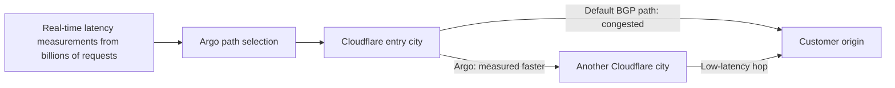

The transcript highlights a recurring pattern: Cloudflare repeatedly turns by-products of scale into products. Anycast turns internet routing into a load balancer; the free tier turns millions of small sites into an attack-detection network; Argo turns request telemetry into a live traffic map.

## 10. Keyless SSL: one secret, one owner

In 2014, Cloudflare wanted to serve banks and other heavily regulated organizations. Terminating TLS normally requires the site's **private key**, and whoever holds it can impersonate the site. For banks, the private key is among the most protected secrets, and policy often forbids it leaving their infrastructure. So they could not use Cloudflare.

The breakthrough came from examining the TLS handshake: the private key is needed for **one cryptographic operation** early in the handshake. Everything after that, including all encrypted application traffic, uses session keys.

**Keyless SSL** moves that single operation elsewhere:

- The private key never leaves the customer, often residing in a **hardware security module (HSM)**.
- Cloudflare performs almost all of the handshake at the edge.
- When the private-key operation is needed, Cloudflare sends just that request to the customer's **key server**, which performs it and returns the result.
- Cloudflare completes the handshake and terminates TLS.

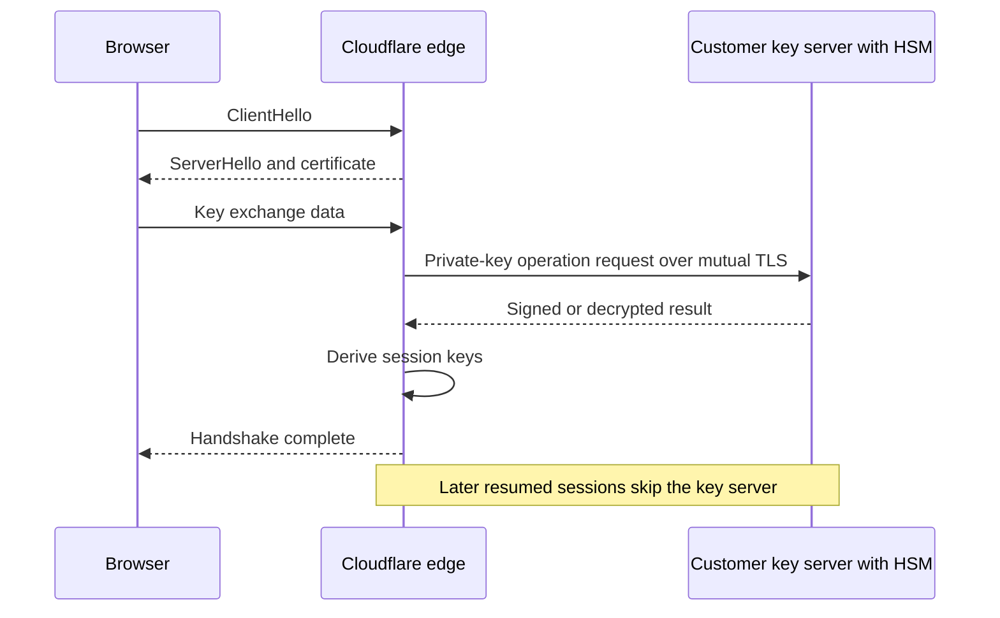

### Trade-offs

- **Extra round trip on new handshakes**, typically tens to a few hundred milliseconds depending on where the key server is. Session resumption avoids it for returning visitors.
- **The key server is on the critical path.** If it is down, new handshakes fail. Cloudflare made it **stateless** so customers can run several behind a load balancer, and the channel between Cloudflare and the key server uses **mutual TLS**. Cloudflare open-sourced both sides of the protocol.

### Breaking its own pattern

Keyless SSL runs opposite to the rest of the architecture. Everywhere else, Cloudflare pushes data outward so the edge never has to ask another machine. Here it deliberately pays a network call per new handshake so a secret stays with one owner. Sometimes copying everywhere is right; sometimes one copy is right. Per the transcript, Cloudflare later applied the idea internally so the edge process terminating TLS no longer has direct access to keys even when customers entrust keys to Cloudflare.

## 11. Durable Objects: exactly one copy on purpose

Most of Cloudflare's design follows one pattern: replicate data everywhere, keep services stateless, cache responses. That works for configuration, certificates, and mostly read-only content. It does not fit a chat room, a game lobby, or a collaborative document, where many people update the **same state** at once.

Cloudflare already had **Workers KV**, a globally replicated, **eventually consistent** store, good for read-heavy data but a poor fit when two people on different continents increment the same counter simultaneously.

**Durable Objects** deliberately break the replicate-everything rule. A Durable Object is code with its own private storage, and **at any moment there is exactly one instance of it in the world**. Every request for that object's ID, from anywhere, is routed to that one instance and processed **one at a time**.

That simplifies a great deal: no consensus protocol, no quorum, no conflict resolution, because there is only one copy of the state. If two users post to the same chat room at the same instant, both requests reach the same object; one is handled first, then the other. Ordering falls out naturally. The transcript notes this is essentially the **actor model**, popularized by Erlang, brought to JavaScript.

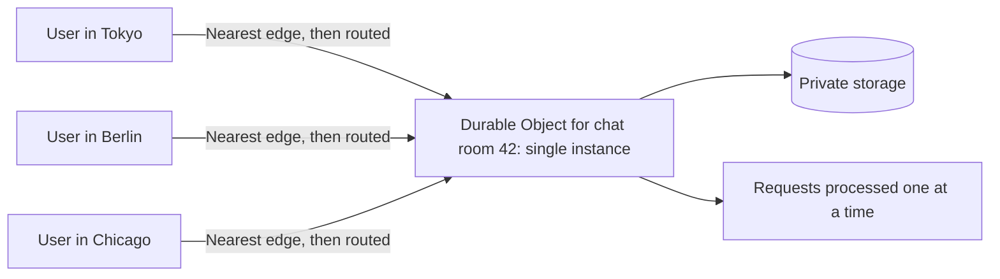

The lesson: replication is ideal for stateless services and read-mostly data, but when many users update the same data, you need one authoritative place.

## 12. Entropy from lava lamps

Modern cryptography depends on **randomness**: every HTTPS connection begins by generating secrets an attacker must not be able to predict. Computers are deterministic and poor sources of true randomness, so Cloudflare also collects entropy from the physical world. The best-known source is a **wall of lava lamps** in its San Francisco office: a camera continuously captures the unpredictable motion inside the lamps and converts it into entropy that helps seed Cloudflare's cryptographic systems. The transcript also mentions **chaotic double pendulums** in London as an additional source. That is the answer to the question posed at the start.

## 13. One request, end to end

Consider a small site on Cloudflare's free plan, visited from Jakarta:

1. The site's DNS points to a Cloudflare **anycast** address; BGP routes the visitor to Cloudflare's **Jakarta** data center automatically.
2. The packet is checked by **XDP** at the network card; legitimate traffic passes, and **Unimog** assigns the connection to a healthy server.
3. The TLS **ClientHello** carries the hostname via SNI, so the server starts loading the site's **Worker** into a V8 isolate during the handshake. Cryptographic secrets draw on entropy seeded in part from lava lamps.
4. When the HTTP request arrives, the server reads configuration from **Quicksilver** dozens of times, each a local memory read: certificate, firewall rules, cache policy, origin.
5. The **WAF** evaluates the request; the Worker runs in its isolate, where `Date.now()` does not advance during execution.
6. On a cache miss, **Pingora** reuses a pooled connection to the origin, and **Argo** may send the request through another Cloudflare city if that is faster than the BGP path.
7. Meanwhile, the same server's **dosd** spots an attack against a different customer and installs a new XDP rule, and a configuration change saved by another customer seconds ago arrives via Quicksilver.
8. The response returns to the browser.

Nearly every decision was made locally, on a server functionally identical to thousands of others, which already knew every customer's configuration before the request arrived.

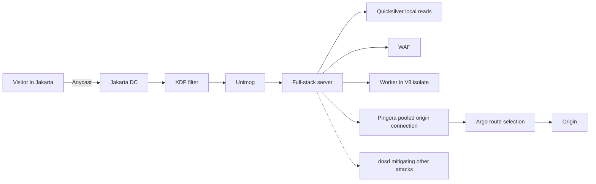

## 14. Trade-offs

- **One fleet, one blast radius.** Interchangeable servers and global configuration in seconds provide shared capacity, instant launches, and very low marginal cost, but a bad update or configuration can reach every server just as quickly.
- **Full replication costs writes and storage.** Quicksilver puts hundreds of gigabytes on every server and replicates every change everywhere, to make reads free.
- **Anycast relies on routing stability.** It works because routes rarely change mid-connection; it gives less direct control over which city serves a given user.
- **Isolates trade isolation strength for density.** Spectre mitigations make attacks impractical rather than impossible, and rely on removing timers, threads, and shared memory, plus fast V8 patching.
- **Shared processes amplify memory bugs.** Cloudbleed showed that in multi-tenant processes a memory-safety bug leaks across customers, motivating the costly move to Rust.
- **Some state must not be replicated.** Keyless SSL and Durable Objects accept extra latency or single-location placement for secrecy or consistency.

## Key takeaways

1. Choose failure boundaries deliberately. A single homogeneous fleet brings shared capacity and near-zero marginal cost, and also a fleet-wide blast radius for mistakes.
2. Let the layer below do the work. Anycast turned BGP into a global load balancer and an attack diffuser; Argo turned request telemetry into better routing.
3. When reads vastly outnumber writes, push the data to the reader. Quicksilver pays at write time so every lookup is a local microsecond read.
4. Drop malicious traffic as early as possible. XDP discards attack packets before the kernel spends anything on them, and autonomous daemons react faster than any human could.
5. Defense can become a flywheel: free protection brings more sites, more sites bring better signals and cheaper peering, which make free protection sustainable.
6. Challenge conventional wisdom where evidence supports it: anycast for TCP, V8 isolates instead of VMs or containers, removing clocks to blunt Spectre, and Keyless SSL.
7. Memory safety matters most in shared processes. Cloudbleed pushed Cloudflare toward Rust, including Pingora and FL2.
8. Replicate what is read-mostly; give contended or secret state exactly one owner, as with Durable Objects and Keyless SSL.
