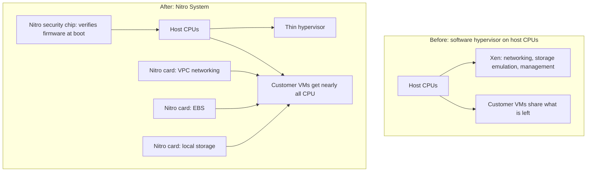
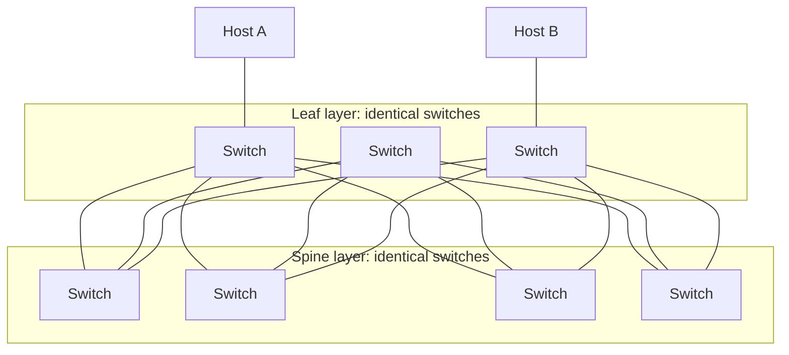
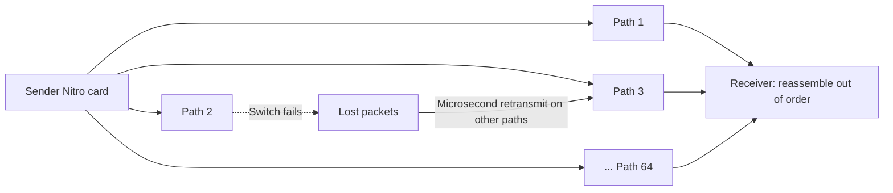
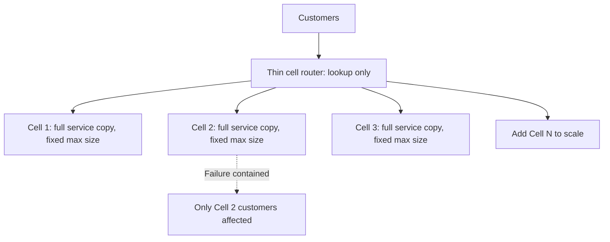
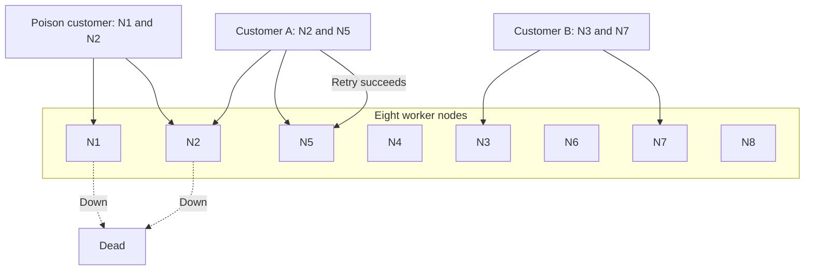
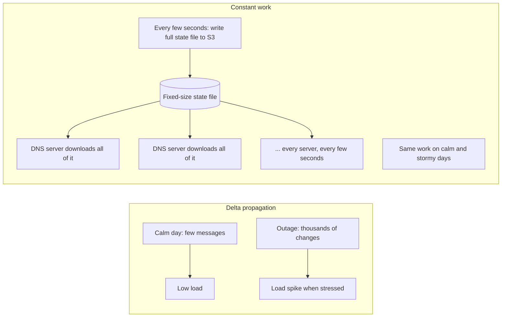
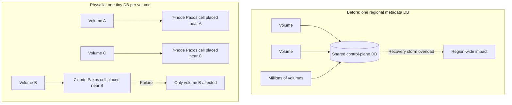
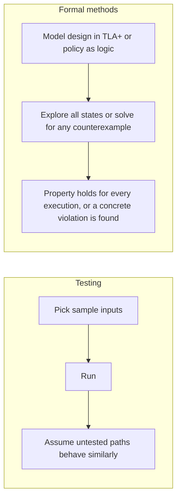
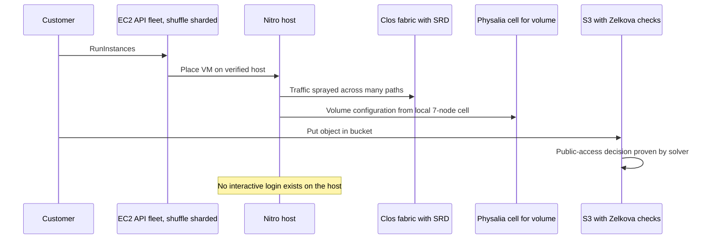

# Amazon Infrastructure Spend: Why AWS Builds Its Own Everything

## Scope and framing

This explainer follows the supplied transcript, which uses Amazon's very large infrastructure spending as a lens on why AWS designs its own servers, networks, and protocols, and on the architectural patterns it uses to operate at the scale of millions of machines. The transcript draws on the Amazon Builders' Library, writing by AWS engineers such as Colm MacCárthaigh and Marc Brooker, the peer-reviewed paper "Millions of Tiny Databases", published work on SRD, the Nitro security white paper, and re:Invent talks by James Hamilton and Peter DeSantis. This document uses the transcript as its backbone and adds widely known distributed-systems background where helpful. Figures such as capital expenditure, acquisition prices, path counts, and availability claims are as reported in the transcript and have not been independently verified. The transcript appears to be machine-processed in places; this document uses the standard names of AWS systems and authors. The diagrams are conceptual.

The transcript opens with scale: Amazon's capital expenditure this year is cited at about **$200 billion**, mostly for AWS data centers and their contents, over half a billion dollars a day. It recalls James Hamilton saying in 2016 that AWS was adding, every day, as much server capacity as all of Amazon needed in 2004, when Amazon was already a roughly $7 billion business.

It is tempting to picture this as an ordinary shopping list multiplied: servers from Dell and HP, chips from Intel and AMD, switches from Cisco and Juniper, leased fiber from telecom carriers. The transcript argues the reality is very different. AWS designs its own **servers**, its own **Graviton** processors, its own **routers**, owns stakes in **undersea cables**, and even uses its own **transport protocol** inside data centers instead of TCP.

The reason is not that vendor equipment is bad. It is designed for customers running **thousands** of machines. At **millions** of machines, costs and failure modes that are invisible at normal scale become enormous, and building your own becomes cheaper than buying.

The transcript covers seven designs:

1. **Nitro**: servers that, in many cases, nobody can log into.
2. **The network**: custom routers and the **SRD** protocol, which sprays each flow across many paths.
3. **Cells**: services that scale by adding fixed-size copies, never by growing.
4. **Shuffle sharding**: giving each customer its own combination of servers.
5. **Constant work**: making the busiest day cost the same as a quiet one.
6. **Physalia**: millions of tiny databases instead of one large one.
7. **Proofs**: formal methods where testing cannot reach.

## 1. Where AWS came from, and why failure is statistics

A popular myth says AWS began as a way to rent out Amazon's spare retail servers. The transcript disputes it: retail traffic peaks in the holiday quarter, so a cloud built on spare retail capacity would have to be reclaimed every December. The real origin was internal. In the early 2000s, Amazon teams kept rebuilding the same storage, compute, and database infrastructure for each project. Amazon required teams to provide these as reliable **internal services**. After years of running them for thousands of internal users, the company realized that operating infrastructure had become a distinct capability, and it packaged and sold that capability.

At millions of servers, **failure stops being an event and becomes a statistic**. A one-in-a-million-per-machine-per-day failure happens every day. Somewhere in the fleet right now, disks are failing and racks are going dark, and none of it makes the news. Werner Vogels, Amazon's CTO, summarized it as: **everything fails all the time.**

## 2. Nitro: taking the hypervisor off the CPU

### The overhead problem

For EC2's first decade, each host ran the **Xen** hypervisor on its main CPUs. A hypervisor splits one physical machine into many virtual machines so different customers can share hardware; it is what makes cloud computing possible. Xen did everything in software: virtual networking, storage emulation, and management, all on the same CPUs customers were paying for.

Every CPU cycle and gigabyte of RAM Xen used was unavailable to customers. On one server, that overhead is small. Across millions of servers, the transcript says, it amounts to **entire data centers** (buildings, power, cooling) doing nothing but running the hypervisor. Most companies accept this because building custom hardware would cost more. At AWS scale, the overhead exceeded the cost of designing hardware.

### Annapurna Labs and Nitro

In 2015, per the transcript, Amazon acquired Israeli chip company **Annapurna Labs** for about **$350 million**. The result was the **Nitro System**, which disassembles the hypervisor and moves each function from the CPU onto dedicated hardware:

- One **Nitro card** handles virtual networking.
- Another handles **EBS** storage.
- Another handles local instance storage.
- A dedicated **Nitro security chip** verifies every piece of firmware and software on the host before it is allowed to boot.

What remains on the CPU is a very thin hypervisor whose only job is dividing the machine's resources. Nearly the whole server is available to customer workloads. It was a one-time engineering investment, and every EC2 server built afterward recovered CPU that would otherwise go to Xen. At AWS scale, recovering even a few percent across millions of servers is worth far more than the chip development.

### Nobody logs in

Nitro also removed something else: **people**. Per the Nitro security white paper as described in the transcript, there is **no interactive login** to Nitro production hosts: no SSH, no shell, for customers or AWS engineers. Operational tasks are done through narrowly scoped, authenticated APIs.

That is a security feature, and also a **scaling decision**. If every production issue required an engineer to SSH into a host, the operations team would have to grow with the fleet and would eventually become the bottleneck. AWS removed the need for humans to manage individual servers, which also removes a whole class of mistakes: **a server nobody can log into is a server nobody can accidentally change.**

### Flexibility falls out

With virtualization functions on Nitro cards, the platform becomes flexible:

- A **bare-metal instance** is a Nitro server with the thin hypervisor switched off; networking, storage, and isolation still come from the cards.
- **EC2 Mac instances** are physical Mac minis in AWS data centers connected to a Nitro card over Thunderbolt, so they get the same networking, storage, and security as any other instance.

The Annapurna team later created **Graviton**, AWS's own family of Arm processors. Redesigning the server from the ground up gave AWS control over every layer of the machine.

## 3. The network: simple routers, Clos fabrics, owned fiber

James Hamilton's reasoning about AWS networking, per the transcript, keeps returning to two questions: **when this device fails, what does the failure look like, and how many of them do we have?**

### Single-chip routers

Vendors like Cisco and Juniper sell large chassis routers packed with features. For most companies, buying them is right. AWS instead builds its own routers around a **single commodity switching chip** (available to anyone on the market) with minimal features.

- A **complex** router fails in complex ways; diagnosis might take a week. With ten routers, that is manageable; with tens of thousands, diagnosis time limits growth.
- A **simple** single-chip router either works or is dead. It does not fail partially, and the remedy is obvious.

### Clos fabrics

AWS deploys these simple routers in **Clos fabrics**: layers of identical switches that provide many equivalent paths between any two machines. Any individual router can fail and traffic routes around it. Capacity grows by adding more identical building blocks. The transcript compares this to Cloudflare's fleet of identical servers, applied here to network hardware.

### Owned global backbone

The same philosophy extends between regions. AWS runs its own **global backbone**; traffic between regions travels over fiber AWS controls, and AWS holds ownership stakes in **undersea cables** between continents. Congestion on the public internet therefore mostly does not affect AWS inter-region traffic, because it never uses the public internet between regions.

## 4. SRD: a transport protocol for the data center

### Why TCP fits poorly inside AWS

TCP has carried the internet for decades on three assumptions:

1. A connection follows **one path** through the network.
2. Packets must be delivered **in order**.
3. Loss is detected and retransmitted on the order of **milliseconds**.

On the internet, those are sensible. Inside AWS data centers, the transcript argues, they are a poor fit:

1. A Clos fabric offers **thousands of parallel paths**, but a TCP flow uses one.
2. In-order delivery means one delayed packet blocks every later packet, even if they have already arrived (head-of-line blocking).
3. Data center round trips are measured in **microseconds**, so a millisecond-scale retransmission timer takes roughly a thousand times longer than delivery itself.

TCP is doing its job; its assumptions just do not match this environment.

### Scalable Reliable Datagram

AWS built **SRD (Scalable Reliable Datagram)**, whose design was published at SIGCOMM. SRD inverts each TCP assumption:

- Packets of one flow are **sprayed across many paths** simultaneously (the transcript cites **64**).
- **Ordering is not enforced** in the transport; packets arrive in any order and a higher layer reassembles them.
- **Retransmission happens in microseconds**, and congestion control is tuned for exactly one network: Amazon's own.

The payoff shows up during failures. If a path congests or a switch dies mid-transfer, the flow barely notices because it never depended on one path. A failed link removes about 1/64 of the flow's capacity, and lost packets are resent over the other paths within microseconds.

| | TCP | SRD |
| --- | --- | --- |
| Paths per flow | One | Many (64 per transcript) |
| Ordering | Strict, in transport | None in transport; reassembled above |
| Retransmission | Millisecond timers | Microsecond |
| Congestion control | General internet | Tuned for AWS network |

## 5. Cells: never let a service get bigger

### The growth problem

A typical service grows: more servers, a larger database, longer queues. Two other things grow with it:

- **The worst-case failure** gets bigger; anything that goes wrong now goes wrong at larger scale.
- **The load test you would need** gets bigger. You cannot load-test a service at a size it has not reached yet, so production becomes the first place its true scale is tested.

### Cells

AWS's answer is the **cell**: a complete, self-contained copy of a service, with its own resources and its own database, serving a fixed set of customers, with a **hard size limit**. To scale, AWS adds **more cells**; cells never grow.

This addresses both problems:

- **Bounded blast radius.** A bad deployment, poisoned dependency, or data problem stops at the cell boundary, because cells share nothing. The worst failure is at most one cell, a known quantity.
- **Testable scale.** You can build one full-size cell in a test environment and load it to its limit before real traffic arrives. You cannot test a service at every future size, but you can test one maximal cell, and a cell is the largest unit that will ever exist in production.

### The thin router

Above the cells sits a **routing layer** that maps each customer to its cell. It touches every customer, so it is the one component not protected by cell boundaries. The rule is that it must be **much simpler than anything it routes**: essentially a lookup, as lightweight and static as possible, with no business logic. Anything that can affect everyone should contain almost nothing that can break. The transcript relates this to Jira's fixed-size tenant shards: bound the unit and scale by adding units.

## 6. Shuffle sharding: combinatorial isolation

Cells isolate customers by partitioning. **Shuffle sharding** isolates them **without** partitioning, using combinatorics.

### The poison-request problem

Every multi-tenant system has a worst customer whose requests are **poison**: malformed input that crashes the handling process, or a targeted attack on their domain. Picture eight worker nodes behind a load balancer:

1. The poison request hits node 1; node 1 dies.
2. The client retries (as clients should), reaching node 2; node 2 dies.
3. After eight retries, one customer has taken out the entire fleet and everyone is down.

### Plain sharding

The standard defense is to split the eight nodes into four shards of two and hash each customer to a shard. Now the poison kills one shard and stops, but every customer who happens to share that shard goes down too. One bad tenant takes out **a quarter** of customers. Better, but still bad.

### Shuffle sharding

The approach the transcript attributes to the Route 53 team (described in detail by Colm MacCárthaigh in the Amazon Builders' Library): do not group nodes at all. Give **each customer its own combination** of nodes, for example 2 of the 8.

$$
\binom{8}{2} = 28 \text{ possible combinations}
$$

Replay the poison scenario. The poison customer kills its two nodes. Almost every other customer overlaps with it on **at most one** node, so their retries land on a healthy node and they never notice. Only customers assigned to the exact same pair lose service entirely: about 1 in 28. Same eight machines, no new hardware, and the blast radius drops from 25% of customers to under 4%.

The numbers grow fast. With 100 nodes and 5 per customer:

$$
\binom{100}{5} = 75{,}287{,}520
$$

The chance another customer shares all five of your nodes is about 1 in 75 million; in practice there are more distinct failure domains than customers. Going from 8 to 100 machines is a 12.5× increase in hardware; going from 28 to about 75 million combinations is roughly a 2.7-million-fold increase in isolation. **Hardware grows linearly; isolation grows combinatorially.**

Per the transcript, **Route 53** uses shuffle sharding to decide which DNS servers answer for each customer's domain, which it cites as one reason Route 53 offers a **100% availability SLA** for DNS queries, and AWS engineers have said this part of the service has not failed in nearly two decades. AWS has applied the technique widely and released an open-source library for it.

## 7. Constant work: the coffee-pot principle

### The problem with sending only changes

The obvious way to keep many servers in sync is to send **deltas**: "server A is down", later "server A is back". That is efficient on calm days, when little changes. But on bad days (large outages, failovers) thousands of things change at once, and a flood of updates must go out exactly when infrastructure is most stressed. **The worse the day, the harder the synchronization system works.**

There is a second weakness: if one update is lost (dropped message, bug, operator error), parts of the system drift out of sync and stay that way until something explicitly corrects them.

### Route 53 health checks

The Route 53 health-check system avoids both problems:

- Every few seconds, a central service writes the **complete state** of every health check to a **fixed-size file** in S3.
- Every few seconds, every DNS server downloads **the whole file**.
- If nothing changed, they still download the whole file. If 100,000 checks changed, they download the same-sized file.

The load never spikes, because it does not depend on how much changed. Consistency is nearly automatic: a server that missed an update or briefly read bad data is corrected by the next full download a few seconds later.

The transcript relays MacCárthaigh's analogy: a barista making drinks to order works harder as more customers arrive, but a **coffee urn** brews the same pot whether one person comes or a thousand. For systems that must stay available, AWS prefers the urn.

This design is deliberately wasteful: most downloads contain little new information. The trade is a small, predictable cost every few seconds for a system whose behavior does not change under load. The busiest day does almost the same work as the quietest.

## 8. Physalia: millions of tiny databases

### The 2011 EBS outage

On **April 21, 2011**, per the transcript, a routine network change in US East went wrong. EBS replication traffic was shifted onto a low-capacity backup network, and volumes across the region lost contact with their replicas. When connectivity returned, the real trouble began: a huge number of volumes simultaneously tried to re-mirror, all searching for space and querying the **same shared control-plane database** that tracked where each volume's replicas lived. That database collapsed under the load, recovery stalled, volumes stayed stuck, and degradation lasted for days.

The lesson was **structural**, not procedural. One database holding metadata for every volume in a region meant every volume shared a single point of failure. Growth would make it worse: more volumes each year meant an even bigger recovery storm against the same database. It was an architectural limit that would tighten as EBS grew.

### Smaller, not bigger

The obvious fix was a bigger database. AWS went the other way and published the design in a peer-reviewed paper, **"Millions of Tiny Databases"** (Marc Brooker and colleagues, NSDI 2020). The system is **Physalia**.

- Instead of one metadata database for all volumes, Physalia runs **one small database per volume**.
- Each is a **cell of seven nodes** that agree on state using **Paxos**, a consensus protocol that lets a group of machines agree on values even if some fail.
- Millions of volumes means millions of independent seven-node databases. If one cell fails, it affects **one volume's** configuration, not a region's.

### Placement matters

Consensus needs a **majority** of a cell's nodes reachable. So Physalia places each volume's seven nodes **physically and topologically close** to the volume's clients and replicas. A network partition is then likely to leave the volume and its metadata on the same side.

### A CP system

Physalia is **CP** in CAP terms: during a partition it chooses consistency over availability, as a configuration authority should, and recovers availability quickly because each cell is small and local.

The lesson: when a shared component is guaranteed to become a bottleneck, do not just make it bigger. Split it into many small pieces and place each next to what it manages.

## 9. Proofs where testing cannot reach

All testing is **sampling**. Unit tests, integration tests, and chaos experiments each exercise some execution paths and assume the rest behave similarly. At AWS's scale, that assumption breaks: a bug requiring a one-in-a-billion sequence of events is not rare across millions of machines performing billions of operations; it happens somewhere on an ordinary day, and sampling will not find it in advance.

A **mathematical proof** asks a different question: does **every** possible execution satisfy the property? The transcript describes two ways AWS uses this in production.

### Design verification with TLA+

Engineers describe distributed designs in **TLA+**, a specification language for how systems should behave. A **model checker** then explores every reachable state of the design, looking for executions that violate expected properties. It is not testing; it is systematic exploration of the model. The transcript cites a DynamoDB replication bug found this way whose shortest failing trace required **35 steps**, practically impossible to hit by testing or chaos engineering.

### Zelkova and IAM policies

IAM policies are not just permission lists; they combine patterns, conditions, principals, and resources that interact in ways that are hard to reason about by hand. AWS built **Zelkova**, which translates a policy into a logical formula and uses automated reasoning (SMT solving) to answer questions such as: **can any request, under any conditions, make this S3 bucket public?**

It does not check a sample of requests someone thought to test; it reasons about every possible request. Per the transcript, this underpins **IAM Access Analyzer**, **S3 Block Public Access**, and the "Public" label in the S3 console. Every time a bucket policy changes, a theorem prover decides whether it could expose data.

## 10. Launching a VM, end to end

1. You launch an instance. The request hits a fleet where **shuffle sharding** gives your account its own combination of servers; a misbehaving customer almost certainly lands on a different combination.
2. AWS selects a physical host. Before it boots, the **Nitro security chip** has verified its firmware and software. Nitro cards provide networking, storage, and isolation, leaving nearly all the CPU to you.
3. Your VM starts sending data. **SRD** sprays each flow across many paths in a **Clos fabric** of simple routers. If a switch fails, one path disappears, and lost packets are resent over others within microseconds.
4. Your EBS volume's configuration lives in its own **Physalia** seven-node cell placed near the volume. Another volume's failure does not touch yours.
5. Every few seconds, **Route 53** health state propagates as a full fixed-size snapshot: the same work whether one or 100,000 checks changed.
6. You write to an S3 bucket. If it is not marked public, that is because an automated reasoner (**Zelkova**) established that no request could make it so.
7. Throughout, nobody logged into a production host, because that capability does not exist.

Meanwhile, disks failed, machines rebooted, and perhaps a rack lost power somewhere in AWS, and your application did not notice. The goal is not hardware that never fails but systems where failures rarely become the customer's problem.

## 11. Trade-offs

- **Build vs. buy.** Custom chips, routers, protocols, and cable stakes pay off only at enormous scale, and require long-term engineering investment and specialized teams.
- **No human access.** Removing SSH eliminates a class of errors and scaling limits, but requires mature, comprehensive APIs and automation for every operational task.
- **Custom transport.** SRD is excellent inside AWS but is specific to AWS's network and hardware, and needs reassembly and ordering logic above it.
- **Cells and shuffle sharding.** Bound blast radius and enable testing, but add routing layers and placement logic that must stay extremely simple and reliable.
- **Constant work wastes resources on calm days** in exchange for predictable behavior on bad ones.
- **Millions of tiny databases** remove a regional single point of failure but multiply the number of consensus groups to place and operate.
- **Formal methods** catch bugs testing cannot, but demand specialized skills and careful modeling, and prove properties of models, which must match the real system.

## Key takeaways

1. Small costs do not stay small at scale. A few percent of CPU per server becomes whole data centers across millions of servers; multiply per-machine costs by the eventual fleet size.
2. Do not build operations that scale with humans. Nitro hosts have no interactive login, which removes a bottleneck and a class of mistakes.
3. Prefer many small, independent units to one large shared one: cells for services, Physalia for metadata.
4. Question the assumptions baked into standard technology. TCP's single path, strict ordering, and millisecond timers did not fit AWS data centers, so AWS built SRD.
5. Isolate customers cleverly, not just with more hardware. Shuffle sharding makes isolation grow combinatorially while hardware grows linearly.
6. If a system must never fail, make its workload predictable. Constant work makes the worst day look like any other.
7. When a shared component will inevitably bottleneck, split it and place the pieces near what they manage.
8. Testing samples; proofs cover everything. At one-in-a-billion-per-day scale, use formal methods where correctness really matters.
