# Snowflake Architecture: Separating Storage from Compute

## Scope and framing

This explainer follows the supplied transcript, which explains how Snowflake built a cloud data warehouse by deliberately placing its data far from its compute, in cloud object storage, and how that choice, combined with immutable files, produces features such as index-free pruning, time travel, zero-copy cloning, and per-second billing. The transcript draws on Snowflake's SIGMOD 2016 paper describing the architecture, an NSDI 2020 paper based on statistics from about 70 million real queries, Snowflake's engineering blog, and founder talks. This document uses the transcript as its backbone and adds widely known database background where helpful. Figures such as request volumes, file counts, partition sizes, retention periods, and IPO details are as reported in the transcript and have not been independently verified. The transcript appears to be machine-processed in places; this document uses standard names. The diagrams are conceptual.

The transcript opens with Snowflake's scale and profile: over **5 billion** queries per day, a very large market value, and a 2020 IPO it describes as the largest in software history, notable enough that Berkshire Hathaway participated in a new share offering for the first time since Ford in 1956.

Much about how the database works sounds strange:

- Standard tables have **no indexes**.
- Data files are **never updated in place**; once written, they never change.
- A dropped table can be restored with one command: `UNDROP TABLE`.

All of it traces back to a decision made around 2012 by two former Oracle architects and a database researcher: break the rule that serious databases had followed for decades, **keep compute close to the data**, and instead put the data far away in someone else's storage service across the network. Everyone who heard the idea said it would be too slow. This document explains how a database that is far from its data became fast.

The transcript covers seven topics:

1. Why earlier warehouses coupled storage and compute, and why Snowflake separated them.
2. **Micro-partitions**: tables as thousands of immutable files.
3. **Pruning**: finding rows in petabytes without indexes.
4. **Time Travel**, `UNDROP`, and **zero-copy cloning**.
5. **Virtual warehouses**: isolating workloads with elastic, stateless compute.
6. The **cloud services layer** and the small database beneath it.
7. **Per-second pricing** and the economics that made the business possible.

## 1. Before Snowflake: shared-nothing warehouses

Almost every data warehouse before Snowflake followed one idea: **spread the data across a cluster and let each machine process its own share**.

Imagine 20 machines. The database is split across all of them; each stores its slice on **local disk** and processes it with its **own CPU**. A query is broken up, each machine scans its slice in parallel, and partial results are combined at the end. Apart from exchanging results, machines share nothing. This is the **shared-nothing** architecture, the standard for about two decades. The transcript lists Teradata, Netezza, Vertica, and the original Amazon Redshift as examples.

The reason was simple: networks were slow and disks were local. Reading over the network was far slower than reading a local disk, so the rule was **move compute to the data, not data to the compute**. Hadoop followed the same principle.

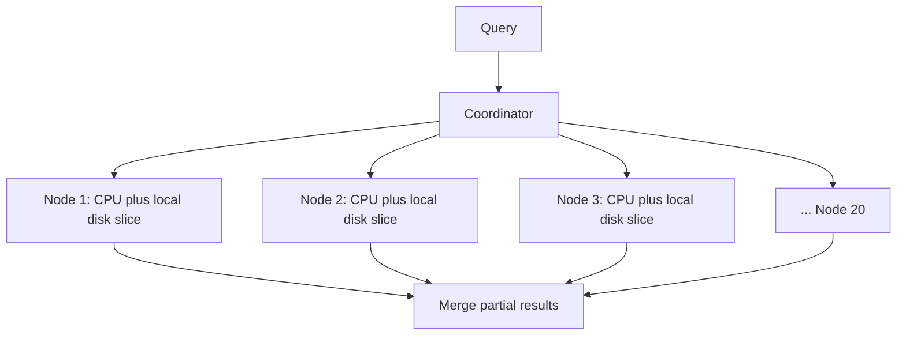

### Three problems that never go away

When storage and compute are welded together, three problems follow:

1. **Scaling means moving data.** Add five machines to a 20-node cluster and the data is no longer evenly spread. Terabytes must be redistributed before new nodes help, which can take days and degrade performance meanwhile.
2. **Workloads contend.** ETL pipelines, BI dashboards, scheduled reports, and ad hoc SQL all share one compute pool. One heavy job slows everything else.
3. **Over-provisioning.** Clusters are sized for the end-of-quarter peak and sit largely idle the rest of the year. Shrinking means redistributing data again, so most teams leave them running.

All three share a root cause: storage and compute are coupled.

## 2. Why 2012 was different

If separating storage and compute fixes these problems, why had nobody done it? Because it was not practical until around 2012, when three things changed:

1. **Cloud object storage matured.** Amazon S3 offered very high durability (commonly described as eleven nines) and effectively unlimited capacity, cheap enough to build a database on.
2. **Data center networks got much faster.** Reading over the network was no longer dramatically slower than reading a local disk.
3. **Compute became elastic.** Instead of buying servers, you could rent them by the minute, discard them, and start new ones on demand.

Many saw these as better infrastructure. Snowflake's founders, per the transcript Benoît Dageville and Thierry Cruanes (who had spent over a decade building databases at Oracle) and Marcin Żukowski (a researcher in Amsterdam who had built a very fast analytical query engine), saw an opportunity to rethink the warehouse. They understood why the old architecture existed and recognized that its assumptions no longer held.

Their idea:

- Put **every byte of table data in cloud object storage**, with exactly one copy.
- Make compute **stateless**, so clusters holding no data can start in seconds, run queries, and disappear.
- Let storage and compute **scale independently**, neither waiting on the other.

The immediate objection: S3 has much higher latency than local disk, so how could a database run on it? The rest of the architecture answers that.

## 3. Three layers

Snowflake is organized in three layers:

- **Storage:** cloud object storage (S3, Azure Blob Storage, or Google Cloud Storage). Every table lives here and only here.
- **Compute:** **virtual warehouses**, clusters of stateless compute rented by the second, where queries execute.
- **Cloud services:** the "brain": metadata, query planning and optimization, transactions, and security. Every query begins here.

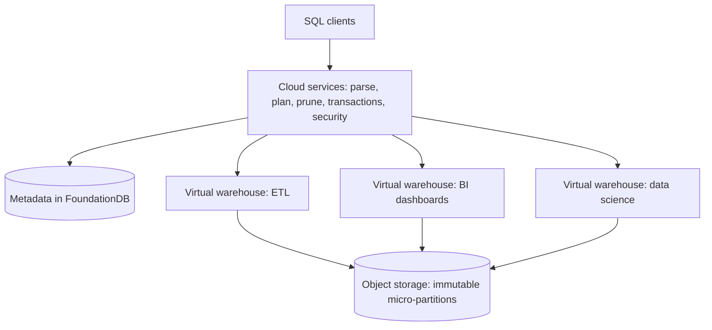

## 4. Micro-partitions: tables as immutable files

### Many small columnar files

A Snowflake table in object storage is not one large file but **thousands of small files**. Snowflake automatically splits every table into **micro-partitions**, each holding roughly **50–500 MB** of uncompressed data per the transcript. A large production table may be tens of thousands of such files.

Inside each micro-partition, data is stored **by column**, not by row. In an e-commerce example, all order dates are stored together, all order amounts together, all customer IDs together. Each column can then be compressed independently with the algorithm best suited to its data.

### Metadata per column per file

The crucial detail is not the data itself but what Snowflake records **about** each file. For every column in every micro-partition, it stores a small amount of metadata, including the **minimum and maximum values** and other statistics. This is what later lets Snowflake scan petabytes without indexes.

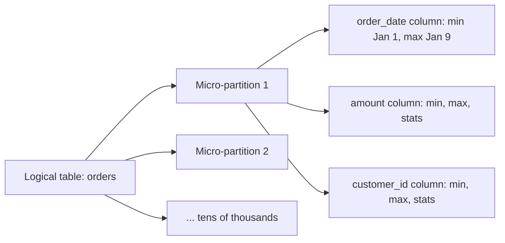

### Immutability

The rule that governs everything: **data files are immutable.** Once Snowflake writes a micro-partition, it never changes it.

Part of this comes from object storage itself. S3 objects can be created, read, or replaced wholesale, but not partially modified. Most systems treat that as a limitation; Snowflake built its architecture around it.

When you update one row, Snowflake does not touch the file containing it. It writes a **new file** containing the same data minus the old row version plus the new one, then updates the table's **list of files**: the old file is removed from the list, the new file added. The old file remains in storage, untouched.

So in Snowflake, **a table is just a list of files**, a reference to immutable data. Changing the list changes the table without touching the data beneath. Keeping an old list preserves an old version of the table, which is the basis for Time Travel.

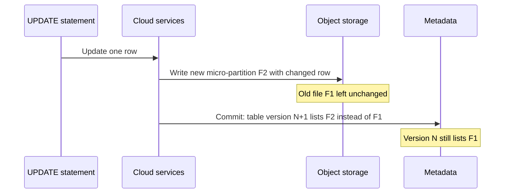

## 5. Pruning: no indexes, just knowing where data is not

### Why drop indexes

Most databases rely on **indexes** to jump straight to relevant rows. But indexes cost: they must be maintained on every insert and update, they consume storage, and at scale they need constant tuning and rebuilding. Snowflake weighed this and dropped them: standard tables have **no indexes**.

### Using min/max metadata

Suppose a query asks for orders where `order_date = '2024-03-03'`. Before reading any file, Snowflake checks **metadata**. If a micro-partition's `order_date` range is January 1 to January 9, that file **cannot** contain a match, so it is never read. Repeating this across every micro-partition, the transcript's example narrows **50,000** files to about **200** candidates, without touching storage. This is **pruning**.

The key difference:

- An **index** tells the database **where data is**.
- Snowflake's metadata tells it **where data definitely is not**.

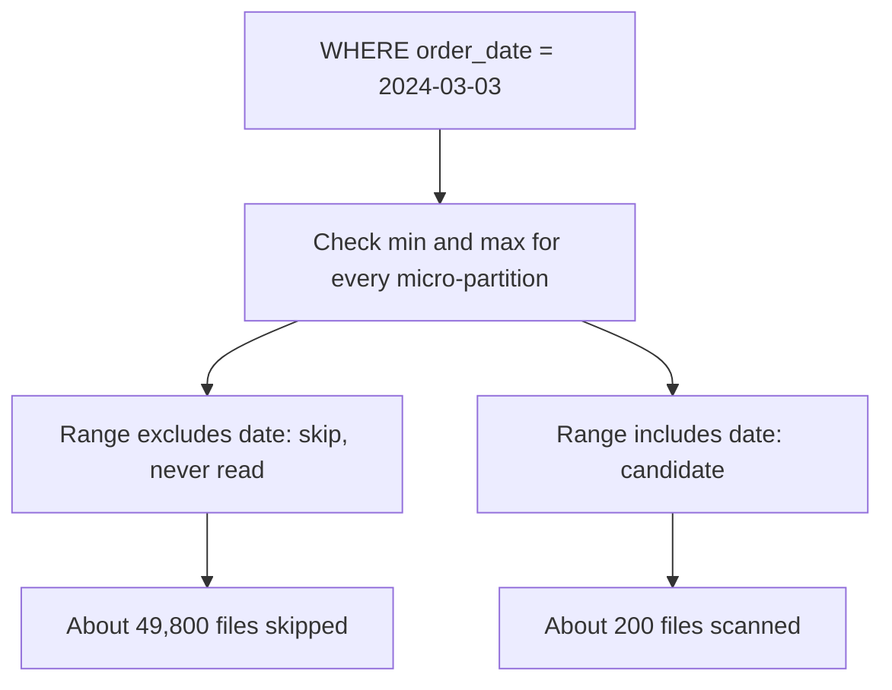

### Why it works: natural clustering

Pruning works because data tends to arrive in groups. Orders from the same week are usually loaded together, so each micro-partition covers a narrow date range. When that natural ordering degrades, Snowflake **reclusters** files in the background to keep ranges narrow. Narrow ranges mean metadata can rule out most files.

As general background, pruning is only as effective as the correlation between the filter column and how data is laid out. Filters on columns with values scattered across every file prune poorly, which is where clustering keys and, later, search optimization come in.

## 6. Time Travel, UNDROP, and zero-copy cloning

### Time Travel

If a table is a list of files, keeping old lists keeps old tables. Every time the list changes, Snowflake retains the previous version, per the transcript **1 day by default and up to 90 days** on higher editions.

To query a table as of yesterday at 4 p.m., Snowflake simply reads **yesterday's metadata**. The files it references are still in storage, unchanged, because files are never modified. No backup restore is involved.

```sql
SELECT * FROM orders AT (TIMESTAMP => '2024-03-02 16:00:00');
```

### UNDROP

Dropping a table does not immediately delete data; it removes the current metadata pointing to it. As long as an older metadata version exists, `UNDROP TABLE` restores the pointer, and the table reappears almost instantly.

The consequence: most databases implement backups, snapshots, and point-in-time recovery as separate systems. Snowflake gets them from one architectural choice: keep data immutable and do everything else in metadata.

### Zero-copy cloning

The same mechanism makes cloning nearly free. Copying a 100 TB production warehouse to test a risky migration traditionally means copying 100 TB: many hours of work and another 100 TB of storage.

In Snowflake, `CREATE ... CLONE` copies **nothing**. It creates new metadata pointing to the **same immutable files**. The original and the clone share storage. Only when either one changes does Snowflake write new files for the changed data; until then both read the same micro-partitions. This is **copy-on-write** applied to an entire warehouse. The transcript links it to Replit, which uses copy-on-write to snapshot agent sandboxes in milliseconds. Every team can have its own full clone for testing without duplicating production data.

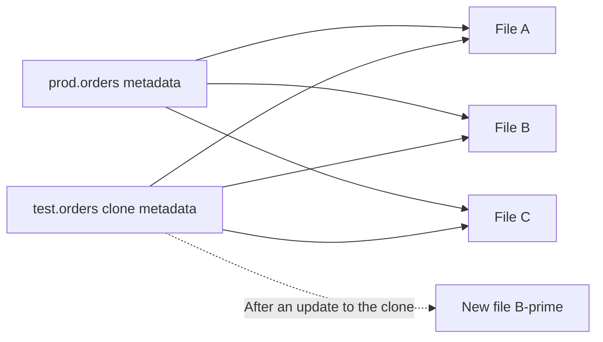

## 7. Virtual warehouses: stateless, elastic compute

### What a virtual warehouse is

Someone still has to run SQL: joins, aggregations, and result assembly. In Snowflake that is a **virtual warehouse**, a cluster of machines that:

- Comes in T-shirt sizes from **XS to 6XL**.
- Starts in **seconds**.
- **Auto-suspends** when idle and **auto-resumes** when a query arrives.
- Is billed **per second**.

These features work because a warehouse **stores nothing** permanently; data lives in object storage. Suspend a warehouse mid-query and you lose that query, but not a byte of data, because the data was never there.

### Workload isolation

Separating compute from data solves an old warehouse problem. You can run ETL on one warehouse, dashboards on another, and data science on a third. They all read the **same data** but do not compete for the **same CPUs**.

In traditional warehouses, all workloads share one cluster: heavy ETL slows dashboards, and ad hoc queries interfere with scheduled reports. Snowflake does not try to schedule contention more cleverly; it gives each workload its own compute.

### Multi-cluster scaling

When demand spikes, for example on Monday morning when hundreds of analysts start querying, a warehouse can automatically add **additional clusters** and shrink back afterward. Capacity does not need planning weeks ahead; elasticity is simply how the system behaves.

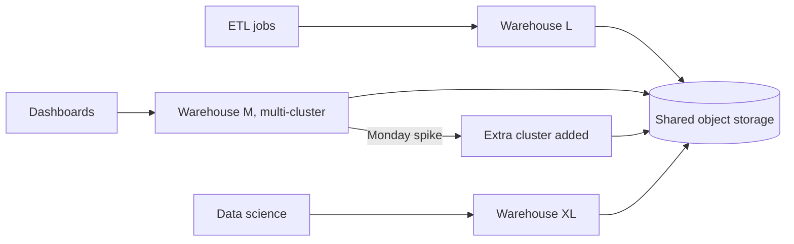

## 8. Making remote storage fast

Object storage has much higher latency than local SSD. The transcript explains Snowflake's performance through four layers that work together.

1. **Read less: pruning.** Metadata eliminates the vast majority of files before execution starts (50,000 to 200 in the example). The fastest read is the one you never do.
2. **Read narrower: columnar access.** Files are columnar, so a query touching 3 of 300 columns reads only those 3 columns from the remaining files.
3. **Read locally: SSD caching.** Each warehouse node has local SSD caching frequently accessed files. Files are assigned to nodes by **consistent hashing**, so each file naturally belongs to one node instead of being duplicated across the cluster. Once a warehouse is warm, most reads come from local SSD; object storage serves only cache misses.
4. **Sometimes read nothing: result cache.** If the same query runs again and the underlying data has not changed, Snowflake returns the cached result without the warehouse doing any work.

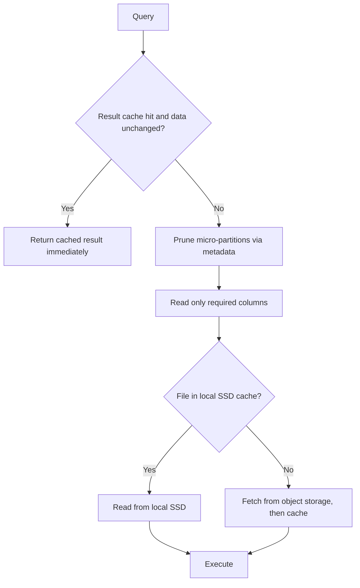

Combined, these let Snowflake work with far-away data at close to local speed.

### Resizing without rebalancing: lazy consistent hashing

If warehouses constantly grow and shrink, what happens to cached data? The obvious approach is to rebalance: when going from four nodes to eight, move cached files so each node holds its share. But resizing usually happens when the warehouse is already busy, the worst time to push terabytes across the network.

Snowflake does not rebalance. On resize, it **reassigns ownership** immediately and moves cache contents **lazily**: new owners fill their caches as queries naturally read files. Resizing becomes a gradual transition instead of a bulk migration. The research paper calls this **lazy consistent hashing**.

### File stealing

Even with evenly distributed data, work may not be even. A node might be slowed by a noisy neighbor, a slower SSD, or temporary resource pressure. Snowflake does not wait. When a node finishes its own files, it starts processing files originally assigned to the slower node. Work balances dynamically, query by query.

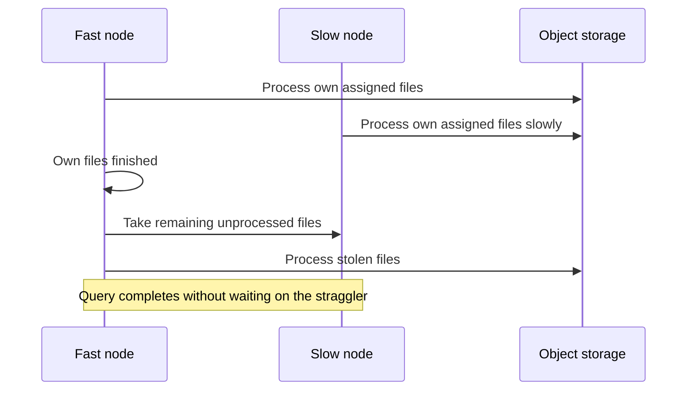

## 9. Cloud services and FoundationDB

### The brain

Neither storage nor compute knows what a table is. Storage knows immutable files; warehouses know how to execute plans. Something must track which files belong to which tables, which version is current, who may access them, and which warehouse should run a query. That is the **cloud services layer**, a multi-tenant service running continuously for all customers. Every query passes through it. It:

- Parses SQL and builds execution plans.
- **Prunes** micro-partitions using metadata.
- Schedules work on virtual warehouses.
- Enforces security and access control.
- Coordinates **transactions**.

### Where metadata lives

Every feature described so far depends on **metadata**: file lists, table versions, pruning statistics, and transaction state. It does **not** live in object storage, which suits immutable data files but not constantly changing metadata that every query must read consistently.

Snowflake keeps metadata in **FoundationDB**, a distributed, transactional key-value store: in the transcript's phrase, **a database beneath the database**.

### Transactions move pointers, not data

At commit time, the new micro-partitions have already been written to object storage. The commit does not touch them; it only updates metadata in FoundationDB, switching the table from one file list to another. **A Snowflake transaction does not move data; it moves pointers.** Data is written durably before commit, and the commit simply makes it visible.

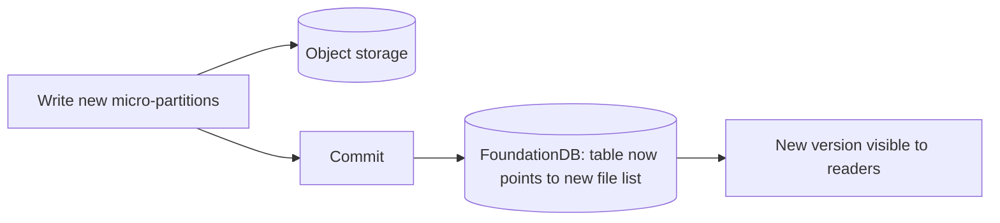

### A historical note

Per the transcript, Apple acquired FoundationDB in 2015 and stopped distributing it. Snowflake was already running its metadata layer on it, so it maintained its own internal copy for about three years until Apple open-sourced FoundationDB again in 2018.

So Snowflake, which looks like one giant warehouse, is really **two systems**: a massive object store of immutable data and a small transactional database coordinating it.

## 10. A query, end to end

1. A query arrives at the **cloud services** layer. It is parsed, planned, and optimized, and metadata prunes tens of thousands of files down to a few hundred.
2. The plan goes to a **virtual warehouse**, which may have been resumed just for this query.
3. Nodes read cached files from **local SSD**; cache misses are fetched from **object storage**.
4. Each node processes its share; if one lags, others **steal** its remaining files.
5. The result is assembled, stored in the **result cache**, and returned.
6. A few minutes later, the idle warehouse **suspends**, and you pay only for the seconds it ran.

No index was consulted, no data file was modified, and compute stayed fully separate from storage.

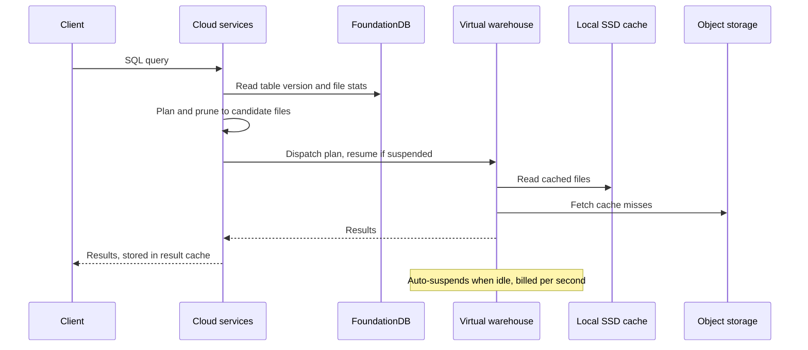

## 11. Economics as architecture

The transcript reports that on **September 16, 2020**, Snowflake raised about **$3.4 billion** in its IPO. Shares priced at $120 and reached about $254 on the first day, valuing the company around $70 billion by the close. Berkshire Hathaway invested about $730 million, its first purchase in a new offering since Ford in 1956, and the stake was worth about $1.5 billion by the end of the day.

Why should an engineer care? Because of what the market was valuing: not just another database but an **architecture**.

- **Per-second billing** is possible because compute is stateless and disposable.
- **Elastic scaling** is possible because data lives elsewhere.
- **Data sharing and a marketplace** follow naturally when every consumer reads the same immutable files through metadata rather than copies.

The transcript's point: a change in architecture enabled a different business model.

## 12. Trade-offs

Every Snowflake decision moved complexity somewhere else:

- **Immutable files** make reads, snapshots, and cloning simple but make writes expensive: changing one row rewrites a whole micro-partition. Workloads with many small, frequent updates pay for this.
- **Separating storage and compute** makes warehouses disposable but puts a network hop on the data path, which must be hidden by pruning, columnar reads, caching, and result reuse.
- **No indexes** simplifies the storage engine, but point-lookup workloads eventually required features such as **search optimization** and **hybrid tables** to compensate.
- **Metadata concentration.** Storage is extremely simple, but the metadata layer is not. It handles transactions, cloning, Time Travel, pruning decisions, and access control, all coordinated through one small transactional database (FoundationDB). Its correctness and availability are central.
- **Retention costs.** Keeping old versions for Time Travel means keeping old files, which consumes storage until retention expires.

| Decision | Enables | Costs |
| --- | --- | --- |
| Data in object storage | Independent scaling, stateless compute, one copy | Remote reads need caching and pruning |
| Immutable micro-partitions | Time Travel, UNDROP, zero-copy clones, snapshot isolation | Expensive fine-grained updates; retained old files |
| No indexes, min/max pruning | Simple storage, no index maintenance | Weak for point lookups; depends on clustering |
| Virtual warehouses | Workload isolation, per-second billing, auto-suspend | Cold caches after resume or resize |
| Metadata in FoundationDB | Cheap commits, clones, and versioning | A critical, complex coordination layer |

## Key takeaways

1. Architecture follows economics. Coupling compute to data made sense when networks were slow; once object storage, fast networks, and elastic compute arrived, the old rule could be broken. Inherited rules were optimized for someone else's constraints.
2. One decision can solve many problems. Never modifying data files gives Time Travel, `UNDROP`, zero-copy cloning, and snapshot isolation.
3. Keep data simple and metadata smart. Transactions are pointer updates and clones are pointer copies, so large operations become cheap, while complexity concentrates in a small metadata layer.
4. Prune instead of index: min/max metadata tells the engine where data is not, eliminating most files without reading them.
5. Hide remote latency in layers: read less, read narrower, read locally, and sometimes read nothing.
6. Elasticity starts with statelessness. Compute that holds no data can appear, disappear, resize lazily, and be billed per second.
7. Architecture is strategy. Competitors can copy features more easily than the architectural decisions that made them possible.

The transcript's summary: Snowflake did not build seven independent features. It made two architectural decisions, separating storage from compute and forbidding file modification, and the rest (Time Travel, cloning, `UNDROP`, snapshot isolation, elastic warehouses, per-second billing, and data sharing) followed from them. There is no universally best design; the best one fits your constraints.
