# Starlink Networking: Routing a Network Whose Routers Never Stop Moving

## Scope and framing

This explainer follows the supplied transcript and uses it as the basis for a conceptual description of how the Starlink satellite network moves packets. SpaceX publishes relatively little about Starlink internals, so the transcript itself is assembled from measurement studies by independent researchers, SpaceX regulatory filings and conference presentations, and academic work on low-Earth-orbit (LEO) networks, including a 2019 paper titled "Network Topology Design at 27,000 km/hour." Some behavior described here — notably the 15-second scheduling interval — is inferred from external measurements rather than confirmed by SpaceX. All figures (satellite counts, link counts, speeds, latencies, maneuver counts) are as reported in the transcript and have not been independently verified. The diagrams are conceptual, not operational network maps.

The core observation is that the terrestrial Internet is built on an assumption that routers do not move. Switches stay in racks and fiber stays in the ground. When topology changes, something has gone wrong — a failed router, a cut cable, a reboot — and routing protocols such as OSPF and BGP exist to detect the change, spread the news, and converge on a new map. Change is treated as episodic and unpredictable.

Starlink violates every part of that assumption. According to the transcript:

- More than 7,000 satellites are in orbit, each travelling at roughly 27,000 km/h (about 7.5 km/s).
- Each completes an orbit in about 95 minutes.
- More than 5 million homes, ships, and aircraft use the service.
- Satellites rise over a user's horizon, cross the sky, and disappear within minutes; links between satellites form and break continuously.

For a conventional network this would be a routing nightmare. But orbital motion has one property terrestrial failures lack: it is **deterministic**. Given current orbital elements, a satellite's position days ahead can be computed to within a few meters. So rather than discovering topology after it changes, Starlink computes the topology **before** it changes and distributes that as a schedule. Almost everything interesting about the architecture follows from this "predict, don't detect" principle.

## 1. Why fly at 550 km

### The geostationary baseline

Satellite Internet existed long before Starlink, using geostationary (GEO) satellites at about 35,800 km. At that altitude an orbit takes 24 hours, so the satellite appears fixed in the sky. From a networking perspective this is convenient:

- One satellite covers roughly a third of the planet.
- The user's antenna points at one fixed spot forever.
- No handovers between satellites are needed.

The problem is distance. Light takes about 120 ms to cover roughly 36,000 km. A request goes up and down, and the response goes up and down again, so the transcript estimates about 500 ms of pure propagation per round trip, and around 600 ms in practice once processing and ground networks are included. That is tolerable for bulk downloads but poor for video calls and gaming.

### Trading distance for motion

Starlink lowers the altitude to about 550 km — roughly 65 times closer. One-way propagation to the satellite drops below 2 ms, and the transcript reports measured round-trip times of about 20–40 ms, most of which is attributable to the ground network rather than space.

Orbital mechanics does not allow altitude and speed to be chosen independently. At 550 km, the only stable orbital speed is about 7.5 km/s; any slower and the satellite falls. So a low satellite necessarily sweeps across the sky in minutes. Continuous service requires a chain of satellites, each taking over from the last, and global coverage requires thousands of them.

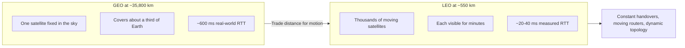

This is the fundamental trade: latency is exchanged for complexity. Every networking problem discussed below is a consequence of that choice.

## 2. The user terminal: a phased array that is told where to look

### Why a motorized dish would not work

A conventional satellite dish is a parabolic reflector on a mount. To track Starlink satellites it would need to sweep across the sky in about four minutes, swing back, acquire the next satellite, and repeat indefinitely in wind and cold. The transcript notes that such mechanics would wear out within months.

### Electronic beam steering

The Starlink terminal is a **phased array antenna**: hundreds of small antenna elements on a flat panel. Each element transmits the same signal with a slightly different time delay. With the right delays, the individual signals combine constructively in one direction to form a narrow beam. Changing the delays moves the beam — no moving parts required. The beam can be redirected anywhere in the sky within milliseconds. (The terminal has a motor, but per the transcript it is only used to tilt the panel once during installation.)

### Prediction instead of search

Crucially, the terminal does not scan the sky looking for a satellite. It stores an **ephemeris** — a continuously updated record of where each satellite will be over time — along with its own GPS position. Given both, the pointing angle is a straightforward calculation.

The same information solves a harder problem: **Doppler shift**. A satellite approaching at 7.5 km/s compresses its radio waves, shifting frequencies by hundreds of kHz in Starlink's bands, and the shift changes continuously as the satellite crosses the sky. A conventional receiver would have to measure and track this error in real time. Because both ends know their predicted relative motion, they can pre-compute the expected shift and compensate before transmitting, removing most of the frequency error before the signal arrives.

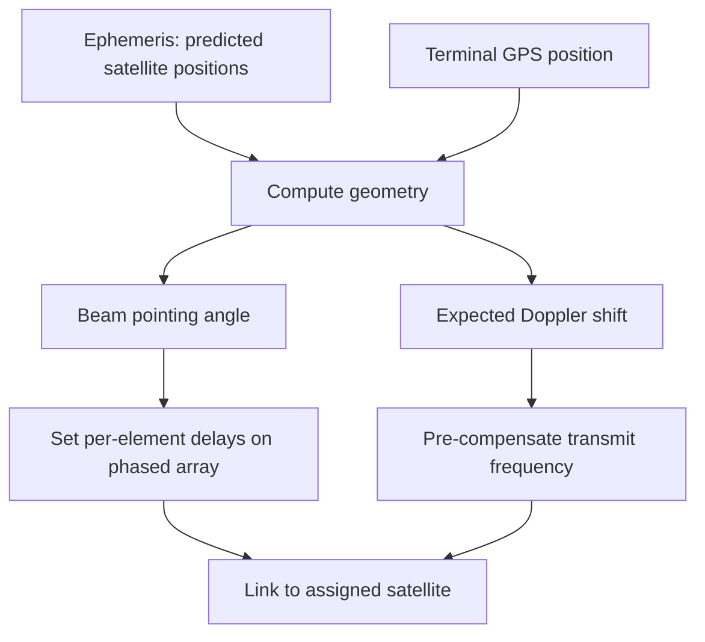

Locking onto a satellite turns out to be the easy part. Deciding **which** satellite should serve a given user is much harder.

## 3. Cells, beams, and the 15-second scheduler

### The ground as a hexagonal grid

Starlink divides the Earth's surface into hexagonal cells. The transcript notes that the cells visible on Starlink's availability map come from **H3**, the open-source hexagonal geospatial index originally developed by Uber. The same grid used to group ride requests is used to group satellite beams.

Each satellite can form only a limited number of narrow beams, and each beam covers approximately one cell. Everyone inside a cell shares that beam's capacity. In effect, Starlink sells access to beam capacity over a patch of ground. That explains why some areas show as sold out or waitlisted: every beam that can serve that cell is already allocated, and adding a customer would take capacity from existing ones.

### A global assignment problem

At any instant, thousands of satellites with limited beams move over millions of cells that all need continuous coverage. The network must keep deciding which satellite serves which cell while the whole constellation moves.

According to the transcript, the constellation goes through a **replanning phase every 15 seconds**. A central scheduler computes new satellite-to-cell assignments and distributes them. Each terminal receives a simple instruction: stay on the current satellite or switch to a specified one. If a switch is needed, the beam moves in milliseconds.

This interval was not published by SpaceX. Researchers inferred it by running terminals and logging latency over long periods: latency changes smoothly as the serving satellite approaches or recedes, then jumps abruptly at boundaries that occur at exact 15-second intervals, synchronized across different users. That implies the network is replanned four times a minute, or 5,760 times a day.

### Constraints the planner must satisfy

The scheduler is not simply picking the nearest satellite. The transcript lists several classes of constraint:

- **Elevation:** a satellite must be at least 25° above the user's horizon; lower angles pass through too much atmosphere.
- **Satellite resources:** each satellite has a finite power budget and a finite number of beams, limiting how many cells it can serve at once.
- **Backhaul and legality:** not every satellite can carry a user's traffic to the Internet; gateway visibility and per-country licensing determine which paths are permitted.
- **GEO exclusion zone:** international spectrum rules protect older geostationary satellites from interference. If a Starlink satellite would pass into the line of sight between a user and the geostationary belt, it must stop transmitting to that user before entering the zone. This creates an invisible no-transmit line moving across the sky — a regulatory rather than physical constraint — which the planner anticipates and routes around.

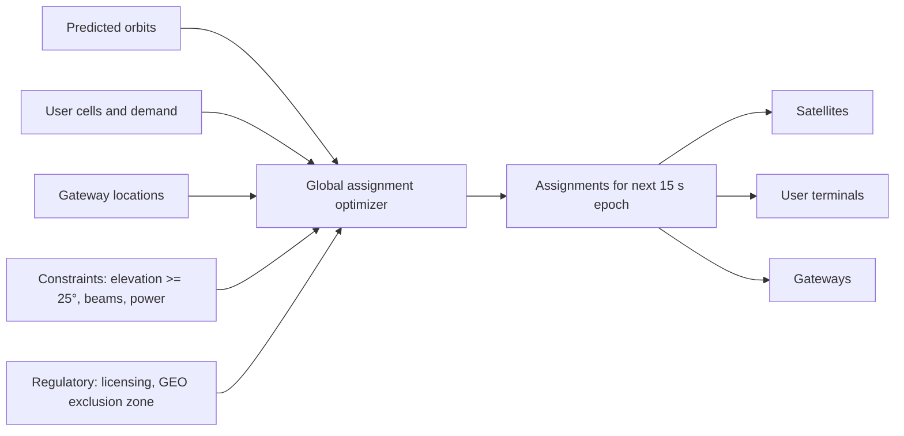

### Synchronized change versus surprise change

The transcript contrasts this with a Datadog outage, where tens of thousands of servers changed state at the same moment and that simultaneous change triggered the incident. Starlink changes its entire network simultaneously four times a minute by design. The difference is that Starlink's changes are computed in advance and delivered as a schedule; nothing is a surprise.

## 4. Why not OSPF or BGP: routing by ephemeris

### Reactive routing on Earth

On the ground, a cut fiber, failed router, or bad configuration push causes OSPF to flood link-state updates and BGP to gradually explore new paths. None of that can happen early, because terrestrial failures are fundamentally unpredictable — nobody can schedule a backhoe accidentally cutting a cable. Existing routing protocols are therefore **reactive**: their job is to detect unexpected change and converge as quickly as possible.

### Predictive routing in orbit

Starlink's topology changes constantly, but almost entirely predictably. A satellite's path is determined by gravity, altitude, and a small correction for atmospheric drag. From today's orbital elements it is possible to compute, to within meters, where any satellite will be at a specific time next week — and therefore every pass over every cell, every moment two satellites will have line of sight, and every link that will be geometrically possible.

So Starlink inverts the routing problem. The ground control system takes predicted orbits, gateway locations, user cells, and all operational constraints, computes the network state for the next planning interval, and distributes that plan to the constellation before it takes effect.

- The **data plane** — packet forwarding — lives in orbit.
- The **control plane** — deciding where packets should go — stays on the ground.

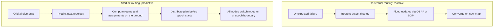

### Epoch-based reconfiguration

Because every satellite, terminal, and gateway switches to the new configuration at the same epoch boundary, no router is half-migrated and no two nodes disagree about which map is current. Convergence is replaced by a schedule. Readers familiar with distributed systems will recognize this as **epoch-based reconfiguration**, applied to a physical network.

### Handling real surprises

Genuinely unexpected events — a satellite failure or a broken laser terminal — are handled in the ordinary way: they are not predicted, they are observed. When the ground system learns a satellite is unavailable, it drops that satellite from the next optimization, and within one epoch the scheduler produces a global plan that no longer depends on it.

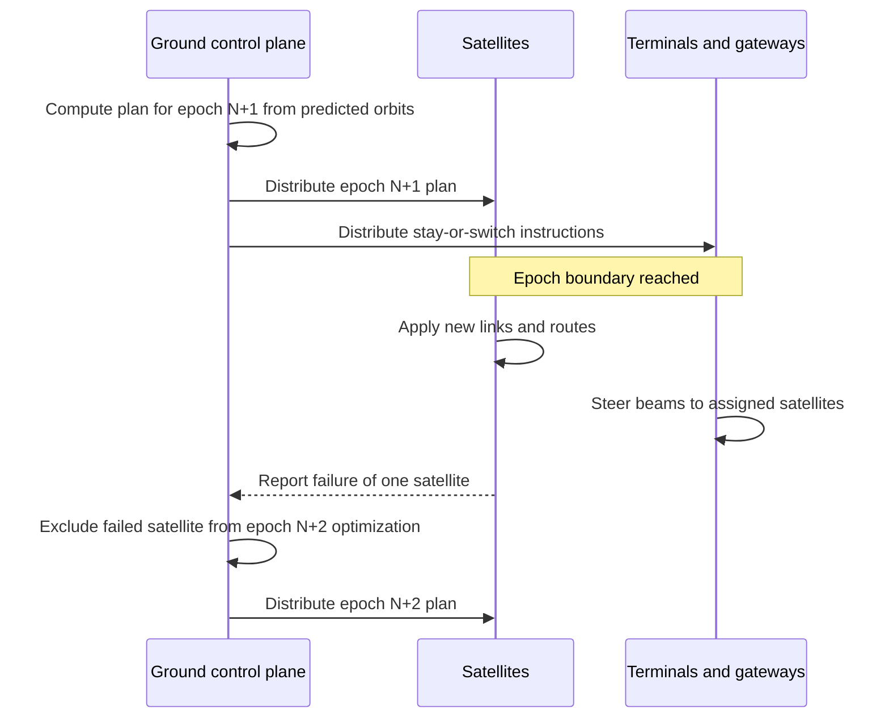

## 5. From bent pipe to lasers in space

### The bent-pipe generation

The first-generation architecture was a **bent pipe**. A packet goes up to a satellite, and the satellite sends it straight back down to a **gateway** — a ground station with large antennas and a fiber connection to the terrestrial Internet. The satellite acts like a mirror in the sky; it does not forward traffic across the constellation.

That imposes a strong constraint: the user and a gateway must both be in view of the same satellite at the same time. At about 550 km, one satellite covers a region only a few thousand kilometers across. With no gateway in that footprint, a packet has nowhere to go after reaching orbit.

This explains the early coverage map: service first appeared in the continental United States and Europe, where gateways could be placed every few hundred kilometers along existing fiber. The middle of the Pacific, polar regions, and ships and aircraft far from land could not be reliably served. In the bent-pipe design, the satellite network is a thin wireless extension of the terrestrial network; a packet spends about 2 ms in space and the rest of its journey on the ground.

### Optical inter-satellite links

To serve places with no fiber below, packets had to stop bouncing straight back down and start moving sideways through space. From 2021, SpaceX began launching satellites with optical inter-satellite links. Citing a SpaceX presentation at Photonics 2024, the transcript reports:

- More than 9,000 laser links across the constellation.
- About 100 Gbps per link.
- Some links spanning up to about 5,400 km.
- Roughly 40 petabytes carried per day.

Each laser terminal has to hold milliradian-level pointing accuracy over thousands of kilometers while both satellites move at orbital speed and experience constant attitude perturbations.

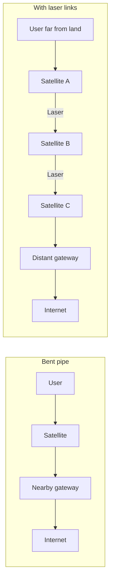

## 6. The structure of the laser mesh

Starlink satellites are not scattered randomly. They are arranged in dozens of **orbital planes**. Each plane is a ring of satellites following the same path one behind another; many rings circle the Earth side by side, slightly offset. The transcript's analogy is parallel highways circling the planet.

### Intra-plane links: nearly static

Each satellite's most important links point to the satellites directly ahead of and behind it in the same plane. These neighbors are at the same altitude, speed, and trajectory, so their relative velocity is close to zero — like two cars on the same highway at the same speed, each appearing stationary to the other. According to the transcript, once established these links stay up for weeks. They are the stable backbone of the mesh.

### Cross-plane links: scheduled handovers

Links to satellites in neighboring planes are harder. The geometry between adjacent rings shifts continuously: a neighbor drifts into a usable position and then drifts away, so the link must eventually be broken and re-established with the next satellite. But these changes are also predictable. Orbital mechanics tells the planner exactly when a cross-plane link will stop being usable and which satellite will replace it, long before it happens.

### Counter-rotating planes: mostly avoided

Where northbound satellites pass southbound ones, relative velocities add rather than cancel, producing closing speeds of tens of thousands of kilometers per hour. These are the hardest links to establish and hold. Per the transcript, Starlink largely avoids linking across opposing planes and prefers routes through slower geometry wherever possible.

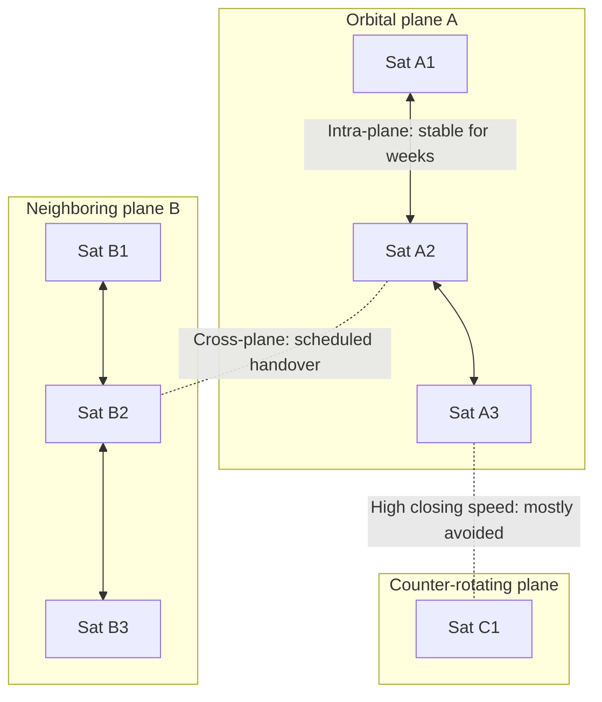

The result is a mesh that is far more structured than it first appears: some links are effectively permanent, others change on a known schedule, and the hardest geometry is simply designed out.

## 7. Why space can beat fiber over long distances

Light in optical fiber does not travel at the vacuum speed of light. Glass slows it by about a third: roughly 200,000 km/s in fiber versus 300,000 km/s in vacuum. In the transcript's framing, photons overhead travel about 50% faster than photons under the ocean.

Over short distances fiber still wins, because a Starlink packet must climb about 550 km, cross the constellation, and descend another 550 km — extra distance the terrestrial path does not have. But that overhead is roughly fixed. As the destination gets farther away, the space path grows only a little longer, while the fiber path grows kilometer by kilometer at two-thirds light speed (and, as general background, undersea and terrestrial cables rarely follow the great-circle route). The transcript cites a crossover of about 3,000 km, beyond which the space path becomes faster.

$$
t_{\text{fiber}} \approx \frac{d_{\text{fiber}}}{0.67c}, \qquad t_{\text{space}} \approx \frac{2h + d_{\text{orbit}}}{c}
$$

Simulations by Mark Handley at University College London, cited in the transcript, examined routes such as London–Singapore and New York–Tokyo and found savings of tens of milliseconds via space. For most users that is a curiosity; for industries where latency is the product, such as high-frequency trading — which has invested heavily in straighter fiber routes and microwave links to shave off milliseconds — it can be valuable.

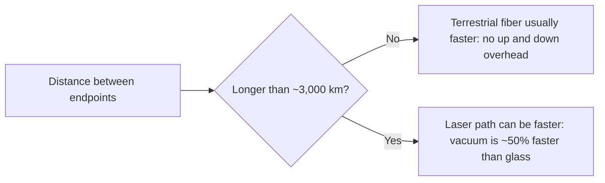

## 8. Keeping sessions alive: stable identity over a moving path

### The point of presence as anchor

If a user's traffic changes satellites every few minutes and the path is replanned every 15 seconds, why don't SSH sessions drop hundreds of times an hour? Because the user's IP address does not live in space. It lives at a **point of presence (PoP)** on the ground — for example Seattle, Frankfurt, or London — where Starlink connects to the rest of the Internet.

Everything between the terminal and the PoP is Starlink's private transport network. Packets may traverse satellites, laser links, gateways, and fiber, but from the Internet's perspective it is a single tunnel with fixed endpoints. The path inside is rebuilt constantly; the identifiers at each end do not change.

Consequences described in the transcript:

- Websites geolocate users by their PoP city, so someone in rural Montana may appear to be in Seattle.
- BGP never sees satellites moving; it simply sees Starlink announcing the same prefixes from the same PoPs.
- A TCP connection sees one stable endpoint, even as hundreds of satellite handovers happen underneath.

This mirrors cellular networks, which anchor a phone's session at a packet gateway in the carrier core and tunnel traffic from the handset to that gateway, so a download survives driving past many towers. Starlink applies the same model with the tunnel stretched through orbit.

### The latency sawtooth

Continuous latency measurements show round-trip times typically of 20–60 ms. At each 15-second boundary the scheduler may move a user to a different satellite, causing a step up or down in latency and occasionally a few lost packets. The resulting graph is a repeating sawtooth rather than random noise: the channel is not noisy, it is periodically rescheduled.

That matters because most Internet protocols assume change is random:

- **CUBIC**, the loss-based congestion controller used widely today, interprets packet loss as congestion, even when the loss comes from a planned handover.
- **BBR**, Google's model-based congestion controller, continuously estimates the path's minimum round-trip time — but on Starlink that minimum itself shifts every 15 seconds.
- Real-time applications must tolerate periodic latency spikes.

For most users, calls, gaming, and browsing work well. But for systems built on Starlink links — ships, aircraft, remote mines, offshore platforms — the transcript's advice is to treat the channel as **periodically changing rather than unreliable**, and tune buffers, timeouts, and congestion behavior for synchronized, not random, variation.

## 9. Operating a fleet that is replaced, not upgraded

### Software updates, hardware replacement

Software is updated conventionally: new firmware is pushed over the air to satellites and terminals, often frequently. Hardware is not upgraded; it is replaced. Satellites are designed for roughly five years of service, and low orbit is self-cleaning: atmospheric drag at about 550 km means failed satellites eventually deorbit and burn up.

New capabilities therefore arrive with new launches. Per the transcript, lasers first appeared in version 1.5, and version 2 Mini added higher capacity and new frequency bands. At any moment several generations are flying at once — some with lasers, some without, with different bands and beam counts. The planner must know each satellite's individual capabilities and schedule around them rather than treat the fleet as uniform.

### Collision avoidance feeds back into prediction

The fleet actively dodges space traffic. The transcript reports roughly 50,000 autonomous collision-avoidance maneuvers in one recent six-month reporting period — small thruster pulses to avoid debris and other spacecraft, performed without human intervention.

Each maneuver changes an orbit, and the predicted orbit underpins nearly everything: antenna pointing, Doppler pre-compensation, laser acquisition, and the 15-second plans. So satellites report their updated positions, and the ground recomputes the network using the new ephemeris.

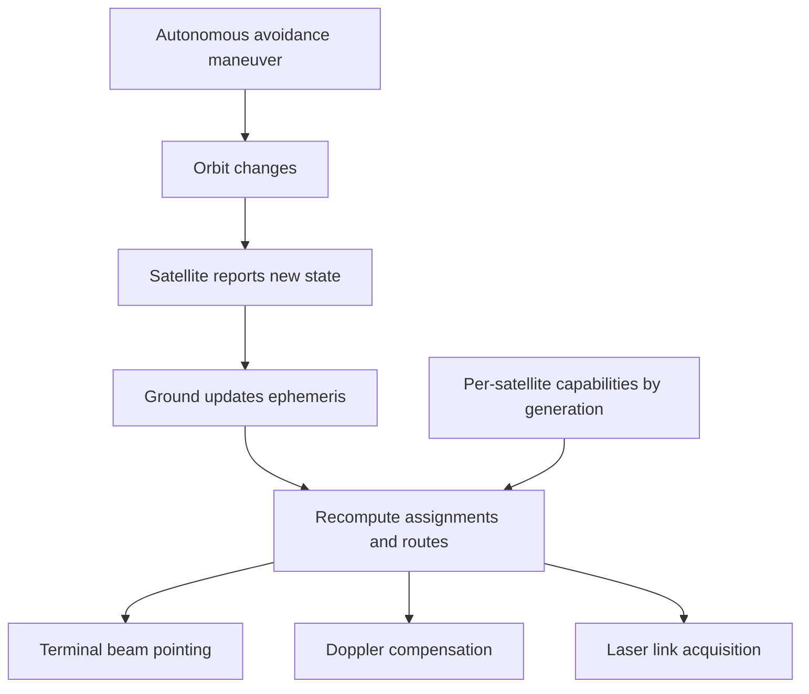

## 10. Tracing one packet end to end

The transcript closes by following a single web request from a ship in the mid-Atlantic:

1. The terminal is already pointed at the satellite named in the current 15-second plan — a satellite it never searched for, whose position came from orbital data — and transmitting on a frequency already pre-compensated for Doppler.
2. The packet reaches orbit in about 2 ms.
3. There is no gateway below, so instead of returning to Earth the packet travels sideways through the constellation.
4. It crosses stable intra-plane laser links, then makes scheduled hops to adjacent planes as the route bends toward Europe. Every hop was computed before the packet was sent.
5. It descends to a gateway on the Irish coast and enters terrestrial fiber.
6. It reaches the London PoP, where the user's public IP lives, passes through NAT, and goes out to the open Internet and the destination website.
7. Mid-page-load, the 15-second scheduler fires; the terminal switches satellites, the space path is rebuilt, and a new tunnel reaches the same London PoP.
8. The TLS session notices nothing, because from the Internet's perspective nothing changed.

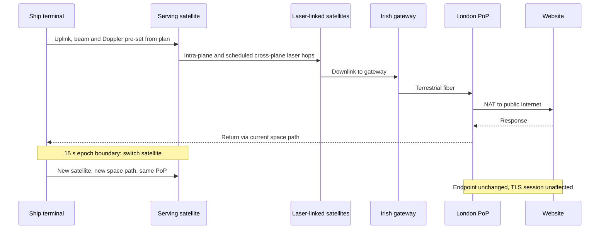

Almost everything that looked dynamic — pointing, handover, routing, even laser links — was executed from a precomputed schedule. The only fully reactive part of the journey was the terrestrial Internet at the end.

## 11. Trade-offs

The architecture solves hard problems, but each choice has a cost:

- **Latency for complexity.** LEO slashes latency compared with GEO but requires thousands of satellites, continuous handovers, and a global scheduler.
- **Centralized control plane.** Ground-based planning is efficient when the future is predictable, but it concentrates decision-making; unexpected failures are only absorbed at the next epoch boundary.
- **Periodic disruption.** Synchronized replanning creates latency steps and occasional packet loss every 15 seconds, which loss-based and delay-based congestion controllers can misinterpret.
- **Shared, finite cell capacity.** Each beam's capacity is shared by everyone in a cell, so dense areas can sell out regardless of how many satellites exist overall.
- **Distance-dependent benefit.** Laser routing beats fiber only beyond roughly 3,000 km; for shorter paths the up-and-down overhead dominates.
- **Geolocation and identity side effects.** Anchoring IPs at a PoP keeps sessions stable but makes users appear to be in the PoP's city.
- **Heterogeneous fleet.** Continuous replacement delivers new capabilities quickly but forces the planner to handle multiple hardware generations simultaneously.
- **External constraints.** Regulation (licensing, GEO exclusion zones) and space traffic (collision avoidance) inject constraints and orbit changes the planner must continually absorb.

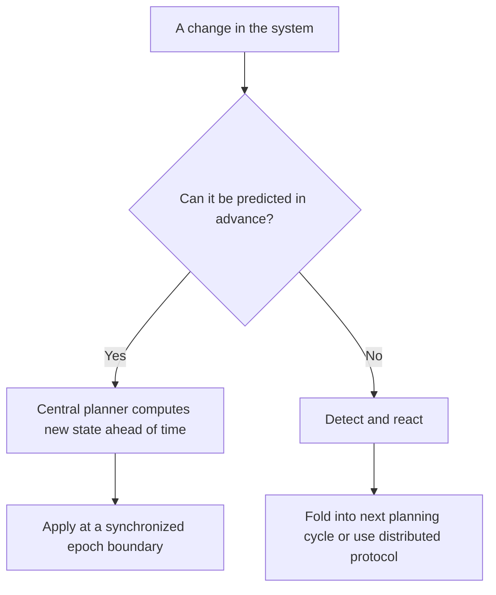

## Key takeaways

1. **Separate expected change from unexpected change.** Most systems react to everything, but traffic patterns, maintenance windows, certificate expirations, and planned failovers can be computed in advance. Keep reactive machinery for true surprises.
2. **When change is constant, synchronize it.** A fixed scheduling epoch turns thousands of independent transitions into one coordinated update, just like epoch-based reconfiguration in distributed systems.
3. **Keep identity stable while infrastructure moves.** A user's IP never moves even as satellites change beneath it — the same principle behind Kubernetes Services over ephemeral pods, cellular packet gateways, and load balancers over churning backends.
4. **Choose central planning or distributed routing by predictability.** If the future can be computed, a central planner usually wins; if it cannot, distributed protocols become necessary. The skill is knowing which parts of a system fall into which category.
5. **Start from physics, not topology.** Light is about 50% faster in vacuum than in glass, so a longer path through a faster medium can beat a shorter one. Physical constraints matter as much as the software above them.
6. **Design for replacement, not perfection.** Frequent software updates plus steady hardware replacement produce a permanently heterogeneous fleet; the scheduler must model individual capabilities instead of assuming uniform nodes.
7. **Treat periodic channels as periodic, not unreliable.** Systems running over Starlink should tune buffers, timeouts, and congestion control for synchronized, predictable variation rather than random loss.

The broader lesson from the transcript is that Starlink did not beat the routing problem by making reactive protocols faster. It changed the nature of the problem: by moving from detection to prediction, a network of constantly moving routers becomes a network that follows a schedule.
