# BitTorrent Architecture: Scaling Supply with Demand in a Leaderless Network

## Scope and framing

This explainer follows the supplied transcript and uses it as the basis for a conceptual description of the BitTorrent protocol and its ecosystem. The transcript draws on Bram Cohen's paper "Incentives Build Robustness in BitTorrent," the protocol specifications, the Kademlia paper, and public engineering reports. Figures such as traffic share, deployment times, slot counts, and timer intervals are given as reported in the transcript and have not been independently verified. Clients differ in their defaults and extensions, so specific numbers should be read as typical or reference values rather than fixed rules. The diagrams are conceptual and simplify the wire protocol.

The central idea is an inversion of the client-server relationship. In a conventional download service, every new user consumes a slice of fixed server capacity. In BitTorrent, every downloader also uploads, so each new participant adds capacity as well as demand. That single inversion creates three engineering problems the protocol must solve without any central authority:

- **Integrity:** data now arrives from anonymous, untrusted machines.
- **Scheduling:** peers must decide which piece to fetch next, and from whom.
- **Incentives:** uploading costs bandwidth, and nothing forces anyone to do it.

On top of those, the protocol later removed its remaining central components — the tracker and the `.torrent` file — and introduced a congestion-control scheme so that background transfers stop degrading everything else on a home connection.

According to the transcript, a 2004 CacheLogic measurement estimated BitTorrent at about 35% of Internet traffic, more than other peer-to-peer networks combined. The first implementation was written in Python by one programmer and released in 2001. There was no company, data center, or server fleet behind that traffic; the capacity came from the users themselves.

## 1. The components of a BitTorrent system

Before looking at the mechanisms, it helps to name the moving parts.

- **Content file(s):** the payload to distribute, split into fixed-size **pieces**.
- **`.torrent` metadata file:** a small file listing the pieces, a cryptographic hash for each piece, and the address of a tracker.
- **Peer:** any machine participating in the transfer. There is no client/server distinction; downloading automatically makes you a peer.
- **Swarm:** the set of peers currently active on one particular torrent.
- **Seeder:** a peer that has every piece.
- **Leecher:** a peer that is still downloading and holds only some pieces.
- **Tracker:** a coordination server that keeps a list of active peers for a torrent and hands a new peer a few dozen addresses. It never touches file data.

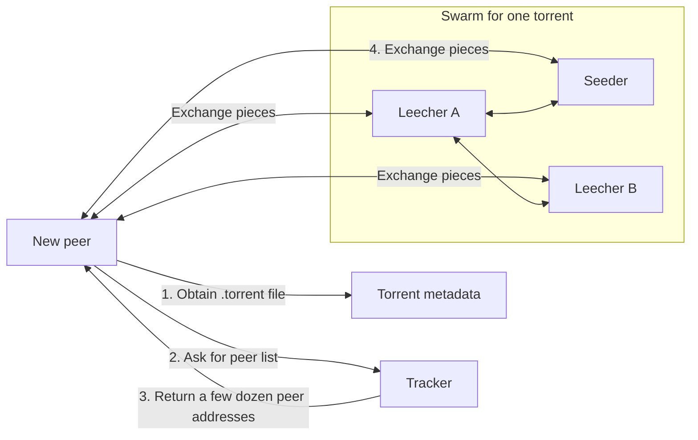

The tracker is deliberately thin. It is a rendezvous point, not a data path. That design choice matters later, because it made the tracker relatively easy to replace with a fully distributed lookup.

## 2. Why client-server distribution hits a wall

### Fixed capacity, variable demand

Around 2001, distributing a file typically meant hosting it on one server. Every download pulled every byte from that server. Bandwidth cost grew linearly with the number of downloaders, while capacity was fixed at whatever had been provisioned in advance.

The failure mode got a name: the **flash crowd**, often called the **Slashdot effect**. A link appears on a popular site, demand spikes by orders of magnitude, and the server collapses precisely when the most people want the file. The transcript illustrates this with a modest 2001-era machine provisioned for a few thousand downloads suddenly facing millions of requests.

The structural issue is that capacity and demand are decoupled:

- Provision too much, and money is wasted on idle capacity.
- Provision too little, and a demand spike causes an outage.

There is no static provisioning level that is efficient in both the quiet case and the spike case.

### Inverting the relationship

BitTorrent's answer is that downloading is inseparable from uploading. With a thousand clients and one server, a client-server model divides one uplink a thousand ways. In a swarm, the origin needs to push each byte into the swarm roughly once; after that, peers copy pieces among themselves. Aggregate capacity becomes the sum of the participants' upload bandwidth, so it grows with the size of the crowd.

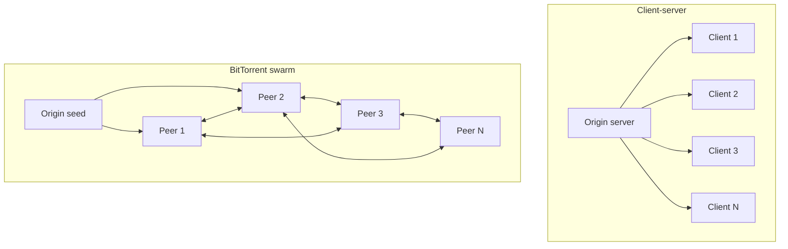

A surge that would overload a single server can instead make a swarm faster, because the surge brings more uploaders. This is the property that makes the design attractive well beyond consumer file sharing.

## 3. Pieces: the unit of parallelism and early contribution

The payload is cut into equal-sized pieces. The transcript cites piece sizes from about 256 KB up to several megabytes, so a large file becomes thousands of pieces. Splitting the file yields two benefits.

### Parallelism and pipelining

Different pieces can be fetched from different peers at the same time. Within a connection, a client does not have to request one block, wait for it, and then request the next. It can **pipeline** several outstanding requests so the link stays busy instead of idling on round trips. (In practice pieces are further divided into smaller blocks for requests, but the principle is the same.)

### Contributing before completion

Once a peer has received and verified a single piece, it can serve that piece to others. A new peer therefore becomes a source within seconds of joining rather than only after its download completes. Without piece-level granularity, a downloader would have nothing verifiable to share until the whole file arrived, and the swarm would lose most of its upload capacity during the period when demand is highest.

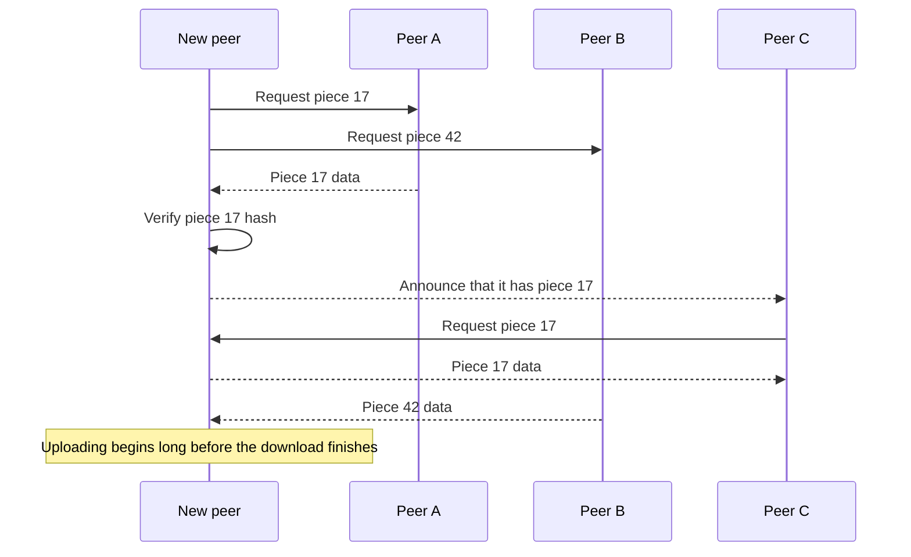

## 4. Integrity: verify the content, not the sender

### The threat

Any machine can join a swarm and start sending data. Some may send corrupt pieces on purpose; others may be buggy or have damaged storage. If a peer accepts a bad piece, it wastes its own bandwidth and then spreads the corruption to everyone it serves.

Authenticating peers is not a workable answer. Participants are meant to be anonymous and interchangeable; the whole point is that anyone can contribute capacity and no small set of peers is special. So the protocol verifies **data**, not **identity**.

### Per-piece hashes

The `.torrent` metadata contains a SHA-1 hash for each piece, computed by whoever created the torrent from the original content. A cryptographic hash maps arbitrary input to a short fixed-size fingerprint; changing a single input bit produces a completely different fingerprint, and producing different data that matches a given fingerprint is intended to be computationally infeasible.

The rule is simple:

1. Accept a piece from any peer.
2. Hash it locally.
3. Compare against the expected hash from the metadata.
4. If it matches, store it and start advertising it.
5. If it does not match, discard it, re-request it from a different peer, and optionally ban the sender.

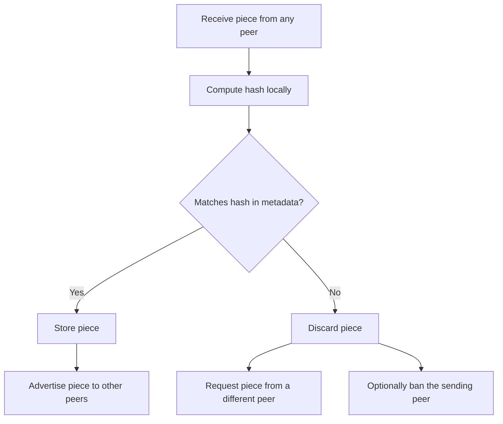

Because the metadata is the root of trust, obtaining it from a trustworthy source (or, later, verifying it against an info-hash) is what makes the rest of the exchange safe. Once content is self-verifying, the delivery path no longer needs to be trusted at all.

A general engineering note: SHA-1 is no longer considered collision-resistant for new security designs, and newer protocol revisions have moved to stronger hashes. The architectural idea — content addressing with per-chunk verification — is independent of the particular hash function.

## 5. Scheduling: which piece next?

### Why sequential download fails

The obvious strategy is to download pieces in order. The transcript identifies three problems with it:

1. **Nothing to trade.** If everyone downloads in the same order, peers hold the same early pieces and have little to offer one another.
2. **Hot spots.** Requests for later pieces all converge on the few peers (usually the seeders) that have them, recreating the bottleneck BitTorrent was meant to remove.
3. **Permanent loss.** If the only seeder leaves, early pieces exist in many copies, but later pieces may exist nowhere. The file can never be completed — the familiar "stuck at 99%" experience.

### Rarest first

BitTorrent reverses the default. Peers tell each other which pieces they hold, and each client tracks how many of its neighbors have each piece. It then prefers the **rarest** pieces — those replicated on the fewest peers — before the common ones.

The effect is that replication levels out across the swarm. Ideally the original seed needs to upload each piece only once, after which the swarm can keep propagating it even if the seed departs.

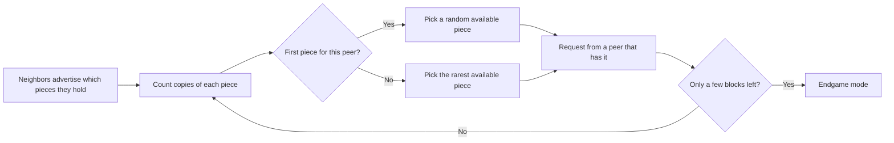

The transcript highlights a design principle here: each client acts partly in the interest of the whole swarm, yet this aligns with its own interest. A healthy swarm with evenly replicated pieces is exactly the environment in which an individual download finishes quickly and reliably.

### Random first piece

There is one exception. A brand-new peer picks its **first** piece at random instead of the rarest one. Rare pieces are, by definition, slow to obtain because few peers have them. A newcomer needs something to trade as quickly as possible, so it grabs whatever is readily available and switches to rarest-first afterward.

### Endgame mode

Most of a download goes quickly because many pieces arrive in parallel from many peers. Near the end, only a few blocks remain, and if one of them is being fetched from a slow peer, the entire download waits on that one machine.

In **endgame mode**, the client requests the remaining blocks from multiple peers at once, keeps whichever copy arrives first, and cancels the others. This spends a small amount of duplicate bandwidth to avoid being held hostage by a single slow peer. At 99% complete, bandwidth is cheap and waiting is expensive.

## 6. Incentives: tit-for-tat without a reputation system

### The free-rider problem

Uploading consumes bandwidth, and on a metered connection it costs money. The individually rational strategy is to download everything and upload nothing. The transcript cites a 2000 study of Gnutella, an earlier peer-to-peer network, that found almost 70% of users shared no files, and the top 1% of hosts provided nearly half of all responses. The "decentralized" network had collapsed into a handful of volunteers carrying everyone else: effectively client-server topology without client-server guarantees.

BitTorrent has no accounts to suspend, no administrators, and no way to prevent users from modifying their client. Enforcement therefore has to live inside the protocol's rules of exchange.

### Choking and unchoking

Each client uploads to only a small number of peers at a time; the transcript gives about four upload slots as the default. Refusing to upload to a peer while keeping the connection open is called **choking**; allowing uploads is **unchoking**.

Periodically — the transcript cites every 10 seconds — each client re-evaluates its neighbors, ranks them by the download rate they have recently provided, unchokes the best few, and chokes the rest. The rate at which a peer uploads therefore determines how much it gets back. Fast uploaders are reciprocated; peers that give nothing are eventually choked by everyone.

This is a direct application of the **tit-for-tat** strategy from game theory: cooperate first, then mirror the other party's behavior. The transcript notes that in Axelrod's iterated Prisoner's Dilemma tournaments this simple strategy outperformed much more complex ones, and Cohen's paper builds on that result. There is no reputation database, no account history, and no moderation; enforcement emerges from each peer's local decisions.

### Optimistic unchoking

Pure tit-for-tat has a bootstrap problem. A new peer has zero pieces, so it uploads nothing, so every neighbor chokes it, so it never gets a first piece — and the swarm cannot admit newcomers.

The fix is **optimistic unchoking**. Periodically — the transcript cites every 30 seconds — each client gives one upload slot to a randomly chosen peer regardless of that peer's upload rate. This serves two purposes:

- **Bootstrapping:** newcomers soon receive a first piece from someone's random slot, verify it, and can begin reciprocating.
- **Discovery:** the random slot occasionally finds a peer with a faster uplink than any current partner. That peer then earns a regular slot on merit.

In reinforcement-learning terms, the regular slots are **exploitation** and the optimistic slot is **exploration**.

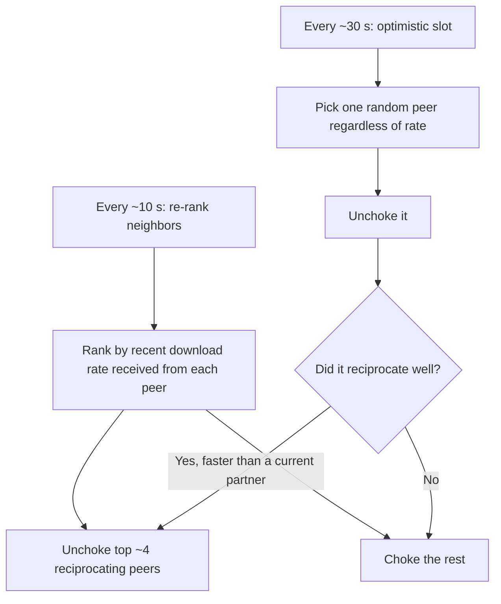

The incentive mechanism is not perfect — later research explored clients that game it — but it moved the equilibrium enough that swarms remained healthy at massive scale without any central enforcement.

## 7. Discovery: removing the tracker with a DHT

### The tracker as a single point of failure

By the transcript's account, as of 2005 each swarm still depended on a tracker. Its job was trivial, but if it went down, new peers could not join and existing swarms could not be found. It was also a single point of failure in a non-technical sense: a tracker has an operator, an IP address, and a hosting account, which made trackers straightforward to shut down.

### Mainline DHT and Kademlia

In 2005 BitTorrent introduced the **Mainline DHT**, a distributed hash table based on **Kademlia** (a protocol from around 2000). A hash table maps keys to values; a DHT spreads that table across a large number of independent machines. In BitTorrent:

- **Key:** the torrent's **info-hash** — the SHA-1 hash of its metadata, a 160-bit identifier.
- **Value:** a list of peers participating in that torrent.

The hard question in any DHT is which machine stores which key when there is no coordinator. Kademlia answers with two ideas:

1. Each node picks a random 160-bit node ID when it joins.
2. Torrents already have 160-bit IDs (their info-hashes).

Because nodes and keys share one ID space, the nodes whose IDs are **closest** to an info-hash are responsible for storing the peer list for that torrent. As general background, Kademlia defines closeness using the XOR of two IDs, and each node keeps a routing table biased toward nodes near its own ID, so a lookup converges on the target in a number of steps that grows roughly logarithmically with network size. The transcript describes this as enabling peer lookup in a network of tens of millions of nodes.

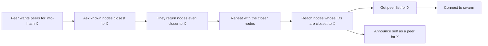

### Metadata exchange and magnet links

After the tracker was gone, one centralized artifact remained: the `.torrent` file, which had to be hosted somewhere. An extension called **metadata exchange** lets peers transfer the metadata itself, just like pieces. The downloader verifies the received metadata against the info-hash, exactly as it verifies pieces against their hashes.

With that, the minimum needed to join a swarm is the info-hash alone — a 40-character hexadecimal string, typically delivered as a **magnet link**. From it a client can find peers via the DHT, fetch and verify the metadata from them, and then download and verify the content.

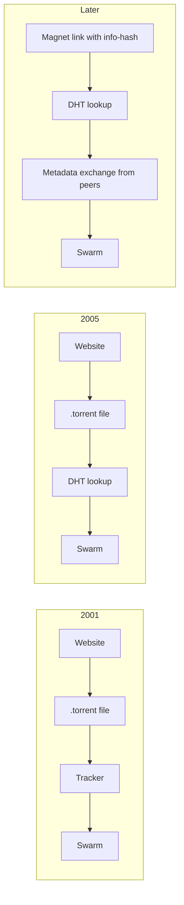

The change looks incremental, but the architecture has shifted fundamentally. A normal URL names a **location**, usually a server that can go down. A magnet link names **content**. Any peer holding that content can serve it, and the requester can verify it independently. The transcript points out that this is why an AI lab can release a model by publishing a single 40-character identifier.

## 8. Coexisting with other traffic: uTP and LEDBAT

### The bufferbloat problem

Early BitTorrent had a reputation for making everything else on a home connection — video calls, games, browsing — miserable. The transcript explains that the cause was not primarily raw bandwidth consumption but **bufferbloat**.

TCP does not know a link's capacity; it probes by sending faster until packets are dropped, and treats loss as the congestion signal. Home routers, however, tend to buffer packets rather than drop them immediately, so by the time TCP sees loss, the buffer is full. A torrent client runs dozens of TCP connections at once, uploading and downloading simultaneously, and together they keep the router buffer permanently full. Every other packet — interactive or not — waits in that queue, and queueing delay can grow to seconds.

### Delay-based congestion control

Around 2009, BitTorrent introduced **uTP** (a transport protocol that, as general background, runs over UDP). Instead of waiting for loss, uTP measures **queueing delay**: packets carry timestamps, and when the one-way delay rises above a target — the transcript cites about 100 milliseconds — the sender backs off before router buffers fill and interactive traffic suffers.

A second, deliberate property: because loss-based TCP is more aggressive, it wins whenever the link is contended. uTP is designed to behave like a background task, consuming spare capacity when available and yielding promptly when foreground TCP traffic appears.

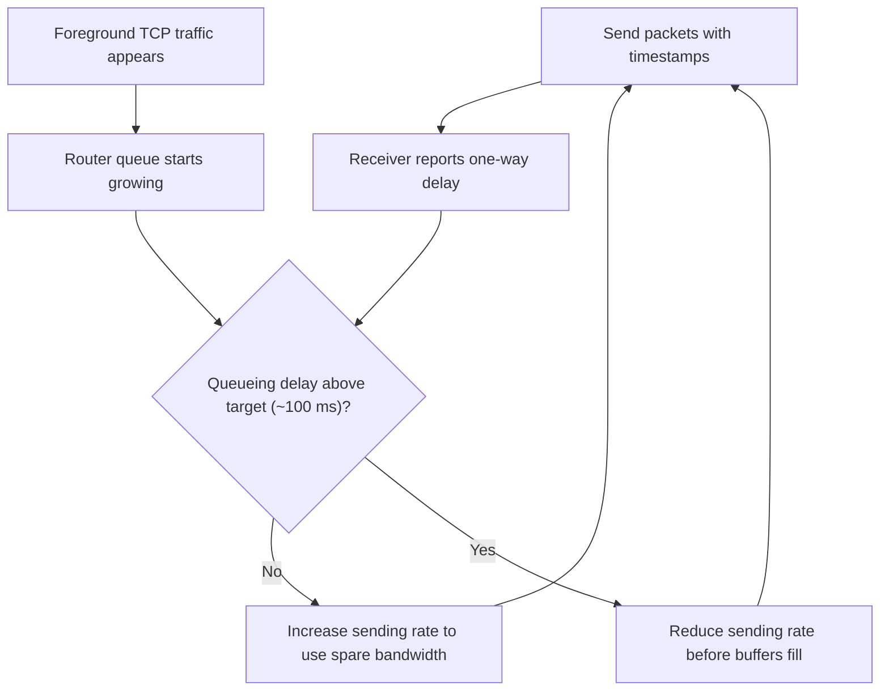

The congestion-control algorithm was standardized by the IETF as **LEDBAT** (Low Extra Delay Background Transport). The transcript reports that the same approach is now used for background transfers such as Windows updates and Apple software updates.

## 9. BitTorrent patterns in production

The transcript lists several uses of the swarm pattern beyond consumer file sharing:

- **Twitter (2010):** used BitTorrent internally to deploy code to thousands of servers, reportedly cutting deployment time from about 40 minutes to about 12 seconds, because each server began re-serving chunks as soon as it received them.
- **Facebook:** used the same idea to push large binaries to tens of thousands of machines, preferring peers in the same rack to keep traffic local.
- **Blizzard:** built a BitTorrent-based patcher for World of Warcraft, since patch day is a textbook flash crowd.
- **Uber Kraken (2018):** distributes Docker images across clusters of thousands of hosts using peer-to-peer replication.
- **Microsoft Delivery Optimization:** uses peer-to-peer distribution to deliver Windows updates to over a billion devices.
- **AI model distribution:** open-weight models are tens to hundreds of gigabytes, and demand peaks in the first hours after release. Mistral publishes magnet links so the community shares the bandwidth cost.

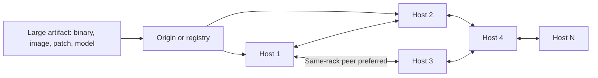

The common thread is a single large artifact wanted by many machines at nearly the same moment. That is exactly the flash-crowd shape where fixed central capacity struggles and swarm capacity shines. In a data center, the peers are trusted and well-connected, so incentive mechanisms matter less, but piece-level parallelism, early re-serving, and content verification still carry over directly.

## 10. Trade-offs and limitations

The transcript is explicit that the design has costs:

- **No privacy of membership.** To be found, a peer must announce itself. Anyone can join a swarm and record every IP address it sees. The openness that makes discovery work also exposes the participant list.
- **Throughput over latency.** Rarest-first is the opposite of sequential download. The piece a video viewer needs next is rarely the one the swarm most wants to replicate, so the protocol is poorly suited to streaming without modifications.
- **Availability follows demand.** Flash crowds are the best case. Once interest fades, availability depends entirely on whether anyone chooses to keep seeding. Unpopular content can disappear.
- **Sybil attacks on open membership.** The DHT accepts any node. An attacker can run many fake identities to skew lookups or poison records. The transcript calls Sybil attacks the most common attack on decentralized networks.
- **Incentives are approximate.** Tit-for-tat encourages uploading but does not guarantee fairness; modified clients can still extract more than they give in some conditions.
- **Operational complexity.** Compared with putting files behind a CDN, a peer-to-peer system is harder to observe, debug, and control, which is one reason internal deployments often add trusted coordination on top.

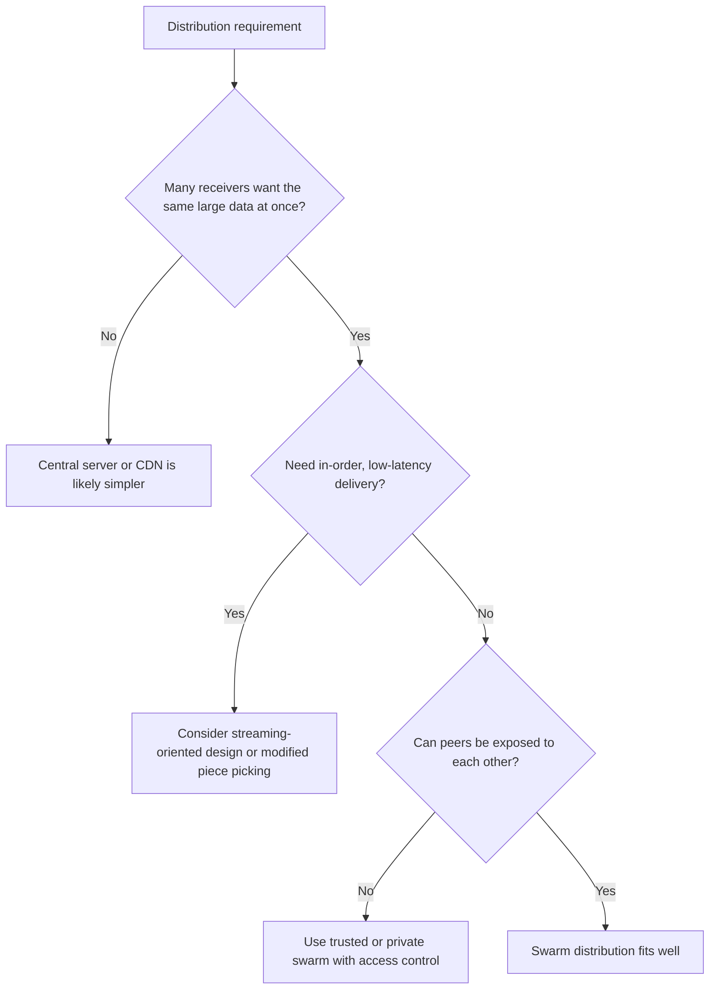

## 11. Putting the whole lifecycle together

A full download using modern features looks like this:

1. The user obtains a magnet link containing a 40-character info-hash.
2. The client queries the DHT for nodes closest to the info-hash and retrieves a list of peers.
3. It connects to peers and fetches the torrent metadata via metadata exchange, verifying it against the info-hash.
4. It picks a random first piece, verifies it, and immediately begins advertising it.
5. It switches to rarest-first selection, pipelining requests across many peers.
6. Every 10 seconds or so it re-ranks partners and unchokes the best reciprocators; every 30 seconds or so it optimistically unchokes a random peer.
7. Traffic runs over delay-sensitive transport where available, backing off when queueing delay grows.
8. Near completion, endgame mode requests the last blocks from multiple peers.
9. Having completed, the client may remain as a seeder, extending availability for others.

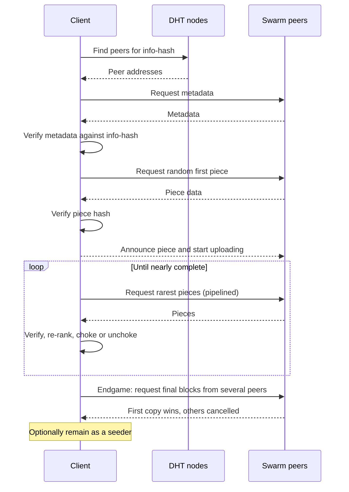

## Key takeaways

1. **Make demand create supply.** BitTorrent's defining property is that every downloader becomes a distributor within seconds of receiving its first verified piece. Capacity grows with load instead of being consumed by it.
2. **Incentives are part of the architecture.** With no central authority, cooperation has to be enforced by the protocol. Choking, tit-for-tat, and optimistic unchoking turn uploading into the way to get good download speed.
3. **Verify content, not the channel.** Per-piece hashes let a client accept data from any untrusted source. Once data verifies itself, mirrors, caches, and strangers become safe delivery paths.
4. **Optimize for the whole system, not a single node.** Rarest-first keeps pieces evenly replicated, and a healthy swarm is exactly what lets an individual download finish.
5. **Do not make every workload compete equally.** LEDBAT-style delay-based congestion control lets background transfers use spare capacity and step aside for interactive traffic.
6. **Name content, not locations.** Moving from tracker and `.torrent` file to DHT and magnet link removed every central component; a 40-character identifier is enough to locate, fetch, and verify data.
7. **Every openness choice has a cost.** Public membership, throughput-first scheduling, demand-dependent availability, and Sybil exposure are the price of a leaderless, permissionless design.

The broader lesson from the transcript is that when a system hits a scaling wall, a bigger server is not the only option. It is worth asking whether unused capacity is already hidden in the demand itself, and whether changing the protocol — the rules by which participants interact — could unlock it.
