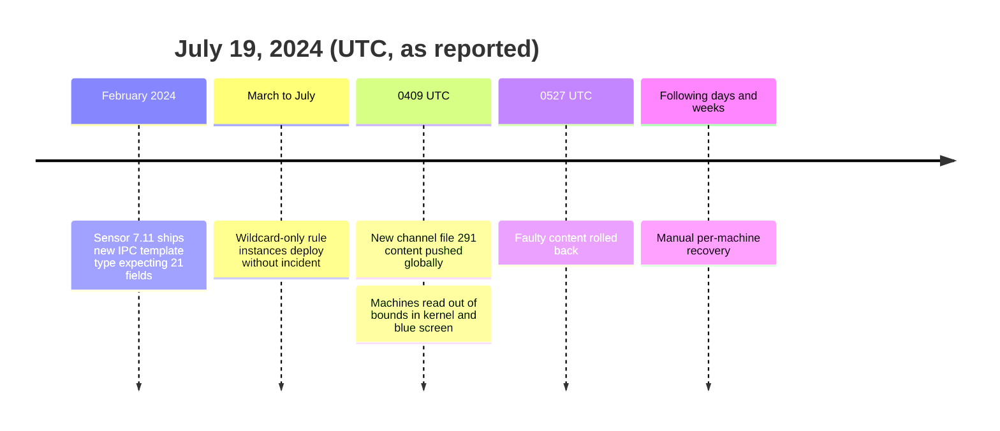
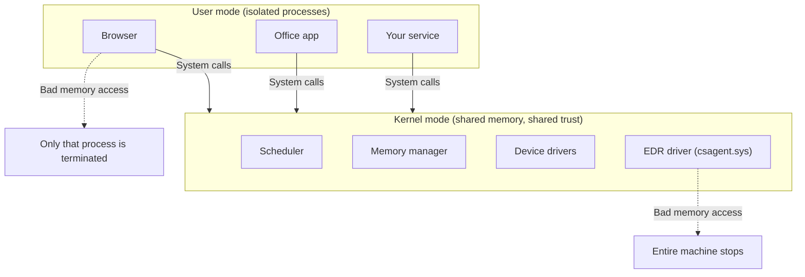
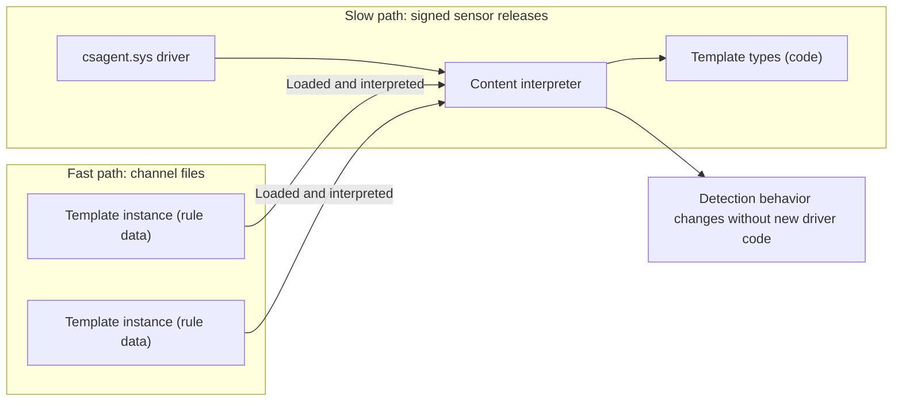
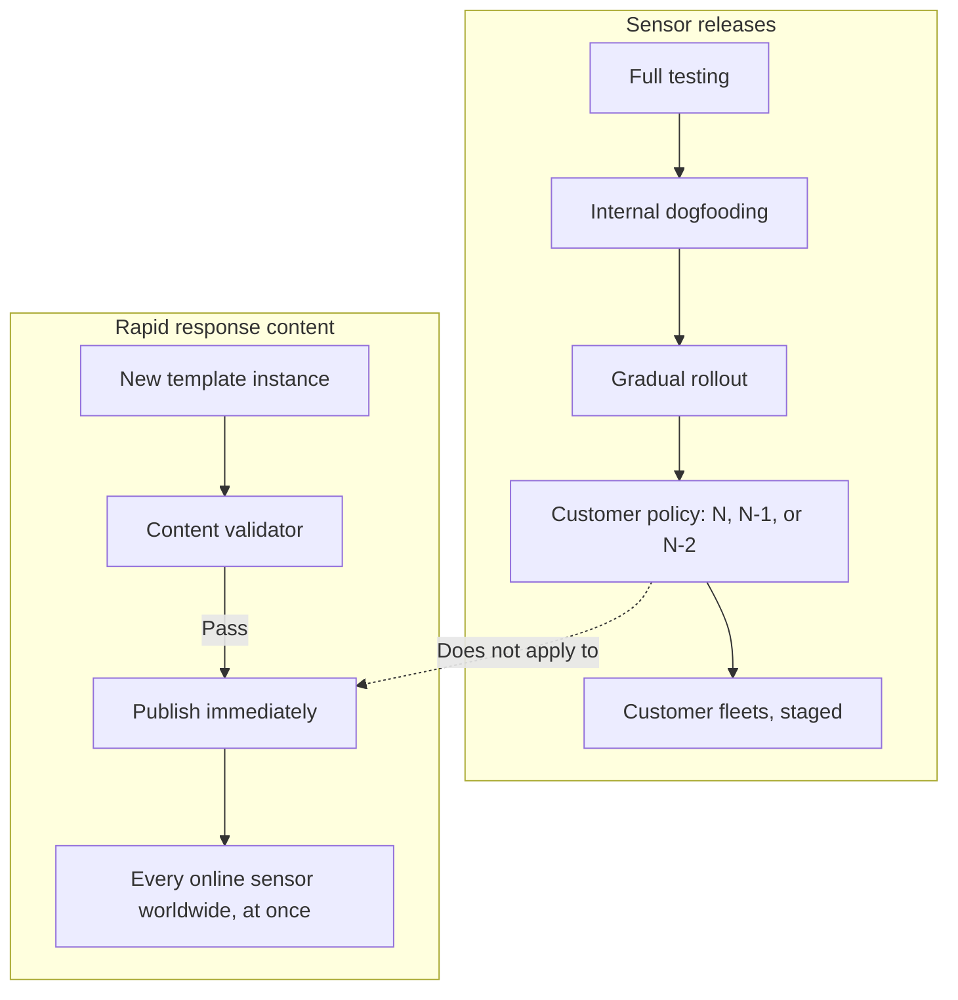
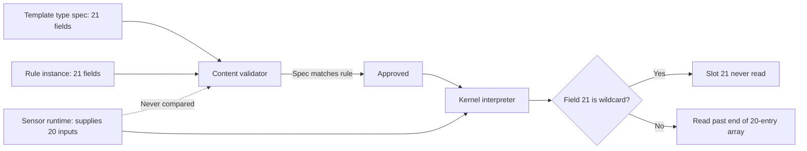
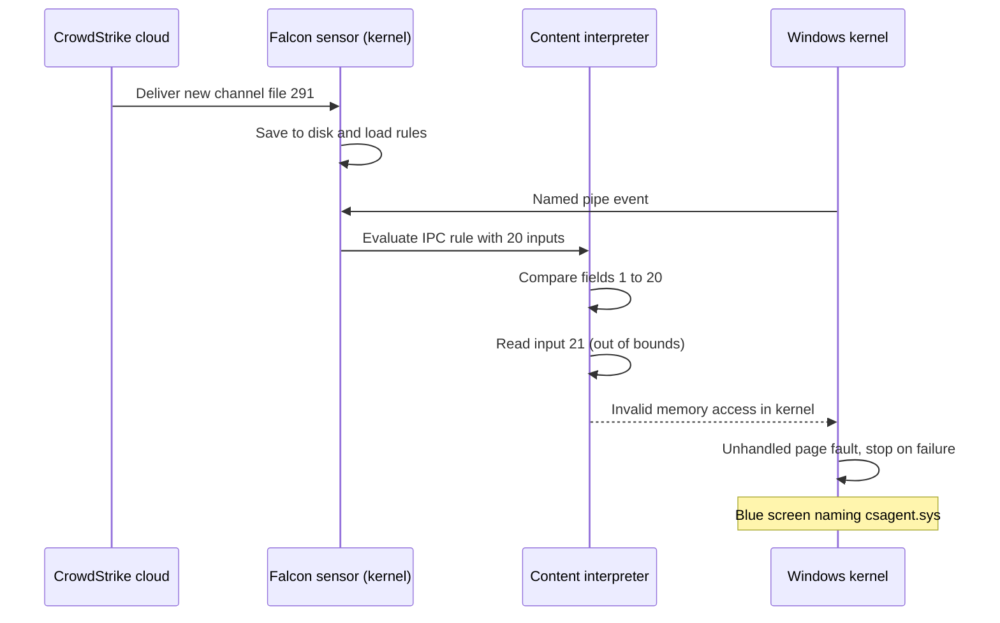
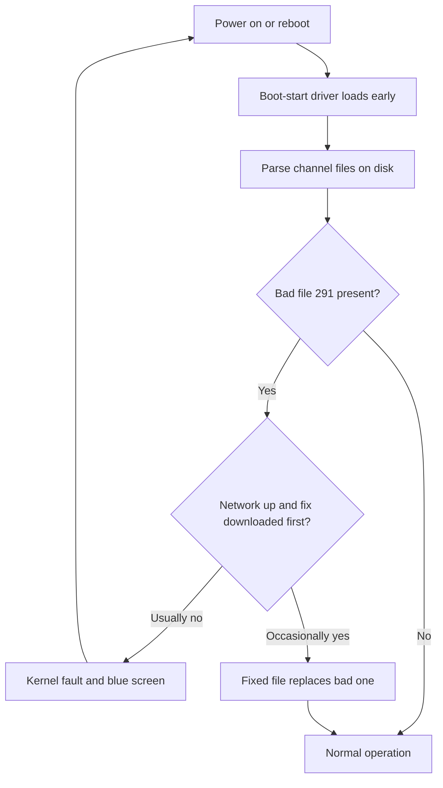
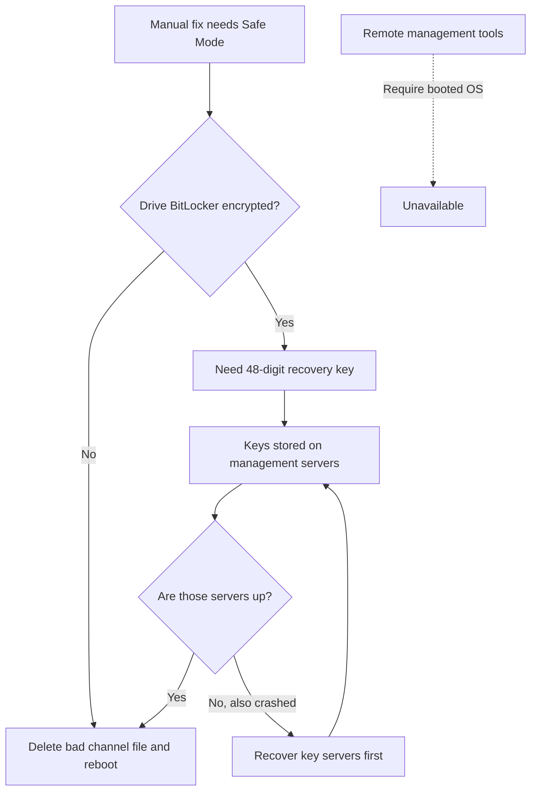
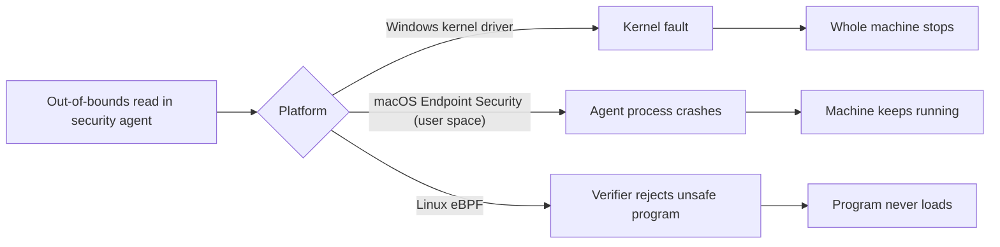
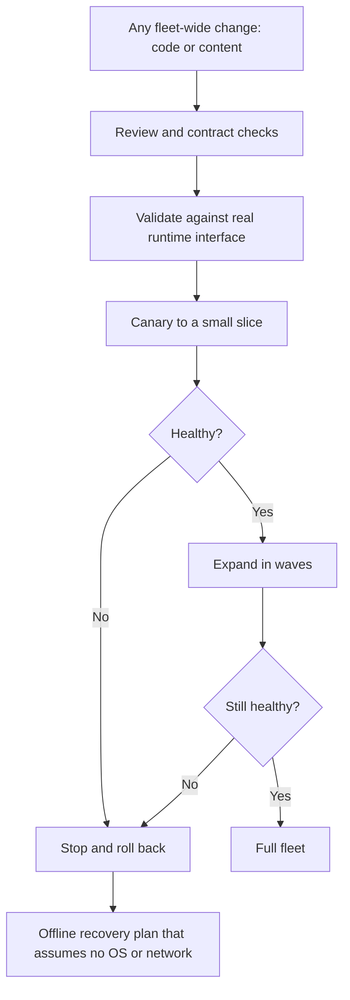

# CrowdStrike Outage: How a 40 KB Content Update Crashed 8.5 Million Windows Machines

## Scope and framing

This explainer follows the supplied transcript, which draws on CrowdStrike's root-cause report, Microsoft's technical write-ups, congressional testimony, and independent reverse engineering of the July 19, 2024 incident. Figures such as the number of affected machines, the 78-minute exposure window, the file size, the financial loss estimates, and the timeline are as reported in the transcript and have not been independently verified here. The diagrams are conceptual: they illustrate the mechanisms described in the transcript rather than CrowdStrike's or Microsoft's exact internal designs.

The incident is often summarized as "a bad update crashed Windows." The transcript's more precise account is that a **contract mismatch** between two components (a template definition expecting 21 input fields and sensor code supplying 20) lay dormant for months, was triggered by a routine content update delivered through a **global, near-instant channel**, executed inside the **Windows kernel** where any memory fault halts the machine, and then **blocked its own remote fix** because the crash happened at boot before networking came up.

This document covers:

- Why a small share of Windows machines had such a large real-world impact.
- What an endpoint detection and response (EDR) product does, and why it runs in the kernel.
- How CrowdStrike separated slow-changing kernel code from fast-changing detection content.
- The two update paths and why customer staging controls did not apply to content.
- The 21-versus-20 field bug, why tests passed for five months, and what triggered it.
- The boot loop, manual recovery, and the BitLocker complication.
- How macOS and Linux designs avoided the same failure mode.
- The fixes that followed and the general lessons for anyone who ships software to fleets.

## 1. The incident at a glance

According to the transcript:

- At **04:09 UTC on Friday, July 19, 2024**, CrowdStrike pushed a roughly **40 KB** configuration file (not a program, not a code update) to Windows machines running its Falcon sensor.
- It was rolled back **78 minutes** later, at **05:27 UTC**.
- In that window, about **8.5 million** Windows machines crashed to a blue screen, rebooted, and crashed again.
- Flights were cancelled, Delta Air Lines could not operate normally for five days, hospitals postponed scheduled surgeries, banks paused operations, 911 services were disrupted in several US states, and some airports issued handwritten boarding passes.
- Estimated losses for Fortune 500 companies alone were about **$5.4 billion**.
- It was **not a cyberattack**. The file came from the security vendor the machines relied on for protection.

Tracing it back through kernel, driver, and file, the transcript reduces the root cause to a single number: a rule expected **21** inputs while the code provided **20**, producing an out-of-bounds array read.

## 2. Why less than 1% of Windows machines paralyzed so much

Microsoft stated that 8.5 million machines was **less than 1%** of Windows computers worldwide. The impact was outsized because of **which** machines they were.

Falcon is an enterprise product. It is installed on machines that organizations consider high-value targets: airport systems, medical databases, bank workstations, trading floors. The transcript notes that roughly a quarter of Fortune 500 companies were directly hit. Many devices people don't think of as computers (check-in kiosks, departure boards, payment terminals, MRI display stations) run Windows with Falcon installed.

The transcript's summary: it wasn't most of the world's computers; it was the 1% that runs the world.

## 3. What an EDR agent does and why it lives in the kernel

Falcon is an **endpoint detection and response (EDR)** system. It goes beyond signature-based antivirus scanning. It monitors processes, file activity, network connections, and inter-process communication, and it can block a process in real time when it sees attack behavior.

That job has three requirements:

1. **See everything** that happens on the machine.
2. **Act before malware runs**, not after.
3. **Resist tampering**, because a common first step for sophisticated malware is to disable the security agent.

All three point toward running in the operating system **kernel**.

### User mode versus kernel mode

Windows, like other general-purpose operating systems, runs code in two privilege levels:

- **User mode:** applications such as browsers, office software, and most services. Each process has its own isolated memory. If a process touches memory it doesn't own, Windows terminates that process, and everything else keeps running.
- **Kernel mode:** the operating system core, including the scheduler, memory manager, and drivers. There are no walls between components; they share one address space and one trust domain.

### The blue screen is a deliberate safety stop

When kernel code touches memory it shouldn't, Windows intentionally halts. The transcript emphasizes that the blue screen is a **design decision** ("stop on failure"), not an accident. If kernel state may be corrupted, nothing can be trusted, and the next disk write might destroy data. The safest action is to stop the whole machine immediately.

The consequence: **any bug in any kernel driver from any vendor is fatal to the entire machine.** That is the bargain of running in the kernel.

### Kernel drivers are meant to change slowly

For this reason Microsoft gates kernel drivers through **WHQL**, its hardware quality certification program. Drivers are tested, certified, and cryptographically signed by Microsoft, a process the transcript describes as taking weeks. Kernel code is expected to be small, stable, and rarely changed.

## 4. The core tension: daily threats versus frozen kernel code

Attackers change tactics daily or even hourly. CrowdStrike's customers expect a new technique discovered in the morning to be detected the same day; that responsiveness **is** the product. Yet the detection must execute in a place where code is effectively frozen by certification.

### Separating the engine from the fuel

The solution, which the transcript notes is common across modern endpoint protection products, is to separate the **engine** from the **fuel**:

- The **driver** (`csagent.sys`) is the engine. It is certified and signed infrequently.
- Inside it, CrowdStrike built an **interpreter**, a content-processing engine.
- The actual detection logic is delivered separately **as data**, in what CrowdStrike calls **channel files**.
- The driver reads and interprets channel files, changing its behavior without changing a byte of signed code.

### Template types and template instances

The content system has two parts:

- **Template types (code):** live inside the sensor. Each monitors a category of behavior such as process creation, file writes, or network activity. They ship with sensor releases on the slow, certified path.
- **Template instances (data):** specific rules or match patterns within a category. They ship in channel files on the fast path and update constantly.

### Channel file 291

Channel files are numbered. The transcript focuses on **channel file 291**, which defines how the sensor evaluates **named pipes**, a Windows mechanism for inter-process communication. Attackers favor named pipes; frameworks such as Cobalt Strike use them to move laterally and communicate with command-and-control infrastructure. Because it tracks an actively abused technique, file 291 changes frequently.

## 5. Two update paths with very different blast radii

CrowdStrike distributed two kinds of updates on two very different paths.

### The slow path: sensor releases

- New sensor code is fully tested.
- CrowdStrike runs it internally first, then rolls out gradually.
- **Customers control versions.** Many enterprises deliberately pin their fleets to **N-1 or N-2**, staying one or two versions behind so others find bugs first.

### The fast path: rapid response content

- A new template instance is checked by a single automated gate, a cloud service the transcript calls the **content validator**.
- If it passes, it is sent **immediately to the entire fleet**: every customer, every machine.

### Why N-1 and N-2 didn't protect anyone

This is the part the transcript calls the most important in the whole story. Customer staging controls applied **only to the sensor**. Channel files bypassed them. An organization that believed it had a cautious, staged update policy still received new content at the same moment as everyone else.

In practice there were two update systems: one gradual and customer-controlled, one effectively global and instantaneous. Content was not first deployed to a few test machines or a small percentage of customers; it reached Falcon sensors worldwide at almost the same time.

## 6. The bug: 21 fields expected, 20 provided

### February: the dormant mismatch ships

In **February 2024**, CrowdStrike released **sensor version 7.11** with a new capability to detect suspicious named-pipe activity. It introduced a new **IPC template type**. The transcript describes a template type as a **contract**: it defines what inputs a rule of that type receives.

- The template type definition declared **21** input fields.
- The sensor code that gathered inputs at runtime supplied only **20**.

One component believed field 21 existed; the other never provided it. The mismatch sat on the interface between them and was rolled out worldwide with the sensor, remaining on nearly every Falcon machine for about **five months**.

### Why nothing went wrong for five months: wildcards

Every template instance of this type released between February and July used a **wildcard** in field 21, meaning "match anything." When the interpreter sees "match anything," it has nothing to compare, so it **never reads input 21**. The input array had only 20 slots, but no code path ever touched slot 21.

### Why the validator approved it

The content validator checked rules against the **specification**, not the actual sensor code:

- The specification said 21 fields.
- The rule had 21 fields.
- Validation passed.

It never observed that the sensor itself supplied only 20. Each side was internally consistent. The only broken piece was the **contract between them**, and nothing checked that contract: not the validator, not the compiler, not the test suite.

The transcript draws a parallel to the Datadog outage covered in an earlier video: there, systemd and Cilium each behaved correctly on their own but shared state neither fully controlled, and the latent problem went unnoticed for 27 months. Here, two correct-in-isolation components combined into a failure that stayed hidden for five.

## 7. "Where were the tests?"

The transcript's answer: the tests existed, and they all passed.

- The new IPC template type was load tested in February using wildcard instances in field 21.
- The first real instances, also wildcards, shipped in March; the validator approved them and production was fine.
- More wildcard instances followed in spring, with no problems.

Every test exercised paths that existed. The fatal path **did not exist yet**, because triggering it required no code change, only **data nobody had written yet**. The code had been fully deployed and fully broken for five months.

A test suite is a selective sample of reality. It cannot check a configuration file that someone will write in July. In the Datadog case, the missing scenario was a condition absent from test environments; here, it was input that had not been created. In both, tests could only verify **the world that already existed**.

## 8. July 19: the trigger and the crash

CrowdStrike's threat intelligence team observed a new attack technique using named pipes for command and control. The team prepared **two new IPC template instances** for the fast path. One of them, for the first time in the template type's life, contained a **real value in field 21** rather than a wildcard.

The validator checked it: 21 fields, matches the definition, valid. At **04:09 UTC**, the new version of channel file 291 went out, and every online Falcon machine began downloading it. As the transcript puts it, the gun was loaded in February and the trigger pulled in July.

### What happened on each machine

1. The file was written to disk, and the sensor loaded it.
2. A named-pipe event occurred, which on Windows happens constantly.
3. The interpreter evaluated the new rule, comparing fields 1, 2, 3, and so on.
4. At field 21, it tried to fetch input 21 from a 20-entry array, reading past the end into unrelated memory and accessing an invalid address.
5. In user mode this would be an access violation that kills one process. In kernel mode, it was a page fault the kernel couldn't handle.
6. Windows halted with the stop code "PAGE_FAULT_IN_NONPAGED_AREA," attributing it to `csagent.sys`.

The transcript's framing: the computer didn't malfunction; it performed its last safety duty exactly as designed. And because the file reached everywhere at once, it happened everywhere at once. At 04:09 UTC it was midday in Sydney, so Australia watched it happen live, Europe woke up to broken machines, and the Americas were still asleep.

## 9. Why the rollback didn't fix the machines

At **05:27 UTC**, 78 minutes later, CrowdStrike identified the cause and replaced the file. The fixed channel file was on its servers. Reboot, download the fix, done? No.

### The boot loop

The Falcon sensor is a **boot-start driver**. It loads early, before the system is fully up, because a security agent that loads late gives malware a head start. That's a deliberate feature.

Early in boot, the driver does what it always does: it parses the channel files on disk, including the bad file 291, and crashes the system **before networking starts**. So:

reboot → driver starts → parses file → crash → reboot → driver starts → parses file → crash.

The fix was, in the transcript's words, milliseconds away on CrowdStrike's servers, but the machine couldn't stay up long enough to fetch it. The same channel that delivered the fault could not deliver the cure. The failure **blocked its own recovery**.

### "Reboot up to 15 times"

Boot timing isn't perfectly deterministic. Sometimes the network came up fast enough for the sensor's updater to grab the fixed file a few seconds before the crash. The odds were slim but nonzero, which is why Microsoft's guidance included advice that sounded almost absurd: reboot, and if that fails, repeat **up to 15 times**. Each reboot was another chance to win the race.

### Manual remediation

For many machines, repeated reboots didn't work. The fix was to:

1. Boot into Safe Mode or the Windows Recovery Environment.
2. Navigate to the CrowdStrike folder under `System32\drivers`.
3. Delete the problematic channel file 291 content.
4. Reboot.

The transcript estimates about **30 seconds per machine**, multiplied across 8.5 million machines. And the usual remote management tools all require a booted operating system, precisely what these machines lacked. People had to physically sit at each keyboard.

### BitLocker: the key locked inside the failure

Corporate drives are typically encrypted with BitLocker, as they should be. Entering Safe Mode on an encrypted drive required a **48-digit BitLocker recovery key**. Many organizations stored those keys on management servers in Active Directory, and in many companies those servers were **also** showing blue screens. The key needed to unlock the fix was locked inside the systems that needed fixing.

The transcript connects this to the Datadog incident, where engineers worked blind because their monitoring was part of the failure. Here the same principle played out at civilizational scale: the recovery path depended on the thing that had failed.

### What recovery actually looked like

According to the transcript:

- IT staff moved desk to desk with USB drives.
- Technicians on ladders worked through data center racks.
- Companies printed recovery keys from whichever domain controllers still responded.
- Microsoft and CrowdStrike distributed bootable USB tools for large fleets, a process that took weeks.

One ironic detail: machines that were **powered off or asleep** during the 78-minute window never downloaded the bad file. A laptop left closed on Thursday night was fine on Friday morning.

## 10. The aftermath

As reported in the transcript:

- **8.5 million machines** affected, based on Microsoft crash telemetry and therefore likely an undercount.
- About **$5.4 billion** in direct losses for Fortune 500 companies, only a small fraction insured.
- **Delta Air Lines** hit hardest: thousands of cancelled flights over five days, about half a billion dollars in claimed damages, and litigation with CrowdStrike that escalated into counterclaims.
- CrowdStrike's share price fell by about a third in the following weeks.
- Yet **most customers stayed**. Removing an EDR system from, say, 100,000 endpoints is itself a risky, multi-month project. The same fleet-wide reach that made the product successful made it hard to leave.

## 11. Why Macs and Linux machines didn't crash

Falcon also runs on macOS and Linux, but the transcript notes that no Mac failed. The difference lies in where each platform allows security software to run.

### macOS: security agents moved out of the kernel

In 2019, Apple deprecated kernel extensions and pushed security vendors to a user-space API, the **Endpoint Security framework**. The kernel streams events to the security agent, which runs as an ordinary process. If Falcon hits a fatal error on a Mac, **only Falcon crashes**; the machine keeps running. Apple removed the vendor's ability to set a machine-wide blast radius.

### Linux: eBPF with a verifier

Linux offers **eBPF**: small programs loaded into a sandboxed virtual machine inside the kernel. Before a program can load, a **verifier** checks it for safety, proving it won't read out of bounds, loop forever, or touch memory it doesn't own. The transcript likens this to AWS's Zelkova, which reasons over every possible request against an S3 bucket policy: not testing examples, but proving properties across all execution paths. The class of bug that crashed Windows machines is rejected by the eBPF verifier before it ever runs.

### Why Windows was different

The transcript attributes this partly to decades of building security products as kernel drivers, and partly to regulation: in 2009, Microsoft committed to European regulators that third-party security vendors would have the same kernel access as Microsoft's own Defender. Removing vendors from the kernel unilaterally risked reopening antitrust issues.

## 12. What was fixed

According to the transcript, CrowdStrike addressed the immediate technical faults:

- The **interpreter** now checks bounds before reading input fields.
- The **validator** checks field counts more carefully.
- **Tests** now cover real values, not only wildcards.

The content update pipeline gained capabilities it lacked:

- **Staged deployment** of content rather than instant global release.
- **Rollback** capability.
- **Customer control** over content rollout.
- Additional **fast checks** before release.

Microsoft launched the **Windows Resiliency Initiative**, working with security vendors toward a supported way to protect endpoints from outside the kernel, so an agent failure terminates a process instead of the machine. The transcript frames this as the Apple and eBPF lesson finally reaching Windows: the blast radius of a security-software failure should be smaller than the machine.

The deepest fix, in the transcript's view, is to **prove rather than test** where failure is unacceptable: validate content before the interpreter runs so a poisoned rule cannot even load, rather than hoping it fails gracefully.

## 13. Trade-offs in the design

None of the design choices here were unreasonable in isolation, which is what makes the incident instructive. Each bought something real, and each contributed to the failure. In particular, separating engine from fuel moved risk into data that runs through kernel code paths, so content became as dangerous as code.

| Choice | Benefit | Risk exposed on July 19 |
|---|---|---|
| Kernel-mode agent | Full visibility, tamper resistance | Any fault halts the machine |
| Boot-start driver | No head start for malware | Crash before network, no remote fix |
| Content as data | Daily detection updates | Data can trigger latent code bugs |
| Global instant push | Fast protection | 100% of fleet within minutes |
| Spec-only validation | Simple automated gate | Spec and runtime contract never compared |
| Central BitLocker keys | Managed encryption | Keys unavailable when servers crash |

## 14. Lessons for anyone who ships to a fleet

The transcript offers five lessons that apply well beyond security software:

1. **Configuration is code.** If a file can change the behavior of your whole system, it deserves what code gets: review, tests, canary deployment, and rollback.
2. **Your real blast radius is your deployment radius.** Anything that can reach 100% of your fleet in under an hour is your biggest single point of failure.
3. **Check contracts, not just artifacts.** The rule instances were valid and the sensor code was consistent, but nobody checked the boundary between them. Validate interfaces at build time, load time, and runtime.
4. **A passing test only covers inputs that already exist.** The fatal input hadn't been written yet, so five months of green tests proved little. Stage content pipelines and test schema boundary values, not only today's data.
5. **Plan for recovery when your machines can't help you.** Walk your runbook line by line: which steps assume the OS boots, the network is up, agents are running, and remote access works? Where are your BitLocker keys, and what must be running to read them?

### The closing thought

Most fleets already have many fast channels into every machine: EDR agents, observability agents, mobile device management, container runtimes, and other auto-updating components. Each is effectively a pipeline from a vendor's CI system directly to your machines, **bypassing your change management**. Understanding which channels exist, how fast they move, and how far they reach is how you find the next global failure before it finds you.

## Key takeaways

1. **The trigger was data, the bug was code, and the failure was the contract.** A template expected 21 fields; the sensor provided 20. Each side was internally consistent; nothing checked the interface between them.
2. **Latent bugs can wait for the right input.** Wildcards meant field 21 was never read for five months, so every test and every deployment passed until the first real value arrived.
3. **Kernel mode turns any fault into a machine-wide stop.** The blue screen was Windows doing exactly what it was designed to do when kernel memory safety is violated.
4. **Deployment radius equals blast radius.** Customer N-1/N-2 policies governed sensor code but not content, so a single content push reached the global fleet in minutes.
5. **Failures can block their own recovery.** A boot-start driver crashing before networking, remote tools that need a booted OS, and BitLocker keys stored on crashed servers all turned a 78-minute exposure into weeks of manual work.
6. **Architecture can shrink blast radius.** macOS's user-space Endpoint Security framework and Linux's verified eBPF programs meant the same class of bug could not take down those machines.
7. **Where failure is unacceptable, prove rather than test.** Bounds checks, contract validation, and load-time verification stop a poisoned input from executing at all.
8. **Treat every auto-updating agent as part of your change management.** Configuration is code, and any channel that can reach your whole fleet quickly deserves staged rollout, rollback, and an offline recovery plan.
