# Amazon Prime Video Microservices: Why a Monitoring Pipeline Moved Back to a Monolith

## Scope and framing

This explainer follows the supplied transcript, which discusses a March 2023 Prime Video engineering post describing how a video-quality monitoring pipeline was rebuilt from a serverless, distributed design into a single-process service. Figures such as the "more than 90%" cost reduction, the Step Functions price per state transition, the approximate number of transitions per second of video, and the point at which account limits were reached are as reported in the transcript and have not been independently verified. Service names, pricing, and quotas can change over time. The diagrams are conceptual illustrations of the ideas, not reproductions of Amazon's internal architecture.

The story is often summarized as "Amazon abandoned microservices for a monolith." The transcript argues that this framing misses the point. The more useful lesson is about **service boundaries**: every boundary has a cost, and that cost depends on how much data crosses it and how often. Prime Video had placed boundaries directly on the hottest data path in the system, where each crossing was expensive and the boundaries delivered little benefit in return.

The explainer covers:

- The problem the pipeline was built to solve.
- Why the original serverless design was a reasonable starting point.
- The two design decisions that made it expensive and unable to scale.
- The "microservice tax" of moving data across service boundaries.
- How the consolidated service was structured and scaled.
- The public debate that followed, and the trade-offs of the new design.
- A practical rule for evaluating boundaries in system design reviews.

## 1. The problem: detecting quality defects customers never report

Prime Video streams to a very large audience, including live events such as Thursday Night Football, where a huge number of viewers arrive within the same minute. At this scale, playback defects are inevitable. The transcript lists several typical ones:

- **Block corruption:** an encoder fault causes part of the image to break into blocky artifacts.
- **Video freeze:** the picture stops while the audio continues.
- **Audio/video desynchronization:** audio gradually drifts out of sync with lip movement.

The difficulty is that viewers rarely file bug reports for these problems. They simply stop watching and may move to another service. A quality problem that is never reported cannot be fixed, so the video-quality analysis team wanted a tool that "watches" streams the way a customer would and flags defects automatically.

### The three components

The monitoring service had three logical parts:

1. **Media converter:** receives an incoming stream and decodes it, splitting video into individual frames and audio into decoded buffers.
2. **Defect detectors:** a set of specialized analyzers, many based on machine-learning models. One looks for block corruption, another for freezes, another for audio/video sync, and so on.
3. **Orchestration:** a controller that decides what runs next. In the original design, this was AWS Step Functions, a managed state-machine service.

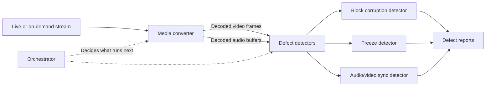

## 2. The original serverless design

### Following one second of video

The transcript traces a single second of video through the original pipeline:

1. The media converter decodes the second of video into frames and writes those frames to an **Amazon S3** bucket.
2. The Step Functions state machine transitions to the next step and triggers the detectors.
3. Each detector downloads the frames it needs from S3, runs its analysis, and reports a result.
4. The state machine transitions again, and the pipeline moves on to the next second of video.
5. The process repeats for every second of every monitored stream.

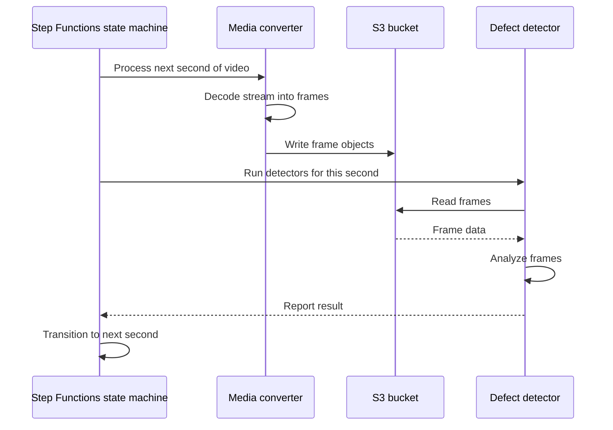

In short: serverless components, connected by Step Functions, with S3 as the hand-off point in the middle.

### Why this was a sensible first design

The transcript stresses that many teams starting from scratch would have built the same thing. The design had real advantages:

- **Independent scaling:** each component could scale on its own.
- **No servers to manage:** every piece was a managed AWS service with someone else on call for the underlying infrastructure.
- **Rented distributed-systems machinery:** queues, retries, and workflow state were provided by the platform rather than built by the team.
- **Speed of delivery:** a small team could ship a working product in weeks.

And it did work. The team launched a real product quickly. The problems appeared only once the system ran at production scale.

## 3. What broke: two decisions that became the dominant costs

The transcript identifies two seemingly minor architectural decisions that came to dominate the system's cost and, more importantly, its ability to scale.

### 3.1 Orchestration billed per state transition

Step Functions charges per state transition. The transcript cites roughly **$25 per million state transitions**, which sounds inexpensive. The problem was the number of transitions this workload generated: roughly **four transitions for every second of every stream**.

For a one-hour stream:

$$
3600 \text{ seconds} \times 4 \text{ transitions per second} = 14{,}400 \text{ transitions}
$$

That is for a single stream-hour. Multiply by many concurrent streams, continuously, and the orchestrator was being asked to perform an enormous number of transitions. The team had intended to rent an orchestrator so they would not have to build one. In practice, they were paying the orchestrator to move frames through the pipeline, not to do useful analysis.

### The limit that mattered more than the bill

The cost was expected to be high. What the transcript highlights as more striking is that the design hit **account-level limits on state transitions at only about 5% of the expected load**. The architecture did not merely become expensive as it grew; it could not reach the required scale at all.

The transcript's explanation is a workload-fit mismatch. Step Functions is well suited to **business workflows** such as placing an order in an e-commerce system, which might involve a small number of steps per order. A per-second media pipeline generating millions of transitions per hour is a very different shape of workload.

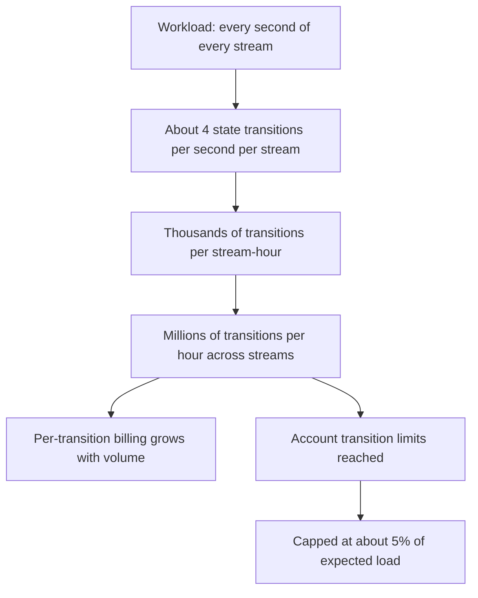

### 3.2 Decoding once and sharing frames through S3

Decoding video into frames is computationally expensive. A naive design would have each detector decode the same stream independently, repeating that work many times. To save compute, the original system **decoded once**: the converter wrote extracted frames to S3, and each detector read the frames it needed.

This did reduce compute cost. But it shifted cost elsewhere:

- Every second of video became **dozens of frame objects** written to S3.
- Every detector added **another round of reads** of those objects.
- Individually each operation was tiny; at Prime Video scale, S3 requests and storage became one of the largest costs in the pipeline.

The transcript summarizes this with a general principle: in distributed systems, **costs don't disappear, they move**. Centralizing decoding moved cost from CPU to network and storage.

### Paying for durability nobody needed

S3 is designed for extremely high durability (the transcript cites "11 nines") so that data survives for a very long time. That property is valuable for records such as financial data or invoices. Here it was being applied to video frames with a useful life of roughly one second. The transcript's analogy: renting a bank vault to pass a note across a table.

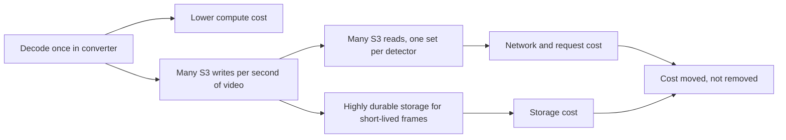

## 4. The microservice tax

The transcript describes this as the most important idea in the story.

Inside a single process, handing a frame from one component to another is a **pointer or reference**. It takes nanoseconds and costs essentially nothing. In the original design, the frame instead crossed a **service boundary**. To get from the converter to a detector, the same frame had to be:

1. Serialized.
2. Sent over the network.
3. Stored durably (and, by extension, replicated by the storage service).
4. Read back over the network.
5. Deserialized by the receiving component.

A memory access turned into a distributed-systems operation. The transcript calls this overhead the **microservice tax**: the cost paid every time data crosses a boundary between services.

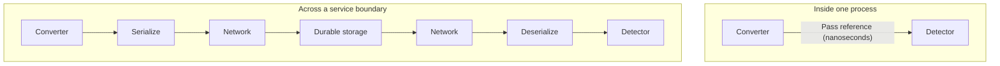

### Two variables decide whether the tax matters

Whether the tax is a rounding error or a disaster comes down to two variables:

- **Payload size:** how much data crosses the boundary per call.
- **Crossing frequency:** how many times per second it crosses.

A simple way to think about it:

$$
\text{boundary cost} \propto \text{payload size} \times \text{crossing frequency}
$$

For a small payload crossing infrequently, such as an order ID passed from checkout to a delivery service, the tax is negligible. For large payloads crossing continuously, such as video frames for every stream and every detector, it dominates. Prime Video's mistake, in the transcript's words, was placing a service boundary on the **busiest path in the entire pipeline**.

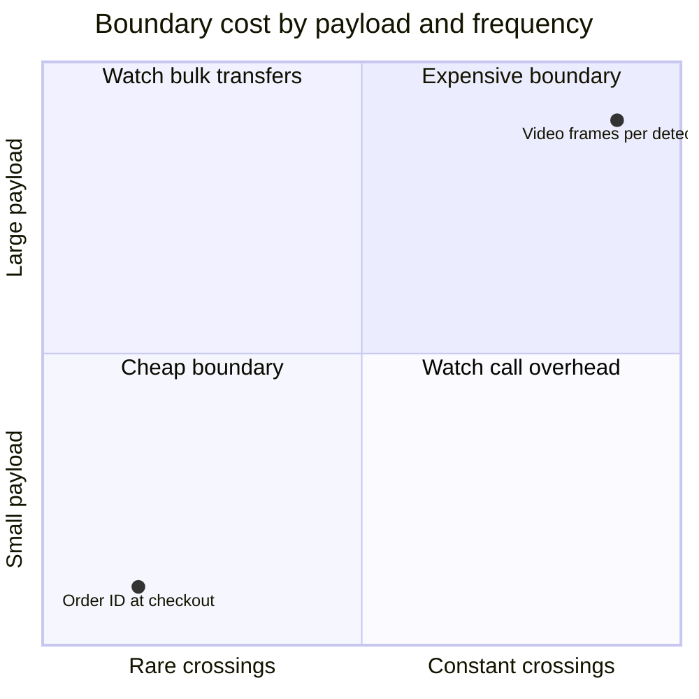

## 5. The redesign: one process, frames in memory

Once the team saw where the cost came from, the fix was conceptually simple: remove the distance between components.

### Merging converter and detectors

The media converter and all detectors were combined into **a single service running on Amazon ECS**. In the new design:

- The converter produces a frame, and the detector reads it **directly from memory**.
- Pixels never leave the machine.
- Nothing is serialized, nothing crosses the network, and nothing is written to durable object storage just to hand it to the next component.

Data transfer between components went from moving megabytes through a distributed system to passing a memory reference within a process.

### Orchestration became ordinary control flow

The orchestration layer collapsed in the same way. What had been a workflow step in a managed state machine became ordinary program control flow. Instead of asking another system what should happen next, the program simply executes the next line of code. There are no per-transition charges and no account-level transition limits for function calls inside a process.

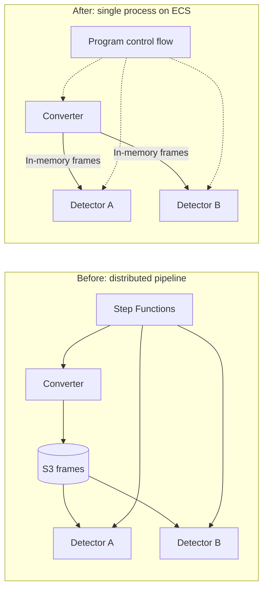

## 6. How the monolith scales

A common objection is that monoliths do not scale. The transcript's answer is that some do and some don't, and the deciding factor here is the **workload**, not the architectural label.

### Independent units of work

Each video stream is independent. Detecting a defect in one stream requires no information from any other stream. There is no shared state and no coordination between streams. That changes the scaling problem entirely.

Instead of splitting the system into smaller services, Prime Video **runs more copies of the whole pipeline**:

- A thin routing layer assigns streams to instances: stream A goes to one copy, stream B to another.
- Each copy contains the entire workflow: decoding, analysis, and detection.
- Copies do not need to communicate with one another.

The transcript's key line: people often assume scalability requires **decomposition**, but it actually requires **independence**. When units of work do not interact, the entire pipeline can be scaled as a single unit by replication.

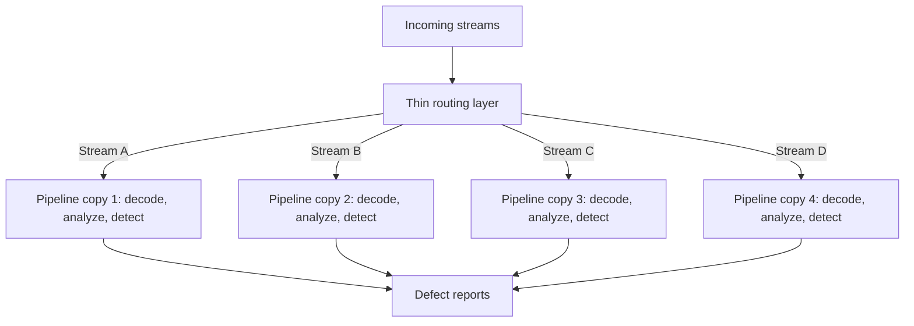

### When one instance can't hold every model

There was a catch. The detector library kept growing, and many detectors are machine-learning models whose weights must be loaded into memory before they run. Eventually a single instance could not fit all the models in RAM at once.

Rather than splitting the service back into separate microservices, the team ran **differently configured copies of the same application**:

- Every copy runs the **same code**.
- Each copy **loads a different subset of detectors** through configuration.
- For example, one group of instances might handle audio models, another video models, and a third a specialized set of quality checks.

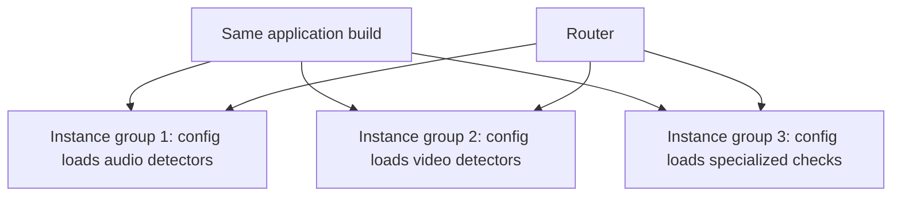

### A gray area in terminology

The result is neither a classic monolith nor a fleet of independently deployed microservices. The transcript's distinction is that microservices typically run **different code and business logic** in each service, whereas here the code and logic are identical. The team ended up with a single system that **scales through replication and specializes through configuration**. The transcript suggests this middle ground is where much practical architecture actually lives.

## 7. Results

According to the transcript:

- Infrastructure costs for this pipeline fell by **more than 90%**.
- The larger win was capability, not just savings. At the old cost, Prime Video could afford to monitor only a **subset** of its streams. At the new cost, it could monitor **all** of them.

The consolidation therefore did more than make the system cheaper; it made the original goal of the project economically feasible.

## 8. The public debate

The team published its write-up in March 2023. For roughly six weeks few people noticed; then it spread widely and turned into a monolith-versus-microservices argument.

Two broad camps emerged:

- **"Monoliths win":** Amazon, a major advocate of serverless and microservices, replaced microservices with a monolith and cut costs by 90%.
- **"The process worked":** the original architecture let the team move quickly, learn the workload, and ship. Once they understood where cost came from, they optimized the expensive part.

Amazon's CTO weighed in publicly. As the transcript summarizes his position, the goal was never to build a monolith or to build microservices; the goal was an architecture that **fits the workload**. Prime Video did not prove that monoliths are better. It showed that architecture is a moving target that should evolve as the workload changes.

## 9. The lesson most people missed: boundaries and ownership

### Microservices are primarily about ownership

The transcript argues that microservices are not first about performance. They are largely about **ownership**, which is as much a human problem as a technical one. A service boundary lets one team build, deploy, and operate its part of the system without coordinating every change with everyone else. That buys:

- Independent deployments and releases.
- Smaller blast radius for a bad change.
- Independent scaling of parts with genuinely different load profiles.

### What the boundaries bought Prime Video

In this pipeline:

- **One team** owned all of it.
- All components processed the **same streams**.
- As traffic increased, the **whole pipeline scaled together**.

There was no separate team to decouple from and no independent scaling problem to solve. The boundaries provided very little benefit while still carrying the usual costs: network hops, serialization, orchestration, storage, and operational complexity. The migration, in the transcript's framing, was not "removing microservices"; it was **removing boundaries that were not paying for themselves**.

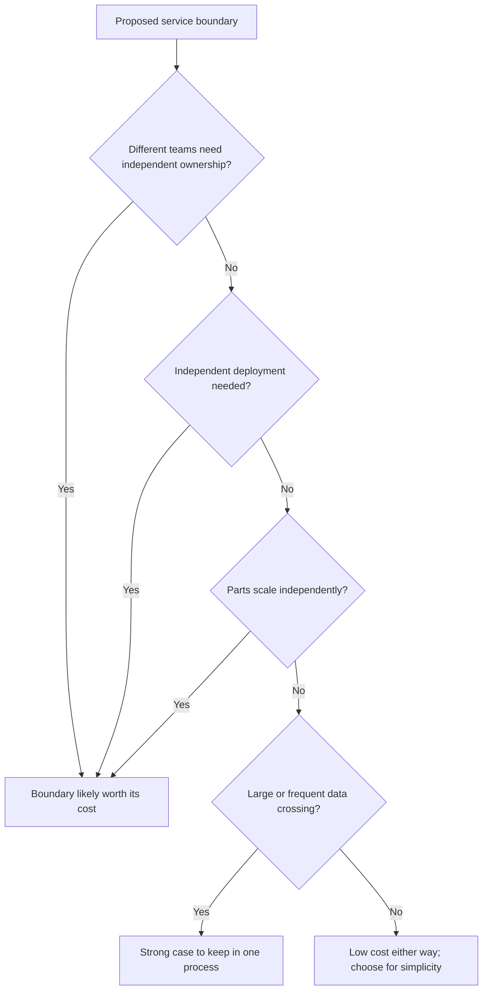

## 10. Trade-offs of the consolidated design

The cloud bill went down, but the trade-offs did not disappear. The transcript lists four:

- **Coupled deployments:** changing a single detector means redeploying the whole service, and the blast radius of a bad deployment is larger.
- **Capacity planning returns:** the serverless version scaled automatically. The new version runs on provisioned compute (the transcript mentions ECS and EC2), so the team must ensure enough capacity is available ahead of demand.
- **Weaker isolation:** previously components ran separately; now they share CPU and memory. A resource-hungry detector can affect everything else in the same process.
- **Configuration matters more:** since different copies load different detector sets, misconfiguration becomes a new class of operational error.

It is also important to note what the story does **not** show. It does not prove the serverless version was wrong. The consolidation works because of this workload's shape: continuous, high-volume video processing where keeping data in one process is a large advantage. A workload with small payloads, infrequent calls, multiple owning teams, or components with very different scaling needs could reasonably lead to the opposite design.

| Dimension | Serverless pipeline | Consolidated service |
|---|---|---|
| Data hand-off | Serialize, S3 write, S3 read | In-memory reference |
| Orchestration | Managed state machine, per-transition billing | Ordinary control flow |
| Scaling | Automatic, per component | Replicate whole pipeline per stream |
| Capacity planning | Mostly handled by platform | Team-managed |
| Isolation | Separate components | Shared CPU and memory |
| Deployment | Per component | Whole service redeployed |
| Fit for this workload | Hit limits at about 5% of expected load | Allowed monitoring of all streams |

## 11. A rule for design reviews

The transcript offers a simple framework to apply before writing code. For **every boundary** in a design, ask:

1. **How much data crosses it?**
2. **How often does it cross?**
3. **What does this boundary buy us?** Independent ownership, independent deployment, or independent scaling?

If the data is large and frequent, and the boundary does not provide ownership, deployment, or scaling independence, it is likely adding more cost than value.

Compare the two cases from the transcript:

- **E-commerce order to delivery service:** tiny payloads, infrequent messages, often separate teams. Boundary cost is negligible and the ownership benefit is real. Splitting makes sense.
- **Video frames to defect detectors:** large payloads, continuous flow, thousands of streams, one team. Boundary cost dominates and the benefit is minimal. Keeping it in one process makes sense.

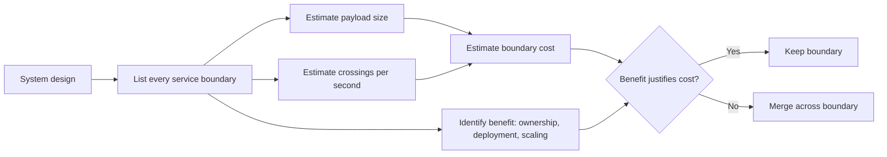

## Key takeaways

1. **Every boundary has a cost.** Before splitting a system, ask how much data crosses the boundary and how often. Those two numbers usually tell you whether the split is cheap or expensive.
2. **Costs move rather than disappear.** Decoding once saved compute but multiplied storage and network operations. Always ask where a saving is being paid for.
3. **Match managed services to workload shape.** A per-transition orchestrator suited to low-step business workflows can become both expensive and quota-limited when driven by a per-second media pipeline.
4. **Put the cloud bill on the architecture diagram.** The largest line items tend to reveal the most important data flows in the system.
5. **Serverless is a good way to learn a workload.** Moving to dedicated infrastructure can make sense once the workload is understood and predictable.
6. **Split where teams need independence.** Microservices primarily buy ownership, independent deployment, and independent scaling. If a boundary buys none of these, think carefully before paying for it.
7. **Scalability comes from independence, not decomposition.** Because streams were independent, the whole pipeline could be scaled by replication, with configuration used to specialize copies when memory limits required it.
8. **Architecture is a moving target.** Prime Video did not prove monoliths are better; it showed that the right architecture depends on the workload and should evolve as the workload becomes clearer.
