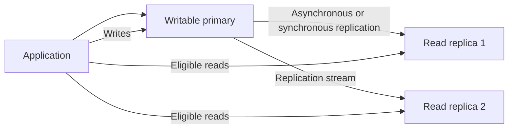
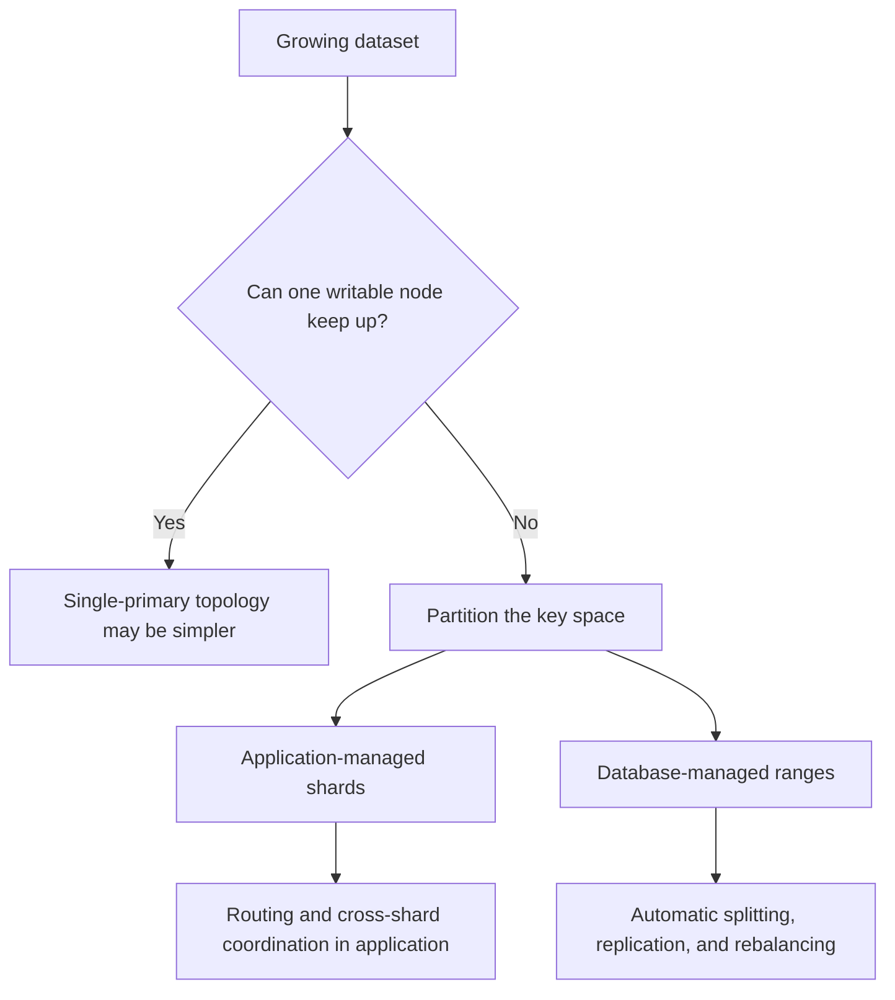
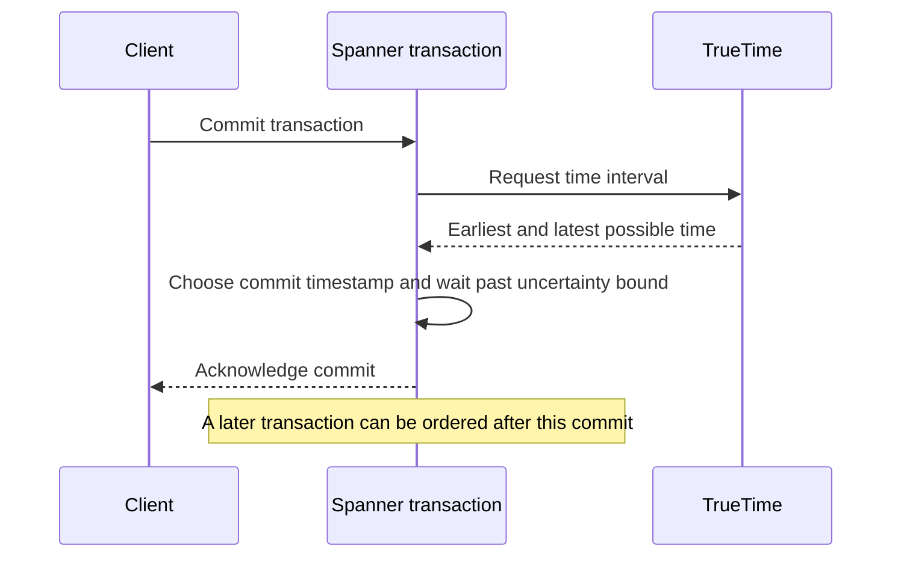
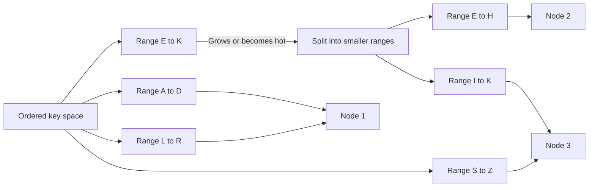
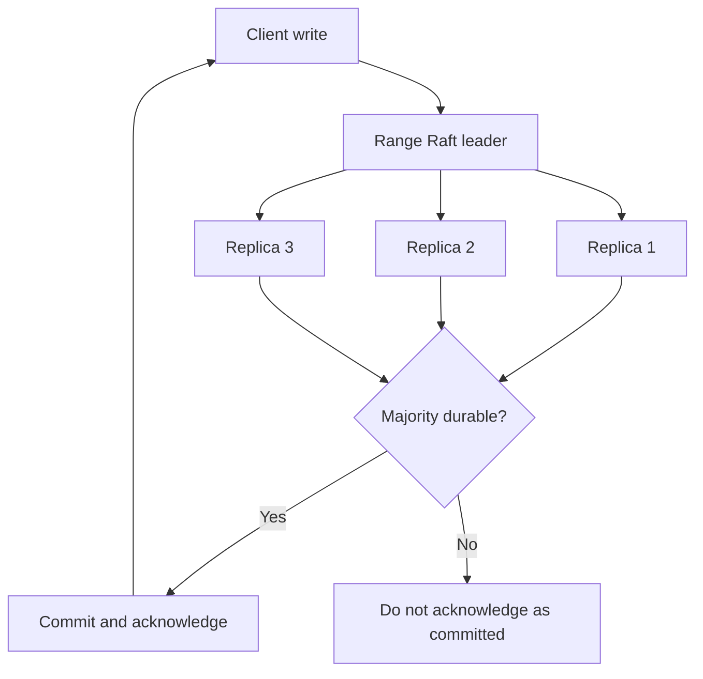
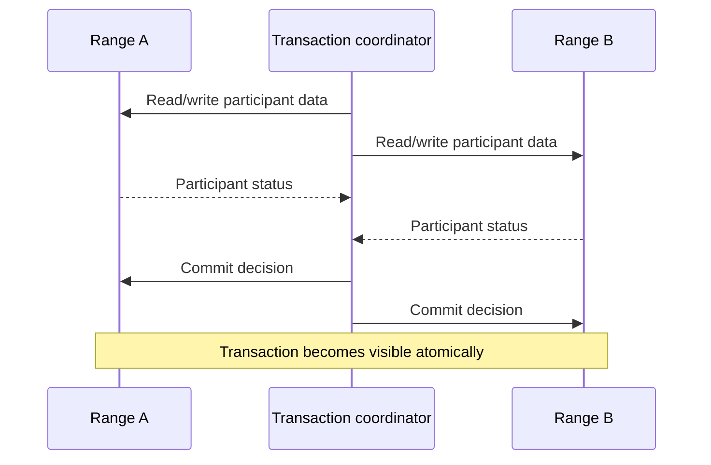
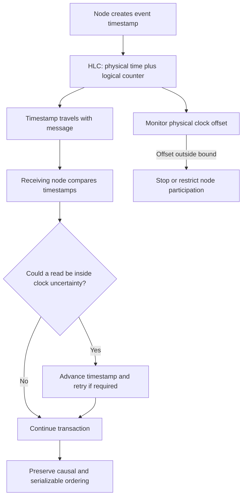
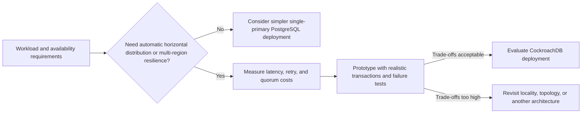
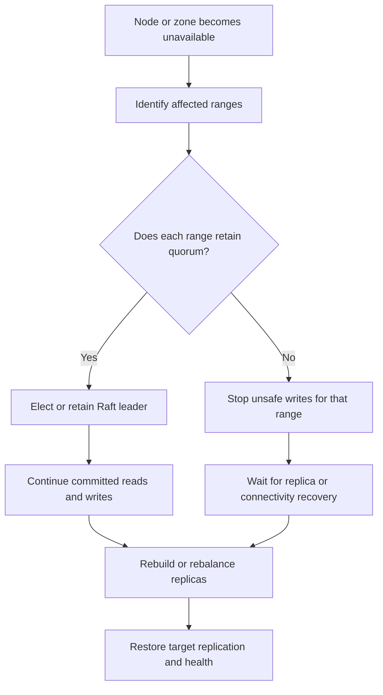
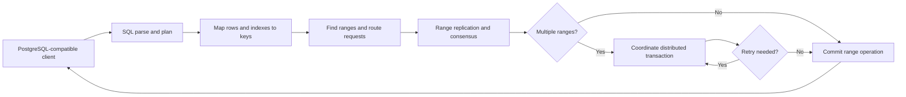

# CockroachDB Architecture: A Detailed Explanation

## Scope and framing

This explainer follows the supplied transcript and uses it as the starting point for a conceptual description of CockroachDB. It is not a full product manual, and the diagrams are explanatory rather than exact deployment diagrams. Details such as range sizes, clock settings, licensing, and performance claims can change by version, configuration, and product offering. A deployment's resilience also depends on its replica placement and quorum configuration; running CockroachDB does not by itself guarantee survival of every region failure.

The core goal is to provide a SQL database that can distribute data across machines and locations, keep transactions strongly consistent, and recover from failures without making an operator manually promote one global primary. The design does this by combining:

- A SQL layer over an ordered key-value representation.
- Automatic partitions called **ranges**.
- Replication of each range using the Raft consensus protocol.
- Distributed transactions when an operation touches multiple ranges.
- Hybrid logical clocks and uncertainty handling to order transactions without specialized clock hardware.
- Background splitting, balancing, and repair.

These guarantees have costs. Replication and consensus add network work; multi-region placement can add write latency; and serializable transactions may need retries. The system is most useful when those costs are justified by the operational need for horizontal scale, consistent transactions, and automatic recovery.

## 1. From one primary to distributed data

A conventional PostgreSQL deployment often starts with one writable primary and one or more replicas. The primary accepts writes and streams changes to replicas. Replicas can serve some read traffic, but they do not automatically divide the primary's write workload into independent pieces.

With **asynchronous replication**, the primary may acknowledge a commit before replicas have received it. This keeps the normal write path relatively quick, but a replica promoted after a primary failure can be missing recently acknowledged writes. The gap between the primary and replica is replication lag.

With **synchronous replication**, a commit waits for acknowledgement from a replica or configured set of replicas. This can reduce the risk of losing acknowledged changes, but adds network latency and can make writes depend on replica availability. Exact semantics depend on the database configuration and failover tooling.

PostgreSQL can be used with synchronous replication and mature high-availability tooling. The distinction is that a standard PostgreSQL server does not, by itself, provide CockroachDB's integrated, automatically sharded, multi-range consensus architecture. Failover, topology, and shard management are commonly assembled from database features, extensions, cloud services, and operational procedures.

### Failover and split brain

If a primary stops responding, an external controller or managed service may decide to promote a replica. The hard part is distinguishing a failed primary from a temporarily unreachable or slow one. If both the old primary and promoted replica accept writes, they can diverge: this is **split brain**. Preventing it requires coordination and fencing so only one side is allowed to act as authoritative.

Asynchronous replication adds a separate concern: the chosen replica may not contain every acknowledged transaction. Thus availability, consistency, and recovery-point guarantees depend on the replication mode, the failover process, and what data had reached each replica.

### Sharding and resharding

When one writable server cannot handle the data or workload, the database can be partitioned across several servers. With application-managed sharding, the application must know which shard owns each key. Cross-shard transactions become harder because multiple independent databases must agree on one atomic outcome. Rebalancing is also operationally difficult: data must move while the application continues to read and write it.

CockroachDB's approach is to keep partitioning inside the database. Rather than assigning one large table or tenant permanently to one server, it divides the ordered key space into many ranges and moves those ranges as the cluster changes.

## 2. Why distributed databases care about time

Transactions need a consistent ordering. On one machine, operations can use a local sequence of events. Across machines, each node has its own physical clock. Clocks drift, virtual machines pause, and network delay varies. Two servers can therefore assign timestamps that appear to contradict the causal order of events.

Imagine transferring money between two partitions. One records the debit and another records the credit. A consistent snapshot must not show the credit without the debit, or the debit without the credit, if the transfer is supposed to be atomic. If machines disagree about timestamps, a read “as of noon” can accidentally combine values from incompatible points in the transaction history.

The important problem is not simply displaying the correct wall-clock time. It is ensuring transactions observe a valid order and that a later operation does not appear to precede an operation on which it depended.

## 3. Spanner's TrueTime approach

Google Spanner uses a time API called **TrueTime** that returns an interval, not a claim that one timestamp is perfectly exact. The real time is guaranteed to lie between an earliest and latest bound. Spanner combines time sources that fail in different ways, including GPS receivers and atomic clocks in its infrastructure, to keep that uncertainty interval small.

For externally consistent commits, Spanner can wait until the uncertainty interval for a commit timestamp has passed before acknowledging the commit. That wait makes the timestamp safe to use as a global ordering point. The specialized hardware does not eliminate waiting; it reduces the uncertainty, and therefore reduces how long the system needs to wait.

Spanner demonstrated that a globally distributed database can offer strong transaction semantics, but Google's infrastructure and managed service model are not available to every organization as ordinary self-hosted components. CockroachDB takes a different route: ordinary clocks plus software mechanisms to track and handle uncertainty.

## 4. CockroachDB's logical key space and ranges

CockroachDB accepts SQL, but its distributed storage layer operates on ordered keys and values. Conceptually, table rows, indexes, and metadata are encoded into keys in a large sorted key space. SQL planning translates statements into operations on those keys. This representation makes it possible to divide the key space into contiguous pieces without making each SQL table a permanent placement unit.

Each piece is a **range**, the core unit for distribution and maintenance. Ranges can be split when they grow or become hot, replicated to other nodes, moved to rebalance load, and repaired after failures. The transcript cites a range size around 512 MB as an example; actual sizing and split decisions are implementation- and configuration-dependent and can also respond to load, not only a fixed threshold.

This is continuous partitioning. Instead of waiting until the whole database becomes too large and scheduling a one-time resharding project, the database can create and move smaller ranges in the background while serving traffic.

Ranges serve as the unit for several operations:

- **Partitioning:** Each range covers a slice of the key space.
- **Replication:** Replicas hold copies of a range on different nodes.
- **Consensus:** Replicas agree on committed updates to that range.
- **Rebalancing:** Ranges can move to nodes with capacity or better locality.
- **Recovery:** Missing replicas can be rebuilt from surviving copies, subject to quorum and placement.

Range boundaries are internal implementation details. Applications continue to query tables and indexes using SQL rather than routing directly to ranges.

## 5. Replication and Raft consensus

Each replicated range has a group of replicas. CockroachDB uses **Raft** so those replicas agree on the order of updates. In a three-replica group, a majority is two. An update is committed when the required quorum has durably accepted it according to the protocol. This is different from asynchronously copying changes after already acknowledging them: a write that has not reached the quorum is not treated as committed.

If one replica fails, the remaining replicas can continue only if they still form a quorum. With three replicas, two survivors can continue to make progress. If only one replica remains reachable, it cannot safely commit new writes for that range, even if that one node is healthy. This is how consensus prevents two isolated sides from independently treating their data as authoritative.

Failure recovery is therefore not magic: it depends on replica placement. To survive a zone or region failure, replicas and voting configuration must be distributed so that a quorum remains available after that failure. Placing replicas farther apart improves fault isolation but adds network latency to quorum operations. The user chooses a placement and latency trade-off through the deployment design.

### Raft leader and leaseholder are related but distinct

The transcript describes a leader that handles writes and a leaseholder that serves reads. These are useful concepts, but they should not be collapsed into one role. The **Raft leader** drives consensus for the range. The **leaseholder** has the authority to serve certain operations for that range, including consistent reads and transaction coordination. They are often colocated, but the roles are logically distinct and may change independently.

This distinction matters when reasoning about performance and failover: not every read requires a fresh Raft election or quorum vote, but a read still needs to satisfy the requested consistency semantics. Lease and timestamp rules help the system serve reads safely.

## 6. Distributed transactions across ranges

A transaction that touches one range can be coordinated within that range's replication group. A transaction touching multiple ranges has to preserve atomicity across multiple groups. CockroachDB's transaction layer coordinates those participants so the transaction either commits as a whole or does not become visible as committed. It also uses timestamps and retry mechanisms to preserve serializable ordering.

This is a significant difference from simply distributing rows. Cross-range operations have coordination cost, and a transaction spanning distant regions can require communication across those regions. Schema design, indexes, key locality, and transaction scope can therefore affect latency. Keeping related data close in the key space can reduce coordination in workloads where locality is important.

This diagram simplifies the implementation. Production transaction protocols can use optimizations and recovery records that are not shown here; the key point is that a multi-range transaction requires coordination beyond an ordinary local write.

## 7. Hybrid logical clocks and uncertainty

CockroachDB uses **hybrid logical clocks (HLCs)**. An HLC combines a physical-clock component with a logical counter. The physical component keeps timestamps broadly related to wall-clock time; the logical component can advance when events need an ordering finer than physical clocks alone provide.

Nodes exchange timestamps as part of messages. When a node learns of a timestamp later than its local HLC, it advances its own logical clock so causally ordered events remain ordered. This gives the system a way to represent causality even though physical clocks are not identical.

HLCs alone do not make physical clock error disappear. CockroachDB also assumes a bound on clock offset between nodes, monitors clock synchronization, and treats readings within that uncertainty window carefully. The transcript cites 500 milliseconds as a default maximum offset; exact defaults and configuration should be checked against the CockroachDB version in use.

When a transaction reads a value whose timestamp could be in the future relative to the transaction's clock uncertainty, the system cannot safely assume the read ordering. It can push the transaction's timestamp forward and retry it. Most transactions avoid this case; the uncertainty mechanism adds work to the cases where clock ambiguity could affect correctness. A node whose clock violates the configured bounds can be prevented from participating until it is safe again.

### How this differs from Spanner

The simplified contrast is:

- **Spanner:** Use TrueTime's bounded uncertainty and wait out the commit uncertainty interval to provide external consistency.
- **CockroachDB:** Use HLC timestamps and bounded uncertainty; transactions that encounter ambiguous ordering may be pushed forward and retried.

This is not “Spanner waits and CockroachDB never waits.” Both systems coordinate. The difference is where and how the uncertainty cost is paid. CockroachDB's retry behavior can move the cost to affected transactions, but retries are not free: they can increase latency and require applications to make transaction bodies safe to rerun.

## 8. SQL and PostgreSQL compatibility

CockroachDB speaks the PostgreSQL wire protocol and supports a large part of PostgreSQL's SQL interface. That lets many PostgreSQL drivers and tools connect with relatively small changes. This compatibility reduces migration friction because applications do not have to adopt an entirely new client ecosystem just to use a distributed SQL database.

Compatibility does not mean CockroachDB is PostgreSQL internally or that every PostgreSQL feature and extension behaves identically. CockroachDB has its own SQL implementation and storage engine, and compatibility varies by feature and release. Before migrating, teams should test schema migrations, SQL behavior, drivers, extensions, transaction patterns, and operational tooling against the target CockroachDB version.

Compatibility is also ongoing work. PostgreSQL evolves, and applications depend on details beyond the wire protocol: SQL semantics, system catalogs, extensions, administrative commands, and tooling. Matching the interface is a product and engineering commitment, not a one-time switch.

## 9. Trade-offs and when the architecture fits

CockroachDB's resilience and distribution come with real costs:

- **Network latency:** A replicated write requires consensus. Cross-region quorum placement can add substantial round-trip time compared with a local disk commit.
- **Transaction retries:** Serializable transactions can be retried due to contention or timestamp uncertainty. Application code should use the database's transaction retry patterns and avoid irreversible side effects inside a transaction body that may run again.
- **Quorum availability:** A range without a reachable quorum cannot safely accept writes. Replica placement determines which failures the cluster can tolerate.
- **Cross-range coordination:** Transactions spanning many ranges or regions need more communication than local transactions.
- **Compatibility gaps:** PostgreSQL protocol support does not guarantee full feature parity.
- **Operational and cost complexity:** A distributed cluster has more nodes, network traffic, capacity planning, and placement decisions than one database server.

For an application that comfortably fits on one PostgreSQL instance and does not need distributed failure tolerance, PostgreSQL may be simpler, faster, and less expensive. CockroachDB is a better candidate when automatic distribution, multi-node fault tolerance, and strongly consistent SQL transactions solve a concrete operational requirement.

## 10. Failure and recovery walkthrough

Suppose one node hosting replicas for many ranges disappears. The effect is per-range, not a single cluster-wide primary promotion:

1. Each affected range detects that a replica is unavailable.
2. If the remaining replicas form a quorum, the Raft group can elect or use a surviving leader and continue safely.
3. Operations for ranges that still have quorum can make progress; ranges without quorum remain unavailable for writes until quorum returns.
4. The cluster rebalances or rebuilds missing replicas from surviving copies according to placement and recovery policy.
5. Once sufficient replicas are restored, the ranges regain their intended fault tolerance.

The important qualification is that “a node failed” and “a whole region failed” are different events. A correctly placed cluster can be configured to survive specified failures, but a region outage may remove enough voting replicas to lose quorum for some ranges. A system may remain consistent while refusing writes to ranges that cannot reach quorum. Consistency does not imply uninterrupted availability under every partition.

## 11. Putting the request path together

The SQL request path can be thought of as a sequence of translations and coordinated operations:

1. A client sends SQL through a PostgreSQL-compatible driver.
2. The SQL layer parses and plans the statement, mapping rows and indexes to encoded keys.
3. The key spans identify one or more ranges, and the distributed execution layer routes work to their current leaseholders and Raft groups.
4. Each affected range applies its part of the operation under replication and timestamp rules.
5. If the transaction spans ranges, the transaction coordinator coordinates participants and handles contention or retry conditions.
6. The client receives a result only when the transaction has satisfied the database's commit rules.

## Key takeaways

1. The difficult part of scaling a relational database is not only storing more bytes; it is partitioning data while preserving transactions and keeping applications insulated from shard placement.
2. CockroachDB makes ranges the unit of replication, movement, balancing, and repair, allowing partitioning to happen continuously in the background.
3. Raft quorums prevent a lone replica from safely inventing a new committed history. Resilience depends on replica placement, and loss of quorum can stop writes for affected ranges.
4. Distributed transactions still require coordination. A transaction across ranges or regions costs more than a local one.
5. Time uncertainty must be modeled explicitly. HLCs preserve causal ordering, while clock bounds and transaction retries handle cases physical clocks cannot disambiguate.
6. PostgreSQL protocol compatibility lowers adoption friction but does not mean complete PostgreSQL feature or extension parity.
7. Every consistency and availability guarantee has a price in network latency, retries, operational complexity, or reduced availability during certain failures.

The broad design lesson is to make the unit of work small and movable, build recovery into the data architecture, and make the costs of consistency explicit. CockroachDB is one set of choices for paying those costs; a single-primary PostgreSQL system makes a different set.