# PayPal Fraud Detection: Mechanisms and Architecture

## Scope and framing

This document explains the system described in the supplied transcript. It combines the transcript's historical account with a conceptual architecture for how large-scale payment-risk decisions can be made. It is not a claim that every internal PayPal implementation detail is public or that the diagrams reproduce PayPal's exact production topology. The transcript attributes its material to PayPal engineering publications, open-source work and talks, an NVIDIA case study, and books about PayPal's early history; figures below should be read as figures reported in that transcript, not independently verified current metrics.

The central engineering problem is to judge a payment quickly without treating each payment as an isolated event. A risk system has to make use of account, device, funding-source, merchant, network, and behavioral history; deal with attackers who change tactics in response to its decisions; keep false declines and fraud losses within acceptable bounds; and learn even though labels arrive late or are missing for blocked transactions.

## 1. Why fraud detection is an adversarial problem

In ordinary predictive systems, a model can become stale because the world changes. In fraud, the system's own decisions can cause that change: a fraud ring observes that a method is failing and modifies its behavior. The defender and attacker therefore participate in a feedback loop. A model trained on yesterday's patterns can be outdated not only because time passed, but because it successfully blocked some attacks.

The transcript groups the main threats into three broad categories:

- **Stolen payment credentials:** Someone uses a legitimate person's card or other funding source without authorization.
- **Account takeover (ATO):** Someone obtains access to a real account, often using stolen or phished credentials, and attempts to change account details or extract value.
- **Fabricated or coordinated actors:** Fake buyers, sellers, or both sides of a transaction are controlled by a fraud operation. A payment platform must assess both sides of the marketplace, not only the payer.

This is why the system needs more than one classifier or one fixed rule. Rules can react quickly, models can combine subtle evidence, graph analysis can expose coordinated activity, and human investigators can review ambiguous or high-impact cases. The system must also preserve enough information to discover when its current assumptions stop working.

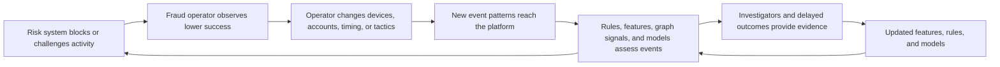

## 2. The decision path and latency budget

The transcript describes a roughly 100-millisecond budget for the fraud decision within a larger checkout round trip. The payment also needs to travel through networks and interact with funding providers, so risk computation cannot consume the whole customer-facing time budget. A slow checkout can cause abandonment, even when the eventual decision is correct.

The practical design principle is to do expensive work before the payment arrives. Streaming jobs continuously update time-window counters and other online features. Batch jobs inspect larger histories and networks. At checkout, the request mainly retrieves precomputed evidence, evaluates models and rules, and applies a policy.

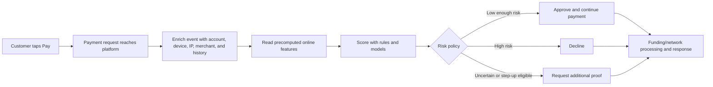

The three user-facing outcomes are:

1. **Approve:** Allow the payment to proceed.
2. **Decline:** Stop it when evidence and policy indicate unacceptable risk.
3. **Step up:** Ask for additional evidence, such as a one-time code or an authentication check, when the system should not make a confident approve/decline decision from the available signals alone.

A step-up is not just another model score. It is a policy action that changes the evidence available for the decision. It can reduce uncertainty when the legitimate user can satisfy a challenge that an attacker is less likely to satisfy, while introducing friction for that legitimate user.

## 3. Five checkpoints, different questions

Risk is assessed at multiple points in the account and money lifecycle. The transcript describes five checkpoints. They are not five identical copies of the payment model: each sees a different event and addresses a different failure mode.

| Checkpoint | Main question | Example risk signal |
| --- | --- | --- |
| Signup | Is this likely to be a real person rather than automated account creation? | Many new accounts created from one device or network in a short interval |
| Login | Is the current actor plausibly the account owner? | Unfamiliar device or location, unusual login sequence, or repeated failures |
| Add funding source | Is this a legitimate funding source, or is it being tested? | One device trying many cards with small transactions |
| Payment | Does this transaction fit the buyer, seller, device, funding source, and their histories? | Unusual amount, velocity, account age, or connected-entity risk |
| Withdrawal | Is the destination account a trustworthy place for value to leave the platform? | Multiple accounts cashing out to a shared or suspicious bank destination |

Earlier intervention is usually cheaper: if an automated or fraudulent account is stopped at signup, downstream login, payment, investigation, and withdrawal work may never be needed. However, the most consequential check can occur at withdrawal because that is where value exits to an external destination. These are complementary observations, not contradictory rules: block cheaply when evidence is available early, and maintain strong controls at cash-out because it is a critical point of loss.

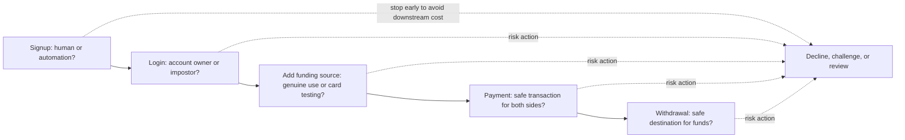

## 4. Evidence: signals, velocity features, and precomputation

An event such as a payment is enriched with context and converted into features. Features are measurable signals that models, rules, or policies can consume. The transcript's examples include:

- Account age and the account's normal spending pattern.
- Number of distinct cards used by one device in a recent time window.
- Failed logins associated with an IP address or network in the last few minutes.
- Distance between recent login locations and the time between them (the “impossible travel” pattern).
- Whether a purchase amount, merchant, device, or shipping choice is unusual for this account.
- Previous associations among accounts, devices, cards, addresses, phone numbers, and bank accounts.

**Velocity features** summarize how often something happened over a time window: for example, card attempts per device over an hour, or failed logins per network over ten minutes. They are useful because attacks such as card testing can be short-lived. A feature that is only computed in a large nightly job may arrive too late to help with a live burst.

The online system cannot afford to reconstruct every history from raw events during checkout. Instead, streaming pipelines update counters and rolling aggregates as events occur. A payment request reads the current values. In parallel, offline batch jobs can compute features from much larger histories for model training and broader analysis.

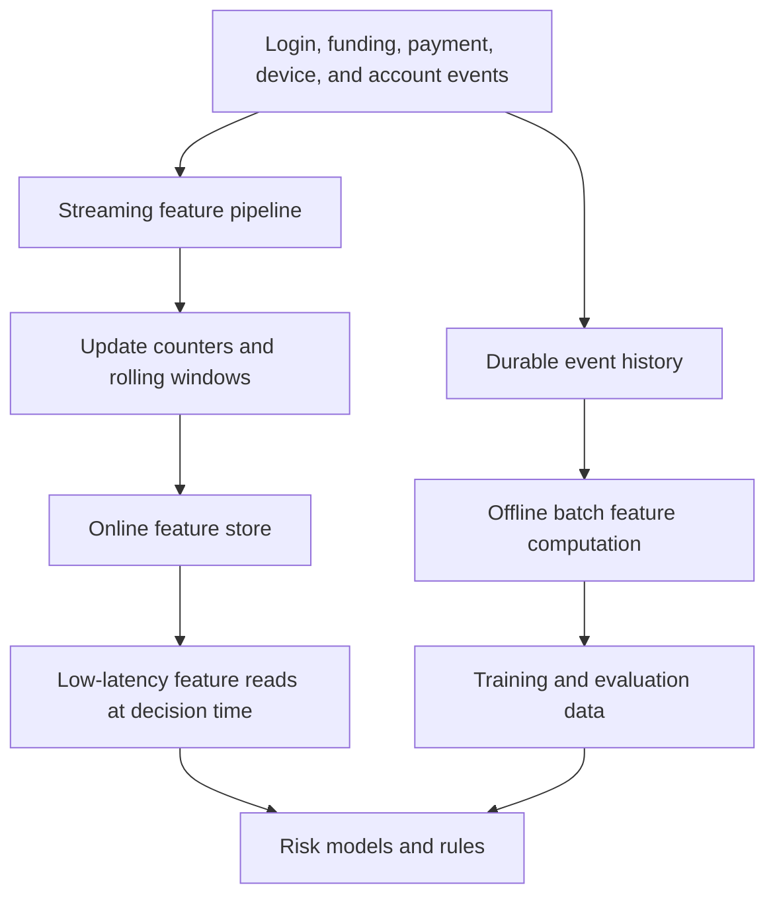

### Consistent definitions prevent training-serving skew

An important risk is **training-serving skew**: training computes a feature one way while production computes what is meant to be the same feature another way. For example, the two implementations might disagree about time-window boundaries, late-arriving events, duplicate events, or which events count. The model then learns from one definition of reality and receives another definition at inference time. This can quietly reduce quality without causing an obvious service outage.

The remedy described in the transcript is to define features consistently and reuse the same semantics across training, validation, and online serving wherever possible. At minimum, the feature definition must specify its entity key, event-time window, inclusion rules, handling of late or duplicate events, and freshness expectations. Feature parity should be tested, not assumed.

## 5. Low-latency storage and tail latency

The transcript presents JunoDB as a key-value store built by PayPal for low-latency access to risk and other backend data, and says it was open-sourced in 2023. It describes proxies routing keys to shards with consistent hashing, replication across nodes or data centers, and quorum-based operations. The exact deployment details and performance figures are transcript-reported and can change over time.

The architectural point is the relationship between fan-out and tail latency. One decision can need hundreds of feature lookups. If those requests run in parallel, total latency is determined largely by the slowest dependency, not by the average lookup. Under a simplified independence assumption, if each of 200 lookups has a 1% chance of being slow, then:

$$
P(\text{at least one slow lookup}) = 1 - (1 - 0.01)^{200} \approx 0.866
$$

So approximately 87% of decisions would encounter at least one slow lookup under those assumptions. Real dependencies may be correlated, and “slow” needs a precise threshold, but the example captures why individual P99 metrics can become a system-level problem under high fan-out. Low tail latency, predictable routing, failure handling, and bounded work per decision are part of the user experience, not merely storage concerns.

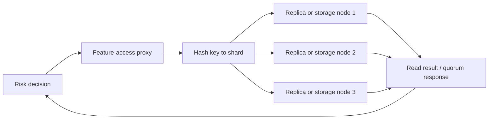

This is a conceptual diagram, not a complete JunoDB topology. The transcript reports that JunoDB's proxy layer handles distribution and replication concerns so application services can make key-based reads and writes without implementing those mechanisms themselves.

## 6. Graphs reveal shared infrastructure

Fraud operations behave like businesses with scarce inputs. Stolen card numbers may be relatively cheap and disposable; clean devices, delivery addresses, and especially usable cash-out accounts may be more difficult to obtain. Reusing costly resources across many accounts creates relationships that a graph can expose.

A risk graph can represent accounts, cards, devices, IP addresses, email addresses, phone numbers, shipping addresses, merchants, and bank accounts as nodes. Edges record observed relationships, such as “device used by account,” “card added to account,” or “account withdrew to bank account.” A normal customer's graph may be small and stable. Coordinated fraud may reuse one device or destination across many identities.

The graph is valuable because one confirmed bad entity can provide evidence about its neighbors. That evidence must decay with distance: a direct link to a confirmed fraud account is stronger than a connection several hops away. Without decay and careful propagation rules, risk can spread through ordinary shared infrastructure and eventually contaminate much of the network.

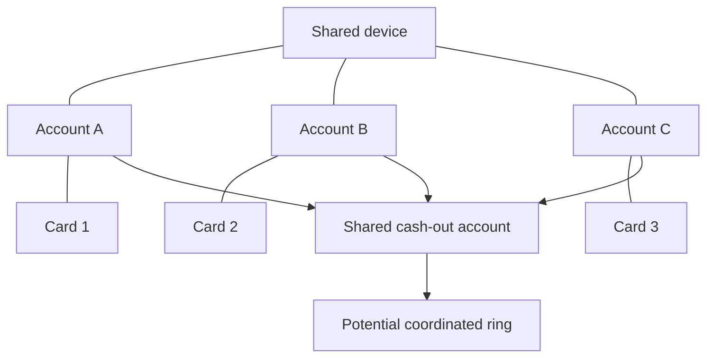

The transcript describes two speeds of graph analysis:

1. **Offline investigation:** Batch processing traverses large portions of the graph, identifies suspicious structures, and computes scores for entities.
2. **Online decision:** Checkout reads precomputed scores and performs only a small number of bounded lookups. It does not attempt to traverse a massive network in the payment's latency budget.

This is a “detective and bouncer” pattern: the slow process investigates and prepares a list; the fast process checks that prepared evidence at the door. Velocity features complement graph scores, especially for brand-new devices or accounts that have no graph history yet.

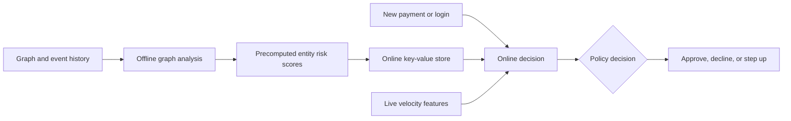

## 7. Multiple model generations and an ensemble

The transcript describes several generations of decision logic that can coexist rather than simply replacing one another:

| Generation or component | Strength | Limitation |
| --- | --- | --- |
| Handwritten rules and investigators | Transparent and quick to change; human review can handle unusual cases | Rules can be probed and bypassed; manual review does not scale to every event |
| Logistic regression | Learns weights from examples and is relatively interpretable and efficient | May not capture complex nonlinear relationships without careful feature design |
| Gradient-boosted trees | Strong fit for structured/tabular signals and nonlinear feature interactions | Depends substantially on useful engineered features and can require careful serving optimization |
| Neural networks | Can learn entity representations and complex interactions across many signals | More demanding to train, explain, and serve within a tight latency budget |
| Sequence/session models | Evaluate the order and context of a series of actions, useful for ATO patterns | Need session context, sequence data, and additional serving complexity |
| Behavioral biometrics | Can provide evidence from interaction patterns, such as typing rhythm or device motion | Must be handled carefully for reliability, privacy, accessibility, and device variation |

These components answer different questions. A payment-level model might judge whether a transaction looks unusual, while an account-takeover model may assess whether a whole sequence of events is suspicious: unfamiliar login, password change, new shipping address, then a high-value expedited purchase. Each action might be legitimate in isolation; the ordered sequence can be the stronger signal.

The transcript characterizes production decisions as an ensemble or “jury”: rules and multiple models produce evidence or scores, and a decision layer combines them. In practice, a robust ensemble also needs calibration, fallback behavior, monitoring, and explicit handling of unavailable or stale signals. A score from one model is not itself the final business action.

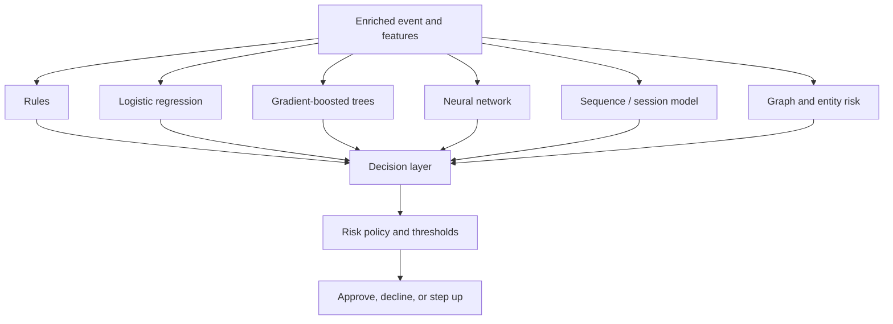

### Model quality has to fit the serving budget

Newer models may need more computation than older ones. A straightforward response is to shrink or simplify the model through techniques such as distillation or quantization, potentially trading some predictive performance for latency. The transcript says PayPal instead moved some real-time inference from CPUs to GPUs and attributes to an NVIDIA case study an approximately 10% improvement in fraud detection while reducing the serving fleet to one eighth of its previous size. Treat those figures as claims reported by the transcript and case study, not a universal result or a guarantee for another workload.

The broader design choice is to optimize the system's total objective: decision quality, latency, cost, availability, and customer impact. Faster hardware can make a more expressive model feasible within the same latency budget, but it also adds serving and operational considerations. Measurement under realistic request loads is necessary to establish whether it is worthwhile.

## 8. Labels arrive late, and declined events create missing outcomes

Supervised models need examples with outcomes. For payment fraud, a chargeback or later investigation may indicate that an approved transaction was unauthorized. These labels can arrive days or weeks later, and they can be imperfect: a dispute is not always fraud. The newest attacks may therefore be the least labeled part of the data.

There is an additional problem with declines. If a transaction is blocked, it does not complete in the ordinary way, so the system may never observe the outcome that would have occurred had it been approved. A declined event is not automatically a fraud label. Treating all declines as fraud would make the model learn its own past decisions rather than the true outcomes.

This is a form of **selective labels** and **counterfactual evaluation**. The system observes outcomes for actions it took, but often cannot directly observe the alternative outcome. As thresholds become stricter, fewer borderline events are approved, and the evidence about that part of the population can become increasingly sparse.

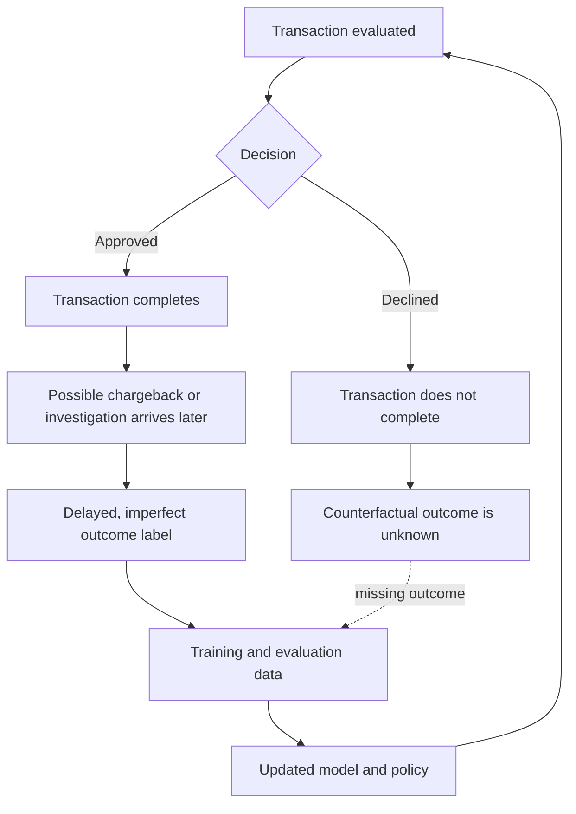

One way to learn about the uncertain region is a **controlled exploration or randomized holdout**: deliberately allow a small, carefully selected fraction of otherwise-declinable traffic to proceed, then observe outcomes. The transcript emphasizes random selection to avoid only testing cases that already look safe. This can produce useful labels, but it exposes the business to intentional risk and must be constrained by legal, network, customer-safety, and loss limits. The exact exploration policy is a governance decision, not a universal recipe.

The learning loop therefore needs to preserve more than final labels. Useful records include the event and its timestamp, feature values or feature versions, model and rule versions, scores, decision, action taken, any challenge result, and subsequent outcome updates. This makes it possible to reconstruct what the system knew when it acted and evaluate changes without confusing old decisions with ground truth.

## 9. Thresholds are business decisions, not just model outputs

A model typically produces a score or probability-like estimate; policy turns that estimate into an action. The threshold should reflect the different costs of false approvals, false declines, challenges, and review. A false approval can create direct loss and downstream network or investigation cost. A false decline can lose a legitimate sale and damage customer trust. A step-up can reduce uncertainty but adds friction. Human review consumes capacity and time.

Therefore, “best accuracy” or a generic classification threshold is not enough. The operating point depends on the costs and constraints at a particular checkpoint, transaction type, customer context, and risk appetite. Thresholds and policies also need monitoring because fraud behavior and business costs change.

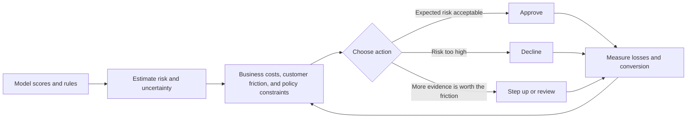

## 10. End-to-end view

Taken together, the system is a collection of components operating at different timescales:

- **Milliseconds:** Read online features and entity scores; evaluate rules and models; apply the current policy; return approve, decline, or step-up.
- **Seconds to minutes:** Streaming pipelines update velocity counters and recent behavioral context.
- **Hours to days:** Batch analysis finds network structure, recalculates graph-derived signals, and supports investigation.
- **Days to months:** Chargebacks and other outcomes mature; investigators resolve cases; training and evaluation datasets are updated; models and policy are revised.

The critical-path decision is fast because it consumes prepared evidence. The system's overall intelligence comes from combining that fast path with slower computation, outcome collection, investigation, and retraining.

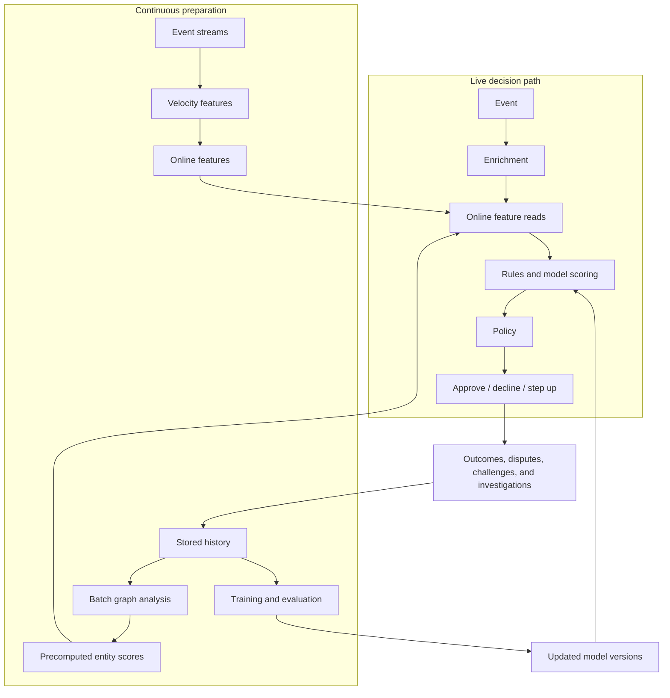

## Key takeaways

1. Fraud is adversarial: successful defenses change attacker behavior, so drift is part of the operating environment.
2. Risk should be checked at multiple lifecycle stages, with the question tailored to each stage and strong controls where value exits.
3. Move expensive computation off the checkout path. Maintain time-sensitive features and graph scores before they are needed.
4. Consistent feature definitions matter as much as model choice; training-serving skew can quietly undermine a healthy-looking service.
5. At high fan-out, tail latency dominates. Storage and model serving must be designed around the end-to-end decision budget.
6. Graph signals expose resource reuse across coordinated accounts, while decay and careful scope prevent risk from spreading indiscriminately.
7. Rules, tabular models, sequence models, graph features, and human review are complementary tools rather than mutually exclusive generations.
8. Labels are delayed and selective. Declined transactions do not reveal what would have happened if they had been approved, so evaluation and exploration need explicit design.
9. The final threshold is a policy choice balancing loss, customer friction, conversion, operational cost, and risk appetite.

The unifying principle is not simply “make inference faster.” It is to prepare evidence in advance, reserve the real-time budget for bounded decisions, and close the learning loop with careful outcome data and business-aware policy.
